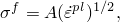
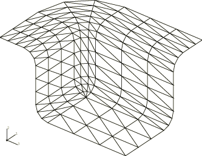
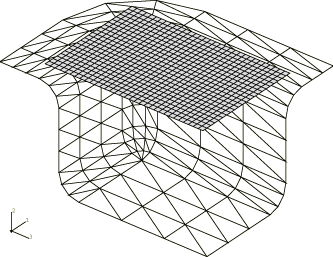
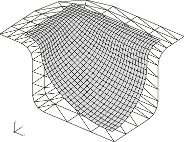
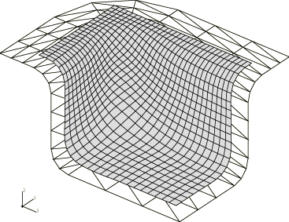
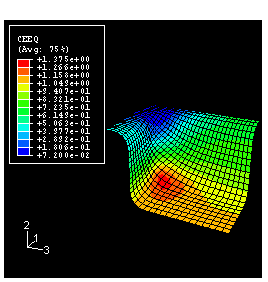
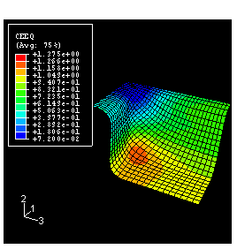
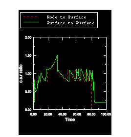
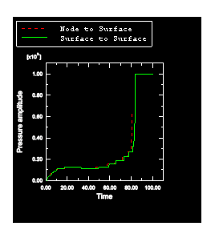

# 1.3.2 Superplastic forming of a rectangular box

**Product: **Abaqus/Standard  

In this example we consider the superplastic forming of a rectangular box. The example illustrates the use of rigid elements to create a smooth three-dimensional rigid surface.

Superplastic metals exhibit high ductility and very low resistance to deformation and are, thus, suitable for forming processes that require very large deformations. Superplastic forming has a number of advantages over conventional forming methods. Forming is usually accomplished in one step rather than several, and intermediate annealing steps are usually unnecessary. This process allows the production of relatively complex, deep-shaped parts with quite uniform thickness. Moreover, tooling costs are lower since only a single die is usually required. Drawbacks associated with this method include the need for tight control of temperature and deformation rate. Very long forming times make this method impractical for high volume production of parts.

A superplastic forming process usually consists of clamping a sheet against a die whose surface forms a cavity of the shape required. Gas pressure is then applied to the opposite surface of the sheet, forcing it to acquire the die shape.

### Rigid surface

A rigid faceted surface can be created from an arbitrary mesh of three-dimensional rigid elements (either triangular R3D3 or quadrilateral R3D4 elements). See ["Analytical rigid surface definition," Section 2.3.4 of the Abaqus Analysis User's Guide](../usb/usb-link.md#usb-int-arigidsurf), for a discussion of smoothing of master surfaces. Abaqus automatically smoothes any discontinuous surface normal transitions between the surface facets.

### Solution-dependent amplitude

One of the main difficulties in superplastically forming a part is the control of the processing parameters. The temperature and the strain rates that the material experiences must remain within a certain range for superplasticity to be maintained. The former is relatively easy to achieve. The latter is more difficult because of the unknown distribution of strain rates in the part. The manufacturing process must be designed to be as rapid as possible without exceeding a maximum allowable strain rate at any material point. For this purpose Abaqus has a feature that allows the loading (usually the gas pressure) to be controlled by means of a solution-dependent amplitude and a target maximum creep strain rate. In the loading options the user specifies a reference value. The amplitude definition requires an initial, a minimum, and a maximum load multiplier. During a quasi-static procedure Abaqus will then monitor the maximum creep strain rate and compare it with the target value. The load amplitude is adjusted based on this comparison. This controlling algorithm is simple and relatively crude. The purpose is not to follow the target values exactly but to obtain a practical loading schedule.

### Geometry and model

The example treated here corresponds to superplastic forming of a rectangular box whose final dimensions are 1524 mm (60 in) long by 1016 mm (40 in) wide by 508 mm (20 in) deep with a 50.8 mm (2 in) flange around it. All fillet radii are 101.6 mm (4 in). The box is formed by means of a uniform fluid pressure.

A quarter of the blank is modeled using 704 membrane elements of type M3D4. These are fully integrated bilinear membrane elements. The initial dimensions of the blank are 1625.6 mm (64 in) by 1117.6 mm (44 in), and the thickness is 3.175 mm (0.125 in). The blank is clamped at all its edges. The flat initial configuration of the membrane model is entirely singular in the normal direction unless it is stressed in biaxial tension. This difficulty is prevented by applying a small biaxial initial stress of 6.89 kPa (1 lb/in2) by means of the initial stress conditions.

The female die is modeled as a rigid body and is meshed with rigid R3D3 elements. The rigid surface can be defined by grouping together those faces of the 231 R3D3 elements used to model the die that face the contact direction. See [Figure 1.3.2--1](ch01s03aex33.md#sxmsuperbox-diesurf) for an illustration of the rigid element mesh.

To avoid having points “fall off” the rigid surface during the course of the analysis, more than a quarter of the die has been modeled, as shown in [Figure 1.3.2--2](ch01s03aex33.md#sxmsuperbox-initpos). It is always a good idea to extend the rigid surface far enough so that contacting nodes will not slide off the master surface.

By default, Abaqus generates a unique normal to the rigid surface at each node point, based on the average of the normals to the elements sharing each node. There are times, however, when the normal to the surface should be specified directly. This is discussed in ["Node definition," Section 2.1.1 of the Abaqus Analysis User's Guide](../usb/usb-link.md#usb-int-inode). In this example the flange around the box must be flat to ensure compatibility between the originally flat blank and the die. Therefore, an outer normal (0, 1, 0) has been specified at the 10 nodes that make up the inner edge of the flange. This is done by entering the direction cosines after the node coordinates. The labels of these 10 vertices are 9043, 9046, 9049, 9052, 9089, 9090, 9091, 9121, 9124, and 9127; and their definitions can be found in [superplasticbox_node.inp](../eif/superplasticbox_node.inp).

### Material

The material in the blank is assumed to be elastic-viscoplastic, and the properties roughly represent the 2004 (Al-6Cu-0.4Zr)-based commercial superplastic aluminum alloy Supral 100 at 470C. It has a Young's modulus of 71 GPa (10.3  106 lb/in2) and a Poisson's ratio of 0.34. The flow stress is assumed to depend on the plastic strain rate according to 

where *A* is 179.2 MPa (26.  103 lb/in2) and the time is in seconds.

### Loading and controls

We perform two analyses to compare constant pressure loading and a pressure schedule automatically adjusted to achieve a maximum strain rate of 0.02/sec. In the constant load case the prestressed blank is subjected to a rapidly applied external pressure of 68.8 kPa (10 lb/in2), which is then held constant for 3000 sec until the box has been formed. In the second case the prestressed blank is subjected to a rapidly applied external pressure of 1.38 kPa (0.2 lb/in2). The pressure schedule is then chosen by Abaqus.

The initial application of the pressures is assumed to occur so quickly that it involves purely elastic response. This is achieved by using the static procedure. The creep response is developed in a second step using a quasi-static procedure.

During the quasi-static step an accuracy tolerance controls the time increment and, hence, the accuracy of the transient creep solution. Abaqus compares the equivalent creep strain rate at the beginning and the end of an increment. The difference should be less than this tolerance divided by the time increment. Otherwise, the increment is reattempted with a smaller time increment. The usual guideline for setting this accuracy tolerance is to decide on an acceptable error in stress and convert it to an error in strain by dividing by the elastic modulus. For this problem we assume that moderate accuracy is required and choose this tolerance as 0.5%. In general, larger tolerance values allow Abaqus to use larger time increments, resulting in a less accurate and less expensive analysis.

In the automatic scheduling analysis the pressure refers to an amplitude that allows for a maximum pressure of 1.38 MPa (200 lb/in2) and a minimum pressure of 0.138 kPa (0.02 lb/in2). The target creep strain rate is a constant entered using creep strain rate control. The node-to-surface (default) and surface-to-surface contact formulations are considered for this case where the creep strain rate is used to control the pressure amplitude. In the node-to-surface contact formulation the thickness of the blank is ignored and the blank is positioned such that its midsurface is used in the contact calculations as an approximation. However, the surface-to-surface contact formulation explicitly accounts for the blank thickness, as in reality.

### Results and discussion

[Figure 1.3.2--3](ch01s03aex33.md#sxmsuperbox-def-34s) through [Figure 1.3.2--5](ch01s03aex33.md#sxmsuperbox-def-77) show a sequence of deformed configurations during the automatically controlled forming process. The stages of deformation are very similar in the constant load process. However, the time necessary to obtain the deformation is much shorter with automatic loading—the maximum allowable pressure is reached after 83.3 seconds. The initial stages of the deformation correspond to inflation of the blank because there is no contact except at the edges of the box. Contact then occurs at the box's bottom, with the bottom corners finally filling. Although there is some localized thinning at the bottom corners, with strains on the order of 100%, these strains are not too much larger than the 80% strains seen on the midsides.

[Figure 1.3.2--6](ch01s03aex33.md#sxmsuperbox-strain-surf) and [Figure 1.3.2--7](ch01s03aex33.md#sxmsuperbox-strain) show the equivalent plastic strain at the end of the process using the surface-to-surface and the node-to-surface contact formulations, respectively. The differences in the results are primarily due to differences in the way that the blank thickness is handled. Consequently, results from the surface-to-surface contact formulation are more reliable since the blank thickness is considered.

[Figure 1.3.2--8](ch01s03aex33.md#sxmsuperbox-rathist) shows the evolution in time of the ratio between the maximum creep strain rate found in the model and the target creep strain rate for the two contact formulations. The load applied initially produces a low maximum creep strain rate at the beginning of the analysis. At the end the maximum creep strain rate falls substantially as the die cavity fills up. Although the curve appears very jagged, it indicates that the maximum peak strain rate is always relatively close to the target value. This is quite acceptable in practice. [Figure 1.3.2--9](ch01s03aex33.md#sxmsuperbox-presshist) shows the pressure schedule that Abaqus calculates for this problem. For most of the time, while the sheet does not contact the bottom of the die, the pressure is low. Once the die starts restraining the deformation, the pressure can be increased substantially without producing high strain rates. Again, the differences in the pressure schedule toward the end of the simulation are due primarily to the differences in the handling of the blank thickness.

### Input files

[superplasticbox_constpress.inp](../eif/superplasticbox_constpress.inp)

Constant pressure main analysis.

[superplasticbox_autopress.inp](../eif/superplasticbox_autopress.inp)

Automatic pressurization main analysis.

[superplasticbox_autopress_surf.inp](../eif/superplasticbox_autopress_surf.inp)

Automatic pressurization main analysis using the surface-to-surface contact formulation.

[superplasticbox_node.inp](../eif/superplasticbox_node.inp)

Node definitions for the rigid elements.

[superplasticbox_element.inp](../eif/superplasticbox_element.inp)

Element definitions for the rigid R3D3 elements.

### Figures

**Figure 1.3.2–1** Rigid surface for die.

**Figure 1.3.2–2** Initial position of blank with respect to die.

**Figure 1.3.2–3** Automatic loading: deformed configuration after 34 sec in Step 2 using the node-to-surface contact formulation.

**Figure 1.3.2–4** Automatic loading: deformed configuration after 63 sec in Step 2 using the node-to-surface contact formulation.

**Figure 1.3.2–5** Automatic loading: deformed configuration after 83 sec in Step 2 using the node-to-surface contact formulation.

**Figure 1.3.2–6** Automatic loading: inelastic strain in the formed box using the surface-to-surface contact formulation.

**Figure 1.3.2–7** Automatic loading: inelastic strain in the formed box using the node-to-surface contact formulation.

**Figure 1.3.2–8** History of ratio between maximum creep strain rate and target creep strain rate.

**Figure 1.3.2–9** History of pressure amplitude.

