# 1.3.3 半球形冲头薄板拉伸

**产品：** Abaqus/Standard   Abaqus/Explicit   

通过刚性冲头和模具进行板料冲压是一种标准的制造工艺。在大多数体积成形工艺中，成形操作所需的载荷通常是主要关注点。然而，在板料成形中，应变分布和极限应变（定义局部颈缩开始）的预测最为重要。这种分析很复杂，因为它需要考虑变形期间的大塑性应变，包括应变硬化的材料响应的准确描述，处理将接触冲头头的区域与无支撑区域分开的移动边界，以及板料与冲头头之间的摩擦。

本示例考虑用半球形冲头拉伸薄圆形板料。

### 几何和模型

该问题的几何形状如图1.3.3-1所示。被拉伸板料的夹紧半径为，为59.18 mm。冲头半径为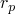，为50.8 mm；模具半径为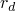，为6.35 mm；板料的初始厚度为，为0.85 mm。这样的板料已由Ghosh和Hecker（1975）进行了实验测试，并由Wang和Budiansky（1978）使用轴对称膜壳有限元公式进行了分析。分析在Abaqus/Standard中静态进行，在Abaqus/Explicit中动态进行，使得惯性力相对较小。分析的初始构型如图1.3.3-2所示。

板料、冲头和模具建模为独立的部件，每个实例化一次。作为Abaqus/Standard中的轴对称问题，板料使用50个SAX1型（或MAX1）单元或25个SAX2型（或MAX2）单元进行建模。Abaqus/Explicit模型使用50个SAX1单元。进行了网格收敛研究（此处未报告），表明这些网格对大多数感兴趣的值给出了足够准确的结果。为了在Abaqus/Standard中测试三维膜和壳单元，使用100个S4R、S4、SC8R或M3D4R型单元或25个M3D9R型单元对10个扇区进行了建模。所有这些网格都相当细密；它们用于获得板料与模具之间移动接触的良好分辨率。在Abaqus/Standard壳模型中，使用了九个积分点穿过板料厚度，以确保屈服和弹塑性弯曲响应的发展；在Abaqus/Explicit中，使用了五个积分点穿过板料厚度。

在Abaqus/Standard中，刚性冲头和模具使用与分析刚性表面结合的表面进行建模，作为刚性体约束。板料的顶面和底面用表面定义进行定义。在Abaqus/Explicit中，冲头和模具建模为刚性体；冲头和模具的表面通过解析刚性表面或RAX2单元进行建模。在Abaqus/Explicit分析中，刚性表面从坯料偏移了坯料厚度的一半，因为Abaqus/Explicit中的接触算法考虑了壳厚度。同样，当使用Abaqus/Standard中的表面-表面接触公式时，默认情况下考虑坯料厚度，刚性表面从坯料偏移了坯料厚度的一半，与物理现实一致。但是，本节中提供的大多数输入文件在Abaqus/Standard中使用节点-表面接触公式。在这些情况下，壳厚度被忽略，壳的中面用于接触计算作为近似。

### 材料属性

材料（铝镇静钢）假定满足真应力与对数应变之间的Ramberg-Osgood关系，

其中杨氏模量E为206.8 GPa；参考应力值K为0.510 GPa；加工硬化指数n为4.76。在当前的Abaqus分析中，Ramberg-Osgood关系使用弹塑性材料近似。材料假定在170.0 MPa的屈服应力下为线弹性，屈服应力之后的应力-应变曲线以分段线性段定义。泊松比为0.3。

Abaqus/Standard中的膜单元模型在静态分析中固有地不稳定，除非在施加外部载荷之前单元中存在一些预应力。因此，对于Abaqus/Standard中的膜单元，规定了等于初始屈服应力5%的等双轴初始应力条件。

### 接触相互作用

板料与刚性冲头和刚性模具之间的接触使用接触对进行建模。接触表面之间的机械相互作用假定为摩擦接触，摩擦系数为0.275。

### 加载

Abaqus/Standard分析分五步进行；Abaqus/Explicit分析分四步进行。在Abaqus/Explicit中，冲头速度使用在第一步中斜坡上升到30 m/s（在1.24毫秒时）并保持恒定直到时间达到1.57毫秒（第二步结束时）的速度边界条件来规定。然后在1.97毫秒（第三步结束时）斜坡下降到零。在Abaqus/Standard和Abaqus/Explicit分析的前三步中，冲头头朝向板料移动，分别通过18.6 mm、28.5 mm和34.5 mm的总距离。这三个步骤的目的是将结果与Ghosh和Hecker针对这些冲头位移提供的实验数据进行比较。更典型的是，冲头将在一步中完成其整个行程。

Abaqus/Standard分析中包含最后两步。在第一步中，金属板料被固定在适当位置，接触对从模型中移除。在第二步中，金属板料的原始边界条件被重新引入用于回弹分析。但是，对于使用膜单元的分析不包括此回弹步骤，因为这些单元没有任何弯曲刚度，残余弯曲应力通常是回弹的关键决定因素。

在Abaqus/Explicit分析的最后一步中，冲头头远离板料进行回弹分析。在此步骤中，粘性压力载荷施加到壳表面以阻尼瞬态波效应，使准静态平衡能够快速达到。这种效果在卸载开始后约2毫秒内发生。粘性压力系数选择为0.35 MPa sec/m，约为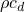值的1%，其中是板料的密度，是膨胀波速。值为的粘性压力将吸收压力波中的所有能量。对于典型的结构问题，选择该值的一小部分提供了一种有效的方式来最小化持续的动态效应。当板料中的残余应力随时间相当恒定时，达到静态平衡。

### 结果和讨论

[图1.3.3-2](ch01s03aex34.md#exxhemipunch-initconfig)显示了坯料、模具和冲头的初始未变形轮廓，[图1.3.3-3](ch01s03aex34.md#exxhemipunch-disp34config)说明变形后的板料以及冲头和模具。[图1.3.3-4](ch01s03aex34.md#exxhemipunch-finalconfig)显示了相同系统在冲头抬起后的曲线，显示了板料的回弹。

[图1.3.3-5](ch01s03aex34.md#exxhemipunch-strndist-18)显示了18.6 mm冲头头位移时板料中名义径向和周向膜应变的分布。[图1.3.3-6](ch01s03aex34.md#exxhemipunch-strndist-28)显示了28.5 mm冲头头位移时的应变分布，[图1.3.3-7](ch01s03aex34.md#exxhemipunch-strndist-34)显示了34.5 mm冲头头位移时的应变分布。SAX1模型的应变分布与Ghosh和Hecker（1975）获得的实验数据以及使用膜壳有限元公式的Wang和Budiansky（1978）数值结果吻合良好。在拉伸过程中颈缩的重要现象几乎在相同位置被重现，尽管获得了略有不同的应变值。实验中使用防皱沟来保持板料边缘，但在这个分析中，板料在其边缘处简单地被夹紧。加入防皱沟边界条件可能会进一步改善与实验数据的相关性。

在某些Abaqus/Standard壳模型中，可以观察到应变分布向板料边缘处的尖峰。这个应变尖峰是板料绕模具弯曲的结果。这个尖峰不存在于膜单元模型中，因为它们没有弯曲刚度。[图1.3.3-5](ch01s03aex34.md#exxhemipunch-strndist-18)到[图1.3.3-9](ch01s03aex34.md#exxhemipunch-residual-bot)中展示的所有Abaqus/Standard结果都使用节点-表面接触公式。使用表面-表面接触公式时获得了相似的结果。

轴对称膜模型获得的结果与轴对称壳模型获得的结果进行了比较，发现吻合良好。

这些分析假设摩擦系数值为0.275。Ghosh和Hecker没有给出他们实验的值，但Wang和Budiansky假设值为0.17。摩擦系数对颈缩期间峰值应变有显著影响，可能是导致颈缩期间峰值应变结果差异的一个因素。这些分析中使用的值是为了与实验数据提供良好相关性而选择的。

[图1.3.3-8](ch01s03aex34.md#exxhemipunch-residual-top)和[图1.3.3-9](ch01s03aex34.md#exxhemipunch-residual-bot)显示了板料回弹后残余应力的分布。

### 输入文件

##### **Abaqus/Standard输入文件**

[thinsheetstretching_m3d4r.inp](../eif/thinsheetstretching_m3d4r.inp)

M3D4R单元类型。

[thinsheetstretching_m3d4r_surf.inp](../eif/thinsheetstretching_m3d4r_surf.inp)

使用表面-表面接触并考虑壳厚度的M3D4R单元类型。

[thinsheetstretching_m3d9r.inp](../eif/thinsheetstretching_m3d9r.inp)

M3D9R单元类型。

[thinsheetstretching_max1.inp](../eif/thinsheetstretching_max1.inp)

MAX1单元类型。

[thinsheetstretching_max2.inp](../eif/thinsheetstretching_max2.inp)

MAX2单元类型。

[thinsheetstretching_s4.inp](../eif/thinsheetstretching_s4.inp)

S4单元类型。

[thinsheetstretching_s4r.inp](../eif/thinsheetstretching_s4r.inp)

S4R单元类型。

[thinsheetstretching_s4r_po.inp](../eif/thinsheetstretching_s4r_po.inp)

[*POST OUTPUT](../key/key-link.md#usb-kws-hpostoutput)分析。

[thinsheetstretching_sc8r.inp](../eif/thinsheetstretching_sc8r.inp)

SC8R单元类型。

[thinsheetstretching_sax1.inp](../eif/thinsheetstretching_sax1.inp)

SAX1单元类型。

[thinsheetstretching_sax2.inp](../eif/thinsheetstretching_sax2.inp)

SAX2单元类型。

[thinsheetstretching_restart.inp](../eif/thinsheetstretching_restart.inp)

thinsheetstretching_sax2.inp的重启动分析。

##### **Abaqus/Explicit输入文件**

[hemipunch_anl.inp](../eif/hemipunch_anl.inp)

使用解析刚性表面描述刚性表面的模型。

[hemipunch.inp](../eif/hemipunch.inp)

使用刚性单元描述刚性表面的模型。

### 参考文献

Ghosh,  A. K., and S. S. Hecker, "Failure in Thin Sheets Stretched Over Rigid Punches," Metallurgical Transactions, vol. 6A, pp. 1065–1074, 1975.

Wang,  N. M., and B. Budiansky, "Analysis of Sheet Metal Stamping by a Finite Element Method," Journal of Applied Mechanics, vol. 45, pp. 73–82, 1978.

### 图形

**图1.3.3-1** 半球形冲头拉伸的配置和尺寸。

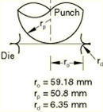

**图1.3.3-2** 初始构型。

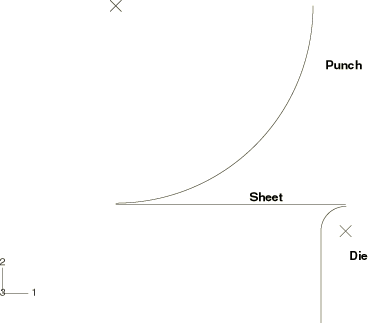

**图1.3.3-3** 冲头头位移34.5 mm时的构型，Abaqus/Explicit。

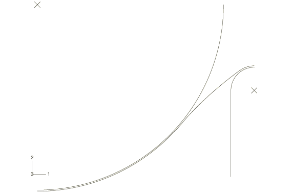

**图1.3.3-4** 回弹后的最终构型，Abaqus/Explicit。

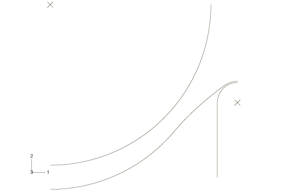

**图1.3.3-5** 冲头头位移18.6 mm时的应变分布。

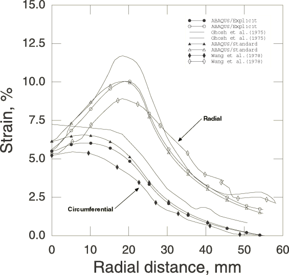

**图1.3.3-6** 冲头头位移28.5 mm时的应变分布。

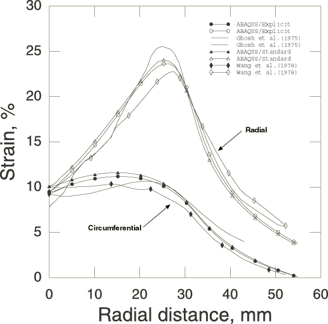

**图1.3.3-7** 冲头头位移34.5 mm时的应变分布。

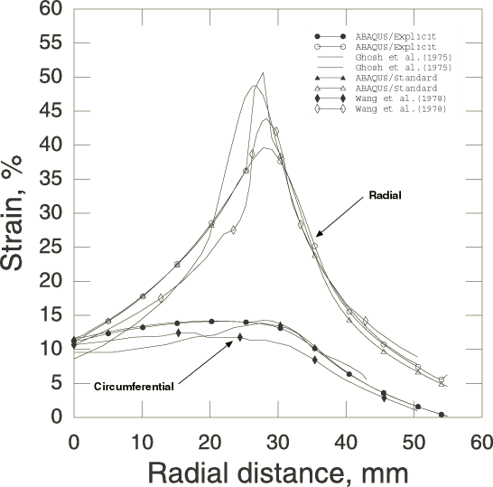

**图1.3.3-8** 回弹后顶表面的残余应力。

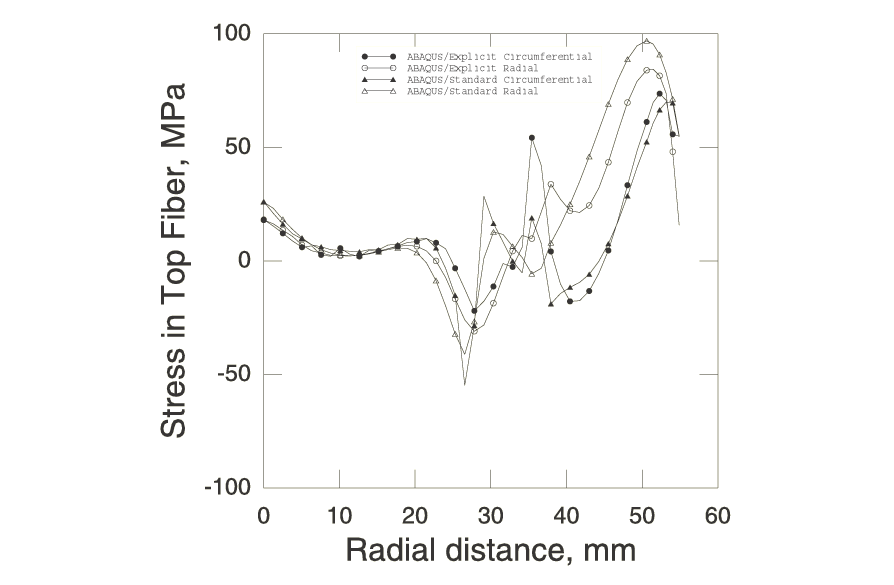

**图1.3.3-9** 回弹后底表面的残余应力。

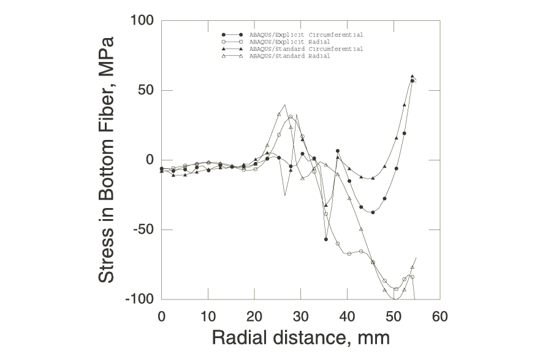

