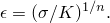
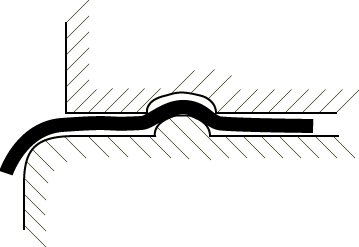
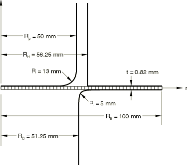
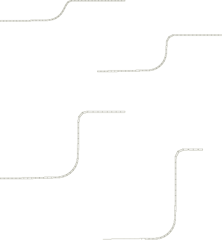
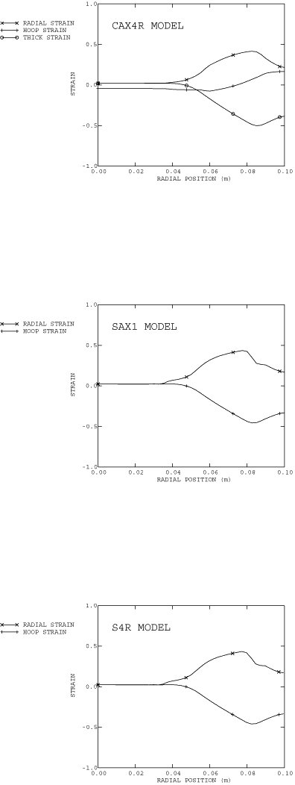
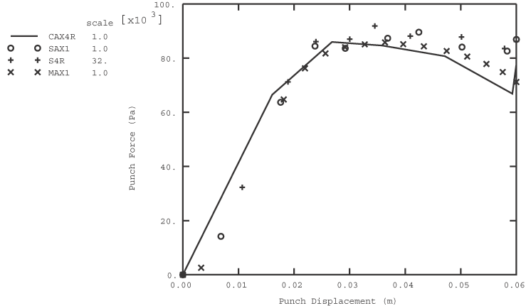
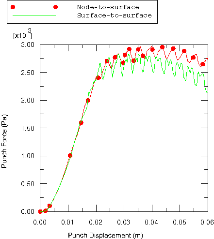
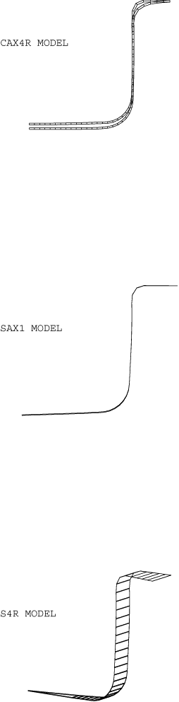

# 1.3.4 圆筒杯的深拉伸

**产品：** Abaqus/Standard  

板料金属深拉伸是一种重要的制造技术。在深拉伸过程中，板料"坯料"被压料圈通过压料板夹紧在模具上。然后冲头向坯料移动，坯料被拉入模具中。与半球形冲头拉伸示例（["半球形冲头薄板拉伸，"第1.3.3节](ch01s03aex34.md)）中描述的操作不同，坯料不被假定固定在模具和压料圈之间；相反，坯料是从这两个工具之间被拉入的。拉伸与拉深的比例由压料圈上的力和坯料/模具/压料圈界面处的摩擦条件控制。较高的力或坯料/模具/压料圈界面的摩擦限制了界面的滑动，增加了坯料的径向拉伸。在某些情况下，使用 drawbeads（如图1.3.4-1所示）来进一步限制该界面的滑动。

为了获得成功的深拉伸过程，必须控制坯料与其压料圈和模具之间的滑动。如果滑动受到过多限制，材料将经历严重拉伸，可能导致颈缩和破裂。如果坯料可以太容易地滑动，材料将被完全拉入，会产生高环向压应力，导致产品起皱。对于像这里的圆筒杯这样的简单形状，广泛的界面条件将产生令人满意的结果。但对于更复杂的三维形状，界面条件需要控制在狭窄范围内才能获得良好的产品。

在拉伸过程中，响应主要由板料的膜行为决定。特别是对于轴对称问题，金属的弯曲刚度仅对纯膜解产生小的修正，如Wang和Tang（1988）所讨论的。相比之下，模具、坯料和压料圈之间的相互作用是关键的。因此，必须在有限元模拟中准确建模板料材料中的厚度变化，因为它们将对界面的接触和摩擦应力产生重大影响。在这些情况下，Abaqus中最合适的单元是4节点减缩积分轴对称四边形CAX4R；一阶轴对称壳单元SAX1；一阶轴对称膜单元MAX1；一阶有限应变四边形壳单元S4R；完全积分的通用有限膜应变壳单元S4；和8节点连续体壳单元SC8R。

CAX4R可以正确建模膜效应和厚度变化。然而，该单元的弯曲刚度较低。该单元不会因不可压缩性或寄生剪切而出现"锁定"现象。它也非常具有成本效益。对于壳和膜，厚度变化根据材料不可压缩变形的假设计算。

### 几何和模型

问题的几何形状如图1.3.4-2所示。被拉伸的圆形坯料初始半径为100 mm，初始厚度为0.82 mm。冲头半径为50 mm，在角落处倒圆半径为13 mm。模具内半径为51.25 mm，在角落处倒圆半径为5 mm。压料圈内半径为56.25 mm。

坯料使用40个CAX4R型单元或31个SAX1、MAX1、S4R、S4或SC8R型单元进行建模。在三维S4R和S4模型中使用圆形坯料的11.25°楔形。这些网格对于此分析来说相当粗。但是，由于主要关注的是研究膜效应，分析仍然可以很好地指示该过程中发生的应力和应变。

坯料与刚性冲头、刚性模具和刚性压料圈之间的接触用接触对进行建模。坯料的顶面和底面在模型中定义为表面。刚性冲头、模具和压料圈建模为解析刚性表面。接触表面之间的机械相互作用假定为摩擦接触。因此，摩擦与各种接触属性定义结合使用来指定摩擦系数。

在CAX4R模型分析开始时，坯料精确定位在模具顶部，压料圈精确接触坯料的顶面。冲头定位在坯料顶面上方0.18 mm处。

对于壳和膜，坯料的定位取决于所使用的接触公式。Abaqus/Standard中提供节点-表面和表面-表面接触公式。对于节点-表面公式，壳/膜厚度使用指数压力-过盈关系进行建模（["接触压力-过盈关系，"Abaqus分析用户指南第37.1.2节](../usb/usb-link.md#usb-cni-anormalinteraction)）。压料圈定位在坯料上方固定距离处。此固定距离是使用指数压力-过盈关系将接触压力设置为零的距离。然而，表面-表面接触公式自动考虑厚度，消除了指定压力过盈关系的需要。此问题提供了使用S4和S4R单元的表面-表面接触公式的示例。

### 材料特性

材料（铝镇静钢）假定满足真应力和对数应变之间的Ramberg-Osgood关系：

参考应力值*K*为513 MPa；加工硬化指数*n*为0.223。杨氏模量为211 GPa，泊松比为0.3。使用这些数据获得91.3 MPa的初始屈服应力。应力-应变曲线在金属塑性 specification 中以分段线性段定义，直至107%的总（对数）应变水平。

界面与冲头之间的摩擦系数取为0.25；模具与压料圈之间的摩擦系数取为0.1，后者模拟界面之间一定程度的润滑。这些分析中使用粘接摩擦的刚度方法。该方法的数值使得在实际上应该发生粘接时，必须选择接触表面之间相对弹性滑动的可接受度量。选择的基础如下。较小的弹性滑动值最好地模拟实际行为，但也会导致解收敛较慢。允许接触表面之间较大的相对弹性位移可能导致坯料中心处的较高应变。在这些运行中，我们让Abaqus选择允许的弹性滑动，这是通过在整个网格上确定一个特征界面单元长度，然后乘以一个小分数来获得允许的弹性滑动度量来实现的。这种方法通常给出相当少量的弹性滑动。

虽然该过程中的材料是完全各向同性的，但局部坐标系与CAX4R单元一起使用，以定义最初与全局方向一致局部朝向。使用此选项的原因是在更自然的坐标中获得应力和应变输出：如果在几何非线性分析中使用局部坐标系，应力和应变分量在共旋框架中给出。因此，在我们的例子中，在整个运动过程中，S11将是杯中间表面方向上*r*–*z*平面中的应力。S22将是厚度方向的应力，S33将是环向应力，S12将是横向剪切应力，这使得解释结果相当容易。对于SAX1或MAX1单元，不需要此朝向定义，因为壳和膜单元的输出已经在局部壳系统中给出。对于SAX1和MAX1模型，S11是经向应力，S22是环向（ hoop）应力。对于S4R和S4模型，通常需要朝向定义，但可以通过以下方式避免：定义楔形，使得每个单元的单个积分点位于全局*x*轴上。这样的模型定义以及适当的运动学边界条件，保持壳的局部应力输出定义为S11是经向平面中的应力，S22是环向应力。在这个问题中不应该有面内剪切S12。S4R和S4模型中使用变换来在圆柱系统中施加边界约束。

### 加载

整个分析分五步进行。在第一步中，压料圈被推动与坯料接触以建立接触。在壳模型中，此位移大致对应于界面上的零间隙。

在第二步中，边界条件被移除并替换为压料圈上100 kN的施加力。此力在第2步和第3步期间保持恒定。这种模拟夹紧过程的技术用于避免压料圈的刚性体模式潜在问题，因为在过程开始时压料圈、坯料和模具之间没有 firm contact。两步程序在压料圈被允许自由移动之前创建接触。

在第三步中，冲头向坯料移动总共60 mm的距离。此步骤模拟实际拉伸过程。在此步骤中，设置时间增量参数以提高与摩擦接触相关的严重不连续行为的效率。

最后两个步骤用于模拟springback。在第四步中，模型中的所有节点固定在其当前位置，接触对从模型中移除。这是释放接触条件最可靠的方法。在第五步也是最后一步中，重新引入常规边界条件，允许springback发生。CAX4R单元的此部分分析仅包含用于演示卸载过程的可行性，并不期望产生现实的结果，因为减缩积分单元具有纯弹性弯曲行为。Springback 在壳单元模型中以更高的精度进行建模。

### 结果和讨论

[图1.3.4-3](ch01s03aex35.md#sxmdeepdraw-defshapes)显示了CAX4R模型在不同拉伸阶段预测的变形形状。轮廓显示金属最初弯曲和拉伸，然后被拉过模具表面覆盖。[图1.3.4-4](ch01s03aex35.md#sxmdeepdraw-straindist)显示了所有三种模型的径向和环向应变以及CAX4R模型的厚度应变。壳或膜模型的厚度可以通过输出变量STH（当前壳或膜厚度）进行监控。厚度变化不大：变化范围从圆柱部分的约12%到成形杯边缘的约+16%。在深拉伸工艺中通常需要相对较小的厚度变化，并且由于径向拉伸应变和环向压应变相互平衡而实现。

对于各种单元类型，作为冲头位移函数的拉伸力如图1.3.4-5所示，其中曲线 seen to match closely。同样，使用S4R单元的节点-表面和表面-表面接触公式的拉伸力与冲头位移的关系如图1.3.4-6所示。反应力历史的差异是由于在表面-表面接触公式中显式考虑坯料厚度，而节点-表面接触公式中指定了压力-过盈关系。在所有情况下，都可以看到力历史中的振荡。这些振荡是由于相当粗糙的网格造成的——每次振荡代表一个单元被拉过模具角落。与壳模型相比，膜模型预测给定冲头位移的冲头力较小。因此，在分析结束时，MAX1模型的冲头力与位移的结果更接近CAX4R模型的结果。

完全卸载后的变形形状如图1.3.4-7所示，叠加在完全加载下的变形形状上。分析表明，对于CAX4R模型，压料圈移除后杯的边缘强烈弹回。在壳模型中没有明显的springback。正如之前所指出的，CAX4R模型中的这种springback 在物理上不现实：在一阶减缩积分单元中，"弯曲"模式与"沙漏"模式相关联了弹性"沙漏控制"刚度，因为在连续体情形中该单元表现出这种模式。实际上，单元的弯曲是一个弹塑性过程，因此springback 可能要小得多。通过在坯料厚度方向上使用多个单元可以更好地模拟这方面的内容，但这也会增加分析成本。壳模型的结果没有表现出这个问题，显然更能代表实际的弹塑性过程。

### 输入文件

[deepdrawcup_cax4r.inp](../eif/deepdrawcup_cax4r.inp)

CAX4R模型。

[deepdrawcup_cax4r_surf.inp](../eif/deepdrawcup_cax4r_surf.inp)

使用表面-表面接触的CAX4R模型。

[deepdrawcup_cax4i.inp](../eif/deepdrawcup_cax4i.inp)

使用不兼容模式单元CAX4I作为CAX4R单元的替代方案的模型。与CAX4R等减缩积分线性等参单元相比，不兼容模式单元即使在厚度方向上有一层单元也具有优异的弯曲性能（参见["悬臂梁的几何非线性分析，"Abaqus Benchmarks指南第2.1.2节](../bmk/bmk-link.md#bmk-elm-nlgeocantilever)），并且没有沙漏问题。然而，它们的计算成本更高。

[deepdrawcup_s4.inp](../eif/deepdrawcup_s4.inp)

S4模型。

[deepdrawcup_s4_surf.inp](../eif/deepdrawcup_s4_surf.inp)

使用表面-表面接触的S4模型。

[deepdrawcup_s4r.inp](../eif/deepdrawcup_s4r.inp)

S4R模型。

[deepdrawcup_s4r_surf.inp](../eif/deepdrawcup_s4r_surf.inp)

使用表面-表面接触的S4R模型。

[deepdrawcup_sc8r.inp](../eif/deepdrawcup_sc8r.inp)

SC8R模型。

[deepdrawcup_sax1.inp](../eif/deepdrawcup_sax1.inp)

SAX1模型。

[deepdrawcup_postoutput.inp](../eif/deepdrawcup_postoutput.inp)

deepdrawcup_sax1.inp的[*POST OUTPUT](../key/key-link.md#usb-kws-hpostoutput)分析。

[deepdrawcup_max1.inp](../eif/deepdrawcup_max1.inp)

MAX1模型。

[deepdrawcup_mgax1.inp](../eif/deepdrawcup_mgax1.inp)

MGAX1模型。

### 参考文献

Wang, N. M., and S. C. Tang, "Analysis of Bending Effects in Sheet Forming Operations," International Journal for Numerical Methods in Engineering, vol. 25, pp. 253–267, January 1988.

### 图形

**图1.3.4-1** 用于限制坯料和模具之间滑动的典型drawbead。

**图1.3.4-2** 深拉伸问题的几何和网格。

**图1.3.4-3** 分析各个阶段的变形形状。

**图1.3.4-4** 深拉伸步骤结束时的应变分布。

**图1.3.4-5** 使用节点-表面接触公式的冲头力与冲头位移的关系。

**图1.3.4-6** 使用S4R单元不同接触公式的冲头力与冲头位移的比较。

**图1.3.4-7** 卸载后的变形形状。

