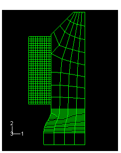
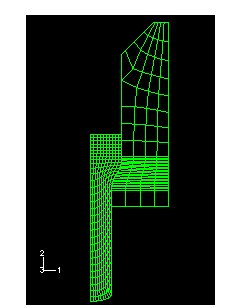
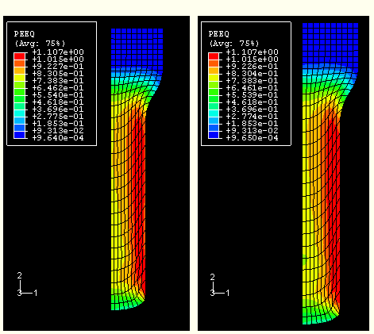
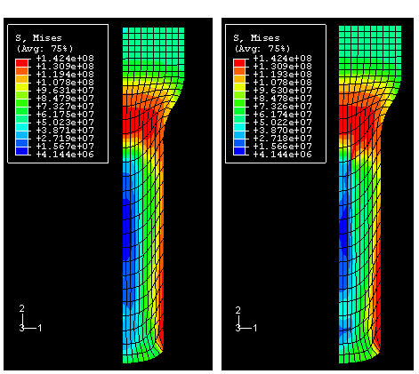
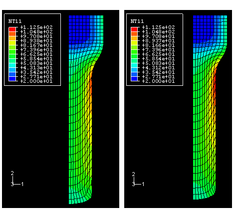
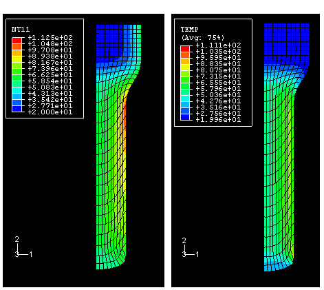
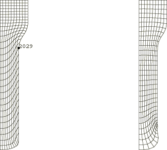
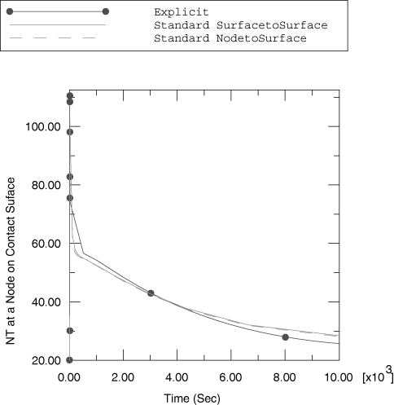

# 1.3.5 圆柱金属棒的挤压成形与摩擦热生成

**产品：** Abaqus/Standard  Abaqus/Explicit  

本分析说明了如何使用Abaqus模拟挤压问题。在这个特定问题中，铝圆柱棒的半径通过挤压工艺减少了33%。考虑了棒内部塑料耗散产生的热量以及工件/模具界面处的摩擦热生成。

### 几何和模型

棒料的初始半径为100 mm，长度为300 mm。[图1.3.5-1](ch01s03aex36.md#sxmbarextru-meshgeom)显示了该棒料横截面的一半，用一阶轴对称单元（Standard中的CAX4T和CAX4RT单元以及Abaqus/Explicit中的CAX4RT单元）建模。

在Abaqus/Standard和Abaqus/Explicit的主要分析中，虽然包含了摩擦加热，但不考虑变形棒料与刚性模具之间的热传递。进行了完全耦合的温度-位移分析，模具保持在恒定温度。此外，提供了使用Abaqus/Standard的绝热分析，不考虑摩擦热生成。提供了Standard中节点-表面（默认）和表面-表面接触公式。对于Abaqus/Explicit，在接触相互作用的定义中使用罚函数和运动学接触公式。

使用各种技术对刚性模具进行建模。在Abaqus/Standard中，模具使用CAX4T单元建模，成为等温刚性体，并使用解析刚性表面。在Abaqus/Explicit中，模具使用解析刚性表面和离散刚性单元（RAX2）进行建模。对于使用解析刚性表面的模型，倒角半径设置为0.075，以平滑模具表面。

Abaqus/Explicit模拟也使用任意拉格朗日-欧拉（ALE）自适应网格划分和增强沙漏控制。

### 材料模型和界面行为

选择材料模型以反映典型商业纯铝合金的响应。材料假定为各向同性硬化。包含了流动应力对温度的依赖性，但忽略了应变率依赖性。相反，选择应变率为0.1 sec⁻¹的代表性材料数据来表征流动强度。

界面假定没有导电特性。力学行为采用库仑摩擦，摩擦系数为0.1。间隙热生成用于指定由摩擦耗散产生的总热量中传递给两个接触体的比例，。一半热量传入工件，另一半传入模具。此外，假定90%的塑性不可恢复功加热工件材料。

### 边界条件、加载和求解控制

在第一步中，将棒料移动到建立接触的位置，工件开始相对于模具滑动。在第二步中，棒料被挤压通过模具，实现挤压过程。这通过向棒料顶部的节点规定位移来完成。在第三步中，移除接触单元，为模拟的冷却部分做准备。在Abaqus/Standard中，这是在单个步骤中执行的：允许棒料使用薄膜条件冷却，变形在第四步期间由热收缩驱动。

对两个分析应用了体积比例阻尼。在一种情况下，使用具有恒定阻尼因子的自动稳定方案。选择非默认阻尼密度以获得收敛且准确的解。在另一种情况下，使用具有默认阻尼密度的自适应自动稳定方案。在这种情况下，阻尼因子根据收敛历史自动调整。

在Abaqus/Explicit中，冷却模拟分为两个步骤：第一步引入粘性压力以阻尼动态效应，从而允许棒料快速达到静态平衡；冷却模拟的平衡在第五步中执行。在本例中不分析通过蠕变 relief 残余应力。

在Abaqus/Explicit中使用质量缩放来降低分析的计算成本；使用非默认沙漏控制来控制模型中的沙漏。默认的积分粘弹性沙漏控制方法通常最适合突然动态加载发生的问题；建议对准静态响应的问题使用基于刚度的沙漏控制。在这个问题中使用了刚度和粘性沙漏控制的组合。

为了比较，还分析了第二个问题，其中在前一个分析的前两个步骤在具有绝热热生成功能的静态分析中重复。绝热分析忽略棒料中的热传导。在这种情况下还必须忽略摩擦热生成。此问题仅在Abaqus/Standard中分析。

### 结果和讨论

以下讨论主要围绕Abaqus/Standard获得的结果进行。对于节点-表面和表面-表面接触公式，Abaqus/Explicit模拟的结果与Abaqus/Standard获得的结果非常一致。

[图1.3.5-2](ch01s03aex36.md#sxmbarextru-defconfig)显示了第2步结束时的变形构型。[图1.3.5-3](ch01s03aex36.md#sxmbarextru-strain)和[图1.3.5-4](ch01s03aex36.md#sxmbarextru-mises)显示了使用CAX4RT单元的完全耦合分析在第2步结束时塑性应变和Mises应力的等值线图。这些图显示了Abaqus/Standard中两种接触公式结果之间的良好一致性。塑性变形在工件表面附近最为严重，塑性应变超过100%。峰值应力发生在工件直径因变形而变窄的区域，以及接触表面上。[图1.3.5-5](ch01s03aex36.md#sxmbarextru-tempfric)比较了在第2步结束时使用Abaqus/Standard中表面-表面接触公式获得的节点温度与使用Abaqus/Explicit中运动学接触获得的节点温度。在两种情况下都使用了CAX4RT单元。尽管在Abaqus/Explicit中使用了质量缩放以节省计算成本，但两种分析的结果非常匹配。峰值温度发生在工件表面，由于塑性变形和摩擦加热。峰值温度发生在模具径向 reduction 区域之后。这是因为：首先，在 reduction 区域通过耗散过程加热的材料在通过 reduction 后区域时会通过传导冷却；其次，摩擦加热在 reduction 区域最大，因为该区域的剪切应力值较大。

使用两种稳定类型获得的结果相似。自适应自动稳定通常是首选，因为它更容易使用。对于具有恒定阻尼因子的稳定方法，通常需要指定非默认阻尼因子；而对于自适应阻尼因子，默认设置通常是合适的。

[图1.3.5-6](ch01s03aex36.md#sxmbarextru-fricadiab)比较了使用Abaqus/Standard中表面-表面接触公式的热耦合分析与绝热分析的结果。如果我们忽略棒料末端极度扭曲的区域，由于没有摩擦加热，绝热分析的表面温度升高不如那么大。正如预期，[图1.3.5-6](ch01s03aex36.md#sxmbarextru-fricadiab)中绝热加热分析的等温线图与[图1.3.5-3](ch01s03aex36.md#sxmbarextru-strain)中热耦合分析的塑性应变等值线非常相似。

如前所述，观察到Abaqus/Explicit（使用默认和增强沙漏控制）和Abaqus/Standard获得的结果之间非常好的一致性。[图1.3.5-7](ch01s03aex36.md#sxmbarextru-adap)比较了ALE自适应网格划分对单元质量的影响。使用ALE自适应网格划分获得的结果显示出显著降低的网格扭曲。在模拟过程中经历最大温升的棒料中的材料点被标出（在无自适应性的模型中的节点2029）。[图1.3.5-8](ch01s03aex36.md#sxmbarextru-ntcompare)比较了使用Abaqus/Explicit获得的该材料点温度历史与使用Abaqus/Standard中两种接触公式获得的结果。同样，结果之间获得了非常好的匹配。

### 输入文件

##### **Abaqus/Standard输入文件**

[metalbarextrusion_coupled_fric.inp](../eif/metalbarextrusion_coupled_fric.inp)

使用CAX4T单元进行具有摩擦热生成的热耦合挤压。

[metalbarextrusion_stabil.inp](../eif/metalbarextrusion_stabil.inp)

使用CAX4T单元进行具有摩擦热生成和自动稳定（用户定义阻尼）的热耦合挤压。

[metalbarextrusion_stabil_adap.inp](../eif/metalbarextrusion_stabil_adap.inp)

使用CAX4T单元进行具有摩擦热生成和自适应自动稳定（默认阻尼）的热耦合挤压。

[metalbarextrusion_coupled_fric_surf.inp](../eif/metalbarextrusion_coupled_fric_surf.inp)

使用CAX4T单元进行具有摩擦热生成和表面-表面接触公式的热耦合挤压。

[metalbarextrusion_s_coupled_fric_cax4rt.inp](../eif/metalbarextrusion_s_coupled_fric_cax4rt.inp)

使用CAX4RT单元进行具有摩擦热生成的热耦合挤压。

[metalbarextrusion_s_coupled_fric_cax4rt_surf.inp](../eif/metalbarextrusion_s_coupled_fric_cax4rt_surf.inp)

使用CAX4RT单元进行具有摩擦热生成和表面-表面接触公式的热耦合挤压。

[metalbarextrusion_adiab.inp](../eif/metalbarextrusion_adiab.inp)

具有绝热热生成且无摩擦热生成的挤压。

[metalbarextrusion_adiab_surf.inp](../eif/metalbarextrusion_adiab_surf.inp)

使用表面-表面接触公式的具有绝热热生成且无摩擦热生成的挤压。

##### **Abaqus/Explicit输入文件**

[metalbarextrusion_x_cax4rt.inp](../eif/metalbarextrusion_x_cax4rt.inp)

具有摩擦热生成且无ALE自适应网格划分的热耦合挤压；模具使用解析刚性表面建模；运动学力学接触。

[metalbarextrusion_x_cax4rt_enh.inp](../eif/metalbarextrusion_x_cax4rt_enh.inp)

具有摩擦热生成且无ALE自适应网格划分的热耦合挤压；模具使用解析刚性表面建模；运动学力学接触；增强沙漏控制。

[metalbarextrusion_xad_cax4rt.inp](../eif/metalbarextrusion_xad_cax4rt.inp)

具有摩擦热生成和ALE自适应网格划分的热耦合挤压；模具使用解析刚性表面建模；运动学力学接触。

[metalbarextrusion_xad_cax4rt_enh.inp](../eif/metalbarextrusion_xad_cax4rt_enh.inp)

具有摩擦热生成和ALE自适应网格划分的热耦合挤压；模具使用解析刚性表面建模；运动学力学接触；增强沙漏控制。

[metalbarextrusion_xd_cax4rt.inp](../eif/metalbarextrusion_xd_cax4rt.inp)

具有摩擦热生成且无ALE自适应网格划分的热耦合挤压；模具使用RAX2单元建模；运动学力学接触。

[metalbarextrusion_xd_cax4rt_enh.inp](../eif/metalbarextrusion_xd_cax4rt_enh.inp)

具有摩擦热生成且无ALE自适应网格划分的热耦合挤压；模具使用RAX2单元建模；运动学力学接触；增强沙漏控制。

[metalbarextrusion_xp_cax4rt.inp](../eif/metalbarextrusion_xp_cax4rt.inp)

具有摩擦热生成且无ALE自适应网格划分的热耦合挤压；模具使用解析刚性表面建模；罚函数力学接触。

[metalbarextrusion_xp_cax4rt_enh.inp](../eif/metalbarextrusion_xp_cax4rt_enh.inp)

具有摩擦热生成且无ALE自适应网格划分的热耦合挤压；模具使用解析刚性表面建模；罚函数力学接触；增强沙漏控制。

### 图形

**图1.3.5-1** 网格和几何：具有网格化刚性模具的轴对称挤压，Abaqus/Standard。

**图1.3.5-2** 变形构型：第2步，Abaqus/Standard。

**图1.3.5-3** 塑性应变等值线：第2步，热耦合分析（摩擦热生成），Abaqus/Standard（表面-表面接触公式，左；节点-表面接触公式，右）。

**图1.3.5-4** Mises应力等值线：第2步，热耦合分析（摩擦热生成），Abaqus/Standard（表面-表面接触公式，左；节点-表面接触公式，右）。

**图1.3.5-5** 温度等值线：第2步，热耦合分析（摩擦热生成）；Abaqus/Standard中的表面-表面接触公式，左；Abaqus/Explicit，右。

**图1.3.5-6** 温度等值线：第2步，Abaqus/Standard使用表面-表面接触公式；热耦合分析，左；绝热热生成（无摩擦导致的热生成），右。

**图1.3.5-7** 工件的变形形状：Abaqus/Explicit；无自适应重网格化，左；具有ALE自适应重网格化，右。

**图1.3.5-8** 接触表面上节点的温度历史（无自适应结果）。

