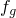

# 1.3.5 Extrusion of a cylindrical metal bar with frictional heat generation

**Products: **Abaqus/Standard  Abaqus/Explicit  

This analysis illustrates how extrusion problems can be simulated with Abaqus. In this particular problem the radius of an aluminum cylindrical bar is reduced 33% by an extrusion process. The generation of heat due to plastic dissipation inside the bar and the frictional heat generation at the workpiece/die interface are considered.

### Geometry and model

The bar has an initial radius of 100 mm and is 300 mm long. [Figure 1.3.5--1](ch01s03aex36.md#sxmbarextru-meshgeom) shows half of the cross-section of the bar, modeled with first-order axisymmetric elements (CAX4T and CAX4RT elements in Abaqus/Standard and CAX4RT elements in Abaqus/Explicit).

In the primary analysis in both Abaqus/Standard and Abaqus/Explicit, heat transfer between the deformable bar and the rigid die is not considered, although frictional heating is included. A fully coupled temperature-displacement analysis is performed with the die kept at a constant temperature. In addition, an adiabatic analysis is presented using Abaqus/Standard without accounting for frictional heat generation. Both the node-to-surface (default) and the surface-to-surface contact formulations in Abaqus/Standard are presented. In the case of Abaqus/Explicit, penalty and kinematic contact formulations are used in the definition of contact interactions.

Various techniques are used to model the rigid die. In Abaqus/Standard the die is modeled with CAX4T elements made into an isothermal rigid body using an isothermal rigid body and with an analytical rigid surface. In Abaqus/Explicit the die is modeled with an analytical rigid surface and discrete rigid elements (RAX2). The fillet radius is set to 0.075 for models using an analytical rigid surface to smoothen the die surface.

The Abaqus/Explicit simulations are also performed with Arbitrary Lagrangian-Eulerian (ALE) adaptive meshing and enhanced hourglass control.

### Material model and interface behavior

The material model is chosen to reflect the response of a typical commercial purity aluminum alloy. The material is assumed to harden isotropically. The dependence of the flow stress on the temperature is included, but strain rate dependence is ignored. Instead, representative material data at a strain rate of 0.1 sec1 are selected to characterize the flow strength.

The interface is assumed to have no conductive properties. Coulomb friction is assumed for the mechanical behavior, with a friction coefficient of 0.1. Gap heat generation is used to specify the fraction, , of total heat generated by frictional dissipation that is transferred to the two bodies in contact. Half of this heat is conducted into the workpiece, and the other half is conducted into the die. Furthermore, 90% of the nonrecoverable work due to plasticity is assumed to heat the work material.

### Boundary conditions, loading, and solution control

In the first step the bar is moved to a position where contact is established and slipping of the workpiece against the die begins. In the second step the bar is extruded through the die to realize the extrusion process. This is accomplished by prescribing displacements to the nodes at the top of the bar. In the third step the contact elements are removed in preparation for the cool down portion of the simulation. In Abaqus/Standard this is performed in a single step: the bar is allowed to cool down using film conditions, and deformation is driven by thermal contraction during the fourth step. 

Volume proportional damping is applied to two of the analyses that are considered. In one case the automatic stabilization scheme with a constant damping factor is used. A nondefault damping density is chosen so that a converged and accurate solution is obtained. In another case the adaptive automatic stabilization scheme with a default damping density is used. In this case the damping factor is automatically adjusted based on the convergence history.

In Abaqus/Explicit the cool down simulation is broken into two steps: the first introduces viscous pressure to damp out dynamic effects and, thus, allow the bar to reach static equilibrium quickly; the balance of the cool down simulation is performed in a fifth step. The relief of residual stresses through creep is not analyzed in this example.

In Abaqus/Explicit mass scaling is used to reduce the computational cost of the analysis; nondefault hourglass control is used to control the hourglassing in the model. The default integral viscoelastic approach to hourglass control generally works best for problems where sudden dynamic loading occurs; a stiffness-based hourglass control is recommended for problems where the response is quasi-static. A combination of stiffness and viscous hourglass control is used in this problem.

For purposes of comparison a second problem is also analyzed, in which the first two steps of the previous analysis are repeated in a static analysis with the adiabatic heat generation capability. The adiabatic analysis neglects heat conduction in the bar. Frictional heat generation must also be ignored in this case. This problem is analyzed only in Abaqus/Standard.

### Results and discussion

The following discussion centers around the results obtained with Abaqus/Standard. The results of the Abaqus/Explicit simulation are in close agreement with those obtained with Abaqus/Standard for both the node-to-surface and surface-to-surface contact formulations.

[Figure 1.3.5--2](ch01s03aex36.md#sxmbarextru-defconfig) shows the deformed configuration after Step 2 of the analysis. [Figure 1.3.5--3](ch01s03aex36.md#sxmbarextru-strain) and [Figure 1.3.5--4](ch01s03aex36.md#sxmbarextru-mises) show contour plots of plastic strain and the Mises stress at the end of Step 2 for the fully coupled analysis using CAX4RT elements. These plots show good agreement between the results using the two contact formulations in Abaqus/Standard. The plastic deformation is most severe near the surface of the workpiece, where plastic strains exceed 100%. The peak stresses occur in the region where the diameter of the workpiece narrows down due to deformation and also along the contact surface. [Figure 1.3.5--5](ch01s03aex36.md#sxmbarextru-tempfric) compares nodal temperatures obtained at the end of Step 2 using the surface-to-surface contact formulation in Abaqus/Standard with those obtained using kinematic contact in Abaqus/Explicit. In both cases CAX4RT elements are used. The results from both of the analyses match very well even though mass scaling is used in Abaqus/Explicit for computational savings. The peak temperature occurs at the surface of the workpiece because of plastic deformation and frictional heating. The peak temperature occurs immediately after the radial reduction zone of the die. This is expected for two reasons. First, the material that is heated by dissipative processes in the reduction zone will cool by conduction as the material progresses through the postreduction zone. Second, frictional heating is largest in the reduction zone because of the larger values of shear stress in that zone.

Similar results were obtained with the two types of stabilization considered. Adaptive automatic stabilization is generally preferred because it is easier to use. It is often necessary to specify a nondefault damping factor for the stabilization approach with a constant damping factor; whereas, with an adaptive damping factor, the default settings are typically appropriate. 

[Figure 1.3.5--6](ch01s03aex36.md#sxmbarextru-fricadiab) compares results of a thermally coupled analysis with an adiabatic analysis using the surface-to-surface contact formulation in Abaqus/Standard. If we ignore the zone of extreme distortion at the end of the bar, the temperature increase on the surface is not as large for the adiabatic analysis because of the absence of frictional heating. As expected, the temperature field contours for the adiabatic heating analysis, shown in [Figure 1.3.5--6](ch01s03aex36.md#sxmbarextru-fricadiab), are very similar to the contours for plastic strain from the thermally coupled analysis, shown in [Figure 1.3.5--3](ch01s03aex36.md#sxmbarextru-strain).

As noted earlier, excellent agreement is observed for the results obtained with Abaqus/Explicit (using both the default and enhanced hourglass control) and Abaqus/Standard. [Figure 1.3.5--7](ch01s03aex36.md#sxmbarextru-adap) compares the effects of ALE adaptive meshing on the element quality. The results obtained with ALE adaptive meshing show significantly reduced mesh distortion. The material point in the bar that experiences the largest temperature rise during the course of the simulation is indicated (node 2029 in the model without adaptivity). [Figure 1.3.5--8](ch01s03aex36.md#sxmbarextru-ntcompare) compares the results obtained for the temperature history of this material point using Abaqus/Explicit with the results obtained using the two contact formulations in Abaqus/Standard. Again, a very good match between the results is obtained.

### Input files

##### **Abaqus/Standard input files**

[metalbarextrusion_coupled_fric.inp](../eif/metalbarextrusion_coupled_fric.inp)

Thermally coupled extrusion using CAX4T elements with frictional heat generation.

[metalbarextrusion_stabil.inp](../eif/metalbarextrusion_stabil.inp)

Thermally coupled extrusion using CAX4T elements with frictional heat generation and automatic stabilization, user-defined damping.

[metalbarextrusion_stabil_adap.inp](../eif/metalbarextrusion_stabil_adap.inp)

Thermally coupled extrusion using CAX4T elements with frictional heat generation and adaptive automatic stabilization, default damping.

[metalbarextrusion_coupled_fric_surf.inp](../eif/metalbarextrusion_coupled_fric_surf.inp)

Thermally coupled extrusion using CAX4T elements with frictional heat generation and the surface-to-surface contact formulation.

[metalbarextrusion_s_coupled_fric_cax4rt.inp](../eif/metalbarextrusion_s_coupled_fric_cax4rt.inp)

Thermally coupled extrusion using CAX4RT elements with frictional heat generation.

[metalbarextrusion_s_coupled_fric_cax4rt_surf.inp](../eif/metalbarextrusion_s_coupled_fric_cax4rt_surf.inp)

 Thermally coupled extrusion using CAX4RT elements with frictional heat generation and the surface-to-surface contact formulation.

[metalbarextrusion_adiab.inp](../eif/metalbarextrusion_adiab.inp)

Extrusion with adiabatic heat generation and without frictional heat generation.

[metalbarextrusion_adiab_surf.inp](../eif/metalbarextrusion_adiab_surf.inp)

Extrusion with adiabatic heat generation and without frictional heat generation using the surface-to-surface contact formulation.

##### **Abaqus/Explicit input files**

[metalbarextrusion_x_cax4rt.inp](../eif/metalbarextrusion_x_cax4rt.inp)

Thermally coupled extrusion with frictional heat generation and without ALE adaptive meshing; die modeled with an analytical rigid surface; kinematic mechanical contact.

[metalbarextrusion_x_cax4rt_enh.inp](../eif/metalbarextrusion_x_cax4rt_enh.inp)

Thermally coupled extrusion with frictional heat generation and without ALE adaptive meshing; die modeled with an analytical rigid surface; kinematic mechanical contact; enhanced hourglass control.

[metalbarextrusion_xad_cax4rt.inp](../eif/metalbarextrusion_xad_cax4rt.inp)

Thermally coupled extrusion with frictional heat generation and ALE adaptive meshing; die modeled with an analytical rigid surface; kinematic mechanical contact.

[metalbarextrusion_xad_cax4rt_enh.inp](../eif/metalbarextrusion_xad_cax4rt_enh.inp)

Thermally coupled extrusion with frictional heat generation and ALE adaptive meshing; die modeled with an analytical rigid surface; kinematic mechanical contact; enhanced hourglass control.

[metalbarextrusion_xd_cax4rt.inp](../eif/metalbarextrusion_xd_cax4rt.inp)

Thermally coupled extrusion with frictional heat generation and without ALE adaptive meshing; die modeled with RAX2 elements; kinematic mechanical contact.

[metalbarextrusion_xd_cax4rt_enh.inp](../eif/metalbarextrusion_xd_cax4rt_enh.inp)

Thermally coupled extrusion with frictional heat generation and without ALE adaptive meshing; die modeled with RAX2 elements; kinematic mechanical contact; enhanced hourglass control.

[metalbarextrusion_xp_cax4rt.inp](../eif/metalbarextrusion_xp_cax4rt.inp)

Thermally coupled extrusion with frictional heat generation and without ALE adaptive meshing; die modeled with an analytical rigid surface; penalty mechanical contact.

[metalbarextrusion_xp_cax4rt_enh.inp](../eif/metalbarextrusion_xp_cax4rt_enh.inp)

Thermally coupled extrusion with frictional heat generation and without ALE adaptive meshing; die modeled with an analytical rigid surface; penalty mechanical contact; enhanced hourglass control.

### Figures

**Figure 1.3.5–1** Mesh and geometry: axisymmetric extrusion with meshed rigid die, Abaqus/Standard.

**Figure 1.3.5–2** Deformed configuration: Step 2, Abaqus/Standard.

**Figure 1.3.5–3** Plastic strain contours: Step 2, thermally coupled analysis (frictional heat generation), Abaqus/Standard (surface-to-surface contact formulation, left; node-to-surface contact formulation, right).

**Figure 1.3.5–4** Mises stress contours: Step 2, thermally coupled analysis (frictional heat generation), Abaqus/Standard (surface-to-surface contact formulation, left; node-to-surface contact formulation, right).

**Figure 1.3.5–5** Temperature contours: Step 2, thermally coupled analysis (frictional heat generation); surface-to-surface contact formulation in Abaqus/Standard, left; Abaqus/Explicit, right.

**Figure 1.3.5–6** Temperature contours: Step 2, Abaqus/Standard using surface-to-surface contact formulation; thermally coupled analysis, left; adiabatic heat generation (without heat generation due to friction), right.

**Figure 1.3.5–7** Deformed shape of the workpiece: Abaqus/Explicit; without adaptive remeshing, left; with ALE adaptive remeshing, right.

**Figure 1.3.5–8** Temperature history of a node on the contact surface (nonadaptive result).

