# 1.3.6 Rolling of thick plates

**Product: **Abaqus/Explicit  

Hot rolling is a basic manufacturing technique used to transform preformed shapes into a form suitable for further processing. Rolling processes can be divided into different categories, depending on the complexity of metal flow and on the geometry of the rolled product. Finite element computations are used increasingly to analyze the elongation and spread of the material during rolling (Kobayashi, 1989). Although the forming process is often carried out at low roll speed, this example shows that a considerable amount of engineering information can be obtained by using the explicit dynamics procedure in Abaqus/Explicit to model the process.

The rolling process is first investigated using plane strain computations. These results are used to choose the modeling parameters associated with the more computationally expensive three-dimensional analysis.

Since rolling is normally performed at relatively low speeds, it is natural to assume that static analysis is the proper modeling approach. Typical rolling speeds (surface speed of the roller) are on the order of 1 m/sec. At these speeds inertia effects are not significant, so the response—except for rate effects in the material behavior—is quasi-static. Representative rolling geometries generally require three-dimensional modeling, resulting in very large models, and include nonlinear material behavior and discontinuous effects—contact and friction. Because the problem size is large and the discontinuous effects dominate the solution, the explicit dynamics approach is often less expensive computationally and more reliable than an implicit quasi-static solution technique.

The computer time involved in running a simulation using explicit time integration with a given mesh is directly proportional to the time period of the event. This is because numerical stability considerations restrict the time increment to 

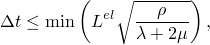

where the minimum is taken over all elements in the mesh, 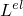 is a characteristic length associated with an element,  is the density of the material in the element, and  and  are the effective Lam's constants for the material in the element. Since this condition effectively means that the time increment can be no larger than the time required to propagate a stress wave across an element, the computer time involved in running a quasi-static analysis can be very large. The cost of the simulation is directly proportional to the number of time increments required, 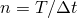 if  remains constant, where *T* is the time period of the event being simulated. ( will not remain constant in general, since element distortion will change  and nonlinear material response will change the effective Lam constants and density; but the assumption is acceptable for the purposes of this discussion.) Thus, 

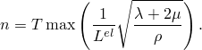

To reduce *n*, we can speed up the simulation compared to the time of the actual process; that is, we can artificially reduce the time period of the event, *T*. This will introduce two possible errors. If the simulation speed is increased too much, the inertia forces will be larger and will change the predicted response (in an extreme case the problem will exhibit wave propagation response). The only way to avoid this error is to find a speedup that is not too large. The other error is that some aspects of the problem other than inertia forces—for example, material behavior—may also be rate dependent. This implies that we cannot change the actual time period of the event being modeled. But we can see a simple equivalent—artificially increasing the material density, , by a factor 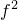 reduces *n* to 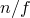, just as decreasing *T* to  does. This concept, which is called “mass scaling,” reduces the ratio of the event time to the time for wave propagation across an element while leaving the event time fixed, thus allowing treatment of rate-dependent material and other behaviors while having exactly the same effect on inertia forces as speeding up the time of simulation. Mass scaling is attractive because it allows us to treat rate-dependent quasi-static problems efficiently. But we cannot take it too far or we allow the inertia forces to dominate and, thus, change the solution. This example illustrates the use of mass scaling and shows how far we can take it for a practical case.

The trial and error method works well for most generic quasi-static problems; however, for rolling processes Abaqus/Explicit can set the mass scaling factor automatically based on the rolling geometry and mesh properties. An acceptable value for the stable time increment is calculated, and the appropriate mass scaling factor is applied on an element-by-element basis. The value of the stable time increment is based on the average element length in the rolling direction, the average velocity of the product through the rollers, and the number of nodes in the cross-section of the mesh.

### Problem description

A steel plate of an original square cross-section of 40 mm by 40 mm and a length of 92 mm is reduced to a 30 mm height by rolling through one roll stand. The radius of the rollers is 170 mm. The single roller in the model (taking advantage of symmetry) is assumed to be rigid and is modeled as an analytical rigid surface. The isotropic hardening yield curve of the steel is taken from Kopp and Dohmen (1990). Isotropic elasticity is assumed, with Young's modulus of 150 GPa and Poisson's ratio of 0.3. The strain hardening is described using 11 points on the yield stress versus plastic strain curve, with an initial yield stress of 168.2 MPa and a maximum yield stress of 448.45 MPa. No rate dependence or temperature dependence is taken into account.

Coulomb friction is assumed between the roller and the plate, with a friction coefficient of 0.3. Friction plays an important role in this process, as it is the only mechanism by which the plate is pulled through the roll stand. If the friction coefficient is too low, the plate cannot be drawn through the roll stand. Initially, when a point on the surface of the plate has just made contact with the roller, the roller surface is moving faster than the point on the surface of the plate and there is a relative slip between the two surfaces. As the point on the plate is drawn into the process zone under the roller, it moves faster and, after a certain distance, sticks to the roller. As the point on the surface of the plate is pushed out of the process zone, it picks up speed and begins to move faster than the roller. This causes slip in the opposite direction before the point on the surface of the sheet finally loses contact with the roller.

For plane strain computations a half-symmetry model with CPE4R elements is used. For the three-dimensional computations a one-quarter symmetry model with C3D8R elements is used. The roller is modeled with analytical rigid surfaces for both the two-dimensional and three-dimensional cases. For quasi-static rolling problems perfectly round analytical surfaces can provide a more accurate representation of the revolved roller geometry, improve computational efficiency, and reduce noise when compared to element-based rigid surfaces.

The roller is rotated through 32 at a constant angular velocity of 1 revolution per second (6.28 rad/sec), which corresponds to a roller surface speed of 1.07 m/sec. The plate is given an initial velocity in the global *x*-direction. The initial velocity is chosen to match the *x*-component of velocity of the roller at the point of first contact. This choice of initial velocity results in a net acceleration of zero in the *x*-direction at the point of contact and minimizes the initial impact between the plate and the roller. This minimizes the initial transient disturbance.

In all but one of the analyses performed in this example, the masses of all elements in the model are scaled by factors of either 110, 2758, or 68962. These scaling factors translate into effective roller surface speeds of 11.2 m/sec, 56.1 m/sec, and 280.5 m/sec. An alternative, but equivalent, means of mass scaling could be achieved by scaling the material mass density by the aforementioned factors. In one analysis, automatic mass scaling is used.

The element formulation for the two-dimensional (using CPE4R elements) and three-dimensional (using C3D8R elements) analyses uses the pure stiffness form of hourglass control. The element formulation is selected using section controls. In addition, the three-dimensional model (using C3D8R elements) uses the centroidal kinematic formulation. These options are economical yet provide the necessary level of accuracy for this class of problems. Two- and three-dimensional analyses using the default hourglass control formulation, the combined hourglass control formulation, and the enhanced hourglass control formulation are included for comparison. For the three-dimensional case, both the orthogonal kinematic formulation and the centroidal kinematic formulation are considered.

For the sole purpose of testing the performances of the modified triangular and tetrahedral elements, the problem is also analyzed in two dimensions using CPE6M elements and in three dimensions using C3D10M elements.

### Results and discussion

[Table 1.3.6--1](ch01s03aex37.md#table-rolling-analcpu) shows the effective rolling speeds and the relative CPU cost of the cases using the element formulations recommended for this problem. The relative costs are normalized with respect to the CPU time for the two-dimensional model (using CPE4R elements) with the intermediate mass scaling value. In addition, [Table 1.3.6--2](ch01s03aex37.md#table-rolling-contopts) compares the relative CPU cost and accuracy between the different element formulations of the solid elements using the intermediate mass scaling value.

#### Plane strain rolling (CPE4R elements)

A plane strain calculation allows the user to resolve a number of modeling questions in two dimensions before attempting a more expensive three-dimensional calculation. In particular, an acceptable effective mass scaling factor for running the transient dynamics procedure can be determined.

[Figure 1.3.6--1](ch01s03aex37.md#exxroll-eps-cpe4r-110) through [Figure 1.3.6--3](ch01s03aex37.md#exxroll-eps-cpe4r-68961) show contours of equivalent plastic strain for the three mass scaling factors using the stiffness hourglass control. [Figure 1.3.6--4](ch01s03aex37.md#exxroll-shr-cpe4r-110) through [Figure 1.3.6--6](ch01s03aex37.md#exxroll-shr-cpe4r-68961) show contours of shear stress for the same cases. These results show that there is very little difference between the lowest and the intermediate mass scaling cases. All the results are in good agreement with the quasi-static analysis results obtained with Abaqus/Standard. The results of the largest mass scaling case show pronounced dynamic effects. [Table 1.3.6--1](ch01s03aex37.md#table-rolling-analcpu) shows the relative run time of the quasi-static calculation, and [Table 1.3.6--2](ch01s03aex37.md#table-rolling-contopts) compares the different element formulations at the same level of mass scaling. The intermediate mass scaling case gives essentially the same results as the quasi-static calculation, using about one-thirteenth of the CPU time. In addition to the savings provided by mass scaling, more computational savings are achieved using the stiffness hourglass control element formulation; the results for this formulation compare well to the results for the computationally more expensive element formulations.

#### Three-dimensional rolling (C3D8R elements)

We have ascertained with the two-dimensional calculations that mass scaling by a factor of 2758 gives results that are essentially the same as a quasi-static solution. [Figure 1.3.6--7](ch01s03aex37.md#exxroll-eps-c3d8r-css) shows the distribution of the equivalent plastic strain of the deformed sheet for the three-dimensional case using the centroidal kinematic formulation and stiffness hourglass control. [Figure 1.3.6--8](ch01s03aex37.md#exxroll-eps-c3d8r-arp) shows the distribution of the equivalent plastic strain of the deformed sheet for the three-dimensional case using the default section controls (average strain kinematic and relax stiffness hourglass). [Table 1.3.6--1](ch01s03aex37.md#table-rolling-analcpu) compares this three-dimensional case with the plane strain, quasi-static, and three-dimensional automatic mass scaling cases; and [Table 1.3.6--2](ch01s03aex37.md#table-rolling-contopts) compares the five different three-dimensional element formulations included here with the two-dimensional cases at the same level of mass scaling. The accuracy for all five element formulations tested is very similar for this problem, but significant savings are realized in the three-dimensional analyses when using more economical element formulations.

#### Analyses using CPE6M and C3D10M elements

The total number of nodes in the CPE6M model is identical to the number in the CPE4R model. The number of nodes in the C3D10M model is 3440 (compared to 3808 in the C3D8R model). The analyses using the CPE6M and C3D10M elements use a mass scaling factor of 2758. [Figure 1.3.6--9](ch01s03aex37.md#exxroll-eps-cpe6m-2758) and [Figure 1.3.6--10](ch01s03aex37.md#exxroll-eps-c3d10m-2758) show the distribution of the equivalent plastic strain of the plate for the two-dimensional and three-dimensional cases, respectively. The results are in reasonably good agreement with other element formulations. However, the CPU costs are higher since the modified triangular and tetrahedral elements use more than one integration point in each element and the stable time increment size is somewhat smaller than in analyses that use reduced-integration elements with the same node count. For the mesh refinements used in this problem, the CPE6M model takes about twice the CPU time as the CPE4R model, while the C3D10M model takes about 5.75 times the CPU time as the C3D8R model.

### Input files

[roll2d330_anl_ss.inp](../eif/roll2d330_anl_ss.inp)

Two-dimensional case (using CPE4R elements) with a mass scaling factor of 2758 and the STIFFNESS hourglass control.

[roll3d330_rev_anl_css.inp](../eif/roll3d330_rev_anl_css.inp)

Three-dimensional case (using C3D8R elements) with a mass scaling factor of 2758, an analytical rigid surface of TYPE=REVOLUTION, and the CENTROID kinematic and STIFFNESS hourglass section control options.

[roll2d66_anl_ss.inp](../eif/roll2d66_anl_ss.inp)

Two-dimensional case (using CPE4R elements) with a mass scaling factor of 110 using the STIFFNESS hourglass control.

[roll2d330_anl_cs.inp](../eif/roll2d330_anl_cs.inp)

Two-dimensional case (using CPE4R elements) with a mass scaling factor of 2758 using the COMBINED hourglass control.

[roll2d330_anl_enhs.inp](../eif/roll2d330_anl_enhs.inp)

Two-dimensional case (using CPE4R elements) with a mass scaling factor of 2758 using the ENHANCED hourglass control.

[roll2d330_cs.inp](../eif/roll2d330_cs.inp)

Two-dimensional case (using CPE4R elements) with a mass scaling factor of 2758 using the COMBINED hourglass control and rigid elements.

[roll3d330_css.inp](../eif/roll3d330_css.inp)

Three-dimensional case (using C3D8R elements) with a mass scaling factor of 2758, rigid elements, and the CENTROID kinematic and STIFFNESS hourglass section control options.

[roll3d330_css_gcont.inp](../eif/roll3d330_css_gcont.inp)

Three-dimensional case (using C3D8R elements) with a mass scaling factor of 2758, rigid elements, the CENTROID kinematic and STIFFNESS hourglass section control options, and the general contact capability.

[roll3d330_ocs.inp](../eif/roll3d330_ocs.inp)

Three-dimensional case (using C3D8R elements) with a mass scaling factor of 2758, rigid elements, and the ORTHOGONAL kinematic and COMBINED hourglass section control options.

[roll3d330_ocs_gcont.inp](../eif/roll3d330_ocs_gcont.inp)

Three-dimensional case (using C3D8R elements) with a mass scaling factor of 2758, rigid elements, the ORTHOGONAL kinematic and COMBINED hourglass section control options, and the general contact capability.

[roll2d1650_anl_ss.inp](../eif/roll2d1650_anl_ss.inp)

Two-dimensional case (using CPE4R elements) with a mass scaling factor of 68962 using STIFFNESS hourglass control.

[roll3d330_rev_anl_ocs.inp](../eif/roll3d330_rev_anl_ocs.inp)

Three-dimensional model (using C3D8R elements) with a mass scaling factor of 2758, an analytical rigid surface of TYPE=REVOLUTION, and the ORTHOGONAL kinematic and COMBINED hourglass section control options.

[roll3d330_rev_anl_oenhs.inp](../eif/roll3d330_rev_anl_oenhs.inp)

Three-dimensional model (using C3D8R elements) with a mass scaling factor of 2758, an analytical rigid surface of TYPE=REVOLUTION, and the ORTHOGONAL kinematic and ENHANCED hourglass section control options.

[roll3d330_rev_anl_cenhs.inp](../eif/roll3d330_rev_anl_cenhs.inp)

Three-dimensional model (using C3D8R elements) with a mass scaling factor of 2758, an analytical rigid surface of TYPE=REVOLUTION, and the CENTROID kinematic and ENHANCED hourglass section control options.

[roll3d330_rev_anl.inp](../eif/roll3d330_rev_anl.inp)

Three-dimensional model (using C3D8R elements) with a mass scaling factor of 2758, an analytical rigid surface of TYPE=REVOLUTION, and the default section control options.

[roll3d_auto_rev_anl_css.inp](../eif/roll3d_auto_rev_anl_css.inp)

Three-dimensional case (using C3D8R elements) with automatic mass scaling, an analytical rigid surface of TYPE=REVOLUTION, and the CENTROID kinematic and STIFFNESS hourglass section control options.

[roll3d330_cyl_anl.inp](../eif/roll3d330_cyl_anl.inp)

Three-dimensional model (using C3D8R elements) with a mass scaling factor of 2758, an analytical rigid surface of TYPE=CYLINDER, and the default section control options.

[roll2d66.inp](../eif/roll2d66.inp)

Two-dimensional model (using CPE4R elements) with a mass scaling factor of 110 and the default section controls.

[roll2d330.inp](../eif/roll2d330.inp)

Two-dimensional model (using CPE4R elements) with a mass scaling factor of 2758 and the default section controls.

[roll2d1650.inp](../eif/roll2d1650.inp)

Two-dimensional model (using CPE4R elements) with a mass scaling factor of 68962 and the default section controls.

[roll3d330.inp](../eif/roll3d330.inp)

Three-dimensional model using rigid elements and the default section controls.

[roll3d330_gcont.inp](../eif/roll3d330_gcont.inp)

Three-dimensional model using rigid elements, the default section controls, and the general contact capability.

[roll2d66_anl.inp](../eif/roll2d66_anl.inp)

Two-dimensional model (using CPE4R elements) with a mass scaling factor of 110, analytical rigid surfaces, and the default section controls.

[roll2d330_anl.inp](../eif/roll2d330_anl.inp)

Two-dimensional model (using CPE4R elements) with a mass scaling factor of 2758, analytical rigid surfaces, and the default section controls.

[roll2d1650_anl.inp](../eif/roll2d1650_anl.inp)

Two-dimensional model (using CPE4R elements) with a mass scaling factor of 68962, analytical rigid surfaces, and the default section controls.

[roll2d_impl_qs.inp](../eif/roll2d_impl_qs.inp)

Implicit, quasi-static, two-dimensional model (using CPE4R elements) with analytical rigid surfaces.

[roll2d330_anl_cpe6m.inp](../eif/roll2d330_anl_cpe6m.inp)

Two-dimensional case (using CPE6M elements) with a mass scaling factor of 2758.

[roll3d330_anl_c3d10m.inp](../eif/roll3d330_anl_c3d10m.inp)

Three-dimensional case (using C3D10M elements) with a mass scaling factor of 2758.

[roll3d_medium.inp](../eif/roll3d_medium.inp)

Additional mesh refinement case (using C3D8R elements) included for the sole purpose of testing the performance of the code.

[roll3d_medium_gcont.inp](../eif/roll3d_medium_gcont.inp)

Additional mesh refinement case (using C3D8R elements) with the general contact capability.

### References

Kobayashi,  S., S. I. Oh, and T. Altan, *Metal Forming and the Finite Element Method, *Oxford University Press, 1989.

Kopp,  R., and P. M. Dohmen, “Simulation und Planung von Walzprozessen mit Hilfe der Finite-Elemente-Methode (FEM),” Stahl U. Eisen, no.7, pp. 131–136, 1990.

### Tables

**Table 1.3.6–1** Analysis cases and relative CPU costs. (The two-dimensional explicit analyses all use CPE4R elements and stiffness hourglass control. The three-dimensional explicit analyses use C3D8R elements and the centroidal kinematic and stiffness hourglass section controls.)
| Analysis Type | Mass Scaling Factor | Effective Roll Surface Speed (m/sec) | Relative CPU Time |
| --- | --- | --- | --- |
| Explicit, plane strain | 110.3 | 11.2 | 4.99 |
| Explicit, plane strain | 2758.5 | 56.1 | 1.00 |
| Explicit, plane strain | 68961.8 | 280.5 | 0.21 |
| Implicit, plane strain |  | quasi-static | 13.4 |
| Explicit, 3D | 2758.5 | 56.1 | 13.8 |
| Explicit, 3D | automatic | ~96 | 9.5 |

**Table 1.3.6–2** Explicit section controls tested (mass scaling factor=2758.5). CPE4R and C3D8R elements are employed for the two-dimensional and three-dimensional cases, respectively. Spread values are reported for the half-model at node 24015.
| Analysis Type | Section Controls | Relative CPU Time | Spread (mm) |
| --- | --- | --- | --- |
| Kinematic | Hourglass |
| Explicit, plane strain | n/a | stiffness | 1.00 | n/a |
| Explicit, plane strain | n/a | relax stiffness | 1.11 | n/a |
| Explicit, plane strain | n/a | combined | 1.04 | n/a |
| Explicit, plane strain | n/a | enhanced | 1.02 | n/a |
| Explicit, 3D | average strain | relax stiffness | 20.8 | 2.06 |
| Explicit, 3D | orthogonal | combined | 17.1 | 2.07 |
| Explicit, 3D | centroidal | stiffness | 13.8 | 2.10 |
| Explicit, 3D | centroidal | enhanced | 14.8 | 2.10 |
| Explicit, 3D | orthogonal | enhanced | 17.3 | 2.10 |

### Figures

**Figure 1.3.6–1** Equivalent plastic strain for the plane strain case (CPE4R) with stiffness hourglass control (mass scaling factor=110.3).

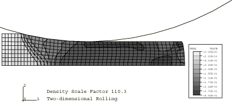

**Figure 1.3.6–2** Equivalent plastic strain for the plane strain case (CPE4R) with stiffness hourglass control (mass scaling factor=2758.5).

**Figure 1.3.6–3** Equivalent plastic strain for the plane strain case (CPE4R) with stiffness hourglass control (mass scaling factor=68961.8).

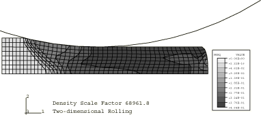

**Figure 1.3.6–4** Shear stress for the plane strain case (CPE4R) with stiffness hourglass control (mass scaling factor=110.3).

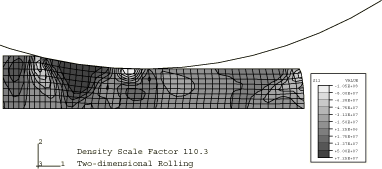

**Figure 1.3.6–5** Shear stress for the plane strain case (CPE4R) with stiffness hourglass control (mass scaling factor=2758.5).

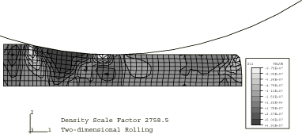

**Figure 1.3.6–6** Shear stress for the plane strain case (CPE4R) with stiffness hourglass control (mass scaling factor=68961.8).

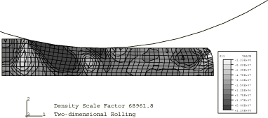

**Figure 1.3.6–7** Equivalent plastic strain for the three-dimensional case (C3D8R) using the centroidal kinematic and stiffness hourglass section controls (mass scaling factor=2758.5).

**Figure 1.3.6–8** Equivalent plastic strain for the three-dimensional case (C3D8R) using the average strain kinematic and relax stiffness hourglass section controls (mass scaling factor=2758.5).

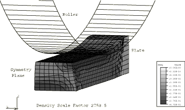

**Figure 1.3.6–9** Equivalent plastic strain for the plane strain case (CPE6M) (mass scaling factor=2758.5).

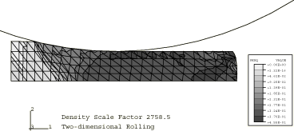

**Figure 1.3.6–10** Equivalent plastic strain for the three-dimensional case (C3D10M) (mass scaling factor=2758.5).

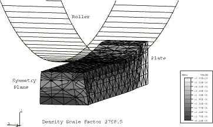

