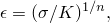
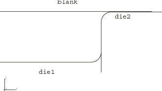
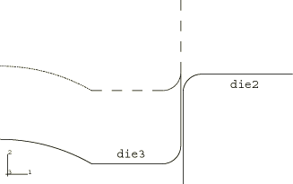
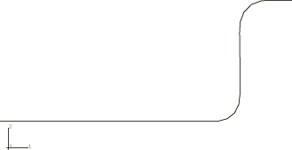
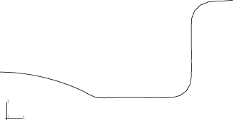
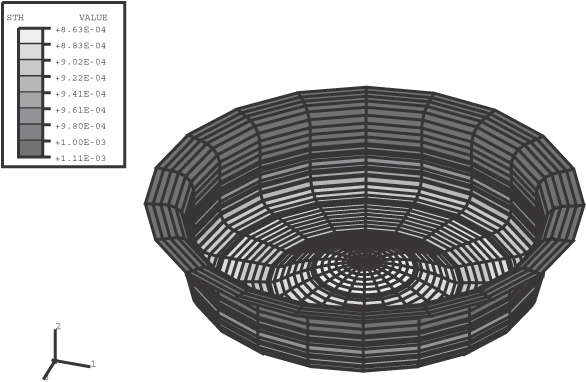

# 1.3.7 Axisymmetric forming of a circular cup

**Products: **Abaqus/Standard  Abaqus/Explicit  

This example illustrates the hydroforming of a circular cup using an axisymmetric model. In this case a two-stage forming sequence is used, with annealing between the stages. Two analysis methods are used: in one the entire process is analyzed using Abaqus/Explicit; in the other the forming sequences are analyzed with Abaqus/Explicit, while the springback analyses are run in Abaqus/Standard. Here, the import capability is used to transfer results between Abaqus/Explicit and Abaqus/Standard and vice versa.

### Problem description

The model consists of a deformable blank and three rigid dies. The blank has a radius of 150.0 mm, is 1.0 mm thick, and is modeled using axisymmetric shell elements, SAX1. The coefficient of friction between the blank and the dies is taken to be 0.1. Dies 1 and 2 are offset from the blank by half of the thickness of the blank, because the contact algorithm takes into account the shell thickness. To avoid pinching of the blank while die 3 is put into position for the second forming stage, the radial gap between dies 2 and 3 is set to be 20% bigger than the initial shell thickness. [Figure 1.3.7--1](ch01s03aex38.md#exxaxiform-config1) and [Figure 1.3.7--2](ch01s03aex38.md#exxaxiform-config2) show the initial geometry of the model.

The three dies are modeled with either two-dimensional analytical rigid surfaces or RAX2 rigid elements. An analytical rigid surface can yield a more accurate representation of two-dimensional curved punch geometries and result in computational savings. Contact pressure can be viewed on the specimen surface, and the reaction force is available at the rigid body reference node. In addition, both the kinematic (default) and penalty contact formulations are tested. Results for the kinematic contact formulation using rigid elements are presented here.

The blank is made of aluminum-killed steel, which is assumed to satisfy the Ramberg-Osgood relation between true stress and logarithmic strain, 

with a reference stress value (*K*) of 513 MPa and work-hardening exponent (*n*) of 0.223. Isotropic elasticity is assumed, with Young's modulus of 211 GPa and Poisson's ratio of 0.3. With these data an initial yield stress of 91.3 MPa is obtained. The stress-strain behavior is defined by piecewise linear segments matching the Ramberg-Osgood curve up to a total (logarithmic) strain level of 107%, with Mises yield, isotropic hardening, and no rate dependence.

The analysis that is performed entirely within Abaqus/Explicit consists of six steps. In the first step contact is defined between the blank and dies 1 and 2. Both dies remain fixed while a distributed load of 10 MPa in the negative *z*-direction is ramped onto the blank. This load is then ramped off in the second step, allowing the blank to spring back to an equilibrium state.

The third step is an annealing step. The annealing procedure in Abaqus/Explicit sets all appropriate state variables to zero. These variables include stresses, strains (excluding the thinning strain for shells, membranes, and plane stress elements), plastic strains, and velocities. There is no time associated with an annealing step. The process occurs instantaneously.

In the fourth step contact is defined between the blank and die 3 and contact is removed between the blank and die 1. Die 3 moves down vertically in preparation for the next pressure loading.

In the fifth step another distributed load is applied to the blank in the positive *z*-direction, forcing the blank into die 3. This load is then ramped off in the sixth step to monitor the springback of the blank.

To obtain a quasi-static response, an investigation was conducted to determine the optimum rate for applying the pressure loads and removing them. The optimum rate balances the computational time against the accuracy of the results; increasing the loading rate will reduce the computer time but lead to less accurate quasi-static results.

The analysis that uses the import capability consists of four runs. The first run is identical to Step 1 of the Abaqus/Explicit analysis described earlier. In the second run the Abaqus/Explicit results for the first forming stage are imported into Abaqus/Standard without updating the reference configuration and with an import of the material state for the first springback analysis. The third run imports the results of the first springback analysis into Abaqus/Explicit for the subsequent annealing process and the second forming stage. By updating the reference configuration and not importing the material state, this run begins with no initial stresses or strains, effectively simulating the annealing process. The final run imports the results of the second forming stage into Abaqus/Standard for the second springback analysis.

### Results and discussion

[Figure 1.3.7--3](ch01s03aex38.md#exxaxiform-deform1) to [Figure 1.3.7--5](ch01s03aex38.md#exxaxiform-shllthck-cntr) show the results of the analysis conducted entirely within Abaqus/Explicit using the rigid element approach and the kinematic contact formulation. [Figure 1.3.7--3](ch01s03aex38.md#exxaxiform-deform1) shows the deformed shape at the end of Step 2, after the elastic springback. [Figure 1.3.7--4](ch01s03aex38.md#exxaxiform-configfinal) shows the deformed shape at the end of the analysis, after the second elastic springback. Although it is not shown here, the amount of springback observed during the unloading steps is negligible. [Figure 1.3.7--5](ch01s03aex38.md#exxaxiform-shllthck-cntr) shows a contour plot of the shell thickness (STH) at the end of the analysis. The thickness of the material at the center of the cup has been reduced by about 20%, while the thickness at the edges of the cup has been increased by about 10%.

The results obtained using the import capability to perform the springback analyses in Abaqus/Standard are nearly identical, as are those obtained using analytical rigid surfaces and/or penalty contact formulations.

You can use the **abaqus restartjoin** execution procedure to extract data from the output database created by a restart analysis and append the data to a second output database. For more information, see ["Joining output database (`.odb`) files from restarted analyses," Section 3.2.21 of the Abaqus Analysis User's Guide](../usb/usb-link.md#usb-int-drestartjoinproc).

### Input files

[axiform.inp](../eif/axiform.inp)

Abaqus/Explicit analysis that uses rigid elements and kinematic contact. This file is also used for the first step of the analysis that uses the import capability.

[axiform_anl.inp](../eif/axiform_anl.inp)

Model using analytical rigid surfaces and kinematic contact.

[axiform_pen.inp](../eif/axiform_pen.inp)

Model using rigid elements and penalty contact.

[axiform_anl_pen.inp](../eif/axiform_anl_pen.inp)

Model using analytical rigid surfaces and penalty contact.

[axiform_sprbk1.inp](../eif/axiform_sprbk1.inp)

First springback analysis using the import capability.

[axiform_form2.inp](../eif/axiform_form2.inp)

Second forming analysis using the import capability.

[axiform_sprbk2.inp](../eif/axiform_sprbk2.inp)

Second springback analysis using the import capability.

[axiform_restart.inp](../eif/axiform_restart.inp)

Restart of axiform.inp included for the purpose of testing the restart capability.

[axiform_rest_anl.inp](../eif/axiform_rest_anl.inp)

Restart of axiform_anl.inp included for the purpose of testing the restart capability.

### Figures

**Figure 1.3.7–1** Configuration at the beginning of stage 1.

**Figure 1.3.7–2** Configuration of dies in forming stage 2. (The dotted line shows the initial position of die 3.)

**Figure 1.3.7–3** Deformed configuration after the first forming stage.

**Figure 1.3.7–4** Final configuration.

**Figure 1.3.7–5** Contour plot of shell thickness.

