# 1.3.8 Cup/trough forming

**Product: **Abaqus/Explicit  

This example illustrates the use of adaptive meshing in forging problems that include large amounts of shearing at the tool-blank interface; a cup and a trough are formed.

### Problem description

Three different geometric models are considered, as shown in [Figure 1.3.8--1](ch01s03aex39.md#exxalecupform-geom). Each model consists of a rigid punch, a rigid die, and a deformable blank. The outer top and bottom edges of the blank are cambered, which facilitates the flow of material against the tools. The punch and die have semicircular cross-sections; the punch has a radius of 68.4 mm, and the die has a radius of 67.9 mm. The blank is modeled as a von Mises elastic, perfectly plastic material with a Young's modulus of 4000 MPa and a yield stress of 5 MPa. The Poisson's ratio is 0.21; the density is 1.E4 tonne/mm3.

In each case the punch is moved 61 mm, while the die is fully constrained. A smooth amplitude curve is used to ramp the punch velocity to a maximum, at which it remains constant. The smoothing of the velocity promotes a quasi-static response to the loading.

#### Case 1: Axisymmetric model for cup forming

The blank is meshed with CAX4R elements and measures 50  64.77 mm. The punch and the die are modeled as analytical rigid surfaces using connected line segments. Symmetry boundary conditions are prescribed at *r*=0. The finite element model is shown in [Figure 1.3.8--2](ch01s03aex39.md#exxalecupform-undef1).

#### Case 2: Three-dimensional model for trough forming

The blank is meshed with C3D8R elements and measures 50  64.7  64.7 mm. The punch and the die are modeled as three-dimensional cylindrical analytical rigid surfaces. Symmetry boundary conditions are applied at the *x*=0 and *z*=0 planes. The finite element model of the blank is shown in [Figure 1.3.8--3](ch01s03aex39.md#exxalecupform-undef2).

#### Case 3: Three-dimensional model for cup forming

The blank is meshed with C3D8R elements. A 90 wedge of the blank with a radius of 50 mm and a height of 64.7 mm is analyzed. The punch and the die are modeled as three-dimensional revolved analytical rigid surfaces. Symmetry boundary conditions are applied at the *x*=0 and *y*=0 planes. The finite element model of the blank is shown in [Figure 1.3.8--4](ch01s03aex39.md#exxalecupform-undef3).

### Adaptive meshing

A single adaptive mesh domain that incorporates the entire blank is used for each model. Symmetry planes are defined as Lagrangian boundary regions (the default), and contact surfaces are defined as sliding boundary regions (the default). Since this problem is quasi-static with relatively small amounts of deformation per increment, the default values for frequency, mesh sweeps, and other adaptive mesh parameters and controls are sufficient.

### Results and discussion

[Figure 1.3.8--5](ch01s03aex39.md#exxalecupform-deform1) through [Figure 1.3.8--7](ch01s03aex39.md#exxalecupform-deform3) show the mesh configuration at the end of the forging simulation for Cases 1–3. In each case a quality mesh is maintained throughout the simulation. As the blank flattens out, geometric edges and corners that exist at the beginning of the analysis are broken and adaptive meshing is allowed across them. The eventual breaking of geometric edges and corners is essential for this type of problem to minimize element distortion and optimize element aspect ratios.

For comparison purposes [Figure 1.3.8--8](ch01s03aex39.md#exxalecupform-deform1-lg) shows the deformed mesh for a pure Lagrangian simulation of Case 1 (the axisymmetric model). The mesh is clearly better when continuous adaptive meshing is used. Several diamond-shaped elements with extremely poor aspect ratios are formed in the pure Lagrangian simulation. Adaptive meshing improves the element quality significantly, especially along the top surface of the cup where solution gradients are highest. [Figure 1.3.8--9](ch01s03aex39.md#exxalecupform-cntr1) and [Figure 1.3.8--10](ch01s03aex39.md#exxalecupform-cntr1-lg) show contours of equivalent plastic strain at the completion of the forging for the adaptive meshing and pure Lagrangian analyses of Case 1, respectively. Overall plastic strains compare quite closely. Slight differences exist only along the upper surface, where the pure Lagrangian mesh becomes very distorted at the end of the simulation. The time histories of the vertical punch force for the adaptive and pure Lagrangian analyses agree closely for the duration of the forging, as shown in [Figure 1.3.8--11](ch01s03aex39.md#exxalecupform-timehists).

### Input files

[ale_cupforming_axi.inp](../eif/ale_cupforming_axi.inp)

Case 1.

[ale_cupforming_axinodes.inp](../eif/ale_cupforming_axinodes.inp)

External file referenced by Case 1.

[ale_cupforming_axielements.inp](../eif/ale_cupforming_axielements.inp)

External file referenced by Case 1.

[ale_cupforming_cyl.inp](../eif/ale_cupforming_cyl.inp)

Case 2.

[ale_cupforming_sph.inp](../eif/ale_cupforming_sph.inp)

Case 3.

[lag_cupforming_axi.inp](../eif/lag_cupforming_axi.inp)

Lagrangian solution of Case 1.

### Figures

**Figure 1.3.8–1** Model geometries for each case.

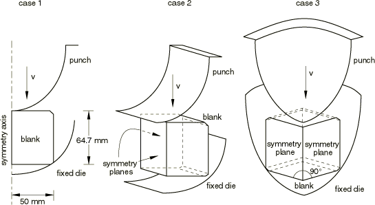

**Figure 1.3.8–2** Undeformed mesh for Case 1.

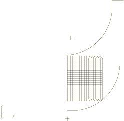

**Figure 1.3.8–3** Undeformed mesh for Case 2.

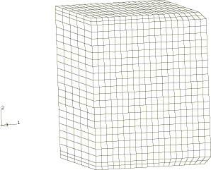

**Figure 1.3.8–4** Undeformed mesh for Case 3.

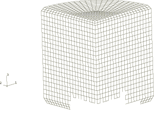

**Figure 1.3.8–5** Deformed mesh for Case 1.

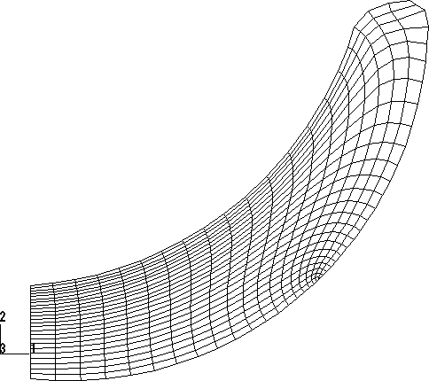

**Figure 1.3.8–6** Deformed mesh for Case 2.

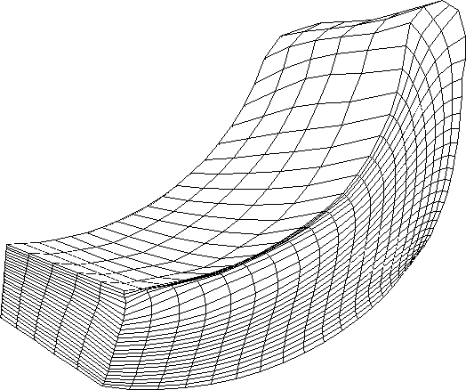

**Figure 1.3.8–7** Deformed mesh for Case 3.

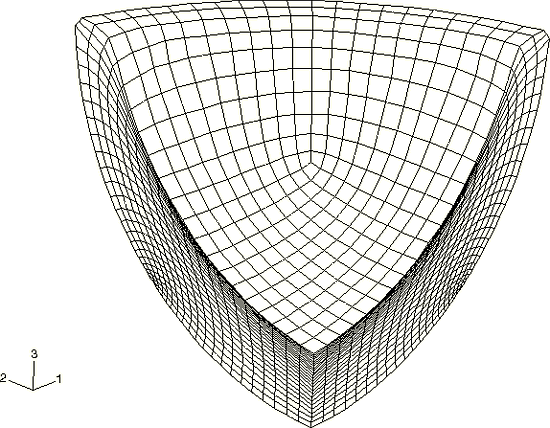

**Figure 1.3.8–8** Deformed mesh for Case 1 using a pure Lagrangian formulation.

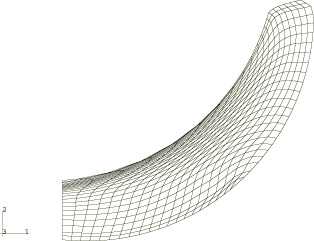

**Figure 1.3.8–9** Contours of equivalent plastic strain for Case 1 using adaptive meshing.

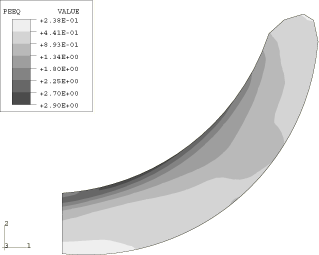

**Figure 1.3.8–10** Contours of equivalent plastic strain for Case 1 using a pure Lagrangian fomulation.

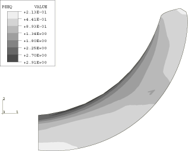

**Figure 1.3.8–11** Comparison of time histories for the vertical punch force for Case 1.

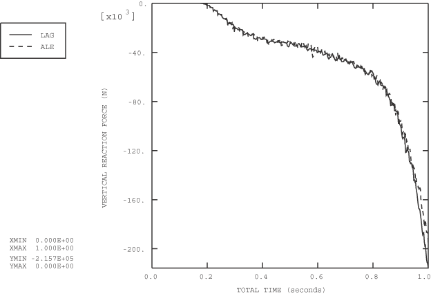

