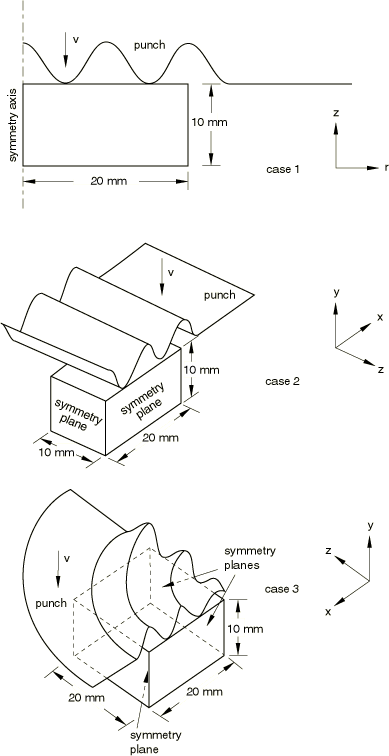
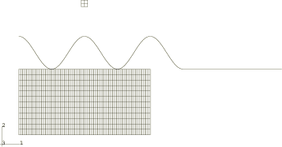
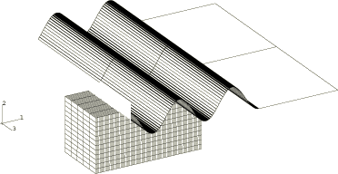
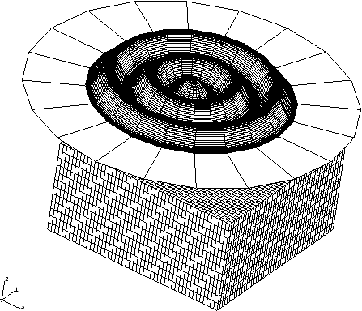
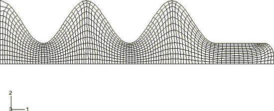
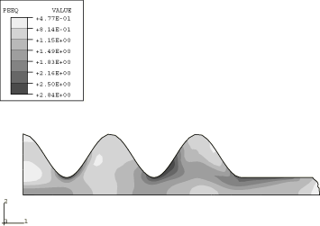
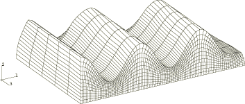
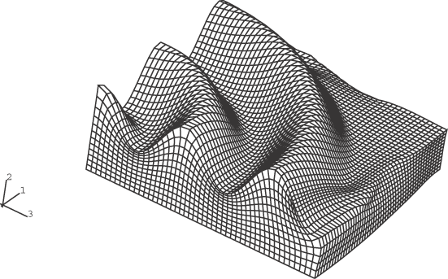
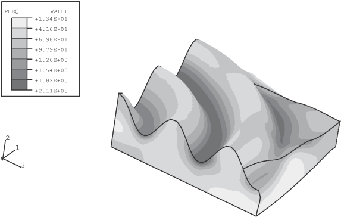

# 1.3.9 正弦模具锻造

**产品：** Abaqus/Explicit  

本示例说明了在包含几何复杂模具并涉及大量材料流动的锻造问题中使用自适应网格划分。

### 问题描述

考虑了三种不同的几何模型，如图1.3.9-1所示。每个模型由一个刚性模具和一个可变形坯料组成。模具的横截面形状为正弦形，振幅和周期分别为5 mm和10 mm。坯料为钢，建模为von Mises弹塑性材料，杨氏模量为200 GPa，初始屈服应力为100 MPa，恒定硬化斜率为300 MPa。泊松比为0.3；密度为7800 kg/m³。

在所有情况下，模具以2000 mm/sec的速度垂直向下移动，其他所有自由度均被约束。模具总位移：案例1为7.6 mm，案例2为6.7 mm，案例3为5.6 mm。这些位移代表了给定初始网格的细化和拓扑所能实现的最大值（如果在整个分析过程中保持网格质量）。虽然每个分析都使用正弦模具，但每个问题的坯料几何形状和流动特性完全不同。

#### 案例1：轴对称模型

坯料用CAX4R单元进行网格划分，尺寸为20×10 mm。模具建模为由连接线段组成的解析刚性表面。坯料底部在*z*方向被约束，在*r*=0处规定了对称边界条件。坯料和模具的初始构型如图1.3.9-2所示。

#### 案例2：三维模型

坯料用C3D8R单元进行网格划分，尺寸为20×10×10 mm。模具建模为三维圆柱形解析刚性表面。坯料底部在*y*方向被约束，在*x*=0和*z*=10平面上应用对称边界条件。坯料和模具的有限元模型如图1.3.9-3所示。

#### 案例3：三维模型

坯料用C3D8R单元进行网格划分，尺寸为20×10×20 mm。模具建模为三维旋转解析刚性表面。坯料底部在*y*方向被约束，在*x*=0和*z*=10平面上应用对称边界条件。坯料和模具的有限元模型如图1.3.9-4所示。为清晰起见，旋转模具在图中从其初始位置向上偏移。

### 自适应网格划分

每个模型使用包含整个坯料的单个自适应网格域。对称平面定义为拉格朗日边界区域（默认），接触表面定义为滑动边界区域（默认）。由于每种几何形状的材料流动都很大，必须增加自适应网格划分的频率和强度以提供准确的解。对于所有情况，自适应网格划分的频率从默认值10降低到5。对于所有情况，网格扫描次数从默认值1增加到3。

### 结果和讨论

[图1.3.9-5](ch01s03aex40.md#exxaleforgsin-deform1)和[图1.3.9-6](ch01s03aex40.md#exxaleforgsin-cntr1)显示了案例1成形步骤完成时的变形网格和等效塑性应变等值线。自适应网格划分保持合理的单元形状和纵横比。这类锻造问题通常无法使用纯拉格朗日公式求解。[图1.3.9-7](ch01s03aex40.md#exxaleforgsin-deform2)显示了案例2的变形网格。当材料在模具下展宽时，在自由表面上形成复杂的双曲率变形模式。单元扭曲看起来是合理的。[图1.3.9-8](ch01s03aex40.md#exxaleforgsin-deform3)和[图1.3.9-9](ch01s03aex40.md#exxaleforgsin-cntr3)显示了案例3的变形网格和等效塑性应变等值线。虽然模具是旋转几何形状，但坯料的三维特性产生了相当复杂的应变模式，这些模式相对于四分之一对称平面对称。

### 输入文件

[ale_sinusoid_forgingaxi.inp](../eif/ale_sinusoid_forgingaxi.inp)

案例1。

[ale_sinusoid_forgingaxisurf.inp](../eif/ale_sinusoid_forgingaxisurf.inp)

案例1引用的外部文件。

[ale_sinusoid_forgingcyl.inp](../eif/ale_sinusoid_forgingcyl.inp)

案例2。

[ale_sinusoid_forgingrev.inp](../eif/ale_sinusoid_forgingrev.inp)

案例3。

### 图形

**图1.3.9-1** 三个案例的模型几何形状。

**图1.3.9-2** 案例1的初始构型。

**图1.3.9-3** 案例2的初始构型。

**图1.3.9-4** 案例3的初始构型。

**图1.3.9-5** 案例1的变形网格。

**图1.3.9-6** 案例1的等效塑性应变等值线。

**图1.3.9-7** 案例2的变形网格。

**图1.3.9-8** 案例3的变形网格。

**图1.3.9-9** 案例3的等效塑性应变等值线。

