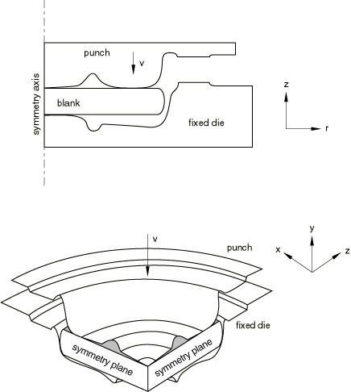
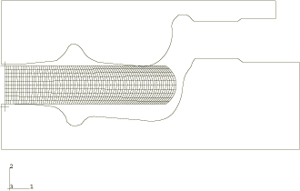
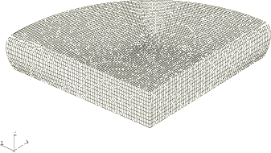
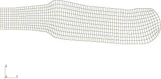
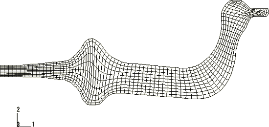
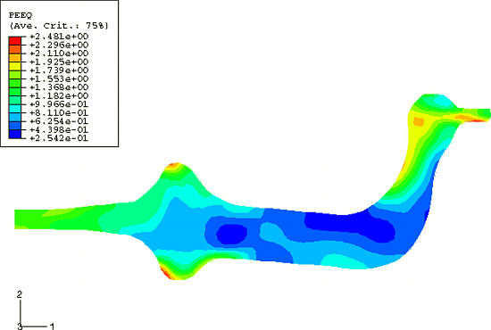
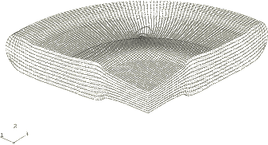
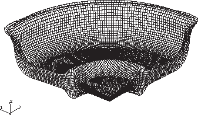

# 1.3.10 Forging with multiple complex dies

**Product: **Abaqus/Explicit  

This example illustrates the use of adaptive meshing in forging problems that use multiple geometrically complex dies. The problem is based on a benchmark presented at the “FEM–Material Flow Simulation in the Forging Industry” workshop.

### Problem description

The benchmark problem is an axisymmetric forging, but in this example both axisymmetric and three-dimensional geometric models are considered. For the axisymmetric models the default hourglass formulation (HOURGLASS=RELAX STIFFNESS) and the enhanced strain hourglass formulation (HOURGLASS=ENHANCED) are considered. For the three-dimensional geometric models the pure stiffness hourglass formulation (HOURGLASS=STIFFNESS) and the enhanced strain hourglass formulation with the orthogonal kinematic formulation (KINEMATIC SPLIT=ORTHOGONAL) are considered. Each model is shown in [Figure 1.3.10--1](ch01s03aex41.md#exxalecomplex-geom). Both models consist of two rigid dies and a deformable blank. The blank's maximum radial dimension is 895.2 mm, and its thickness is 211.4 mm. The outer edge of the blank is rounded to facilitate the flow of material through the dies. The blank is modeled as a von Mises elastic-plastic material with a Young's modulus of 200 GPa, an initial yield stress of 360 MPa, and a constant hardening slope of 30 MPa. The Poisson's ratio is 0.3; the density is 7340 kg/m3.

Both dies are fully constrained, with the exception of the top die, which is moved 183.4 mm downward at a constant velocity of 166.65 mm/s.

#### Case 1: Axisymmetric model

The blank is meshed with CAX4R elements. A fine discretization is required in the radial direction because of the geometric complexity of the dies and the large amount of material flow that occurs in that direction. Symmetry boundary conditions are prescribed at *r*=0. The dies are modeled as TYPE=SEGMENTS analytical rigid surfaces. The initial configuration is shown in [Figure 1.3.10--2](ch01s03aex41.md#exxalecomplex-init-axisym).

#### Case 2: Three-dimensional model

The blank is meshed with C3D8R elements. A 90 wedge of the blank is analyzed. The level of mesh refinement is the same as that used in the axisymmetric model. Symmetry boundary conditions are applied at the *x*=0 and *z*=0 planes. The dies are modeled as TYPE=REVOLUTION analytical rigid surfaces. The initial configuration of the blank only is shown in [Figure 1.3.10--3](ch01s03aex41.md#exxalecomplex-init-3d). Although the tools are not shown in the figure, they are originally in contact with the blank.

### Adaptive meshing

A single adaptive mesh domain that incorporates the entire blank is used for each model. Symmetry planes are defined as Lagrangian boundary regions (the default), and contact surfaces are defined as sliding boundary regions (the default). Since this problem is quasi-static with relatively small amounts of deformation per increment, the defaults for frequency, mesh sweeps, and other adaptive mesh parameters and controls are sufficient.

### Results and discussion

[Figure 1.3.10--4](ch01s03aex41.md#exxalecomplex-deform-asym-mid) and [Figure 1.3.10--5](ch01s03aex41.md#exxalecomplex-deform-asym-end) show the deformed mesh for the axisymmetric case using the default hourglass control formulation (HOURGLASS=RELAX STIFFNESS) at an intermediate stage ( 0.209 s) and in the final configuration ( 0.35 s), respectively. The elements remain well shaped throughout the entire simulation, with the exception of the elements at the extreme radius of the blank, which become very coarse as material flows radially during the last 5% of the top die's travel. [Figure 1.3.10--6](ch01s03aex41.md#exxalecomplex-cntr-axisym) shows contours of equivalent plastic strain at the completion of forming. [Figure 1.3.10--7](ch01s03aex41.md#exxalecomplex-deform-3d-mid) and [Figure 1.3.10--8](ch01s03aex41.md#exxalecomplex-deform-3d-end) show the deformed mesh for the three-dimensional case using the pure stiffness hourglass control (HOURGLASS=STIFFNESS) and the orthogonal kinematic formulation (KINEMATIC SPLIT=ORTHOGONAL) at  0.209 and  0.35, respectively. Although the axisymmetric and three-dimensional mesh smoothing algorithms are not identical, the elements in the three-dimensional model also remain well shaped until the end of the analysis, when the same behavior that is seen in the two-dimensional model occurs. Contours of equivalent plastic strain for the three-dimensional model (not shown) are virtually identical to those shown in [Figure 1.3.10--6](ch01s03aex41.md#exxalecomplex-cntr-axisym).

### Input files

[ale_duckshape_forgingaxi.inp](../eif/ale_duckshape_forgingaxi.inp)

Case 1 using the default hourglass formulation (HOURGLASS=RELAX STIFFNESS).

[ale_duckshape_forgingaxi_enhs.inp](../eif/ale_duckshape_forgingaxi_enhs.inp)

Case 1 using the enhanced strain hourglass formulation (HOURGLASS=ENHANCED).

[ale_duckshape_forg_axind.inp](../eif/ale_duckshape_forg_axind.inp)

External file referenced by the Case 1 analyses.

[ale_duckshape_forg_axiel.inp](../eif/ale_duckshape_forg_axiel.inp)

External file referenced by the Case 1 analyses.

[ale_duckshape_forg_axiset.inp](../eif/ale_duckshape_forg_axiset.inp)

External file referenced by the Case 1 analyses.

[ale_duckshape_forg_axirs.inp](../eif/ale_duckshape_forg_axirs.inp)

External file referenced by the Case 1 analyses.

[ale_duckshape_forgingrev.inp](../eif/ale_duckshape_forgingrev.inp)

Case 2 using the pure stiffness hourglass formulation (HOURGLASS=STIFFNESS) and the orthogonal kinematic formulation (KINEMATIC SPLIT=ORTHOGONAL).

[ale_duckshape_forgingrev_oenhs.inp](../eif/ale_duckshape_forgingrev_oenhs.inp)

Case 2 using the enhanced strain hourglass formulation (HOURGLASS=ENHANCED) and the orthogonal kinematic formulation (KINEMATIC SPLIT=ORTHOGONAL).

### Reference

Industrieverband Deutscher Schmieden e.V. (IDS), “Forging of an Axisymmetric Disk,” FEM–Material Flow Simulation in the Forging Industry, Hagen, Germany, October 1997.

### Figures

**Figure 1.3.10–1** Axisymmetric and three-dimensional model geometries.

**Figure 1.3.10–2** Initial configuration for the axisymmetric model.

**Figure 1.3.10–3** Initial configuration mesh for the three-dimensional model.

**Figure 1.3.10–4** The deformed mesh for the axisymmetric model using the default hourglass formulation (HOURGLASS=RELAX STIFFNESS) at an intermediate stage.

**Figure 1.3.10–5** The deformed mesh for the axisymmetric model using the default hourglass formulation (HOURGLASS=RELAX STIFFNESS) at the end of forming.

**Figure 1.3.10–6** Contours of equivalent plastic strain for the axisymmetric model using the default hourglass formulation (HOURGLASS=RELAX STIFFNESS) at the end of forming.

**Figure 1.3.10–7** The deformed mesh for the three-dimensional model using the pure stiffness hourglass formulation (HOURGLASS=STIFFNESS) and the orthogonal kinematic formulation (KINEMATIC SPLIT=ORTHOGONAL) at an intermediate stage.

**Figure 1.3.10–8** The deformed mesh for the three-dimensional model using the pure stiffness hourglass formulation (HOURGLASS=STIFFNESS) and the orthogonal kinematic formulation (KINEMATIC SPLIT=ORTHOGONAL) at the end of forming.

