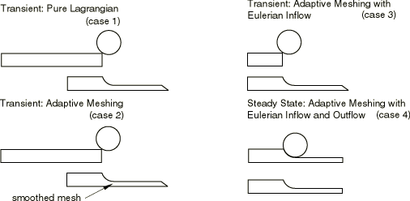
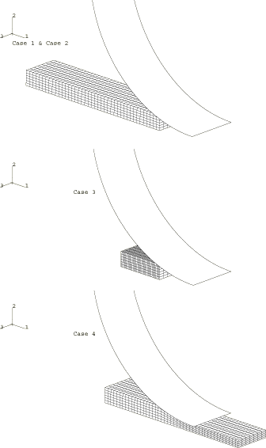
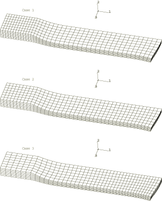
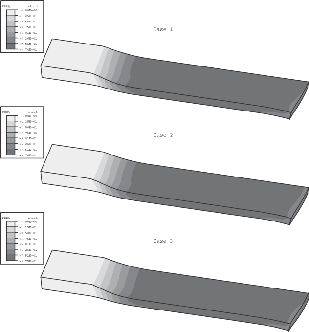
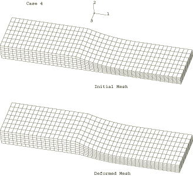
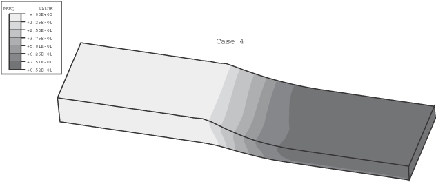
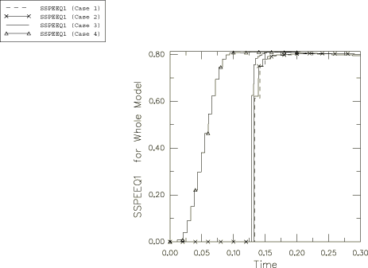
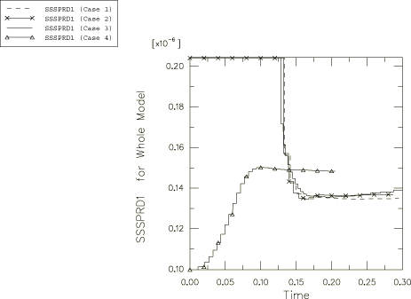
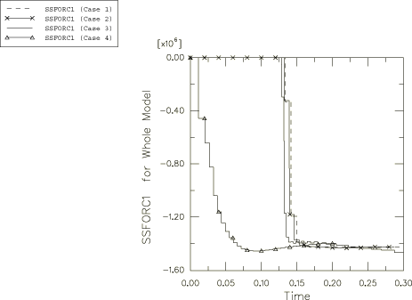
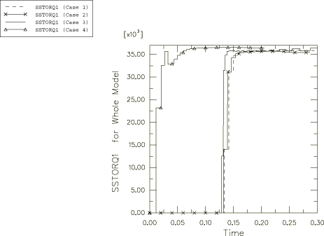

# 1.3.11 平轧：瞬态和稳态

**产品：** Abaqus/Explicit  

本示例说明了使用自适应网格划分通过瞬态和稳态方法模拟轧制工艺，如图1.3.11-1所示。使用三种不同方法进行瞬态平轧模拟："纯"拉格朗日方法、使用拉格朗日域的自适应网格划分方法，以及混合欧拉-拉格朗日自适应网格划分方法，其中来自轧辊上游的材料从欧拉入口边界被抽出，但坯料的下游端以拉格朗日方式处理。此外，使用欧拉自适应网格域作为控制体积并定义入口和出口欧拉边界来进行稳态平轧模拟。比较了每种方法的结果。

### 问题描述

对于每个分析案例，假设四分之一对称；模型由一个刚性轧辊和一个可变形坯料组成。坯料用C3D8R单元进行网格划分。圆柱形轧辊建模为解析刚性表面。圆柱半径为175 mm。在坯料的右侧（*z*=0平面）和底部（*y*=0平面）面上规定了对称边界条件。

假定轧辊与钢板之间存在库仑摩擦，摩擦系数为0.3。轧辊上的所有自由度都被约束，除了绕*z*轴的旋转，那里规定了6.28 rad/sec的恒定角速度。对于每个分析案例，坯料在*x*方向上被赋予0.3 m/s的初始速度以开始接触。

坯料为钢，建模为具有各向同性硬化的von Mises弹塑性材料。杨氏模量为150 GPa，初始屈服应力为168.2 MPa。泊松比为0.3；密度为7800 kg/m³。在步骤开始时，所有坯料单元的质量按2750的因子进行缩放，以便可以更经济地进行分析。此缩放因子代表了此问题可行质量缩放的近似上限，超过该上限将产生显著的惯性效应。

定义了基于达到稳态条件来停止轧制分析的标准。使用的标准要求在默认容差范围内满足等效塑性应变、展宽、力和扭矩的稳态检测规范。每个规范的出口平面定义为通过轧辊中心的平面，平面法向与轧制方向重合。对于案例1到案例3，稳态检测规范在每个单元平面通过出口平面时进行评估。案例4需要均匀采样，因为由于初始几何形状以及入口和出口欧拉边界，初始网格大致是静止的。

每个分析案例使用的有限元模型如图1.3.11-2所示。以下是每个模型的描述和使用的自适应网格划分技术：

#### 案例1：瞬态模拟——纯拉格朗日方法

坯料最初为矩形，尺寸为224×20×50 mm。不执行自适应网格划分。分析运行直至达到稳态条件。

#### 案例2：瞬态模拟——拉格朗日自适应网格域

此案例的有限元模型与案例1使用的模型相同，只是定义了包含整个坯料的单个自适应网格域以允许连续自适应网格划分。对称平面定义为拉格朗日表面（默认），坯料上的接触表面定义为滑动表面（默认）。分析运行直至达到稳态条件。

#### 案例3：瞬态模拟——混合欧拉-拉格朗日方法

此分析在相对较短的初始坯料（65×20×50 mm）上进行。材料通过在上游端定义的入口欧拉边界被轧辊在坯料上的作用连续抽出。坯料用与案例1和2相同数量的单元进行网格划分，以便在坯料延长并达到稳态条件时获得相似的纵横比。

定义了一个包含整个坯料的自适应网格域。因为它包含至少一个欧拉表面，所以对于设置参数默认值的目的，此域被视为欧拉域。然而，分析模型同时具有拉格朗日和欧拉方面。相对于网格的材料流动量在入口端较大，在域的下游端较小。为了考虑下游端的拉格朗日运动，为此问题更改自适应网格控制，以便基于当前自适应网格增量开始时节点的位置执行自适应网格划分。为了准确网格化入口端并经济地执行分析，频率设置为5，网格扫描次数设置为5。

与案例2一样，对称平面定义为拉格朗日边界区域（默认），坯料上的接触表面定义为滑动边界区域（默认）。此外，上游端的边界定义为欧拉表面。在欧拉表面上使用自适应网格约束定义自适应网格约束，以将入口表面网格完全固定，同时允许材料垂直于表面进入域。使用方程约束来确保垂直于入口边界的速度在表面上是均匀的。约束入口边界表面切向方向上节点的速度。

#### 案例4：稳态模拟——欧拉自适应网格域

此分析采用控制体积方法，其中材料从入口欧拉边界被抽出，并通过轧辊的作用被推出出口边界。此分析案例的坯料几何形状被定义为近似于对应于稳态解的形状：此几何形状可以被认为是解的"初始猜测"。坯料最初长度为224 mm，宽度为50 mm，具有可变的厚度以符合轧辊的形状。横跨轧制方向的坯料表面未调整以考虑稳态解中发生的最终展宽。实际上，任何合理的初始几何形状都将达到稳态，但更接近稳态几何形状的几何形状通常可以在较短时间内获得解。

与前两个案例一样，在坯料上定义了自适应网格域，对称平面定义为拉格朗日表面（默认），接触表面定义为滑动表面（默认）。使用与案例3相同的技术在坯料两端定义入口和出口欧拉表面，除了对于出口边界，自适应网格约束仅垂直于边界表面应用，并且没有材料约束切向于边界表面。

为了提高分析的计算效率，自适应网格划分的频率增加到每五个增量一次，因为欧拉域经历非常小的整体变形，材料流动速度远小于材料波速度。此频率将导致欧拉边界处的网格略微漂移。然而，漂移量非常小，不会累积。不需要增加网格扫描次数，因为此域相对静止，默认情况下，基于原始网格的节点位置执行自适应网格划分。只需要很少的网格平滑。

### 结果和讨论

三个瞬态案例每个的坯料最终变形构型如图1.3.11-3所示。瞬态案例已达到稳态解，并根据稳态检测定义中的标准终止。稳态条件被认为已达成当时轧辊上的反作用力和力矩已稳定，并且轧辊下的横截面形状和等效塑性应变分布随时间变得恒定。当使用稳态检测定义时，这些条件意味着力、力矩、展宽和等效塑性应变规范已稳定，以至于在三个连续采样间隔内规范的变化已降至用户规定的容差以下。有关规范定义的详细讨论，请参见["稳态检测，"Abaqus分析用户指南第11.8.1节](../usb/usb-link.md#usb-anl-asteadystatedetection)。三个瞬态案例每个的等效塑性应变等值线一致良好，如图1.3.11-4中每个坯料的最终构型所示。[图1.3.11-5](ch01s03aex42.md#exxaleflat-deform4)显示了稳态时初始和最终网格配置。除案例3外，所有分析都使用默认稳态规范容差终止。由于轧辊处的力和扭矩相当嘈杂，案例3要求将力和扭矩规范容差从.005增加到.01。

为了比较瞬态和稳态方法的结果，[表1.3.11-1](ch01s03aex42.md#table-aleflat-spread)总结了每个案例的稳态检测规范。该表显示了分析终止后稳态检测规范值的比较。唯一的显著差异是案例4的展宽规范值，它高于其他案例。展宽规范定义为工件横截面的第二主惯性矩的最大值。由于展宽规范是工件横向变形的立方函数，测试案例之间位移的相当小的差异可能导致展宽规范的显著差异。

还显示了稳态检测规范的时间历史图。[图1.3.11-9](ch01s03aex42.md#exxaleflat-force-v-time)和[图1.3.11-10](ch01s03aex42.md#exxaleflat-torque-v-time)分别显示了所有案例的稳态力和扭矩规范的时间历史图。力和扭矩规范本质上是轧辊上力和力矩的运行平均值，对于所有四个测试案例显示出良好的一致性。[图1.3.11-7](ch01s03aex42.md#exxaleflat-peeq-v-time)和[图1.3.11-8](ch01s03aex42.md#exxaleflat-spread-v-time)分别显示了所有案例的稳态等效塑性应变和展宽规范的时间历史图。所有案例的等效塑性应变规范一致良好。

### 输入文件

[lag_flatrolling.inp](../eif/lag_flatrolling.inp)

案例1，使用接触对。

[lag_flatrolling_gcont.inp](../eif/lag_flatrolling_gcont.inp)

案例1，使用通用接触。

[ale_flatrolling_noeuler.inp](../eif/ale_flatrolling_noeuler.inp)

案例2。

[ale_flatrolling_inlet.inp](../eif/ale_flatrolling_inlet.inp)

案例3。

[ale_flatrolling_inletoutlet.inp](../eif/ale_flatrolling_inletoutlet.inp)

案例4。

### 表格

**表1.3.11-1** 稳态检测规范比较。

| 公式 | 展宽规范 | 有效塑性应变规范 | 力规范 | 扭矩规范 |
| --- | --- | --- | --- | --- |
| 案例1 | 1.349 E7 | .8037 | 1.43 E6 | 3.59 E4 |
| 案例2 | 1.369 E7 | .8034 | 1.43 E6 | 3.55 E4 |
| 案例3 | 1.365 E7 | .8018 | 1.43 E6 | 3.61 E4 |
| 案例4 | 1.485 E7 | .8086 | 1.40 E6 | 3.65 E4 |

### 图形

**图1.3.11-1** 说明此问题中使用的四种分析方法的图。

**图1.3.11-2** 每个案例的初始构型。

**图1.3.11-3** 案例1-3的变形网格。

**图1.3.11-4** 案例1-3的等效塑性应变等值线。

**图1.3.11-5** 案例4的变形网格（显示初始网格以供比较）。

**图1.3.11-6** 案例4的等效塑性应变等值线。

**图1.3.11-7** 所有案例的等效塑性应变规范与时间的比较。

**图1.3.11-8** 所有案例的展宽规范与时间的比较。

**图1.3.11-9** 所有案例的力规范与时间的比较。

**图1.3.11-10** 所有案例的扭矩规范与时间的比较。

