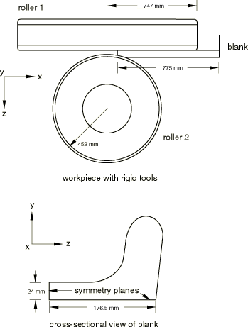
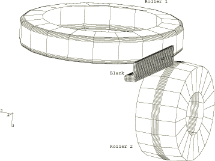
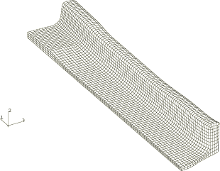
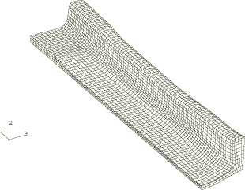
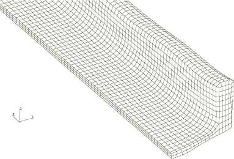
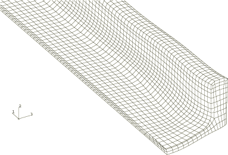
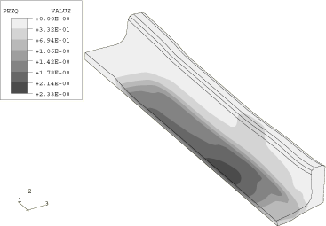
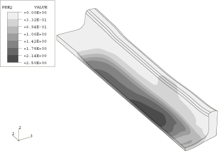
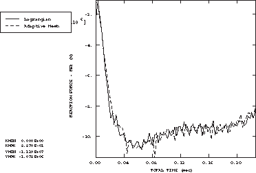
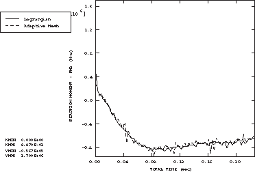

# 1.3.12 Section rolling

**Product: **Abaqus/Explicit  

This example illustrates the use of adaptive meshing in a transient simulation of section rolling. Results are compared to a pure Lagrangian simulation.

### Problem description

This analysis shows a stage in the rolling of a symmetric I-section. Because of the cross-sectional shape of the I-section, two planes of symmetry exist and only a quarter of the section needs to be modeled. The quarter-symmetry model, shown in [Figure 1.3.12--1](ch01s03aex43.md#exxalesection-geom), consists of two rigid rollers and a blank. Roller 1 has a radius of 747 mm, and roller 2 has a radius of 452 mm. The blank has a length of 850 mm, a web half-width of 176.7 mm, a web half-thickness of 24 mm, and a variable flange thickness.

The finite element model is shown in [Figure 1.3.12--2](ch01s03aex43.md#exxalesection-femodel). The blank is meshed with C3D8R elements. Symmetry boundary conditions are applied on the *y* and *z* symmetry planes of the blank. The rollers are modeled as three-dimensional revolved analytical rigid surfaces. Roller 1 has all degrees of freedom constrained except rotation about the *z*-axis, where a constant angular velocity of 5 rad/sec is specified. Roller 2 has all degrees of freedom constrained except rotation about the *y*-axis. An initial velocity of 4187.0 mm/sec in the negative *x*-direction is applied to the blank to initiate contact between the blank and the rollers. This velocity corresponds to the velocity of the rollers at the point of initial contact.

 Variable mass scaling is used to scale the masses of all the blank elements so that a desired minimum stable time increment is achieved initially and the stable time increment does not fall below this minimum throughout the analysis. The loading rates and mass scaling definitions are such that a quasi-static solution is generated.

The blank is steel and is modeled as a von Mises elastic-plastic material with a Young's modulus of 212 GPa, an initial yield stress of 80 MPa, and a constant hardening slope of 258 MPa. Poisson's ratio is 0.281; the density is 7833 kg/m3. Coulomb friction with a friction coefficient of 0.3 is assumed between the rollers and the blank.

### Adaptive meshing

Adaptive meshing can improve the solution and mesh quality for section rolling problems that involve large deformations. A single adaptive mesh domain that incorporates the entire blank is defined. Symmetry planes are defined as Lagrangian boundary regions (the default), and the contact surface on the blank is defined as a sliding boundary region (the default). The default values are used for all adaptive mesh parameters and controls.

### Results and discussion

[Figure 1.3.12--3](ch01s03aex43.md#exxalesection-blank-def-adapt) shows the deformed configuration of the blank when continuous adaptive meshing is used. For comparison purposes a pure Lagrangian simulation is performed. [Figure 1.3.12--4](ch01s03aex43.md#exxalesection-blank-def-lg) shows the deformed configuration for a pure Lagrangian simulation. The mesh at the flange-web interface is distorted in the Lagrangian simulation, but the mesh remains nicely proportioned in the adaptive mesh analysis. A close-up view of the deformed configuration of the blank is shown for each analysis in [Figure 1.3.12--5](ch01s03aex43.md#exxalesection-closeup-adapt) and [Figure 1.3.12--6](ch01s03aex43.md#exxalesection-closeup-lg) to highlight the differences in mesh quality. Contours of equivalent plastic strain for each analysis are shown in [Figure 1.3.12--7](ch01s03aex43.md#exxalesection-cntr-adapt) and [Figure 1.3.12--8](ch01s03aex43.md#exxalesection-cntr-lg). The plastic strain distributions are very similar.

[Figure 1.3.12--9](ch01s03aex43.md#exxalesection-yforce) and [Figure 1.3.12--10](ch01s03aex43.md#exxalesection-zmoment) show time history plots for the *y*-component of reaction force and the reaction moment about the *z*-axis, respectively, for roller 1. The results for the adaptive mesh simulation compare closely to those for the pure Lagrangian simulation.

### Input files

[ale_rolling_section.inp](../eif/ale_rolling_section.inp)

Analysis that uses adaptive meshing.

[ale_rolling_sectionnode.inp](../eif/ale_rolling_sectionnode.inp)

External file referenced by the adaptive mesh analysis.

[ale_rolling_sectionelem.inp](../eif/ale_rolling_sectionelem.inp)

External file referenced by the adaptive mesh analysis.

[ale_rolling_sectionnelset.inp](../eif/ale_rolling_sectionnelset.inp)

External file referenced by the adaptive mesh analysis.

[ale_rolling_sectionsurf.inp](../eif/ale_rolling_sectionsurf.inp)

External file referenced by the adaptive mesh analysis.

[lag_rolling_section.inp](../eif/lag_rolling_section.inp)

Lagrangian analysis using contact pairs.

[lag_rolling_section_gcont.inp](../eif/lag_rolling_section_gcont.inp)

Lagrangian analysis using general contact.

### Figures

**Figure 1.3.12–1** Geometry of the quarter-symmetry blank and the rollers.

**Figure 1.3.12–2** Quarter-symmetry finite element model.

**Figure 1.3.12–3** Deformed blank for the adaptive mesh simulation.

**Figure 1.3.12–4** Deformed blank for the pure Lagrangian simulation.

**Figure 1.3.12–5** Close-up of the deformed blank for the adaptive mesh simulation.

**Figure 1.3.12–6** Close-up of the deformed blank for the pure Lagrangian simulation.

**Figure 1.3.12–7** Contours of equivalent plastic strain for the adaptive mesh simulation.

**Figure 1.3.12–8** Contours of equivalent plastic strain for the pure Lagrangian simulation.

**Figure 1.3.12–9** Time history of the reaction force in the *y*-direction at the reference node of Roller 1.

**Figure 1.3.12–10** Time history of the reaction moment about the *z*-axis at the reference node of Roller 1.

