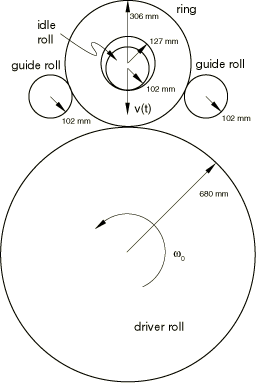
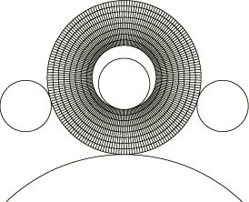
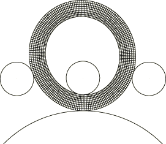
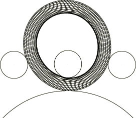
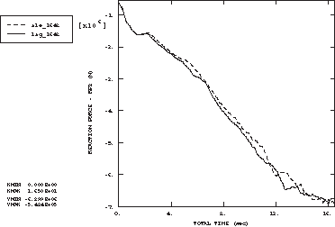
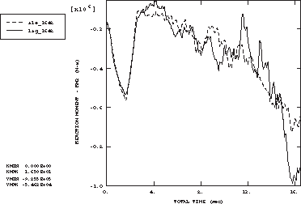

# 1.3.13 环件轧制

**产品：** Abaqus/Explicit  

本示例说明了在二维轧制模拟中使用自适应网格划分。将结果与纯拉格朗日方法获得的结果进行了比较。

### 问题描述

环件轧制是一种专门工艺，通常用于制造具有回转几何形状的零件，如轴承。三维轧制设置通常包括一个自由安装的空转辊、一个连续旋转的驱动辊，以及轧制平面中的导向辊。垂直于轧制平面，使用锥形辊来稳定环件并提供面外方向的成形表面。在本示例中，使用了忽略锥形辊影响的二维平面应力理想化模型。环件及其周围工具的示意图如图1.3.13-1所示。

驱动辊直径为680 mm，空转辊和导向辊直径为102 mm。环件初始内径为127.5 mm，厚度为178.5 mm。空转辊和驱动辊垂直布置，分别与环件的内表面和外表面接触。驱动辊围绕其固定轴旋转，而空转辊以指定的进给速率垂直向下移动。对于此模拟，导向辊的*x*–*y*运动是预先确定的，并被规定为使辊在整个分析过程中保持与环件接触，但不对其施加可观的力。在实际中，导向辊通常通过联动系统连接，其运动是力和位移的函数。

环件使用CPS4R单元进行网格划分，如图1.3.13-2所示。环件为钢，建模为von Mises弹塑性材料，杨氏模量为150 GPa，初始屈服应力为168.7 MPa，恒定硬化斜率为884 MPa。泊松比为0.3；密度为7800 kg/m³。

分析运行使环件完成约20转（16.5秒）。刚性辊使用连接线段建模为解析刚性表面。驱动辊以3.7888 rad/sec的恒定角速度绕*z*轴旋转，而空转辊具有4.9334 mm/sec的恒定进给速率，并可绕*z*轴自由旋转。驱动辊和空转辊的所有其他自由度均被约束。在坯料-空转辊和坯料-驱动辊界面定义了0.5的摩擦系数。环件与导向辊之间使用无摩擦接触，并且约束了导向辊的旋转，因为实际的导向辊可以自由旋转，对环件施加的扭矩可以忽略不计。

为了获得经济的解，将环件中所有单元的质量按2500的因子进行缩放。此缩放因子代表了此问题可行质量缩放的近似上限，超过该上限将产生显著的惯性效应。此外，由于二维模型不包含锥形辊，即使在导向辊的作用下，环件也会左右摆动。在环件的内表面和外表面上施加300 MPa sec/m的人工粘性压力，以协助导向辊保持环件的圆形。压力值通过试错法选择。

### 自适应网格划分

定义了一个包含整个环件的自适应网格域。环件上的接触表面定义为滑动边界区域（默认）。由于模拟20转需要大量增量，每个增量的变形非常小。因此，自适应网格划分的频率从默认值10更改为每50个增量一次。此频率下的自适应网格划分成本与底层分析成本相比可以忽略不计。

### 结果和讨论

图1.3.13-3显示了使用连续自适应网格划分完成20转后环件的变形构型。在整个模拟过程中，单元保持高质量的形状和纵横比。图1.3.13-4显示了纯拉格朗日模拟时环件的变形构型。纯拉格朗日网格发生扭曲，特别是在内半径处，单元变得歪斜且在径向方向上非常小。

图1.3.13-5和图1.3.13-6分别显示了空转辊*y*方向反作用力和驱动辊绕*z*轴反作用力矩的时间历史图，适用于自适应网格和纯拉格朗日两种方法。尽管最终网格存在显著差异，但轧辊力和扭矩相当一致。

对于自适应和纯拉格朗日两种解，这里使用的平面应力理想化在环件的内半径和外半径处产生非常局部化的厚度应变。这种特定类型的局部应变是平面应力建模所特有的，在环件轧制过程中不会发生。三维有限元模型也不会预测到这种应变。如果使用自适应并且需要细网格来捕捉内端和外端的强梯度，则可以将初始均匀网格替换为分级网格。虽然此处未显示，但分级网格将单元细化集中在强梯度区域。您可以在自适应网格控制中指定在分析发展过程中应保留初始网格分级，同时减少扭曲。

### 输入文件

[ale_ringroll_2d.inp](../eif/ale_ringroll_2d.inp)

使用自适应网格划分的分析。

[ale_ringroll_2dnode.inp](../eif/ale_ringroll_2dnode.inp)

自适应网格分析引用的外部文件。

[ale_ringroll_2delem.inp](../eif/ale_ringroll_2delem.inp)

自适应网格分析引用的外部文件。

[guideamp.inp](../eif/guideamp.inp)

自适应网格分析引用的外部文件。

[lag_ringroll_2d.inp](../eif/lag_ringroll_2d.inp)

拉格朗日分析。

### 图形

**图1.3.13-1** 二维环件轧制分析模型几何形状。

**图1.3.13-2** 初始网格构型。

**图1.3.13-3** 使用自适应网格划分完成20转后的变形构型。

**图1.3.13-4** 使用纯拉格朗日方法完成20转后的变形构型。

**图1.3.13-5** 空转辊*y*方向反作用力随时间的变化。

**图1.3.13-6** 驱动辊绕*z*轴反作用力矩随时间的变化。

