# 1.3.14 轴对称挤压：瞬态和稳态

**产品：** Abaqus/Explicit  

本示例说明了在三种轴对称分析情况的挤压过程模拟中使用自适应网格划分。首先，使用拉格朗日网格域上的自适应划分对反向平底模具挤压几何形状进行瞬态模拟。其次，使用拉格朗日网格域上的自适应划分对类似的正向方嘴模具挤压几何形状进行瞬态模拟。最后，使用欧拉网格域上的自适应划分对正向挤压几何形状进行稳态模拟。

### 问题描述

三种分析情况的模型构型如图1.3.14-1所示。每个模型都是轴对称的，由一个或多个刚性工具和一个可变形坯料组成。刚性工具建模为连接线段的解析刚性表面。所有接触表面均假设润滑良好，因此被视为无摩擦。坯料由铝制成，建模为具有各向同性硬化的von Mises弹塑性材料。杨氏模量为38 GPa，初始屈服应力为27 MPa。泊松比为0.33；密度为2672 kg/m³。

#### 案例1：反向挤压的瞬态分析

模型几何形状包括一个刚性模具、一个刚性冲头和一个坯料。坯料用CAX4R单元进行网格划分，尺寸为28×89 mm。坯料沿底部在*z*方向受到约束，在*r*方向的对称轴处也受到约束。径向膨胀通过坯料与模具之间的接触来阻止。冲头和模具完全约束，除了冲头的预定垂直运动。冲头向下移动82 mm，形成壁厚和底壁厚度均为7 mm的管子。冲头速度使用平滑幅值指定，使得响应基本上是准静态的。

挤压问题中发生的变形，特别是涉及平底模具几何形状的变形，非常极端，需要自适应网格划分。由于Abaqus/Explicit中的自适应网格划分在整个步骤中使用相同的网格拓扑，初始网格必须选择为使其拓扑适合模拟的持续时间。为此类挤压问题开发了一种简单的网格划分技术。在二维中，它使用四边映射网格域，几乎所有有限元网格预处理程序都可以创建它。四边映射网格的顶点如图1.3.14-1所示，分别标记为A、B、C和D。两个顶点位于挤压开口的任意一侧，第三个顶点位于死料区角落（坯料的左上角），第四个顶点位于对角相对的角落。使用此网格划分技术为此分析情况创建了10×60单元网格，如图1.3.14-2所示。网格细化方向的取向使得沿AB和DC侧的细网格将随着冲头向下移动而沿着挤出的壁向上移动。

定义了一个包含整个坯料的自适应网格域。由于反向挤压模拟中预期会出现极大的扭曲，对于每个自适应网格增量，指定了三次网格扫描，而不是默认值一次。使用了默认的自适应网格划分频率10。或者，可以指定更高的频率来执行每个自适应网格增量一次网格扫描。但是，由于所需的对流扫描数量增加，此方法将导致更高的计算成本。

通过将步骤开始时执行的网格扫描次数增加到100来进行大量初始网格平滑。初始平滑后的网格如图1.3.14-2所示。初始平滑在分析执行之前通过圆润角落和缓和尖锐过渡来减少映射网格的扭曲；因此，它允许在整个分析过程中使用最佳网格。

#### 案例2：正向挤压的瞬态分析

模型几何形状包括一个刚性模具和一个坯料。坯料几何形状和网格与案例1描述的相同，只是映射网格相对于垂直面反转，使得网格线朝向正向挤压开口。坯料在*r*方向的对称轴处受到约束。径向膨胀通过坯料与模具之间的接触来阻止。模具完全约束。通过为沿坯料底部的节点指定5 m/sec的恒定速度，将坯料向上推动19 mm。当坯料被推动时，材料通过模具开口流动，形成半径为7 mm的实心杆。

案例2的自适应网格划分以与案例1类似的方式定义。初始网格构型（初始网格平滑之前和之后）如图1.3.14-3所示。

#### 案例3：正向挤压的稳态分析

模型几何形状包括一个刚性模具，与案例2使用的模具相同，以及一个坯料。坯料几何形状被定义为近似于稳态解对应的形状：此几何形状可以被认为是解的"初始猜测"。如图1.3.14-4所示，坯料用简单分级模式进行离散化，在模具圆角附近最为细化。对于稳态情况不需要特殊网格，因为预计模拟过程中网格运动很小。坯料在*r*方向的对称轴处受到约束。坯料的径向膨胀通过与模具的接触来阻止。

定义了一个包含整个坯料的自适应网格域。由于欧拉域经历非常小的整体变形，材料流动速度远小于材料波速度，自适应网格划分的频率从默认值1更改为5，以提高分析的计算效率。

假设出口边界无牵引力，并位于足够远的下游，以确保可以获得稳态解。此边界被设置为欧拉边界区域。在出口边界上定义多点约束，以保持垂直于边界的速度均匀。入口边界使用欧拉边界条件定义，规定垂直方向的速度为5 m/sec。在入口和出口边界上定义自适应网格约束，以将网格固定在垂直方向。这有效地创建了一个相对于入口和出口边界的静止控制体积，材料可以通过它流动。

### 结果和讨论

下面描述每个分析情况的结果。

#### 案例1

映射网格技术结合自适应网格划分的使用使反向挤压分析能够完成，创建了带有底盖的长管。在不同时刻的变形网格的三个图如图1.3.14-5所示。这些图清楚地显示了网格质量如何在大部分模拟过程中得到保持。尽管涉及大量变形，网格保持平滑并集中在高应变梯度区域。在分析接近结束时，冲头圆角处发生极端变形和变薄。可以通过增加冲头的圆角半径来减少这种变薄。相应等效塑性应变等值线如图1.3.14-6所示。塑性应变在管子内表面处最高。

#### 案例2

自适应网格划分使瞬态正向挤压模拟能够比使用纯拉格朗日方法走得更远。在将坯料推动19 mm穿过模具后，由于单元变得过于扭曲，无法继续分析。由于坯料材料基本不可压缩，模具开口顶部的横截面积是坯料原始横截面积的1/16，形成的杆测量约304 mm（原始坯料长度的三倍）。

瞬态正向挤压在不同时刻的变形网格的三个图如图1.3.14-7所示。与反向挤压情况一样，这些图显示了网格质量在大部分模拟过程中得到保持。最后的变形形状被截断以保持清晰，因为挤出的柱变得非常细长。在类似时刻的等效塑性应变等值线如图1.3.14-8所示。在垂直柱中发展的塑性应变分布在即使在304 mm的高度下也未达到稳态值。案例3讨论中报告的稳态结果显示，基于等效塑性应变分布的稳态解直到更晚时候才能达到。在死料区上游侧的材料首先沿该区通过并通过模具开口之前，无法达到绝对稳态解。死料区大致呈三角形，位于模具的右上角。

#### 案例3

正向挤压分析的稳态解在挤出柱高度为800 mm时获得，这对应于将坯料推动50 mm穿过模具。因此，此分析的运行时间是案例2的2.5倍。

模拟中期和结束时的等效塑性应变等值线如图1.3.14-9所示。挤出柱外边缘在出口边界处和出口边界下方27.5 mm处的等效塑性应变时间历史如图1.3.14-10所示。在模拟结束时，两个位置的塑性应变收敛到相同的值，表明解已达到稳态。最终网格构型如图1.3.14-11所示。由于对稳态域形状的准确初始猜测以及Abaqus/Explicit自适应网格划分能力保留原始网格分级的特性，网格从分析开始到结束变化非常小。

作为对稳态模拟精度和自适应网格划分守恒特性的进一步检查，出口边界的速度时间历史如图1.3.14-12所示。速度达到约80 m/s的稳态值，与不可压缩材料假设以及模具开口与坯料尺寸1/16的比例一致。

### 输入文件

[ale_extrusion_back.inp](../eif/ale_extrusion_back.inp)

案例1。

[ale_extrusion_backnode.inp](../eif/ale_extrusion_backnode.inp)

案例1的节点数据。

[ale_extrusion_backelem.inp](../eif/ale_extrusion_backelem.inp)

案例1的单元数据。

[ale_extrusion_forward.inp](../eif/ale_extrusion_forward.inp)

案例2。

[ale_extrusion_forwardnode.inp](../eif/ale_extrusion_forwardnode.inp)

案例2的节点数据。

[ale_extrusion_forwardelem.inp](../eif/ale_extrusion_forwardelem.inp)

案例2的单元数据。

[ale_extrusion_eulerian.inp](../eif/ale_extrusion_eulerian.inp)

案例3。

[ale_extrusion_euleriannode.inp](../eif/ale_extrusion_euleriannode.inp)

案例3的节点数据。

[ale_extrusion_eulerianelem.inp](../eif/ale_extrusion_eulerianelem.inp)

案例3的单元数据。

### 图形

**图1.3.14-1** 挤压分析中使用的轴对称模型几何形状。

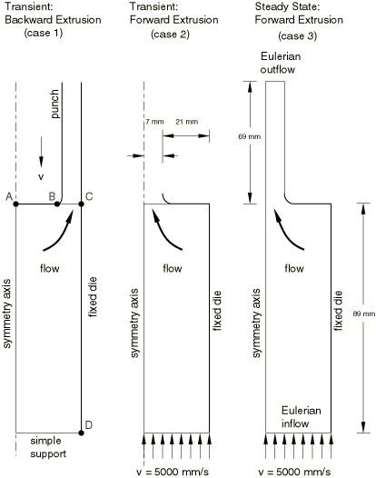

**图1.3.14-2** 案例1的未变形构型，初始平滑之前和之后。

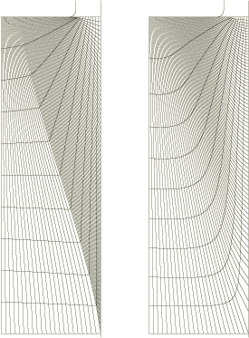

**图1.3.14-3** 案例2的未变形构型，初始平滑之前和之后。

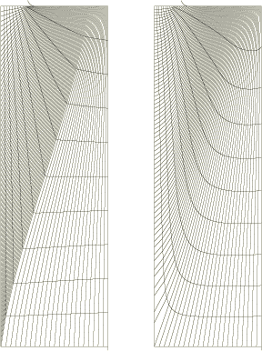

**图1.3.14-4** 案例3的未变形构型。

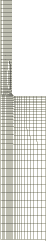

**图1.3.14-5** 案例1在不同时刻的变形网格。

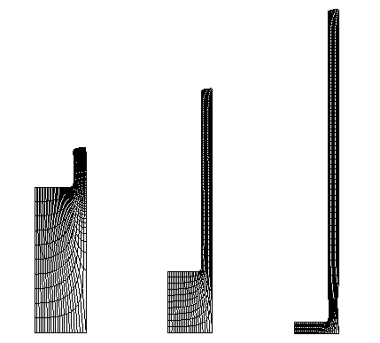

**图1.3.14-6** 案例1在不同时刻的等效塑性应变等值线。

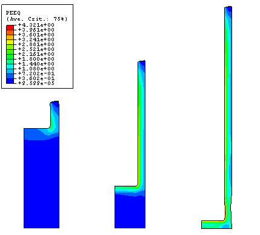

**图1.3.14-7** 案例2在不同时刻的变形网格。

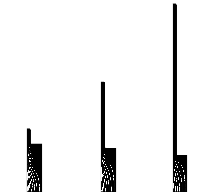

**图1.3.14-8** 案例2在不同时刻的等效塑性应变等值线。

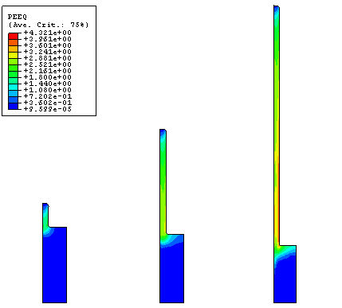

**图1.3.14-9** 案例3在中间阶段和分析结束时的等效塑性应变等值线。

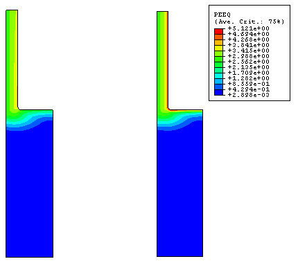

**图1.3.14-10** 案例3挤出柱外边缘等效塑性应变随时间的变化。

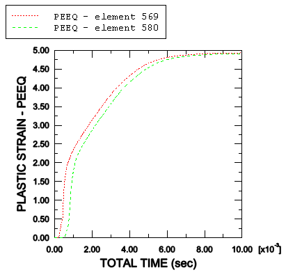

**图1.3.14-11** 案例3的最终变形网格。

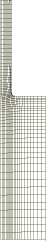

**图1.3.14-12** 案例3出口边界材料速度随时间的变化。

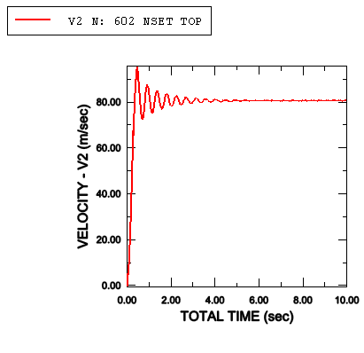

