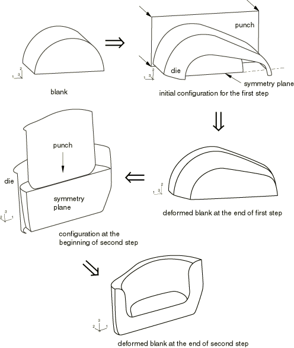
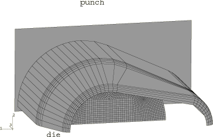
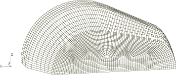
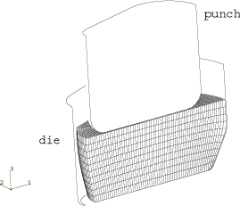
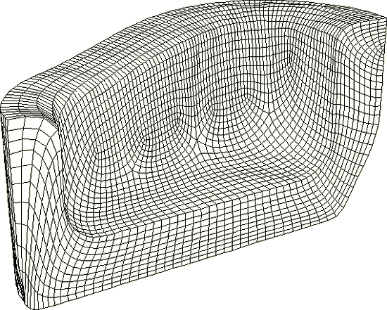
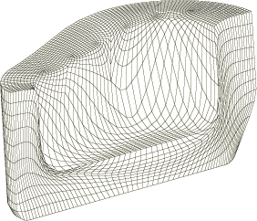
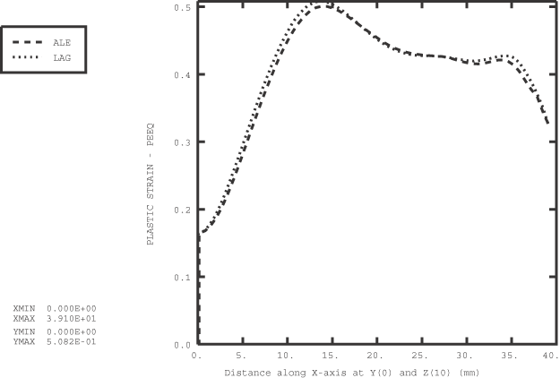
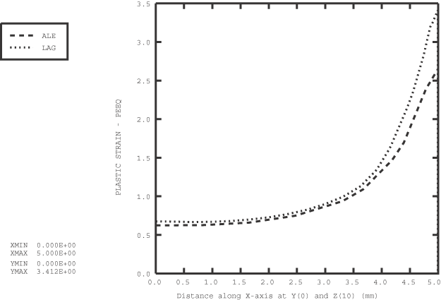
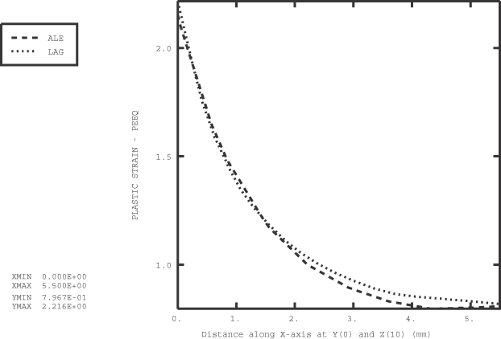

# 1.3.15 Two-step forming simulation

**Product: **Abaqus/Explicit  

This example illustrates the use of adaptive meshing in simulations of a two-step, bulk metal forming process. The problem is based on a benchmark problem presented at the Metal Forming Process Simulation in Industry conference.

### Problem description

The model consists of two sets of rigid forming tools (one set for each forming step) and a deformable blank. The blank and forming die geometries used in the simulation are shown in [Figure 1.3.15--1](ch01s03aex46.md#exxale2step-process). The initial configurations of the blank and the tools for each step are shown in [Figure 1.3.15--2](ch01s03aex46.md#exxale2step-init1) and [Figure 1.3.15--4](ch01s03aex46.md#exxale2step-init2). All forming tools are modeled as discrete rigid bodies and meshed with R3D4 and R3D3 elements. The blank, which is meshed with C3D8R elements, is cylindrical and measures 14.5  21 mm. A half model is constructed, so symmetry boundary conditions are prescribed at the *y*=0 plane.

The blank is made of a steel alloy that is assumed to satisfy the Ramberg-Osgood relation for true stress and logarithmic strain, 

with a reference stress value (*K*) of 763 MPa and a work-hardening exponent (*n*) of 0.245. Isotropic elasticity is assumed, with a Young's modulus of 211 GPa and a Poisson's ratio of 0.3. An initial yield stress of 200 MPa is obtained with these data. The stress-strain behavior is defined by piecewise linear segments matching the Ramberg-Osgood curve up to a total (logarithmic) strain level of 140%, with von Mises yield and isotropic hardening.

The analysis is conducted in two steps. For the first step the rigid tools consist of a planar punch, a planar base, and a forming die. The initial configuration for this step is shown in [Figure 1.3.15--2](ch01s03aex46.md#exxale2step-init1). The base, which is not shown, is placed at the opening of the forming die to prevent material from passing through the die. The motion of the tools is fully constrained, with the exception of the prescribed displacement in the *z*-direction for the punch, which is moved 12.69 mm toward the blank at a constant velocity of 30 m/sec consistent with a quasi-static response. The deformed configuration of the blank at the completion of the first step is shown in [Figure 1.3.15--3](ch01s03aex46.md#exxale2step-deform1).

In the second step the original punch and die are removed from the model and replaced with a new punch and die, as shown in [Figure 1.3.15--4](ch01s03aex46.md#exxale2step-init2). The removal of the tools is accomplished by deleting the contact pairs between them and the blank. Although not shown in the figure, the base is retained; both it and the new die are fully constrained. The punch is moved 10.5 mm toward the blank at a constant velocity of 30 m/sec consistent with a quasi-static response. The deformed configuration of the blank at the completion of the second step is shown in [Figure 1.3.15--5](ch01s03aex46.md#exxale2step-deform2).

### Adaptive meshing

A single adaptive mesh domain that incorporates the entire blank is used for both steps. A Lagrangian boundary region type (the default) is used to define the constraints on the symmetry plane, and a sliding boundary region type (the default) is used to define all contact surfaces. The frequency of adaptive meshing is increased to 5 for this problem since material flows quickly near the end of the step.

### Results and discussion

[Figure 1.3.15--6](ch01s03aex46.md#exxale2step-deform2-lg) shows the deformed mesh at the completion of forming for an analysis in which a pure Lagrangian mesh is used. Comparing [Figure 1.3.15--5](ch01s03aex46.md#exxale2step-deform2) and [Figure 1.3.15--6](ch01s03aex46.md#exxale2step-deform2-lg), the resultant mesh for the simulation in which adaptive meshing is used is clearly better than that obtained with a pure Lagrangian mesh.

In [Figure 1.3.15--7](ch01s03aex46.md#exxale2step-eps1) through [Figure 1.3.15--9](ch01s03aex46.md#exxale2step-eps2-right) path plots of equivalent plastic strain in the blank are shown using the pure Lagrangian and adaptive mesh domains for locations in the *y*=0 symmetry plane at an elevation of *z*=10 mm. The paths are defined in the positive *x*-direction (from left to right in [Figure 1.3.15--4](ch01s03aex46.md#exxale2step-init2) to [Figure 1.3.15--6](ch01s03aex46.md#exxale2step-deform2-lg)). As shown in [Figure 1.3.15--7](ch01s03aex46.md#exxale2step-eps1), the results are in good agreement at the end of the first step. At the end of the second step the path is discontinuous. Two paths are considered: one that spans the left-hand side and another that spans the right-hand side of the U-shaped cross-section along the symmetry plane. The left- and right-hand paths are shown in [Figure 1.3.15--8](ch01s03aex46.md#exxale2step-eps2-left) and [Figure 1.3.15--9](ch01s03aex46.md#exxale2step-eps2-right), respectively. The solutions from the second step compare qualitatively. Small differences can be attributed to the increased mesh resolution and reduced mesh distortion for the adaptive mesh domain.

### Input files

[ale_forging_steelpart.inp](../eif/ale_forging_steelpart.inp)

Analysis with adaptive meshing.

[ale_forging_steelpartnode1.inp](../eif/ale_forging_steelpartnode1.inp)

External file referenced by the adaptive mesh analysis.

[ale_forging_steelpartnode2.inp](../eif/ale_forging_steelpartnode2.inp)

External file referenced by the adaptive mesh analysis.

[ale_forging_steelpartnode3.inp](../eif/ale_forging_steelpartnode3.inp)

External file referenced by the adaptive mesh analysis.

[ale_forging_steelpartnode4.inp](../eif/ale_forging_steelpartnode4.inp)

External file referenced by the adaptive mesh analysis.

[ale_forging_steelpartelem1.inp](../eif/ale_forging_steelpartelem1.inp)

External file referenced by the adaptive mesh analysis.

[ale_forging_steelpartelem2.inp](../eif/ale_forging_steelpartelem2.inp)

External file referenced by the adaptive mesh analysis.

[ale_forging_steelpartelem3.inp](../eif/ale_forging_steelpartelem3.inp)

External file referenced by the adaptive mesh analysis.

[ale_forging_steelpartelem4.inp](../eif/ale_forging_steelpartelem4.inp)

External file referenced by the adaptive mesh analysis.

[ale_forging_steelpartelem5.inp](../eif/ale_forging_steelpartelem5.inp)

External file referenced by the adaptive mesh analysis.

[ale_forging_steelpartsets.inp](../eif/ale_forging_steelpartsets.inp)

External file referenced by the adaptive mesh analysis.

[lag_forging_steelpart.inp](../eif/lag_forging_steelpart.inp)

Pure Lagrangian analysis.

[lag_forging_steelpart_gcont.inp](../eif/lag_forging_steelpart_gcont.inp)

Pure Lagrangian general contact analysis.

### Reference

Hermann,  M., and A. Ruf, “Forming of a Steel Part,” Metal Forming Process Simulation in Industry, Stuttgart, Germany, September 1994.

### Figures

**Figure 1.3.15–1** Two-step forging process.

**Figure 1.3.15–2** Initial configuration for the first step.

**Figure 1.3.15–3** Deformed blank at the end of the first step.

**Figure 1.3.15–4** Configuration at the beginning of the second step.

**Figure 1.3.15–5** Deformed blank at the end of the second step for the adaptive mesh analysis.

**Figure 1.3.15–6** Deformed blank at the end of the second step for the pure Lagrangian analysis.

**Figure 1.3.15–7** Path plot of equivalent plastic strain at the end of the first step.

**Figure 1.3.15–8** Path plot of equivalent plastic strain along the left side at the end of the second step.

**Figure 1.3.15–9** Path plot of equivalent plastic strain along the right side at the end of the second step.

