# 1.3.16 圆柱坯料的镦粗：耦合温度-位移和绝热分析

**产品：** Abaqus/Standard  Abaqus/Explicit  

本示例说明了金属成形应用中的耦合温度-位移分析。研究的情况是对Lippmann（1979）中定义的标准测试用例的扩展；因此，通过与该参考文献中给出的数值结果进行比较，可以对结果进行一些验证。该示例是一个小圆形金属坯料，长度减少60%。在这里，问题作为粘塑性情况进行分析，包括塑性功对坯料的加热。这种分析在制造过程中通常很重要，特别是当温度升高会降低材料性能时。该问题也在Abaqus/Standard中使用多孔金属材料模型进行分析。同样的问题用于["圆柱坯料的镦粗：准静态分析与网格到网格解映射（Abaqus/Standard）和自适应网格划分（Abaqus/Explicit），"第1.3.1节](ch01s03aex32.md)，以说明Abaqus/Standard中的网格重划分和Abaqus/Explicit中的自适应网格划分。

### 几何和模型

试样如图1.3.16-1所示：一个圆形坯料，长30 mm，半径10 mm，在平坦、粗糙的刚性模具之间压缩。假设坯料的所有表面完全隔热：选择此热边界条件是为了最大化温升。

有限元模型是轴对称的，仅包括坯料的上半部分，因为坯料的中间表面是对称平面。在Abaqus/Standard中使用CAX8RT单元（8节点四边形，减少积分，允许完全耦合温度-位移分析）。使用6×6单元的规则网格，如图1.3.16-1所示。此外，坯料用CAX4RT单元建模，网格为12×12，用于Abaqus/Standard和Abaqus/Explicit分析。

坯料顶部和侧向外表面的接触与刚性模具使用接触对建模。坯料表面通过基于单元的表面定义。刚性模具建模为解析刚性表面或基于单元的刚性表面。接触表面之间的力学相互作用在Abaqus/Standard中被假定为非间歇性、粗糙摩擦接触。因此，接触属性包括两个额外规格：一种无分离接触压力-过盈关系，以确保一旦建立接触就不会发生分离；粗糙摩擦以在建立接触后强制执行无滑移约束。在Abaqus/Explicit中，坯料和刚性模具之间的摩擦系数为1.0。

该问题也在Abaqus/Standard中使用12×12网格中的一阶完全耦合温度-位移CAX4T单元求解。类似地，使用CAX8RT单元和用户子程序[`UMAT`](../sub/sub-link.md#sub-xsl-umat)和[`UMATHT`](../sub/sub-link.md#sub-xsl-umatht)求解该问题，以说明这些子程序的用法。

未进行网格收敛研究，但与Lippmann（1979）中给出的结果比较表明，这些网格提供的精度与那些分析中的最佳精度相当。

Abaqus/Explicit模拟使用和不使用自适应网格划分进行。

### 材料

材料定义基本上如Lippmann（1979）所述，只是金属被假定为率相关。添加了与典型钢相对应的热特性以及多孔金属塑性模型的数据。材料属性如下：

| 杨氏模量： | 200 GPa |
| --- | --- |
| 泊松比： | 0.3 |
| 热膨胀系数： | 1.2×10⁻⁵ 每℃ |
| 初始静态屈服应力： | 700 MPa |
| 加工硬化率： | 300 MPa |
| 应变率依赖性： | 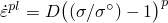；当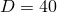/s时，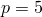 |
| 比热： | 586 J/(kg·℃) |
| 密度： | 7833 kg/m³ |
| 导热系数： | 52 J/(m·s·℃) |
| 多孔材料参数： | 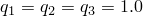 |
| 初始相对密度： | 0.95 (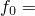 0.05) |

由于Abaqus/Standard中的问题定义假设模具完全粗糙，在金属与模具接触的任何地方都不允许切向滑动。

### 边界条件和加载

运动边界条件是轴对称（节点集`AXIS`中*r*=0的节点，规定*u*=0）和*z*=0平面对称（节点集`MIDDLE`中*z*=0的所有节点，规定*w*=0）。为避免过度约束，位于对称轴上坯料顶表面的节点不是节点集`AXIS`的一部分：该节点的径向运动已经受到无滑移摩擦约束的约束（参见["Abaqus/Standard接触建模的常见困难，"Abaqus分析用户指南第39.1.2节](../usb/usb-link.md#usb-cni-acontacttrouble)，以及["使用接触对的Abaqus/Explicit接触建模的常见困难，"Abaqus分析用户指南第39.2.2节](../usb/usb-link.md#usb-cni-aexpcontacttrouble)）。定义模具的刚性表面的刚体参考节点被约束为无旋转或*z*方向位移，其*z*方向位移被规定为沿轴向下移动9 mm，恒定速度。刚性参考节点上的反作用力对应于模具施加的总力。

热边界条件是所有外表面隔热（不允许热通量）。选择此条件是因为这是最极端的情况：它必须提供尽可能大的温升，因为没有热量可以从试样中移除。

Abaqus/Standard中自动时间增量方案的控制之一是允许在任何增量中发生的最大温度变化的限制。它设置为100℃，这是一个大值，表明我们不会因为积分热传递方程的精度考虑而限制时间增量。实际上，自动时间增量方案将选择相当小的增量，因为问题中存在严重的非线性，即使有相对大量的增量也需要每次迭代几次。将增量中允许的最大温度变化设置为大值是为了以低成本获得合理的解。

在Abaqus/Explicit中，使用自动时间增量方案来确保数值稳定性并在时间上推进解。使用质量缩放来降低分析的计算成本。

振幅在线性施加于步长，因为完全耦合温度-位移分析的默认振幅变化是阶跃函数，但这里我们希望模具以恒定速度向下移动。

运行两个版本的分析：慢速镦粗，其中镦粗在100秒内发生；快速镦粗，其中事件在0.1秒内发生。两个版本都使用耦合温度-位移过程进行分析。快速镦粗也在Abaqus/Standard中作为绝热静态应力分析运行。时间周期值与各个过程选项一起指定。绝热应力分析在与快速镦粗情况相同的时间框架内进行。在所有使用Abaqus/Standard分析的情况中，使用时间周期1.5%的初始时间增量；即，慢速情况为1.5秒，快速情况为0.0015秒。选择此值是因为它将产生约1%每增量的标称轴向应变，经验表明此类增量大小通常适合此类情况。

### 结果和讨论

首先讨论Abaqus/Standard模拟的结果，从粘塑性完全致密材料的结果开始。慢速镦粗的结果如图1.3.16-2到图1.3.16-4所示。快速镦粗耦合温度-位移分析的结果如图1.3.16-5到图1.3.16-7所示；绝热静态应力分析的结果如图1.3.16-8和图1.3.16-9所示。图1.3.16-2和图1.3.16-5显示了60%镦粗时预测的构型。绝热分析的构型未显示，因为它与快速镦粗耦合情况几乎相同。慢速和快速镦粗情况都显示了坯料顶部外表面向模具的折叠，以及试样中部的严重应变。每个系列的第二张图（慢速情况的图1.3.16-3，快速情况的图1.3.16-6，以及绝热情况的图1.3.16-8）显示了坯料中的等效塑性应变。试样中心的峰值应变约为180%。每个系列的第三张图（慢速情况的图1.3.16-4，快速情况的图1.3.16-7，以及绝热情况的图1.3.16-9）显示了温度分布，慢速和快速镦粗情况之间存在明显差异。在慢速情况下，热有时间扩散（60%镦粗在100秒内发生，试样的典型长度为10 mm），因此100秒时的温度分布相当均匀，仅在坯料中介于180℃和185℃之间变化。相比之下，快速镦粗发生得太快，热无法扩散。在这种情况下，试样顶表面的中间在事件结束时保持在0℃，而试样中心加热到近600℃。快速耦合情况和绝热情况之间的温度没有显著差异。在坯料的外顶部区域存在差异，这是由于该区域单元的严重扭曲和生成热的耗散不足造成的。坯料其余部分的温度比较良好。此示例说明了绝热分析的优势，因为在大约完全耦合分析所需计算机时间的60%内获得了良好的结果表示。

慢速和快速镦粗的多孔金属塑性模型的结果如图1.3.16-10到图1.3.16-15所示。变形构型与图1.3.16-2和图1.3.16-5中的相同。分析结束时试样中孔洞的生长/闭合程度如图1.3.16-10和图1.3.16-13所示。多孔材料由于该区域应力场的压缩性质，在坯料中心附近几乎完全压实；另一方面，角单元在坯料外顶部附近向上折叠并拉伸，孔隙体积分数增加到近0.1（或10%），表明材料可能发生撕裂。慢速镦粗（图1.3.16-11）和快速镦粗（图1.3.16-14）的多孔材料的等效塑性应变分别如图所示；图1.3.16-12和图1.3.16-15显示了多孔金属慢速和快速镦粗的温度分布。与完全致密金属相比，多孔金属实现相同变形需要较少的外部功。因此，作为热量耗散的塑性功较少；因此，温升不如完全致密金属那样多。这种效果在快速镦粗问题中更为明显，试样仅加热到510℃，而完全致密金属约为600℃。

图1.3.16-16到图1.3.16-18显示了模具位移与总镦粗力的预测。在图1.3.16-16中，慢速镦粗粘塑性和多孔塑性结果与Lippmann（1979）收集的几个弹塑性和刚塑性结果以及Taylor（1981）获得的慢速粘塑性结果进行了比较。所有率无关结果之间存在普遍一致，这些结果对应于本示例和Taylor（1981）发现的慢速粘塑性结果。在图1.3.16-17中研究了屈服应力的率依赖性。快速粘塑性和多孔塑性结果在整个事件过程中显示出比慢速结果明显更高的力值。这个效应很容易估计。整个事件中保持6 sec⁻¹的标称应变率。使用所选的粘塑性模型，此效应将屈服应力提高68%。这个因子与图1.3.16-17中出现的载荷放大因子非常接近。图1.3.16-18显示快速粘塑性绝热分析的力与位移预测与完全耦合结果非常吻合。

在Abaqus/Standard中还考虑了两个使用基于单元的刚性表面建模模具的情况。为了定义基于单元的刚性表面，使用等温刚体约束将单元分配给刚体。当使用解析刚性表面时，结果与使用基于单元的刚性表面的情况非常吻合。

自动载荷增量的结果表明，总体上获得了约2%每增量的标称应变增量，比初始时间增量建议中预期的略好。这些值是此类问题的典型值，是估算此类情况所需的计算工作的有用指导原则。

Abaqus/Explicit获得的结果与Abaqus/Standard获得的结果比较良好，如图1.3.16-19所示，它比较了Abaqus/Explicit（无自适应网格划分）的总镦粗力与模具位移的结果以及Abaqus/Standard获得的相同结果。两种解之间的一致性非常好。使用自适应网格划分的Abaqus/Explicit模拟结果获得类似的一致性。在这种情况下，网格扭曲显著减少，如图1.3.16-20所示。

### 输入文件

##### **Abaqus/Standard输入文件**

[cylbillet_cax4t_slow_dense.inp](../eif/cylbillet_cax4t_slow_dense.inp)

慢速镦粗情况，144个CAX4T单元，使用完全致密材料。

[cylbillet_cax4t_fast_dense.inp](../eif/cylbillet_cax4t_fast_dense.inp)

快速镦粗情况，144个CAX4T单元，使用完全致密材料。

[cylbillet_cax4rt_slow_dense.inp](../eif/cylbillet_cax4rt_slow_dense.inp)

慢速镦粗情况，144个CAX4RT单元，使用完全致密材料。

[cylbillet_cax4rt_fast_dense.inp](../eif/cylbillet_cax4rt_fast_dense.inp)

快速镦粗情况，144个CAX4RT单元，使用完全致密材料。

[cylbillet_cax8rt_slow_dense.inp](../eif/cylbillet_cax8rt_slow_dense.inp)

慢速镦粗情况，CAX8RT单元，使用完全致密材料。

[cylbillet_cax8rt_rb_s_dense.inp](../eif/cylbillet_cax8rt_rb_s_dense.inp)

慢速镦粗情况，CAX8RT单元，使用完全致密材料和对模具使用基于单元的刚性表面。

[cylbillet_cax8rt_fast_dense.inp](../eif/cylbillet_cax8rt_fast_dense.inp)

快速镦粗情况，CAX8RT单元，使用完全致密材料。

[cylbillet_cax8rt_slow_por.inp](../eif/cylbillet_cax8rt_slow_por.inp)

慢速镦粗情况，CAX8RT单元，使用多孔材料。

[cylbillet_cax8rt_fast_por.inp](../eif/cylbillet_cax8rt_fast_por.inp)

快速镦粗情况，CAX8RT单元，使用多孔材料。

[cylbillet_cgax4t_slow_dense.inp](../eif/cylbillet_cgax4t_slow_dense.inp)

慢速镦粗情况，144个CGAX4T单元，使用完全致密材料。

[cylbillet_cgax4t_fast_dense.inp](../eif/cylbillet_cgax4t_fast_dense.inp)

快速镦粗情况，144个CGAX4T单元，使用完全致密材料。

[cylbillet_cgax4t_rb_f_dense.inp](../eif/cylbillet_cgax4t_rb_f_dense.inp)

快速镦粗情况，144个CGAX4T单元，使用完全致密材料和对模具使用基于单元的刚性表面。

[cylbillet_cgax4t_rb_f_dense_surf.inp](../eif/cylbillet_cgax4t_rb_f_dense_surf.inp)

快速镦粗情况，144个CGAX4T单元，使用完全致密材料和对模具使用面-面接触的基于单元的刚性表面。

[cylbillet_cgax8rt_slow_dense.inp](../eif/cylbillet_cgax8rt_slow_dense.inp)

慢速镦粗情况，CGAX8RT单元，使用完全致密材料。

[cylbillet_cgax8rt_fast_dense.inp](../eif/cylbillet_cgax8rt_fast_dense.inp)

快速镦粗情况，CGAX8RT单元，使用完全致密材料。

[cylbillet_c3d10m_adiab_dense.inp](../eif/cylbillet_c3d10m_adiab_dense.inp)

使用C3D10M单元建模完全致密材料的绝热静态分析。

[cylbillet_c3d10m_adiab_dense_surf.inp](../eif/cylbillet_c3d10m_adiab_dense_surf.inp)

使用C3D10M单元建模完全致密材料并使用面-面接触的绝热静态分析。

[cylbillet_c3d10m_adiab_dense_po.inp](../eif/cylbillet_c3d10m_adiab_dense_po.inp)

[cylbillet_c3d10m_adiab_dense.inp](../eif/cylbillet_c3d10m_adiab_dense.inp)的[*POST OUTPUT*](../key/key-link.md#usb-kws-hpostoutput)分析。

[cylbillet_cax6m_adiab_dense.inp](../eif/cylbillet_cax6m_adiab_dense.inp)

使用CAX6M单元建模完全致密材料的绝热静态分析。

[cylbillet_cax8r_adiab_dense.inp](../eif/cylbillet_cax8r_adiab_dense.inp)

使用CAX8R单元建模完全致密材料的绝热静态分析。

[cylbillet_postoutput.inp](../eif/cylbillet_postoutput.inp)

使用完全致密材料的[*POST OUTPUT*](../key/key-link.md#usb-kws-hpostoutput)分析。

[cylbillet_slow_usr_umat_umatht.inp](../eif/cylbillet_slow_usr_umat_umatht.inp)

慢速镦粗情况，材料行为在用户子程序[`UMAT`](../sub/sub-link.md#sub-xsl-umat)和[`UMATHT`](../sub/sub-link.md#sub-xsl-umatht)中定义。

[cylbillet_slow_usr_umat_umatht.f](../eif/cylbillet_slow_usr_umat_umatht.f)

cylbillet_slow_usr_umat_umatht.inp使用的用户子程序[`UMAT`](../sub/sub-link.md#sub-xsl-umat)和[`UMATHT`](../sub/sub-link.md#sub-xsl-umatht)。

##### **Abaqus/Explicit输入文件**

[cylbillet_x_cax4rt_slow.inp](../eif/cylbillet_x_cax4rt_slow.inp)

慢速镦粗情况，完全致密材料用CAX4RT单元建模，无自适应网格划分；运动学力学接触。

[cylbillet_x_cax4rt_fast.inp](../eif/cylbillet_x_cax4rt_fast.inp)

快速镦粗情况，完全致密材料用CAX4RT单元建模，无自适应网格划分；运动学力学接触。

[cylbillet_x_cax4rt_slow_adap.inp](../eif/cylbillet_x_cax4rt_slow_adap.inp)

慢速镦粗情况，完全致密材料用CAX4RT单元建模，有自适应网格划分；运动学力学接触。

[cylbillet_x_cax4rt_fast_adap.inp](../eif/cylbillet_x_cax4rt_fast_adap.inp)

快速镦粗情况，完全致密材料用CAX4RT单元建模，有自适应网格划分；运动学力学接触。

[cylbillet_xp_cax4rt_fast.inp](../eif/cylbillet_xp_cax4rt_fast.inp)

快速镦粗情况，完全致密材料用CAX4RT单元建模，无自适应网格划分；罚函数力学接触。

### 参考文献

Lippmann, H., *Metal Forming Plasticity*, Springer-Verlag, Berlin, 1979.

Taylor, L. M., "A Finite Element Analysis for Large Deformation Metal Forming Problems Involving Contact and Friction," Ph.D. Thesis, U. of Texas at Austin, 1981.

### 图形

**图1.3.16-1** 轴对称镦粗示例：几何形状和网格（单元类型CAX8RT）。

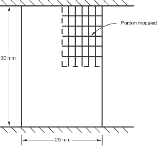

**图1.3.16-2** 60%镦粗时的变形构型：慢速情况，耦合温度-位移分析，Abaqus/Standard。

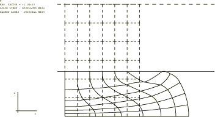

**图1.3.16-3** 60%镦粗时的塑性应变：慢速情况，耦合温度-位移分析，Abaqus/Standard。

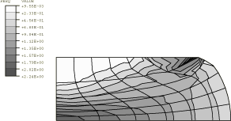

**图1.3.16-4** 60%镦粗时的温度：慢速情况，耦合温度-位移分析，Abaqus/Standard。

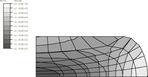

**图1.3.16-5** 60%镦粗时的变形构型：快速情况，耦合温度-位移分析，Abaqus/Standard。

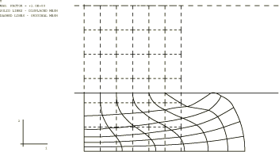

**图1.3.16-6** 60%镦粗时的塑性应变：快速情况，耦合温度-位移分析，Abaqus/Standard。

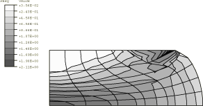

**图1.3.16-7** 60%镦粗时的温度：快速情况，耦合温度-位移分析，Abaqus/Standard。

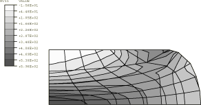

**图1.3.16-8** 60%镦粗时的塑性应变：快速情况，绝热应力分析，Abaqus/Standard。

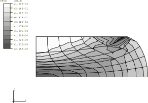

**图1.3.16-9** 60%镦粗时的温度：快速情况，绝热应力分析，Abaqus/Standard。

**图1.3.16-10** 60%镦粗时的孔隙体积分数：多孔材料，慢速耦合温度-位移分析，Abaqus/Standard。

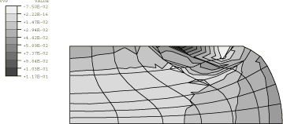

**图1.3.16-11** 60%镦粗时的塑性应变：多孔材料，慢速耦合温度-位移分析，Abaqus/Standard。

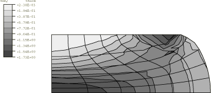

**图1.3.16-12** 60%镦粗时的温度：多孔材料，慢速耦合温度-位移分析，Abaqus/Standard。

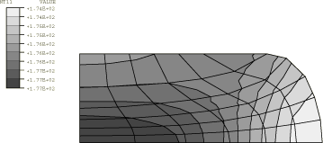

**图1.3.16-13** 60%镦粗时的孔隙体积分数：多孔材料，快速耦合温度-位移分析，Abaqus/Standard。

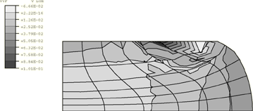

**图1.3.16-14** 60%镦粗时的塑性应变：多孔材料，快速耦合温度-位移分析，Abaqus/Standard。

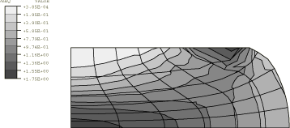

**图1.3.16-15** 60%镦粗时的温度：多孔材料，快速耦合温度-位移分析，Abaqus/Standard。

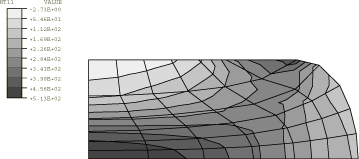

**图1.3.16-16** 慢速圆柱镦粗的力-位移响应，Abaqus/Standard。

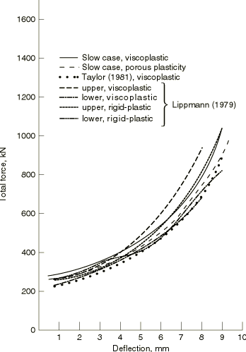

**图1.3.16-17** 力-位移响应的率依赖性，Abaqus/Standard。

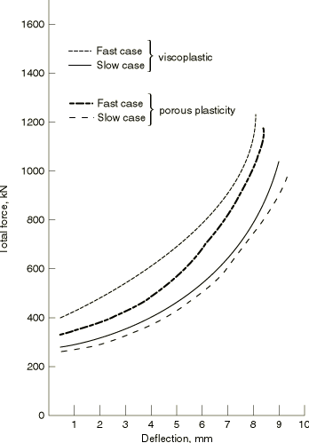

**图1.3.16-18** 力-位移响应：绝热与完全耦合分析的比较，Abaqus/Standard。

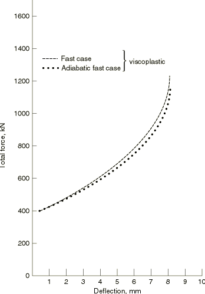

**图1.3.16-19** 力-位移响应：Abaqus/Explicit与Abaqus/Standard的比较。

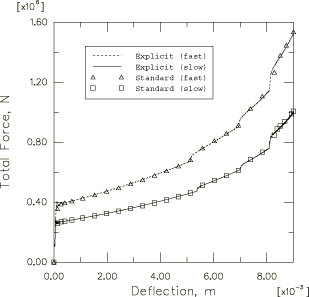

**图1.3.16-20** 60%镦粗时的变形构型：慢速情况，Abaqus/Explicit（无自适应网格划分，左；有自适应网格划分，右）。

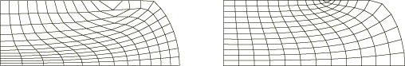

