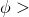
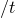
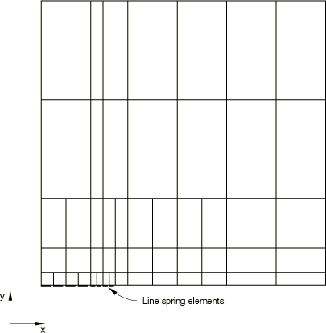
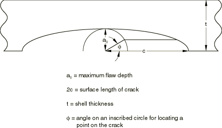
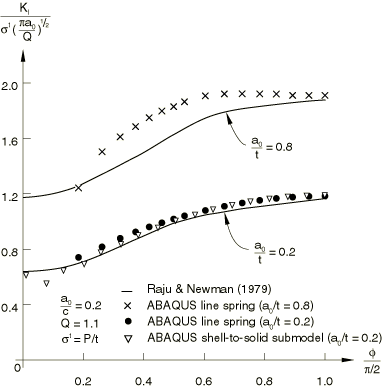
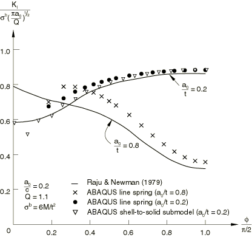
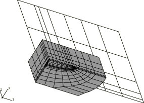

# 1.4.1 A plate with a part-through crack: elastic line spring modeling

**Product: **Abaqus/Standard  

The line spring elements in Abaqus allow inexpensive evaluation of the effects of surface flaws in shell structures, with sufficient accuracy for use in design studies. The basic concept of these elements is that they introduce the local solution, dominated by the singularity at the crack tip, into a shell model of the uncracked geometry. The relative displacements and rotations across the cracked section, calculated in the line spring elements, are then used to determine the magnitude of the local strain field and hence the *J*-integral and stress intensity factor values, as functions of position along the crack front. This example illustrates the use of these elements and provides some verification of the results they provide by comparison with a published solution and also by making use of the shell-to-solid submodeling technique.

### Problem description

A large plate with a symmetric, centrally located, semi-elliptic, part-through crack is subjected to edge tension and bending. The objective is to estimate the Mode I stress intensity factor, , as a function of position along the crack front. Symmetry allows one quarter of the plate to be modeled, as shown in [Figure 1.4.1--1](ch01s04aex51.md#sxmplatecrack-model). The 8-node shell element, S8R, and the corresponding 3-node (symmetry plane) line spring element LS3S are used in the model.

A mesh using LS6 elements is also included. Only half-symmetry is used in this case. When LS6 elements are used, the shell elements on either side of an LS6 element must be numbered such that the normals to these shell elements point in approximately the same direction.

### Geometry and model

For each load case (tension and bending) two plate thicknesses are studied: a “thick” case, for which the plate thickness is 76.2 mm (3.0 in); and a “thin” case, for which the plate thickness is 19.05 mm (0.75 in). For both thicknesses the semi-elliptic crack has a maximum depth ( in [Figure 1.4.1--2](ch01s04aex51.md#sxmplatecrack-schematic)) of 15.24 mm (0.6 in) and a half-length, *c*, of 76.2 mm (3.0 in). The plate is assumed to be square, with dimensions 609.6  609.6 mm (24  24 in).

The material is assumed to be linear elastic, with Young's modulus 207 GPa (30  106 lb/in2) and Poisson's ratio 0.3.

A quarter of the plate is modeled, with symmetry along the edges of the quarter-model at 0 and 0. On the edge containing the flaw (0), the symmetry boundary conditions are imposed only on the unflawed segment of the edge, since they are built into the symmetry plane of the line spring element being used (LS3S).

The loading consists of a uniform edge tension (per unit length) of 52.44 kN/m (300 lb/in) or a uniform edge moment (per unit length) of 1335 N-m/m (300 lb-in/in).

### Results and discussion

The stress intensity factors for the thick and thin plates are compared with the detailed solutions of Raju and Newman (1979) and Newman and Raju (1979) in [Figure 1.4.1--3](ch01s04aex51.md#sxmplatecrack-tension) (tension load) and [Figure 1.4.1--4](ch01s04aex51.md#sxmplatecrack-moment) (bending load). These plots show that the present results agree reasonably well with those of Raju and Newman over the middle portion of the flaw (30), with better correlation being provided for the thick case, possibly because the crack is shallower in that geometry. The accuracy is probably adequate for basic assessment of the criticality of the flaw for design purposes. For values of  less than about 30 (that is, at the ends of the flaw), the stress intensity values predicted by the line spring model lose accuracy. This accuracy loss arises from a combination of the relative coarseness of the mesh, (especially in this end region where the crack depth varies rapidly), as well as from theoretical considerations regarding the appropriateness of line spring modeling at the ends of the crack. These points are discussed in detail by Parks (1981) and Parks et al. (1981).

### Shell-to-solid submodeling around the crack tip

An input file for the case = 0.2, which uses the shell-to-solid submodeling capability, is included. This C3D20R element mesh allows the user to study the local crack area using the energy domain integral formulation for the *J*-integral. The submodel uses a focused mesh with four rows of elements around the crack tip. A  singularity is utilized at the crack tip, the correct singularity for a linear elastic solution. Symmetry boundary conditions are imposed on two edges of the submodel mesh, while results from the global shell analysis are interpolated to two edges by using the submodeling technique. The global shell mesh gives satisfactory *J*-integral results; hence, we assume that the displacements at the submodel boundary are sufficiently accurate to drive the deformation in the submodel. No attempt has been made to study the effect of making the submodel region larger or smaller. The submodel is shown superimposed on the global shell model in [Figure 1.4.1--5](ch01s04aex51.md#sxmplatecrack-solid-shell).

The variations of the *J*-integral values along the crack in the submodeled analysis are compared to the line spring element analysis in [Figure 1.4.1--3](ch01s04aex51.md#sxmplatecrack-tension) (tension load) and [Figure 1.4.1--4](ch01s04aex51.md#sxmplatecrack-moment) (bending load). Excellent correlation is seen between the three solutions. A more refined mesh in the shell-to-solid submodel near the plate surface would be required to obtain *J*-integral values that more closely match the reference solution.

### Input files

[crackplate_ls3s.inp](../eif/crackplate_ls3s.inp)

LS3S elements.

[crackplate_surfaceflaw.f](../eif/crackplate_surfaceflaw.f)

A small program used to create a data file containing the surface flaw depths.

[crackplate_ls6_nosym.inp](../eif/crackplate_ls6_nosym.inp)

LS6 elements without symmetry about  0.

[crackplate_postoutput.inp](../eif/crackplate_postoutput.inp)

[*POST OUTPUT](../key/key-link.md#usb-kws-hpostoutput) analysis.

[crackplate_submodel.inp](../eif/crackplate_submodel.inp)

Shell-to-solid submodel.

### References

Newman,  J. C., Jr., and I. S. Raju, “Analysis of Surface Cracks in Finite Plates Under Tension or Bending Loads,” NASA Technical Paper 1578, National Aeronautics and Space Administration, December 1979.

Parks,  D. M., “The Inelastic Line Spring: Estimates of Elastic-Plastic Fracture Mechanics Parameters for Surface-Cracked Plates and Shells,” Journal of Pressure Vessel Technology, vol. 13, pp. 246–254, 1981.

Parks,  D. M., R. R. Lockett, and J. R. Brockenbrough, “Stress Intensity Factors for Surface-Cracked Plates and Cylindrical Shells Using Line Spring Finite Elements,”* Advances in Aerospace Structures and Materials*, Edited by S. S. Wang and W. J. Renton, ASME, AD–01, pp. 279–286, 1981.

Raju,  I. S., and J. C. Newman, Jr., “Stress Intensity Factors for a Wide Range of Semi-Elliptic Surface Cracks in Finite Thickness Plates,” Journal of Engineering Fracture Mechanics, vol. 11, pp. 817–829, 1979.

### Figures

**Figure 1.4.1–1** Quarter model of large plate with center surface crack.

**Figure 1.4.1–2** Schematic surface crack geometry for a semi-elliptical crack.

**Figure 1.4.1–3** Stress intensity factor dependence on crack front position: tension loading.

**Figure 1.4.1–4** Stress intensity factor dependence on crack front position: moment loading.

**Figure 1.4.1–5** Solid submodel superimposed on shell global model.

