# 1.4.2 线性弹性无限半空间中锥形裂纹的轮廓积分


**产品：** Abaqus/Standard  Abaqus/CAE

### 目标

本示例演示了 Abaqus 以下线弹性断裂力学特性和技术：
- 基于线性静态应力分析评估轴对称和三维断裂力学的轮廓积分；
- 对二维和三维分析中用于评估轮廓积分的网格进行分区；
- 当裂纹扩展方向沿裂纹前缘变化时评估三维轮廓积分；
- 断裂问题中基于节点的子模型（将单个精细分析与子模型方法的结果进行比较）；
- 基于全局模型应力的表面基子模型，并提供获得足够精度的指南；以及
- 应用连续无限元模拟无限域。

### 应用描述

本示例研究锥形裂纹的断裂行为，这可能由小硬物体撞击大脆性体产生。它展示了如何评估裂纹在静态载荷下扩展的倾向，但不涉及形成裂纹的事件。

*J* 积分是广泛应用的断裂力学参数，与裂纹扩展相关的能量释放有关，是裂纹尖端变形强度的度量。在实践中，计算得到的 *J* 积分可以与所考虑材料的临界值进行比较以预测断裂。*T* 应力代表平行于裂纹面的应力。*T* 应力和 *J* 积分共同提供了一个双参数断裂模型，描述了平面应变或三维中宽范围裂纹构型和载荷下的 I 型弹塑性裂纹尖端应力和变形。应力强度因子，，与能量释放率相关，并衡量裂纹扩展的倾向。

本示例使用轴对称和三维模型来演示 Abaqus 断裂力学能力，其中裂纹扩展方向沿曲线裂纹前缘变化。还演示了使用无限元来模拟远场边界。

### 几何

问题域包含位于无限固体半空间中的锥形裂纹，如图 [Figure 1.4.2--1](ch01s04aex52.md#sxmconicalcrack-geom) 所示。裂纹扩展方向随裂纹绕圆扫动而变化。本示例的单位是非物理的；因此，尺寸、载荷和材料性能以长度和力单位描述。裂纹在自由表面上围绕半径为 10 个长度单位的圆周。裂纹与自由表面的交角为 45°，向固体域延伸 15 个长度单位。

### 材料

材料为线弹性固体。

### 边界条件和载荷

半无限域被约束以防止刚体运动。施加的载荷为静水压力，大小为 10 力/长度²，作用于裂纹所围绕的圆形自由表面上。载荷如图 [Figure 1.4.2--1](ch01s04aex52.md#sxmconicalcrack-geom) 所示。

### Abaqus 建模方法和模拟技术

本示例包括六个案例，演示使用 Abaqus/Standard 的不同建模方法。裂纹建模为缝隙，因为未加载状态下裂纹表面彼此相邻且无间隙。

几何是轴对称的，可以如此建模。然而，三维案例演示了 Abaqus 断裂力学能力，其中裂纹扩展方向沿曲线裂纹前缘变化。无限半空间使用多种技术处理。在案例 1 到案例 4 中，域延伸到远远超出感兴趣区域。施加在距感兴趣区域一定距离处的远场边界条件对裂纹附近响应的影响可以忽略不计。案例 5 和案例 6 演示了连续无限元的使用。提供带或不带子模型的轴对称和三维案例。[Abaqus Analysis User's Guide 的 "Fracture mechanics," Section 11.4](../usb/usb-link.md#usbafrac) 提供了断裂力学程序的详细信息。

### 分析案例摘要

| 案例 1 | 使用 Abaqus/CAE 的完整轴对称模型。 |
| --- | --- |
| 案例 2 | 使用 Abaqus/CAE 的完整三维模型。 |
| 案例 3 | 使用 Abaqus/CAE 的轴对称方法与子模型。 |
| 案例 4 | 使用 Abaqus/CAE 的三维方法与子模型。 |
| 案例 5 | 使用输入文件的轴对称方法与子模型和无限元。 |
| 案例 6 | 使用输入文件的三维方法与子模型和无限元。 |

以下部分讨论适用于若干或所有案例的分析考虑因素。后面提供了更详细的描述，包括结果讨论和所提供文件的列表。案例 1 到案例 4 的模型使用 Abaqus/CAE 生成。除了生成模型数据库的 Python 脚本外，这些案例也提供了 Abaqus/Standard 输入文件。

### 网格设计

网格包括沿裂纹的缝隙和重复节点，允许裂纹在加载时打开。对几何进行分区以映射围绕裂纹尖端的单元环，用于轮廓积分计算。模型使用四边形或砖块单元，侧面 collapse 形成三角形单元（二维情况）或楔形单元（三维情况），在裂纹尖端引入奇异性。要用于评估轮廓积分，裂纹尖端周围的网格必须按照 [Abaqus/CAE User's Guide 的 "Using contour integrals to model fracture mechanics," Section 31.2](../usi/usi-link.md#usi-eng-crack) 中所述进行建模。在轴对称案例中创建圆形分区以在裂纹尖端周围进行网格划分。在三维案例中，相应的分区是围绕裂纹尖端的弯曲管状体积。

裂纹尖端需要精细网格以获得与轮廓无关的结果；即，围绕裂纹尖端的连续单元环计算的轮廓积分值没有显著变化。在裂纹尖端周围用于计算轮廓积分的圆形分区区域内，网格应向裂纹尖端适度偏置。轮廓积分的精度对偏置不太敏感。需要工程判断来确定足够的网格细化以产生与轮廓无关的结果，同时避免在裂纹尖端创建相对于其他单元太小的单元，从而引入数值条件问题和相关舍入误差。

当变形和材料是线性的（如本示例），用于映射裂纹尖端轮廓积分计算的裂纹尖端网格的圆形分区直径不是关键的。（如果材料是弹塑性的，圆形分区的大小通常应包含塑性区，并允许轮廓积分的若干轮廓在仍处于弹性区域时包围塑性区。）创建剩余分区，使得远离裂纹尖端的区域中的单元形状满足单元质量标准。

要了解在二维或三维中折叠单元侧面创建的奇异性类型，请参阅 [Abaqus Analysis User's Guide 的 "Contour integral evaluation," Section 11.4.2](../usb/usb-link.md#usb-anl-acontintegral) 中的 "small-strain analysis 的 fracture mechanics mesh 构建"。在这个应用中，我们希望在裂纹处有应变平方根奇异性，因为材料是线弹性的，我们将进行小应变分析。

应力强度因子和 *T* 应力使用相互作用积分方法计算，其中使用辅助平面应变裂纹尖端场。裂纹前缘半径曲率对这个问题是重要的。因此，为了准确计算三维案例的轮廓积分，使用了非常精细的网格以在裂纹前缘局部接近平面应变条件。这个精细网格使轮廓积分域足够小以最小化曲率对结果的影响。

轴对称和三维案例的更详细网格程序在下面各个案例的描述中讨论。

### 材料模型

线性静态结构分析需要指定弹性模量，为 30,000,000 力/长度² 单位，和泊松比，为 0.3。一个实体均匀截面用于为单元分配材料性能。

### 载荷

均匀压力载荷为 10 力/长度² 单位，沿着裂纹的自由顶面施加。在轴对称模型中，施加压力的载荷区域由线段表示。对于三维案例，施加压力的载荷区域为一个面。

### 分析步骤

每个分析使用单个线性静态步骤进行。

### 输出请求

输出请求用于指定轮廓积分、应力强度因子和 *T* 应力的计算。关于断裂力学输出的更多信息，请参阅 [Abaqus/CAE User's Guide 的 "Requesting contour integral output," Section 31.2.11](../usi/usi-link.md#usi-eng-help-crack-output)。子模型案例中使用的全局模型包括必要的输出请求，以将位移和应力结果写入输出数据库（.odb）文件；在使用基于节点的子模型的情况下，位移结果用于在相应子模型上建立边界条件。在使用基于表面的子模型的情况下，应力结果用于在相应子模型上建立边界 traction。

#### 子模型

现实的断裂分析往往需要大量计算资源。为了在分析裂纹尖端周围的应力场时获得准确结果，必须使用精细网格来捕获尖端附近的强梯度。所需的网格细化会使断裂力学模型很大，因为裂纹通常是与模型尺寸相比非常小的特征。减少计算资源的替代技术是使用子模型通过顺序运行两个较小的模型来获得准确结果，而不是执行在裂纹区域具有精细网格的单个全局分析。第一步是求解一个较粗的全局模型以获得在远离裂纹尖端处准确但在区域附近不够精细以捕获强梯度的解。然后使用裂纹尖端区域的精细子模型来获得更准确的解，从而获得更准确的轮廓积分。子模型的边界必须足够远离感兴趣区域，以便较粗的全局模型能够在子模型边界处提供准确结果，在使用基于表面的子模型时尤其重要。可以通过在后处理中确认子模型边界处的应力轮廓与全局模型中相同位置的应力轮廓相似来验证此条件。

虽然对于本示例不需要子模型方法，因为案例 1 和案例 2 中分析的整个域的精细模型足够小，可以在常用计算平台上运行，但本应用提供了演示轴对称和三维断裂力学案例的子模型技术的机会，并展示了基于位移的节点子模型和基于应力的表面子模型之间的差异。子模型程序在 [Abaqus Analysis User's Guide 的 "Node-based submodeling," Section 10.2.2](../usb/usb-link.md#usb-anl-asubmodeldisp)、[Abaqus Analysis User's Guide 的 "Surface-based submodeling," Section 10.2.3](../usb/usb-link.md#usb-anl-asubmodelstress) 和 [Abaqus/CAE User's Guide 的 Chapter 38, "Submodeling"](../usi/usi-link.md#usi-adv-submodeling) 中详细描述。

#### 无限域建模

案例 1 到案例 4 使用相对于裂纹尺寸较大的连续网格模拟域的无限范围，并带有适当的远场边界条件。在这些案例中，域延伸到裂纹长度的 20 倍。案例 5 和案例 6 演示了连续无限元的使用，并将感兴趣区域用减缩积分连续单元表示到约裂纹尺寸 10 倍的距离，周围是连续无限元层。这些案例不需要远场边界条件。

### 案例 1 使用 Abaqus/CAE 的完整轴对称模型

轴对称域是一个半径等于高度 300 长度单位的固体（见 [Figure 1.4.2--2](ch01s04aex52.md#sxmconicalcrack-axisgeom)）。模型的顶部边缘表示包含裂纹的自由表面。半无限域通过将连续模型延伸到裂纹长度 20 倍的距离并施加适当的远场边界条件来模拟。此模型使用连续轴对称二次减缩积分（CAX8R）单元。

### 网格设计

在计算二维问题的轮廓积分时，必须在裂纹尖端周围使用四边形单元进行轮廓积分计算，而三角形单元在裂纹尖端旁边。这些三角形单元实际上是折叠的四边形，引入奇异性。轴对称模型必须分区如图 [Figure 1.4.2--2](ch01s04aex52.md#sxmconicalcrack-axisgeom) 所示，以定义裂纹，在裂纹尖端通过折叠单元引入奇异性，并创建用于轮廓积分计算的四边形单元环。创建直线分区，其中定义缝隙裂纹以及圆形分区，使单元环围绕裂纹尖端映射。当对此分区使用结构化网格时，在裂纹尖端旁边创建三角形单元，周围是四边形（见 [Abaqus/CAE User's Guide 的 "Using contour integrals to model fracture mechanics," Section 31.2](../usi/usi-link.md#usi-eng-crack)）。Abaqus/CAE 自动将裂纹尖端的三角形单元转换为折叠一侧以引入奇异性的四边形单元。

[Abaqus/CAE User's Guide 的 "Creating a seam," Section 31.1.2](../usi/usi-link.md#usi-eng-help-seamcrack) 描述了如何选择分区段来定义缝隙（裂纹）。在裂纹尖端控制应变平方根奇异性的程序在 [Abaqus/CAE User's Guide 的 "Controlling the singularity at the crack tip," Section 31.2.8](../usi/usi-link.md#usi-eng-help-crack-cracksingularity) 中描述。定义缝隙后，选择裂纹尖端以指定定义第一个轮廓积分的区域，并定义 *q* 向量以按照 [Abaqus/CAE User's Guide 的 "Creating a contour integral crack," Section 31.2.9](../usi/usi-link.md#usi-eng-help-crack) 中所述指定裂纹扩展方向。

### 边界条件

[Figure 1.4.2--3](ch01s04aex52.md#axisymmmesh) 中所示模型的右边缘未受约束以表示远场边界。模型的底边约束为零位移（U2）以消除刚体运动，同时模拟远场边界。这些边缘距离裂纹周围感兴趣区域足够远，可以表示对感兴趣区域影响可忽略的无限域。

### 运行程序

案例 1 模型使用 Abaqus/CAE 生成以创建和网格化本机几何。提供了 Python 脚本以自动化构建模型和运行解决方案。脚本可以交互式运行或从命令行运行。

要交互式创建模型，启动 Abaqus/CAE 并从出现的 **Start Session** 对话框中选择 **Run Script**。为案例选择第一个文件 `AxisymmConeCrack_model.py`。脚本完成后，您可以使用 Abaqus/CAE 命令显示和查询模型。当您准备好分析模型时，从 **File** 菜单中选择 **Run Script** 并选择下一个脚本 `AxisymmConeCrack_job.py`。提供的 Python 脚本允许您使用 Abaqus/CAE 交互式修改模型以探索此处提供的案例的其他变体。

或者，Python 脚本可以使用 Abaqus/CAE `noGUI` 选项从命令行运行，顺序如下：

```
abaqus cae noGUI=*filename*.py 
```

其中 `abaqus` 是运行程序的系统命令，*filename* 是要运行的脚本名称。

作为 Python 脚本的替代方案，也提供了 Abaqus/Standard 输入文件 `AxisymmConeCrack.inp` 来运行此案例。您可以使用以下命令提交分析：

```
`abaqus input=AxisymmConeCrack.inp`
```

### 案例 2 使用 Abaqus/CAE 的完整三维模型

三维域是一个边长为 300 单位的立方体，如图 [Figure 1.4.2--4](ch01s04aex52.md#symmetricmesh) 所示。网格表示问题域的四分之一对称段。模型的顶部表示包含裂纹的自由表面。半无限域通过将连续网格延伸到裂纹长度 20 倍的距离并施加适当的对称和远场边界条件来表示。

### 网格设计

在计算三维轮廓积分时，必须在裂纹尖端周围使用砖块单元环进行轮廓积分计算，而楔形单元在裂纹尖端旁边（这些楔形实际上是折叠的砖块）。创建同心管状分区以在裂纹尖端周围映射网格。三维域和几何分区如图 [Figure 1.4.2--5](ch01s04aex52.md#partitionedblock) 和 [Figure 1.4.2--6](ch01s04aex52.md#sweptmesh) 所示。缝隙裂纹如图 [Figure 1.4.2--7](ch01s04aex52.md#seamcrackfaces) 所示。当对内部管状分区使用结构化网格时，在裂纹尖端旁边创建楔形单元，周围是砖块单元环（详见 [Abaqus/CAE User's Guide 的 "Using contour integrals to model fracture mechanics," Section 31.2](../usi/usi-link.md#usi-eng-crack)）。在内部环中使用的扫掠网格在裂纹尖端创建楔形单元。外环使用结构化网格技术网格化为六面体单元。

关于如何定义裂纹扩展方向（其中向量方向沿裂纹前缘变化，称为 *q* 向量）的详细信息，请参阅 [Abaqus/CAE User's Guide 的 "Defining the crack extension direction," Section 31.2.4](../usi/usi-link.md#usi-eng-conc-crack-crackdirection)。[Figure 1.4.2--8](ch01s04aex52.md#qvectors) 展示了 *q* 向量。

### 边界条件

对称位移边界条件施加在垂直于对称平面的方向上。模型侧面（不是对称平面）的远场面未受约束。模型底面在压力载荷方向（U2=0）上约束以防止刚体运动，同时模拟远场边界条件。

### 运行程序

提供的用于生成 Abaqus/CAE 模型和分析模型的 Python 脚本按照与案例 1 所述相同的程序运行。

作为 Python 脚本的替代方案，也提供了 Abaqus/Standard 输入文件 `SymmConeCrackOrphan.inp` 来运行此案例。您可以使用以下命令提交分析：

```
`	abaqus input= SymmConeCrackOrphan.inp`
```

定义此案例节点和单元的文件 `SymmConeCrackOrphan_node.inp` 和 `SymmConeCrackOrphan_elem.inp` 必须在提交输入文件时可用。

[Figure 1.4.2--9](ch01s04aex52.md#displacedshape) 显示了来自案例 2 完整三维分析的裂纹变形形状图。位移使用比例因子夸大以可视化裂纹开口。

### 案例 3 使用 Abaqus/CAE 的轴对称子模型方法

案例 3 使用子模型方法，因此需要两个顺序分析，称为全局模型和子模型。首先，求解一个较粗的全局模型以获得在裂纹尖端足够准确的位移解。然后使用由全局模型位移解驱动的感兴趣区域的精细子模型来获得裂纹尖端区域的准确解。每个这些模型比案例 1 中使用的完整精细轴对称全局模型小得多。

### 网格设计

轴对称全局模型在裂纹区域具有相对较粗的网格。案例 3 使用的全局模型在裂纹尖端有两圈单元的网格聚焦，而案例 1 中使用的完整模型在裂纹尖端周围有 13 圈单元。

案例 3 的轴对称全局模型和子模型网格如图 [Figure 1.4.2--10](ch01s04aex52.md#axisymmconecrackmeshdensity) 所示。轴对称子模型在裂纹尖端周围有精细网格，周围有 12 圈单元。假设全局模型的粗网格足够准确以驱动子模型：如果全局模型的位移场在子模型边界处准确，则子模型可以获得准确的轮廓积分结果，这些边界远离裂纹尖端。您可以在后处理阶段通过将子模型边界处的应力轮廓与全局模型的相应轮廓进行比较来验证这一点。

### 边界条件

施加在轴对称全局模型上的边界条件与案例 1 使用的相同。使用子模型技术时，来自全局模型的位移解被施加到子模型边界。

### 运行程序

案例 3 使用的模型使用 Abaqus/CAE 生成以创建和网格化本机几何。运行案例 1 和 2 的 Python 脚本的相同程序用于创建和分析全局模型。构建子模型的脚本引用全局模型输出数据库（.odb）文件，在分析子模型时必须可用。分析全局模型后，使用用于全局模型的相同程序运行构建和分析子模型的脚本。

也提供了 Abaqus/Standard 输入文件来运行此案例。首先，运行作业创建和分析全局模型；然后运行子模型作业。全局模型的结果必须可用于运行子模型。典型执行过程如下：

```
abaqus job=*globalModelJobName*  input=*globalModelInputfile*.inp
abaqus job=*submodelJobname*, input=*subModelInputfile*.inp,
globalmodel=*globalModelJobNameOutputDatabase*

```

### 案例 4 使用 Abaqus/CAE 的三维子模型方法

案例 4 使用三维子模型方法，需要两个顺序分析，一个全局模型和一个子模型。首先，求解一个全局模型，具有足够的细化以提供在裂纹尖端远处准确的位移和应力解。

然后使用两个版本的感兴趣区域精细子模型来获得裂纹尖端区域的准确解。在一个子模型分析中，感兴趣区域由来自全局模型的位移解驱动。在另一个子模型分析中，感兴趣区域由来自全局模型的应力解驱动。

此案例中使用的每个模型比案例 2 中使用的完整精细三维全局模型小得多。

### 网格设计

首先分析在裂纹区域具有较粗网格的三维全局模型，然后用于驱动子模型。对于三维全局模型，仅在裂纹线上使用 18 个单元，而在子模型中沿裂纹线使用 38 个单元。[Figure 1.4.2--11](ch01s04aex52.md#conecrackmeshdensity) 显示了三维全局模型和子模型的网格。

### 边界条件

案例 4 中施加在全局模型上的边界条件与完整三维案例 2 使用的相同。子模型方法使用来自全局模型的位移或应力解来驱动子模型边界。

### 运行程序

案例 4 使用的模型使用 Abaqus/CAE 生成以创建和网格化本机几何。案例 3 使用的相同程序也可用于案例 4。构建子模型的脚本引用全局模型输出数据库（.odb）文件，在分析子模型时必须可用。

作为 Python 脚本的替代方案，也提供了 Abaqus/Standard 输入文件来运行此案例。这些使用与案例 3 下所述输入文件相同的程序提交。

### 案例 5 使用 Abaqus/Standard 输入文件的带无限元的轴对称子模型方法

案例 5 使用带连续无限元模拟远场边界条件的轴对称网格的子模型方法。子模型技术需要两个顺序分析，一个较粗的全局模型和一个在裂纹尖端的精细子模型。

案例 5 的全局模型包括到半径为 170 长度单位的连续元轴对称表示。使用 8 节点双二次轴对称四边形减缩积分单元（CAX8R）在裂纹附近区域建模实体域。该域使用一层连续无限元进一步延伸至半径 340 长度单位。使用 5 节点二次轴对称单向无限单元（CINAX5R）来模拟固体的远场区域。案例 5 中使用的子模型不包含完整裂纹面，而是延伸到距裂纹尖端足够远的地方，使得应力场的强变化被捕获在子模型内。可以通过将子模型的应力轮廓与全局模型中的相应应力轮廓进行比较来验证此结果。

### 网格设计

首先分析在裂纹区域具有相对较粗网格的轴对称全局模型，然后用于驱动子模型。案例 5 的轴对称全局模型和子模型网格如图 [Figure 1.4.2--12](ch01s04aex52.md#sxmconicalcrack-globalmod) 所示。

### 边界条件

连续无限元消除了对案例 1 到案例 4 所需的远场约束的需要。

### 运行程序

案例 5 使用的模型使用 Abaqus/Standard 输入文件生成。首先，运行作业创建和分析全局模型；然后运行子模型作业。全局模型的结果必须可用于运行子模型。典型执行过程如下：

```
abaqus job=*globalModelJobName*  input=*globalModelInputfile*.inp
abaqus job=*submodelJobname*, input=*subModelInputfile*.inp,
globalmodel=*globalModalJobNameOutputDatabase* 
```

### 案例 6 使用 Abaqus/Standard 输入文件的带无限元的三维子模型方法

案例 6 使用带连续无限元模拟远场边界条件的三维网格的子模型方法。案例 6 建模的域包含一个球体的八分之一，代表半无限问题域的四分之一。连续单元使用到半径 170 长度单位。该域使用一层无限连续元延伸至半径 340 长度单位。

子模型技术需要两个单独的分析，一个较粗的全局模型和一个在裂纹尖端的精细子模型。案例 6 使用 Abaqus/Standard 输入文件生成模型，而不是 Abaqus/CAE Python 脚本。使用 20 节点二次减缩积分实体单元（C3D20R）在裂纹附近区域建模固体域。该域使用一层 12 节点二次单向无限砖块单元（CIN3D12R）进一步延伸至半径 340 长度单位。

案例 6 中使用的子模型不包含完整裂纹面，而是延伸到距裂纹尖端足够远的地方，使得应力场的强变化被捕获在子模型内。

### 网格设计

首先分析在裂纹区域具有相对较粗网格的三维全局模型，然后用于驱动子模型。案例 6 的三维全局模型和子模型网格如图 [Figure 1.4.2--13](ch01s04aex52.md#sxmconicalcrack-submesh) 所示。

### 边界条件

连续无限元消除了对案例 1 到案例 4 所需的远场约束的需要。

### 运行程序

案例 6 的模型使用 Abaqus/Standard 输入文件生成。案例 5 中使用的相同程序也用于案例 6。在运行输入文件创建全局模型时，必须提供包含三维全局模型节点和单元定义的文件。全局模型的输出数据库（.odb）文件必须可用于运行子模型。

### 结果讨论和案例比较

每个案例从数据（.dat）文件获得的轮廓积分结果总结在 [Table 1.4.2--1](ch01s04aex52.md#table-conicalcrack-jintka-ests) 到 [Table 1.4.2--4](ch01s04aex52.md#table-conicalcrack-tstress-ests) 中。这些结果也可以通过在 Abaqus/CAE 可视化模块中显示历史输出来自输出数据库（.odb）文件。虽然没有可供比较的解析解，但使用极端网格细化的额外轴对称分析作为参考解决方案的基础。每个表的标题中都包含参考解值。

Abaqus 使用两种方法计算 *J* 积分。*J* 积分的值基于应力强度因子，J_K，以及通过直接评估轮廓积分，J_A。应力强度因子  和 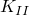，以及 *T* 应力分别在 [Table 1.4.2--2](ch01s04aex52.md#table-conicalcrack-k1-ests)、[Table 1.4.2--3](ch01s04aex52.md#table-conicalcrack-k2-ests) 和 [Table 1.4.2--4](ch01s04aex52.md#table-conicalcrack-tstress-ests) 中给出。当请求应力强度因子时，Abaqus 会自动输出基于应力强度因子的 *J* 积分 J_K。由于载荷对称， 的值应为零，因此未列出表格，因为这些值与  和  相比可忽略不计。

表格列出轮廓 1 到轮廓 5 的值。每个轮廓对应从裂纹尖端向外径向延伸的连续单元环。对于轴对称案例，每条轮廓有一组结果可用。对于三维案例，Abaqus/Standard 在每个裂纹尖端节点处提供轮廓积分值。[Table 1.4.2--1](ch01s04aex52.md#table-conicalcrack-jintka-ests) 到 [Table 1.4.2--4](ch01s04aex52.md#table-conicalcrack-tstress-ests) 中列出的三维案例的值对应于裂纹圆周中点处的位置，位于三维模型对称面之间的中间。对三维案例结果的详细检查确认，轮廓积分值在裂纹尖端圆周每个节点处基本恒定。例外是计算  的值；它波动，但相对于裂纹几乎整个长度上的  和  保持较小；然而  在对应于对称平面的裂纹开放端面处增加。在三维裂纹开放端节点处发生的精度损失是已知限制，在应用此方法时可以预期。

在评估断裂问题时通常不使用第一个轮廓的结果，因为第一个轮廓受裂纹尖端奇异性影响。表格结果中报告的平均值排除第一个轮廓。比较仅指轮廓 2 到轮廓 5。轴对称和三维建模方法非常一致，有和没有子模型。对于每个案例，通过直接评估轮廓积分计算的（J_A）、、 和 *T* 应力，表格数量的值与轮廓 2 到轮廓 5 平均值的偏差小于 2%。每个案例的 *J* 积分从应力强度因子（J_K）计算的偏差小于相应值的平均值的 3.5%。J_K 与 J_A 偏差较大是预期的，因为从应力强度因子计算轮廓积分的方法（J_K）比直接计算轮廓积分的方法（J_A）对数值精度更敏感。由于本示例中的几何和载荷对称， 在解析上等于零； 的数值结果相对于  和  可忽略不计。

#### 子模型结果

用于计算驱动子模型的变形和应力场的全局模型使用的裂纹尖端网格太粗，无法给出轮廓积分的准确结果；因此，全局模型的结果未列入表格。为参考此全局分析的子模型列出了结果。通常这些结果验证了子模型方法在断裂问题中提供足够准确性，其中在全局模型的裂纹尖端区域使用足够精细的网格可能不实际。基于节点的子模型方法比基于表面的方法提供更高的准确性。

##### 基于节点的子模型结果

基于节点的子模型分析的 *J* 积分值与完整模型分析（裂纹尖端周围具有足够网格细化的分析）匹配，偏差小于 1%。

##### 基于表面的子模型结果

三维子模型案例还考虑了基于表面的子模型，其中子模型由全局模型应力场驱动。考虑了两对不同的全局模型和基于表面的子模型：一对与基于节点的分析使用相同的网格设计，另一对进行了调整以提高准确性。第一对分析的 *J* 积分值，仅与基于节点的子模型使用相同的网格，与完整模型匹配，仅在 6% 以内。这些不准确的结果源于违反 [Abaqus Analysis User's Guide 的 "Surface-based submodeling," Section 10.2.3](../usb/usb-link.md#usb-anl-asubmodelstress) 中建立的指南的建模布置，即
- 子模型表面应在应力梯度相对较低的区域与全局模型相交，和
- 子模型表面应在单元尺寸均匀的区域与全局模型相交。

进行了符合这些指南的调整后的全局和子模型分析。在这种情况下，子模型驱动表面距裂纹区域和应力梯度更远，并且全局模型网格被细化，使得在子模型表面区域中单元更加均匀。[Figure 1.4.2--14](ch01s04aex52.md#conecracksbsubmodel) 显示了子模型/全局模型对的比较。左侧的布置将较低的子模型边界放置得离裂纹和高应力梯度太近，并穿过高纵横比单元。右侧的布置在全局模型中提供较低纵横比的单元，并将较低的子模型边界放置得离裂纹更远。现在，调整后的分析使 *J* 积分值与完整模型匹配，偏差在 2% 以内。这种准确性差异说明了遵循基于表面子模型设计指南的重要性。在实践中，在没有参考全局解决方案的情况下，您应使用以下指南确保您的基于表面的解决方案足够：
- 与任何子模型分析一样，在子模型边界上比较全局模型和子模型之间的解决方案结果。在这种情况下，应力比较是适当的。[Figure 1.4.2--15](ch01s04aex52.md#conecracksbsubmodelstress) 比较了两个基于表面的子模型分析及其相应全局模型的 2 分量应力。结果绘制在位于较低子模型边界上并从中心向外延伸的路径上。近边界子模型与全局模型的应力差异明显更大。
- 在基于表面的子模型中使用惯性 relief 来处理刚体模式的情况下，如果惯性 relief 力输出变量（IRF）与模型中 prevailing 力水平相比较小，则基于表面的应力分布是平衡的。在这个模型中， prevailing 力是作用在裂纹上表面（半径为 6）的 10 单位压力，或三维四分之一对称模型的 786 单位力。在这个分析中，2 方向上的惯性 relief 力在两种情况下相似（近边界模型为 33，远边界模型为 32），相对较小；因此，在这种情况下，惯性 relief 力不会暗示近边界子模型的结果较差，其小值不是子模型设计充分性的充分度量。

### 文件

您可以使用 Abaqus/CAE 的 Python 脚本和 Abaqus/Standard 的输入文件来创建和运行案例。

##### **案例 1 完整轴对称分析**

[AxisymmConeCrack_model.py](../eif/AxisymmConeCrack_model.py)

创建模型的脚本，包括创建用于参考解决方案的网格的说明。

[AxisymmConeCrack_job.py](../eif/AxisymmConeCrack_job.py)

分析模型的脚本。

[AxisymmConeCrack.inp](../eif/AxisymmConeCrack.inp)

创建和分析模型的输入文件。

##### **案例 2 完整三维模型**

[SymmConeCrack_model.py](../eif/SymmConeCrack_model.py)

创建模型的脚本。

[SymmConeCrack_job.py](../eif/SymmConeCrack_job.py)

分析模型的脚本。

[SymmConeCrackOrphan.inp](../eif/SymmConeCrackOrphan.inp)

创建和分析模型的输入文件。

[SymmConeCrackOrphan_node.inp](../eif/SymmConeCrackOrphan_node.inp)

SymmConeCrackOrphan.inp 的节点。

[SymmConeCrackOrphan_elem.inp](../eif/SymmConeCrackOrphan_elem.inp)

SymmConeCrackOrphan.inp 的单元。

##### **案例 3 轴对称子模型分析**

[AxisymmConeCrackGl_model.py](../eif/AxisymmConeCrackGl_model.py)

创建模型的脚本。

[AxisymmConeCrackGl_job.py](../eif/AxisymmConeCrackGl_job.py)

分析模型并创建驱动子模型的输出数据库文件的脚本。

[AxisymmConeCrackSub_model.py](../eif/AxisymmConeCrackSub_model.py)

创建子模型的脚本。

[AxisymmConeCrackSub_job.py](../eif/AxisymmConeCrackSub_job.py)

使用来自全局模型输出数据库文件的结果驱动分析子模型的脚本。

[AxisymmConeCrackGl.inp](../eif/AxisymmConeCrackGl.inp)

创建和分析全局模型的输入文件。

[AxisymmConeCrackSub.inp](../eif/AxisymmConeCrackSub.inp)

创建和分析子模型的输入文件。

##### **案例 4 三维子模型分析**

[SymmConeCrackGl_model.py](../eif/SymmConeCrackGl_model.py)

创建全局模型的脚本。

[SymmConeCrackGl_job.py](../eif/SymmConeCrackGl_job.py)

分析全局模型并创建驱动子模型的输出数据库文件的脚本。参阅脚本中的参数定义以创建调整后的全局模型，如 ["Submodeling results](ch01s04aex52.md#conicalcracksubmodel) 中所述。

[SymmConeCrackSub_model.py](../eif/SymmConeCrackSub_model.py)

创建基于节点的子模型的脚本。

[SymmConeCrackSub_job.py](../eif/SymmConeCrackSub_job.py)

使用来自全局模型输出数据库文件的结果驱动基于节点的子模型分析的脚本。

[SymmConeCrackSubSb_near_model.py](../eif/SymmConeCrackSubSb_near_model.py)

创建基于表面的子模型的脚本。

[SymmConeCrackSubSb_near_job.py](../eif/SymmConeCrackSubSb_near_job.py)

使用来自全局模型输出数据库文件的应力结果驱动基于表面的子模型分析的脚本。

[SymmConeCrackSubSb_far_model.py](../eif/SymmConeCrackSubSb_far_model.py)

创建具有远边界的基于表面的子模型的脚本。

[SymmConeCrackSubSb_far_job.py](../eif/SymmConeCrackSubSb_far_job.py)

使用来自全局模型输出数据库文件的应力结果驱动具有远边界的基于表面的子模型分析的脚本。

[SymmConeCrackGlOrphan.inp](../eif/SymmConeCrackGlOrphan.inp)

创建和分析全局模型的输入文件。

[SymmConeCrackGlOrphan_node.inp](../eif/SymmConeCrackGlOrphan_node.inp)

SymmConeCrackGlOrphan.inp 的节点。

[SymmConeCrackGlOrphan_elem.inp](../eif/SymmConeCrackGlOrphan_elem.inp)

SymmConeCrackGlOrphan.inp 的单元。

[SymmConeCrackGlOrphanAdj.inp](../eif/SymmConeCrackGlOrphanAdj.inp)

创建和分析为提高基于表面的子模型准确性而调整的全局模型的输入文件。

[SymmConeCrackGlOrphanAdj_node.inp](../eif/SymmConeCrackGlOrphanAdj_node.inp)

SymmConeCrackGlOrphanAdj.inp 的节点。

[SymmConeCrackGlOrphanAdj_elem.inp](../eif/SymmConeCrackGlOrphanAdj_elem.inp)

SymmConeCrackGlOrphanAdj.inp 的单元。

[SymmConeCrackSubOr.inp](../eif/SymmConeCrackSubOr.inp)

创建和分析基于节点的子模型的输入文件。

[SymmConeCrackSubOr_node.inp](../eif/SymmConeCrackSubOr_node.inp)

SymmConeCrackSubOr.inp 的节点。

[SymmConeCrackSubOr_elem.inp](../eif/SymmConeCrackSubOr_elem.inp)

SymmConeCrackSubOr.inp 的单元。

[SymmConeCrackSubOrSb_near.inp](../eif/SymmConeCrackSubOrSb_near.inp)

使用基于表面的子模型技术驱动子模型应力的输入文件。

[SymmConeCrackSubOrSb_near_node.inp](../eif/SymmConeCrackSubOrSb_near_node.inp)

SymmConeCrackSubOrSb_near.inp 的节点。

[SymmConeCrackSubOrSb_near_elem.inp](../eif/SymmConeCrackSubOrSb_near_elem.inp)

SymmConeCrackSubOrSb_near.inp 的单元。

[SymmConeCrackSubOrSb_far.inp](../eif/SymmConeCrackSubOrSb_far.inp)

使用具有远边界的基于表面的子模型技术驱动子模型应力的输入文件。

[SymmConeCrackSubOrSb_far_node.inp](../eif/SymmConeCrackSubOrSb_far_node.inp)

SymmConeCrackSubOrSb_far.inp 的节点。

[SymmConeCrackSubOrSb_far_elem.inp](../eif/SymmConeCrackSubOrSb_far_elem.inp)

SymmConeCrackSubOrSb_far.inp 的单元。

##### **案例 5 使用无限连续元的轴对称子模型分析**

[conicalcrack_axiglobal.inp](../eif/conicalcrack_axiglobal.inp)

分析轴对称全局模型并创建驱动子模型的输出数据库文件的输入文件。

[conicalcrack_axisubmodel_rms.inp](../eif/conicalcrack_axisubmodel_rms.inp)

使用来自全局模型输出数据库文件的结果分析轴对称子模型的输入文件。

##### **案例 6 使用无限元的几何三维子模型分析**

[conicalcrack_3dglobal.inp](../eif/conicalcrack_3dglobal.inp)

分析三维全局模型并创建驱动子模型的输出数据库文件的输入文件。

[conicalcrack_3dsubmodel_rms.inp](../eif/conicalcrack_3dsubmodel_rms.inp)

使用来自全局模型输出数据库文件的结果分析三维子模型的输入文件。

### 参考文献

**其他**

Shih, C. F., B. Moran, and T. Nakamura, "Energy Release Rate Along a Three-Dimensional Crack Front in a Thermally Stressed Body," International Journal of Fracture, vol. 30, pp. 79--102, 1986.

### 表格

**Table 1.4.2–1** 使用 Abaqus 的锥形裂纹 *J* 积分估计（10^7）。JK 表示从应力强度因子估计的 *J* 值；JA 表示由 Abaqus 直接估计的 *J* 值。参考解 *J* 积分值为 1.33。
| 解决方案 | 轮廓 | 平均值，轮廓 2--5 |
| --- | --- | --- |
| *J* 估计方法 | 1 | 2 | 3 | 4 | 5 |
| 案例 1：完整轴对称 | JK | 1.326 | 1.308 | 1.288 | 1.262 | 1.228 | 1.272 |
| JA | 1.334 | 1.333 | 1.334 | 1.334 | 1.334 | 1.334 |
| 案例 2：完整三维 | JK | 1.303 | 1.325 | 1.312 | 1.295 | 1.274 | 1.302 |
| JA | 1.308 | 1.334 | 1.336 | 1.337 | 1.337 | 1.336 |
| 案例 3：子模型轴对称 | JK | 1.327 | 1.319 | 1.311 | 1.300 | 1.287 | 1.304 |
| JA | 1.330 | 1.329 | 1.330 | 1.330 | 1.330 | 1.330 |
| 案例 4：基于节点子模型三维 | JK | 1.314 | 1.316 | 1.303 | 1.285 | 1.264 | 1.292 |
| JA | 1.318 | 1.326 | 1.328 | 1.328 | 1.328 | 1.328 |
| 案例 4：基于表面子模型三维 | JK | 1.396 | 1.398 | 1.385 | 1.367 | 1.345 | 1.374 |
| JA | 1.400 | 1.408 | 1.409 | 1.408 | 1.407 | 1.408 |
| 案例 4：具有远边界的基于表面子模型三维 | JK | 1.345 | 1.347 | 1.335 | 1.317 | 1.296 | 1.324 |
| JA | 1.349 | 1.357 | 1.359 | 1.358 | 1.358 | 1.358 |
| 案例 5：带无限元的子模型轴对称 | JK | 1.413 | 1.359 | 1.363 | 1.363 | 1.361 | 1.362 |
| JA | 1.407 | 1.360 | 1.365 | 1.365 | 1.365 | 1.364 |
| 案例 6：带无限元的子模型三维 | JK | 1.329 | 1.363 | 1.367 | 1.368 | 1.368 | 1.367 |
| JA | 1.336 | 1.361 | 1.366 | 1.366 | 1.366 | 1.365 |

**Table 1.4.2–2** 使用 Abaqus 的锥形裂纹应力强度因子  估计。轮廓 1 不包含在平均值计算中。参考解  值为 0.491。
| 解决方案 | 轮廓 | 平均值，轮廓 2--5 |
| --- | --- | --- |
| 1 | 2 | 3 | 4 | 5 |
| 案例 1：完整轴对称 | 0.495 | 0.497 | 0.499 | 0.500 | 0.499 | 0.499 |
| 案例 2：完整三维 | 0.492 | 0.501 | 0.503 | 0.502 | 0.500 | 0.502 |
| 案例 3：子模型轴对称 | 0.491 | 0.493 | 0.494 | 0.495 | 0.496 | 0.494 |
| 案例 4：基于节点子模型三维 | 0.491 | 0.496 | 0.498 | 0.497 | 0.494 | 0.497 |
| 案例 4：基于表面子模型三维 | 0.426 | 0.431 | 0.433 | 0.431 | 0.427 | 0.430 |
| 案例 4：具有远边界的基于表面子模型三维 | 0.436 | 0.441 | 0.443 | 0.442 | 0.439 | 0.441 |
| 案例 5：带无限元的子模型轴对称 | 0.537 | 0.527 | 0.528 | 0.528 | 0.529 | 0.528 |
| 案例 6：带无限元的子模型三维 | 0.522 | 0.528 | 0.529 | 0.530 | 0.530 | 0.528 |

**Table 1.4.2–3** 使用 Abaqus 的锥形裂纹应力强度因子  估计。轮廓 1 不包含在平均值计算中。参考解  值为 2.03。
| 解决方案 | 轮廓 | 平均值，轮廓 2--5 |
| --- | --- | --- |
| 1 | 2 | 3 | 4 | 5 |
| 案例 1：完整轴对称 | --2.032 | --2.016 | --2.000 | --1.978 | --1.949 | --1.986 |
| 案例 2：完整三维 | --2.013 | --2.029 | --2.018 | --2.004 | --1.987 | --2.010 |
| 案例 3：子模型轴对称 | --2.033 | --2.026 | --2.019 | --2.010 | --1.999 | --2.014 |
| 案例 4：基于节点子模型三维 | --2.023 | --2.023 | --2.012 | --1.997 | --1.980 | --2.003 |
| 案例 4：基于表面子模型三维 | --2.102 | --2.103 | --2.092 | --2.078 | --2.061 | --2.084 |
| 案例 4：具有远边界的基于表面子模型三维 | --2.060 | --2.060 | --2.050 | --2.036 | --2.019 | --2.041 |
| 案例 5：带无限元的子模型轴对称 | --2.090 | --2.050 | --2.053 | --2.052 | --2.051 | --2.051 |
| 案例 6：带无限元的子模型三维 | 2.027 | 2.053 | 2.057 | 2.057 | 2.057 | 2.056 |

**Table 1.4.2–4** 使用 Abaqus 的锥形裂纹 *T* 应力估计。轮廓 1 不包含在平均值计算中。参考解 *T* 应力值为 0.979。
| 解决方案 | 轮廓 | 平均值，轮廓 2--5 |
| --- | --- | --- |
| 1 | 2 | 3 | 4 | 5 |
| 案例 1：完整轴对称 | --0.982 | --0.979 | --0.976 | --0.972 | --0.967 | --0.973 |
| 案例 2：完整三维 | --0.942 | --0.972 | --0.966 | --0.960 | --0.954 | --0.963 |
| 案例 3：子模型轴对称 | --0.980 | --0.978 | --0.977 | --0.975 | --0.973 | --0.976 |
| 案例 4：基于节点子模型三维 | --0.947 | --0.966 | --0.959 | --0.953 | --0.947 | --0.956 |
| 案例 4：基于表面子模型三维 | --0.981 | --0.996 | --0.989 | --0.983 | --0.976 | --0.986 |
| 案例 4：具有远边界的基于表面子模型三维 | --0.958 | --0.973 | --0.966 | --0.960 | --0.954 | --0.963 |
| 案例 5：带无限元的子模型轴对称 | --1.182 | --0.983 | --0.985 | --0.984 | --0.984 | --0.984 |
| 案例 6：带无限元的子模型三维 | --0.599 | --0.982 | --0.984 | --0.983 | --0.982 | --0.982 |

### 图表

**图 1.4.2–1** 半空间中的锥形裂纹。

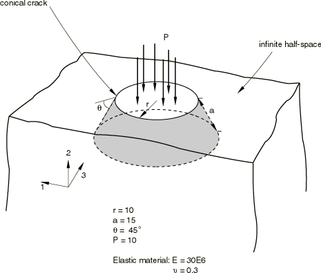

**图 1.4.2–2** 案例 1：轴对称几何分区。


**图 1.4.2–3** 案例 1：完整轴对称网格。

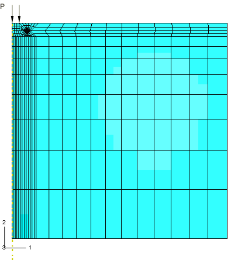

**图 1.4.2–4** 案例 2：完整三维网格。

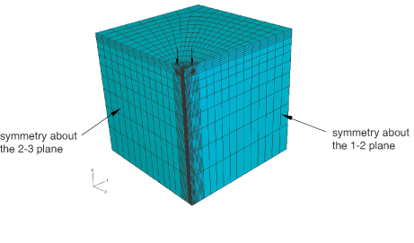

**图 1.4.2–5** 案例 2：分区的完整三维模型。

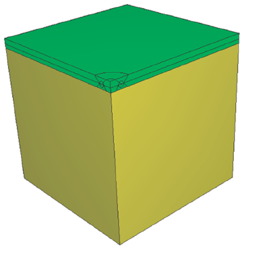

**图 1.4.2–6** 案例 2：裂纹线周围的分区。较小的内环使用楔形单元进行扫掠网格划分。外环使用六面体单元和结构化网格技术进行网格划分。锥形分区也可见。

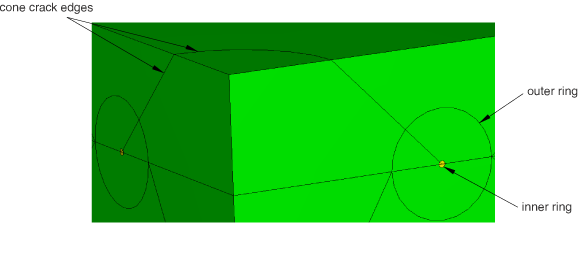

**图 1.4.2–7** 案例 2：锥体的缝隙裂纹面。

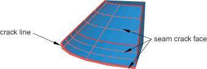

**图 1.4.2–8** 案例 2：在孤岛网格上沿整个裂纹线定义的 *q* 向量。

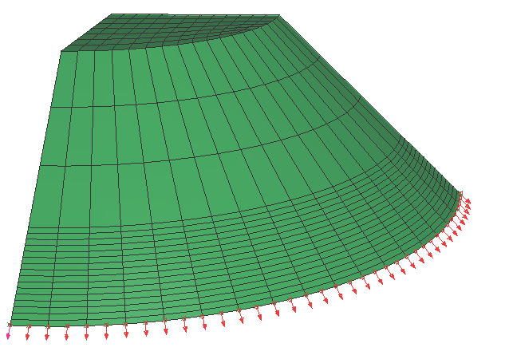

**图 1.4.2–9** 案例 2：结果三维位移形状。

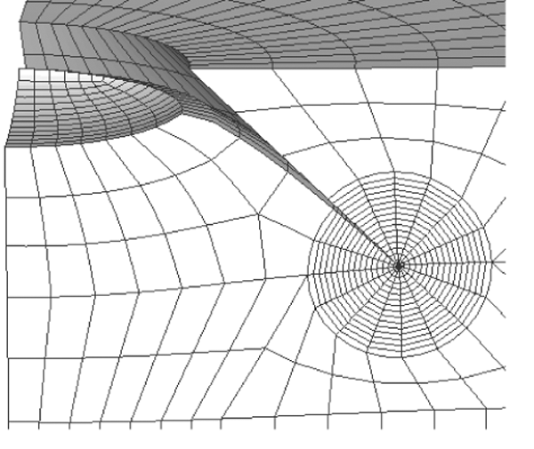

**图 1.4.2–10** 案例 3：轴对称全局和子模型网格围绕裂纹线。

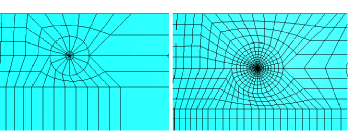

**图 1.4.2–11** 案例 4：完整三维全局模型和子模型网格围绕裂纹线。

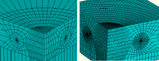

**图 1.4.2–12** 案例 5：使用无限元的轴对称全局模型和子模型网格。

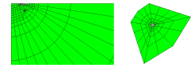

**图 1.4.2–13** 案例 6：带无限元的三维全局模型和子模型网格。

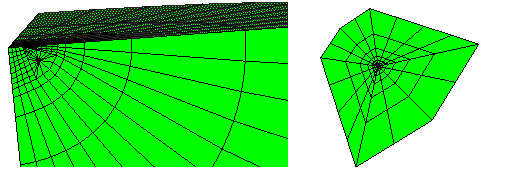

**图 1.4.2–14** 案例 4：基于表面子模型应力解决方案的不足（左侧）和充分（右侧）全局和子模型设计的比较。

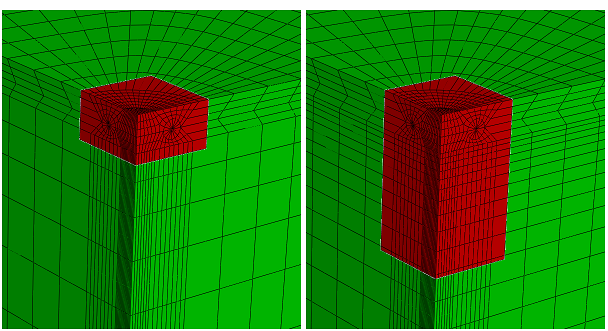

**图 1.4.2–15** 案例 4：全局模型和子模型之间应力一致性的确认。

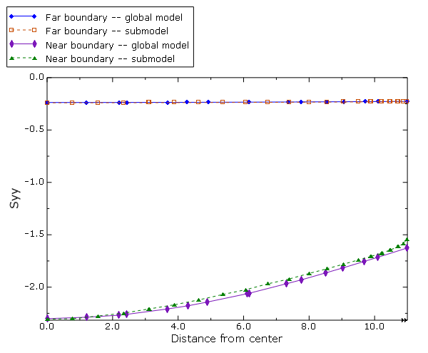


