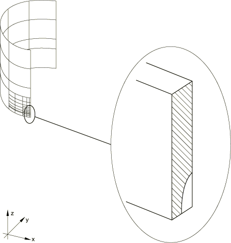
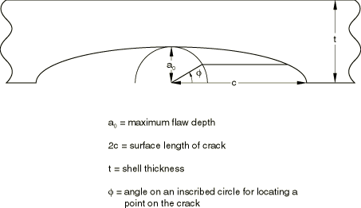
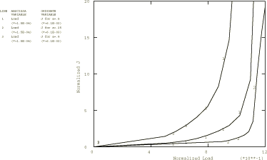
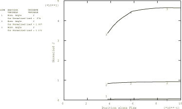
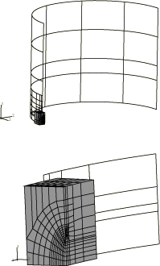
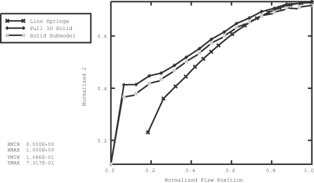

# 1.4.3 带部分贯穿轴向裂纹的有限长圆柱的弹塑性线弹簧建模

**产品：** Abaqus/Standard

Abaqus 中的弹塑性线弹簧单元旨在为涉及壳体结构中部分贯穿表面裂纹的问题提供经济高效的解决方案，这些壳体结构主要承受 I 型膜和弯曲组合载荷，且需要考虑非弹性变形的影响。本示例说明了这些单元的使用。所考虑的情况是一个长圆柱，内表面有轴向裂纹，承受内压。取自 Parks 和 White (1982) 的论文。

当线弹簧单元模型达到理论极限时，利用壳体-实体子模型技术来提供准确的  积分结果。能量域积分用于评估此案例的 *J* 积分。

### 几何与模型

圆柱内半径为 254 mm (10 in)，壁厚为 25.4 mm (1 in)，假设非常长。网格如图 [Figure 1.4.3--1](ch01s04aex53.md#sxmcylflaw-model) 所示。通过使用多点约束（MPC）在裂纹周围进行细化。对称四分之一模型有 70 个 S8R 型壳单元，裂纹上有 8 个对称线弹簧单元（类型 LS3S）。网格取自 Parks 和 White，他们建议此网格对于作为分析主要目标的断裂参数（*J* 积分值）已足够收敛。未进行独立的网格研究。使用 MPC 细化减缩积分壳单元（如 S8R）的网格在这种相对较厚的壳中通常令人满意。但是，对于薄壳不建议这样做，因为它会在较细网格区域引入 "锁定" 响应的约束。在薄壳情况下，较细网格必须远离高应变梯度区域进行。

研究三种不同的缺陷。所有都具有如图 [Figure 1.4.3--2](ch01s04aex53.md#sxmcylflaw-schematic) 所示的半椭圆几何，在所有情况下，a/t = 0.5。三种缺陷的 a/t 比为 0.25（浅裂纹）、0.5 和 0.8（深裂纹）。在所有情况下，圆柱轴向长度取为裂纹半长度的 14 倍，c：假设这足以近似无限长度。

还提供了一个输入数据文件用于情况 a/t = 0.5，不假设关于 θ = 0° 的对称性。此网格使用 LS6 线弹簧单元，用于检查 LS6 单元的弹塑性能力。结果与使用 LS3S 单元和关于 θ = 0° 对称的相应网格相同。LS6 单元的公式假定塑性主要由缺陷周围的 I 型变形引起，忽略缺陷周围 II 型和 III 型变形的影响。在全局网格中，在缺陷深度为零的缺陷末端节点处，y 方向的位移被约束为零。为了在 using LS6 单元的网格中复制此约束，缺陷末端（缺陷深度 = 0）的两个节点被约束为具有相同的位移。

### 材料

圆柱假定由弹塑性金属制成，弹性模量为 206.8 GPa (30 × 10^6 lb/in²)，泊松比为 0.3，初始屈服应力为 482.5 MPa (70000 lb/in²)，并具有恒定加工硬化至 10% 塑性应变时的极限应力 689.4 MPa (105 lb/in²)，在更高应变时为完全塑性行为。

### 载荷

载荷由施加于所有壳单元的均匀内压组成，边缘载荷施加于圆柱远端，以提供对应于闭端条件的轴向应力。即使缺陷位于圆柱内表面，压力也不会施加在暴露的裂纹面上。由于 Abaqus 中线弹簧单元缺陷表面的压力载荷使用线性叠加实现，因此当存在非线性时施加这些载荷没有理论依据。我们假设这对这个问题的结果影响不大。为与线弹簧单元模型保持一致，压力载荷不施加于壳体-实体子模型的裂纹面。

### 结果与讨论

线弹簧单元直接提供 *J* 积分值。[Figure 1.4.3--3](ch01s04aex53.md#sxmcylflaw-j-press) 显示了三种缺陷在裂纹中心处作为施加压力函数的  积分值。在输入数据中，最大时间增量大小受到限制，以便获得足够平滑的曲线。[Figure 1.4.3--4](ch01s04aex53.md#sxmcylflaw-j-posit) 显示了在几个不同压力水平下半厚度裂纹（a/t = 0.5）的  积分值沿裂纹的变化（使用归一化压力 pR_m/t，其中 R_m 是圆柱的平均半径）。这些结果都与 Parks 和 White (1982) 报告的结果非常一致，作者指出这些结果也被其他工作确认。在 φ < 30° 区域，结果不准确有两个原因。首先，缺陷深度在该区域变化非常快，这使得线弹簧近似相当不准确。其次，σ 的大小与 pR_m/t 的量级相同，但线弹簧塑性模型仅在 σ >> pR_m/t 时有效。裂纹中心附近（φ > 30°）的结果比裂纹末端的结果更准确，因为在该区域缺陷深度随位置变化较慢，且 σ 远大于 pR_m/t。因此，在 [Figure 1.4.3--4](ch01s04aex53.md#sxmcylflaw-j-posit) 中仅显示 φ > 30° 的 *J* 值。

### 裂纹尖端的壳体-实体子模型

提供了一个输入文件用于情况 a/t = 0.25，使用壳体-实体子模型功能。此 C3D20R 单元网格允许用户使用 *J* 积分的能量域积分公式研究局部裂纹区域。子模型使用围绕裂纹尖端的四排单元的聚焦网格。在裂纹尖端采用 1/r 奇异性，这是完全发展塑性解的正确奇异性。在子模型网格的两个边缘上施加对称边界条件，而从全局壳体分析得到的结果通过子模型技术插值到两个表面。全局壳体网格给出令人满意的 *J* 积分结果；因此，我们假设子模型边界处的位移足够准确以驱动子模型中的变形。尚未研究使子模型区域更大或更小的效果。子模型叠加在全局壳体模型上如图 [Figure 1.4.3--5](ch01s04aex53.md#sxmcylflaw-solid-shell) 所示。

此外，提供了一个输入文件用于情况 a/t = 0.25，它由一个完整的三维 C3D20R 实体单元模型组成，用作参考解决方案。此模型具有与子模型网格相同的一般特征。有关此网格的更多详细信息，请参阅 inelasticlinespring_c3d20r_ful.inp。使用壳单元与连续单元执行此分析之间存在一个重要差异。压力载荷施加于壳单元的中面，而连续单元则准确地沿圆柱内表面施加压力。对于此分析，此差异导致线弹簧壳单元分析的 *J* 积分值比完整三维实体单元模型高约 10%。

将子模型分析的 *J* 积分值沿裂纹的变化与 LS3S 线弹簧单元分析和完整实体单元网格进行比较，归一化压力载荷为 p/σ_y = 0.898，其中 R_m 是圆柱的平均半径。如 [Figure 1.4.3--6](ch01s04aex53.md#sxmcylflaw-j-posit-2) 所示，由于前述原因，线弹簧单元低估了 φ < 50° 的  积分值。注意，在 φ = 0° 处，由于圆柱表面缺乏裂纹尖端约束，*J* 积分应为零。需要更精细的网格来正确模拟此现象。显然，需要使用壳体-实体子模型来增强线弹簧单元模型分析，以获得圆柱表面附近准确的  积分值。

### 输入文件

[inelasticlinespring_05.inp](../eif/inelasticlinespring_05.inp)

a/t = 0.5。

[inelasticlinespring_05_nosym.inp](../eif/inelasticlinespring_05_nosym.inp)

a/t = 0.5，不假设关于 θ = 0° 的对称性，使用 LS6 型线弹簧单元。

[inelasticlinespring_progcrack.f](../eif/inelasticlinespring_progcrack.f)

用于创建沿裂纹位置给出缺陷深度数据文件的程序。

[inelasticlinespring_025.inp](../eif/inelasticlinespring_025.inp)

浅裂纹情况，a/t = 0.25。

[inelasticlinespring_08.inp](../eif/inelasticlinespring_08.inp)

深裂纹情况，a/t = 0.8。

[inelasticlinespring_c3d20r_sub.inp](../eif/inelasticlinespring_c3d20r_sub.inp)

C3D20R (a/t = 0.25) 子模型。

[inelasticlinespring_c3d20r_ful.inp](../eif/inelasticlinespring_c3d20r_ful.inp)

C3D20R (a/t = 0.25) 完整模型。

### 参考文献

Parks, D. M., and C. S. White, "Elastic-Plastic Line-Spring Finite Elements for Surface-Cracked Plates and Shells," Transactions of the ASME, Journal of Pressure Vessel Technology, vol. 104, pp. 287–292, November 1982.

### 图表

**图 1.4.3–1** 带轴向缺陷的压力圆柱有限元模型。

**图 1.4.3–2** 半椭圆表面裂纹示意图。

**图 1.4.3–3** 归一化 *J* 积分值 J/σ_y²t² 与归一化施加压力 p/σ_y，其中 R_m 是圆柱的平均半径。

**图 1.4.3–4** 对于 a/t = 0.5，归一化 *J* 积分值 J/σ_y²t² 与沿缺陷表面位置 φ 的关系，归一化施加压力 pR_m/t = 0.574、1.097 和 1.172。R_m 是圆柱的平均半径。

**图 1.4.3–5** 实体子模型叠加在壳体全局模型上。

**图 1.4.3–6** 对于 a/t = 0.25 和归一化压力 p/σ_y = 0.898，归一化 *J* 积分值 J/σ_y²t² 与沿缺陷表面位置 φ 的关系。R_m 是圆柱的平均半径。

