# 1.4.3 Elastic-plastic line spring modeling of a finite length cylinder with a part-through axial flaw

**Product: **Abaqus/Standard  

The elastic-plastic line spring elements in Abaqus are intended to provide inexpensive solutions for problems involving part-through surface cracks in shell structures loaded predominantly in Mode I by combined membrane and bending action in cases where it is important to include the effects of inelastic deformation. This example illustrates the use of these elements. The case considered is a long cylinder with an axial flaw in its inside surface, subjected to internal pressure. It is taken from the paper by Parks and White (1982).

When the line spring element model reaches theoretical limitations, the shell-to-solid submodeling technique is utilized to provide accurate -integral results. The energy domain integral is used to evaluate the *J*-integral for this case.

### Geometry and model

The cylinder has an inside radius of 254 mm (10 in), wall thickness of 25.4 mm (1 in), and is assumed to be very long. The mesh is shown in [Figure 1.4.3--1](ch01s04aex53.md#sxmcylflaw-model). It is refined around the crack by using multi-point constraints (MPCs). There are 70 shell elements of type S8R in the symmetric quarter-model and eight symmetric line spring elements (type LS3S) along the crack. The mesh is taken from Parks and White, who suggest that this mesh is adequately convergent with respect to the fracture parameters (*J*-integral values) that are the primary objective of the analysis. No independent mesh studies have been done. The use of MPCs to refine a mesh of reduced integration shell elements (such as S8R) is generally satisfactory in relatively thick shells as in this case. However, it is not recommended for thin shells because it introduces constraints that “lock” the response in the finer mesh regions. In a thin shell case the finer mesh would have to be carried out well away from the region of high strain gradients.

Three different flaws are studied. All have the semi-elliptic geometry shown in [Figure 1.4.3--2](ch01s04aex53.md#sxmcylflaw-schematic), with, in all cases, 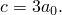 The three flaws have 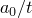 ratios of 0.25 (a shallow crack), 0.5, and 0.8 (a deep crack). In all cases the axial length of the cylinder is taken as 14 times the crack half-length, : this is assumed to be sufficient to approximate the infinite length.

An input data file for the case 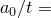.5 without making the symmetry assumption about 0 is also included. This mesh uses the LS6 line spring elements and serves to check the elastic-plastic capability of the LS6 elements. The results are the same as for the corresponding mesh using LS3S elements and symmetry about 0. The formulation of the LS6 elements assumes that the plasticity is predominately due to Mode I deformation around the flaw and neglects the effect of the Mode II and Mode III deformation around the flaw. In the global mesh the displacement in the -direction is constrained to be zero at the node at the end of the flaw where the flaw depth goes to zero. To duplicate this constraint in the mesh using LS6 elements, the two nodes at the end of the flaw (flaw depth = 0) are constrained to have the same displacements.

### Material

The cylinder is assumed to be made of an elastic-plastic metal, with a Young's modulus of 206.8 GPa (30  106 lb/in2), a Poisson's ratio of 0.3, an initial yield stress of 482.5 MPa (70000 lb/in2, and constant work hardening to an ultimate stress of 689.4 MPa (105 lb/in2) at 10% plastic strain, with perfectly plastic behavior at higher strains.

### Loading

The loading consists of uniform internal pressure applied to all of the shell elements, with edge loads applied to the far end of the cylinder to provide the axial stress corresponding to a closed-end condition. Even though the flaw is on the inside surface of the cylinder, the pressure is not applied on the exposed crack face. Since pressure loads on the flaw surface of line spring elements are implemented using linear superposition in Abaqus, there is no theoretical basis for applying these loads when nonlinearities are present. We assume that this is not a large effect in this problem. For consistency with the line spring element models, pressure loading of the crack face is not applied to the shell-to-solid submodel.

### Results and discussion

The line spring elements provide *J*-integral values directly. [Figure 1.4.3--3](ch01s04aex53.md#sxmcylflaw-j-press) shows the -integral values at the center of the crack as functions of applied pressure for the three flaws. In the input data the maximum time increment size has been limited so that adequately smooth graphs can be obtained. [Figure 1.4.3--4](ch01s04aex53.md#sxmcylflaw-j-posit) shows the variations of the -integral values along the crack for the half-thickness crack (0.5), at several different pressure levels (a normalized pressure, 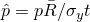, is used, where 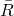 is the mean radius of the cylinder). These results all agree closely with those reported by Parks and White (1982), where the authors state that these results are also confirmed by other work. In the region 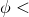30 the results are inaccurate for two reasons. First, the depth of the flaw is changing very rapidly in this region, which makes the line spring approximation quite inaccurate. Second,  is of the same order of magnitude as , but the line spring plasticity model is only valid when 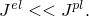 The results toward the center of the crack (30) are more accurate than those at the ends of the crack since the flaw depth changes less rapidly with position in this region and  is much larger than 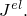 For this reason only *J* values for 30 are shown in [Figure 1.4.3--4](ch01s04aex53.md#sxmcylflaw-j-posit).

### Shell-to-solid submodeling around the crack tip

An input file for the case 0.25, which uses the shell-to-solid submodeling capability, is included. This C3D20R element mesh allows the user to study the local crack area using the energy domain integral formulation for the -integral. The submodel uses a focused mesh with four rows of elements around the crack tip. A 1/*r* singularity is utilized at the crack tip, the correct singularity for a fully developed perfectly plastic solution. Symmetry boundary conditions are imposed on two edges of the submodel mesh, while results from the global shell analysis are interpolated to two surfaces via the submodeling technique. The global shell mesh gives satisfactory *J*-integral results; hence, we assume that the displacements at the submodel boundary are sufficiently accurate to drive the deformation in the submodel. No attempt has been made to study the effect of making the submodel region larger or smaller. The submodel is shown superimposed on the global shell model in [Figure 1.4.3--5](ch01s04aex53.md#sxmcylflaw-solid-shell).

In addition, an input file for the case 0.25, which consists of a full three-dimensional C3D20R solid element model, is included for use as a reference solution. This model has the same general characteristics as the submodel mesh. See [inelasticlinespring_c3d20r_ful.inp](../eif/inelasticlinespring_c3d20r_ful.inp) for further details about this mesh. One important difference exists in performing this analysis with shell elements as opposed to continuum elements. The pressure loading is applied to the midsurface of the shell elements as opposed to the continuum elements, where the pressure is accurately applied along the inside surface of the cylinder. For this analysis this discrepancy results in about 10% higher *J*-integral values for the line spring shell element analysis as compared to the full three-dimensional solid element model.

Results from the submodeled analyses are compared to the LS3S line spring element analysis and full solid element mesh for variations of the *J*-integral values along the crack at the a normalized pressure loading of 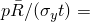 0.898, where  is the mean radius of the cylinder. As seen in [Figure 1.4.3--6](ch01s04aex53.md#sxmcylflaw-j-posit-2), the line spring elements underestimate the -integral values for 50 for reasons described previously. Note that at 0 the *J*-integral should be zero due to the lack of crack-tip constraint at the cylinder surface. A more refined mesh would be required to model this phenomenon properly. It is quite obvious that the use of shell-to-solid submodeling is required to augment a line spring element model analysis to obtain accurate -integral values near the surface of the cylinder.

### Input files

[inelasticlinespring_05.inp](../eif/inelasticlinespring_05.inp)

 0.5.

[inelasticlinespring_05_nosym.inp](../eif/inelasticlinespring_05_nosym.inp)

 0.5 without the symmetry assumption across 0, using line spring element type LS6.

[inelasticlinespring_progcrack.f](../eif/inelasticlinespring_progcrack.f)

A program used to create a data file giving the flaw depths as a function of position along the crack.

[inelasticlinespring_025.inp](../eif/inelasticlinespring_025.inp)

Shallow crack case, 0.25.

[inelasticlinespring_08.inp](../eif/inelasticlinespring_08.inp)

Deep crack case, 0.8.

[inelasticlinespring_c3d20r_sub.inp](../eif/inelasticlinespring_c3d20r_sub.inp)

C3D20R (0.25) submodel.

[inelasticlinespring_c3d20r_ful.inp](../eif/inelasticlinespring_c3d20r_ful.inp)

C3D20R (0.25) full model.

### Reference

Parks, D. M., and C. S. White, “Elastic-Plastic Line-Spring Finite Elements for Surface-Cracked Plates and Shells,” Transactions of the ASME, Journal of Pressure Vessel Technology, vol. 104, pp. 287–292, November 1982.

### Figures

**Figure 1.4.3–1** Finite element model for an axial flaw in a pressurized cylinder.

**Figure 1.4.3–2** Schematic of a semi-elliptical surface crack.

**Figure 1.4.3–3** Normalized *J*-integral values 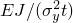 versus normalized applied pressure 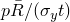, where  is the mean radius of the cylinder.

**Figure 1.4.3–4** Normalized *J*-integral values  versus position along the flaw surface given by 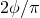, for 0.5, and normalized applied pressures = .574, 1.097, and 1.172.  is the mean radius of the cylinder.

**Figure 1.4.3–5** Solid submodel superimposed on shell global model.

**Figure 1.4.3–6** Normalized *J*-integral values  versus position along the flaw surface given by  for 0.25 and at the normalized pressure. 0.898.  is the mean radius of the cylinder.

