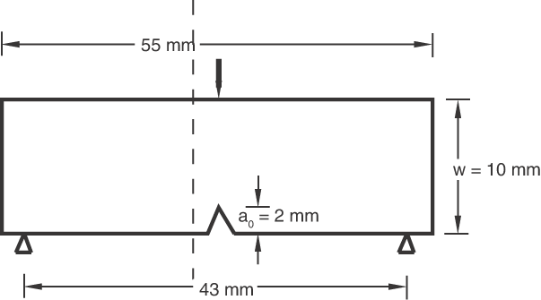
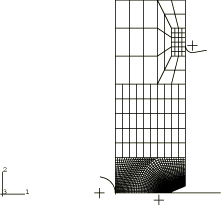
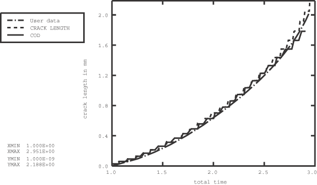
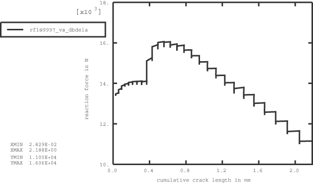
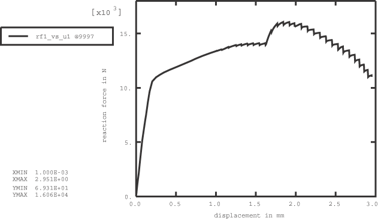
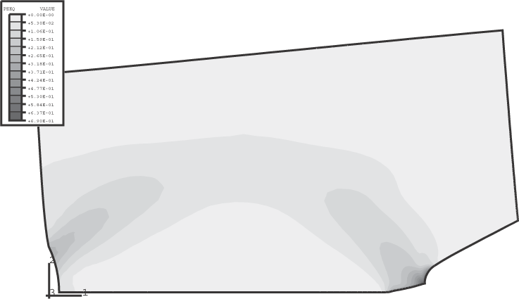
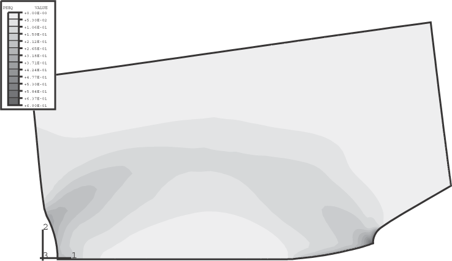
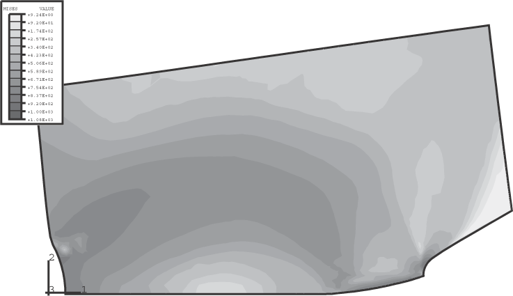

# 1.4.4 Crack growth in a three-point bend specimen

**Product: **Abaqus/Standard  

This example illustrates the modeling of crack length versus time to simulate crack propagation and the use of crack opening displacement as a crack propagation criterion. For stable crack growth in ductile materials, experimental evidence indicates that the value of the crack opening displacement (COD) at a specified distance behind the crack tip associated with ongoing crack extension is usually a constant. Abaqus provides the critical crack opening displacement, at a specified distance behind the crack tip, as a crack propagation criterion. The other crack propagation model used in this example—prescribed crack length versus time—is usually used to verify the results obtained from experiments. Abaqus also provides the critical stress criterion for crack propagation in brittle materials.

In this example an edge crack in a three-point bend specimen is allowed to grow based on the crack opening displacement criterion. Crack propagation is first modeled by giving the crack length as a function of time. The data for the crack length are taken from Kunecke, Klingbeil, and Schicker (1993). The data for the crack propagation analysis using the COD criterion are taken from the first analysis. This example demonstrates how the COD criterion can be used in stable crack growth analysis.

### Problem description

An edge crack in a three-point bend specimen in plane strain, subjected to Mode I loading, is considered (see [Figure 1.4.4--1](ch01s04aex54.md#sxmcrackgrowth-geom)). The crack length to specimen width ratio is 0.2. The length of the specimen is 55 mm, and its width is 10 mm. The specimen is subjected to bending loads such that initially a well-contained plastic zone develops for the stationary crack. Subsequently, the crack is allowed to grow.

### Geometry and model

Due to symmetry only one-half of the specimen is analyzed. The crack tip is modeled as initially blunted so that finite deformation effects near the crack tip can be taken into account (geometric nonlinearities considered in the step). The mesh is composed of 1737 CPE4 elements ([Figure 1.4.4--2](ch01s04aex54.md#sxmcrackgrowth-mesh)). A reasonably fine mesh, necessary to obtain a smooth load versus crack length relation, is used to model the area in which the plastic zone grows and crack propagation occurs. The loading point and the support points for the specimen are simulated by analytical rigid surfaces, as shown in [Figure 1.4.4--2](ch01s04aex54.md#sxmcrackgrowth-mesh).

### Material

The material is assumed to be elastic-plastic, with a Young's modulus of  200 GPa and Poisson's ratio of 0.3. The plastic work hardening data are given in [Table 1.4.4--1](ch01s04aex54.md#table-crackgrowth-strss-strain).

### Loading and solution control

The analysis is carried out in two stages. The first stage consists of pushing the rigid surface 1.0 mm into the specimen. No crack growth is specified during this stage.

In the second stage the crack is allowed to propagate while the rigid surface is moved an additional 1.951 mm.

Once a crack-tip node debonds, the traction at the tip is initially carried as a reaction force at that node. This force is ramped down to zero according to the amplitude curve specified in the crack propagation analysis. The manner in which the forces at the debonded nodes are ramped down greatly influences the convergence of the solution. The convergence of the solution is also affected by reversals in plastic flow due to crack propagation. In such circumstances, very small time increments are required to continue the analysis. In the present analysis solution controls are defined on the displacement field and on the warping degree of freedom equilibrium equations to relax the tolerances so that more rapid convergence is achieved. Because of the localized nature of the nonlinearity in this problem, the resulting loss of accuracy is not significant. The definition of solution controls is generally not recommended.

#### Crack length versus time

In the case when the crack length is given as a function of time, the second step in the analysis consists of letting the crack grow according to a prescribed crack length versus time relationship, using the data taken from Kunecke, Klingbeil, and Schicker.

#### COD criterion

The loading of the specimen and the specification of the COD criterion for crack growth demonstrates the flexibility of the critical crack opening displacement criterion. Frequently, the crack opening displacement is measured at the mouth of the crack tip: this is called the crack mouth opening displacement (CMOD). The crack opening displacement can also be measured at the position where the initial crack tip was located. Alternatively, the crack-tip opening angle (CTOA), defined as the angle between the two surfaces at the tip of the crack, is measured. The crack-tip opening angle can be easily reinterpreted as the crack opening at a distance behind the crack tip. In this example the COD specification required to use both the CMOD and the CTOA criteria is demonstrated.

For the purposes of demonstration the crack opening displacement at the mouth of the crack is used as the initial debond criterion. The first three nodes along the crack propagation surface are allowed to debond when the crack opening displacement at the mouth of the crack reaches a critical value. To achieve this, the following loading sequence is adopted: in Step 1, the specimen is loaded to a particular value (crack propagation analysis is not used), and in Step 2 the first crack-tip node is allowed to debond (crack propagation analysis is used). Steps 3 and 4 and Steps 5 and 6 follow the same sequence as Steps 1 and 2 so that the two successive nodes can debond. Since, the crack opening displacement is measured at the mouth of the crack, the value of the distance behind the crack tip along the slave surface is different in Steps 2, 4, and 6.

The loading sequence adopted above outlines a way in which the CMOD measurements can be simulated without encountering the situation in which the COD is measured beyond the bound of the specimen, which would lead to an error message. In this example, the loads at which the crack-tip nodes debonded were known *a priori*. In general, such information may not be available, and the restart capabilities in Abaqus can be used to determine the load at which the fracture criterion is satisfied.

The remaining bonded nodes along the crack propagation surface are allowed to debond based on averaged values of the crack-tip opening angles for different accumulated crack lengths. The data prescribed under the crack propagation criteria in Step 7 are the crack opening displacement values that were computed from the crack-tip opening angles observed in the analysis that uses the prescribed crack length versus time criterion. These crack-tip opening angles are converted to critical crack opening displacements at a fixed distance of 0.04 mm behind the crack tip. Hence, the crack opening displacement is measured very close to the current crack tip.

### Results and discussion

[Figure 1.4.4--3](ch01s04aex54.md#sxmcrackgrowth-lth-time) shows a plot of the accumulated incremental crack length versus time. The user-specified data, as well as the results obtained from the finite element analysis based on the two criteria, are plotted. Good agreement is observed between the user input values and the results from the analysis. The curve based on the COD criterion does not correspond with the user-specified data toward the end of the analysis because an average crack opening displacement was assumed.

[Figure 1.4.4--4](ch01s04aex54.md#sxmcrackgrowth-force-lth) shows the reaction force at the node where the displacements are applied as a function of the accumulated incremental crack length, obtained from the analysis in which the crack length was specified as a function of time. The curve obtained when the COD criterion is used is almost identical and is not shown in this figure.

[Figure 1.4.4--5](ch01s04aex54.md#sxmcrackgrowth-force-disp) depicts the variation of the reaction force as a function of the displacement at the rigid body reference node.

The contours of equivalent plastic strain in the near crack-tip region for two different crack advance positions are shown in [Figure 1.4.4--6](ch01s04aex54.md#sxmcrackgrowth-plastzone1) and [Figure 1.4.4--7](ch01s04aex54.md#sxmcrackgrowth-plastzone2). Contours of the Mises equivalent stress at the final stage of the analysis are shown in [Figure 1.4.4--8](ch01s04aex54.md#sxmcrackgrowth-mises).

### Input files

[crackgrowth_lengthvtime.inp](../eif/crackgrowth_lengthvtime.inp)

Analysis with the crack length versus time criterion.

[crackgrowth_cod.inp](../eif/crackgrowth_cod.inp)

Analysis with the COD criterion.

[crackgrowth_model.inp](../eif/crackgrowth_model.inp)

Model data for the two analysis files.

### Reference

G. Kunecke, D. Klingbeil, and J. Schicker, “Rifortschrittssimulation mit der ABAQUS-option DEBOND am Beispiel einer statisch belasteten Kerbschlagbiegeprobe,” presented at the ABAQUS German Fracture Mechanics group meeting in Stuttgart, November 1993.

### Table

**Table 1.4.4–1** Stress-strain data for isotropic plastic behavior.
| True Stress (MPa) | True Strain |
| --- | --- |
| 461.000 | 0.0 |
| 472.810 | 0.0187 |
| 521.390 | 0.0280 |
| 628.960 | 0.0590 |
| 736.306 | 0.1245 |
| 837.413 | 0.2970 |
| 905.831 | 0.5756 |
| 1208.000 | 1.9942 |

### Figures

**Figure 1.4.4–1** Schematic of the three-point bend specimen.

**Figure 1.4.4–2** Finite element mesh for the three-point bend specimen.

**Figure 1.4.4–3** Accumulated incremental crack length versus time.

**Figure 1.4.4–4** Variation of the reaction force as a function of the cumulative crack length.

**Figure 1.4.4–5** Variation of the reaction force as a function of displacement.

**Figure 1.4.4–6** Plastic zone for an accumulated crack length of 1.03 mm.

**Figure 1.4.4–7** Plastic zone for an accumulated crack length of 2.18 mm.

**Figure 1.4.4–8** Contours of Mises stress for an accumulated crack length of 2.18 mm.

