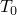
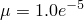
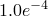
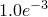
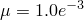
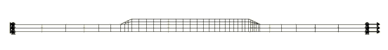
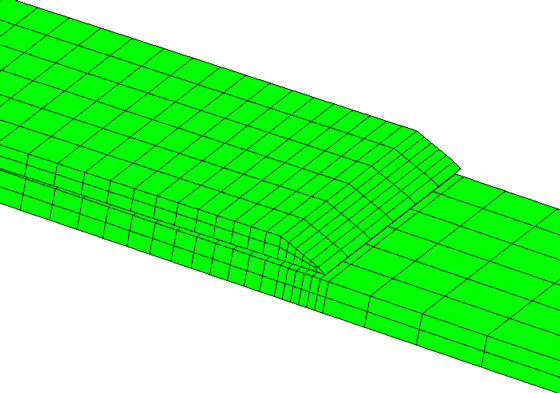
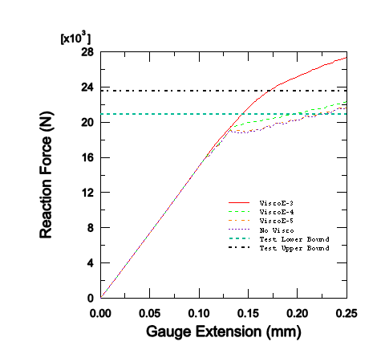

# 1.4.5 Analysis of skin-stiffener debonding under tension

**Product: **Abaqus/Standard  

This example illustrates the application of cohesive elements in Abaqus to predict the initiation and progression of debonding at the skin-stiffener interface in stiffened panels, which is a common failure mode for this type of structure. The particular problem considered here is described in Davila (2003); it consists of a stringer flange bonded onto a skin, originally developed by Krueger (2000). The results presented are compared against the experimental results presented in Davila (2003). The problem is analyzed in Abaqus/Standard using a damaged, linear elastic constitutive model for the skin/stiffener interface.

### Geometry and model

The problem geometry and loading are depicted in [Figure 1.4.5--1](ch01s04aex55.md#exa-skinflangedebond-model): a 203-mm-long and 25.4-mm-wide specimen with a total skin thickness of 2.632 mm and maximum flange thickness of 1.88 mm, loaded in tension along the length direction. For the model in which the loading is simulated through prescribed displacements, the free gauge length is 127 mm. The skin thickness direction is comprised of 14 composite plies; while the flange is made up of 10 plies, each having a uniform thickness of 0.188 mm. 

The finite element mesh for the three-dimensional model of the debonding problem is identical to that used in Davila (2003) except that the “decohesion” elements utilized in that reference to represent the skin/flange interface are replaced with Abaqus cohesive elements. Both the skin and the flange are modeled by two layers each of C3D8I elements. The interface between them is represented by COH3D8 elements, with the cohesive element mesh sharing nodes with the matching C3D8I meshes of the flange and the skin on either side. The model has a total of 828 solid elements and 174 cohesive elements. As stated in Davila, the two tapered ends of the flange are discretized differently to eliminate model symmetry and to prevent simultaneous delamination from occurring at both ends. The analysis includes a thermal loading step prior to the mechanical loading to simulate the residual stresses in the specimen due to a difference of 157C between the curing temperature and room temperature. The temperature difference causes residual stresses at the skin/flange interface due to the fact that the thermal expansion coefficients of both the skin and flange material are orthotropic (even though they are specified to be the same) and the ply layups in the skin and flange are different.

### Material

The material data, as given in Davila (2003), are reproduced below.

Composite material properties:

| Engineering constants |
| --- |
|  | 144.7 GPa |
|  | 9.65 GPa |
|  | 9.65 GPa |
|  | 0.30 |
|  | 0.30 |
|  | 0.45 |
|  | 5.2 GPa |
|  | 5.2 GPa |
|  | 3.4 GPa |

The elastic properties of the interface material are defined using uncoupled traction-separation behavior (see ["Defining elasticity in terms of tractions and separations for cohesive elements" in "Linear elastic behavior," Section 22.2.1 of the Abaqus Analysis User's Guide](../usb/usb-link.md#usb-mat-clinearelastic-traction)), with stiffness values of *E*= 1.0  106 MPa, =  1.0  106 MPa, and = 1.0  106 MPa. The quadratic traction-interaction failure criterion is chosen for damage initiation in the cohesive elements; and a mixed-mode, energy-based damage evolution law based on the Benzeggagh-Kenane criterion is used for damage propagation. The relevant material data are as follows: =61 MPa, = 68 MPa, = 68 MPa, = 0.075 N/mm, = 0.547 N/mm, =  0.547 N/mm, and = 1.45.

### Results and discussion

The deformed geometry is given in [Figure 1.4.5--2](ch01s04aex55.md#exa-skinflangedebond-deformed), which clearly shows the flange separation from the skin. In [Figure 1.4.5--3](ch01s04aex55.md#exa-skinflangedebond-exp-comparison) the load-extension predictions are compared with the experimental data presented by Davila (2003). The initiation of delamination is marked by the sharp slope change of the curves. The results presented here are obtained using three different viscous regularizations; i.e., , , and . Higher viscosity provides better convergence but also affects the results more than lower viscosity. The results using  are close to the ones without viscosity, while the results using  agree best with the experimental results in terms of debonding initiation.

### Input file

[skinflangetension.inp](../eif/skinflangetension.inp)

Input data for the three-dimensional skin/flange delamination model.

### References

Davila,  C. G., and P. P. Camanho, “Analysis of the Effects of Residual Strains and Defects on Skin/Stiffener Debonding using Decohesion Elements,” SDM Conference, Norfolk, VA, April 7–10, 2003.

Krueger,  R., M. K. Cvitkovich, T. K. O'Brien, and P. J. Minguet, “Testing and Analysis of Composite Skin/Stringer Debonding under Multi-Axial Loading,” Journal of Composite Materials, vol. 34, no.15, pp. 1263–1300, 2000.

### Figures

**Figure 1.4.5–1** Model geometry for the skin/flange debond problem.

**Figure 1.4.5–2** Deformed geometry after skin/flange debond.

**Figure 1.4.5–3** Predicted and experimental debond loads.

