# 1.4.6 钝缺口纤维金属层合板的失效

**产品：** Abaqus/Standard  Abaqus/Explicit

纤维金属层合板（FML）由层压薄铝层与中间玻璃纤维增强环氧层粘合组成。与实心铝板相比，FML 由于其优越的性能（如高断裂韧性和低密度）而在航空航天工业中受到极大关注。

本示例模拟了承受准静态载荷条件的含钝缺口 FML 中的失效和损伤。内聚力单元用于模拟层间分层，Abaus 纤维增强材料的损伤模型用于预测纤维增强环氧层的性能。此外，纤维增强环氧层的性能也使用 Linde 等人 (2004) 提出的模型描述，该模型在用户子程序 [`UMAT`](../sub/sub-link.md#sub-xsl-umat) 中实现。当对纤维增强环氧层使用 Abaqus 内置损伤模型进行模拟时，使用 Abaqus/Standard 和 Abaqus/Explicit。这种类型的问题在航空航天工业中很重要，因为钝缺口（如紧固件孔）常见于飞机结构中；含钝缺口结构的强度是重要的设计参数。本示例中给出的模型演示了如何预测钝缺口强度、纤维增强环氧层内纤维和基体的失效模式，以及 FML 不同层之间的分层。

### 问题描述和材料特性

[Figure 1.4.6--1](ch01s04aex56.md#sxmdmgfml-geom) 显示了本示例含钝缺口层合板的几何。层合板沿纵向承受单轴张力。层合板由三层铝和两层 0/90 玻璃纤维增强环氧组成。只需要对层合板的 1/8 建模，施加适当的对称边界条件如图 [Figure 1.4.6--2](ch01s04aex56.md#sxmdmgfml-model) 所示。[Figure 1.4.6--2](ch01s04aex56.md#sxmdmgfml-model) 还显示了 1/8 模型的层厚铺设。

铝的材料性能假定为具有等向硬化的各向同性弹塑性。弹性模量为 73800 MPa，泊松比为 0.33；各向同性硬化数据如表 [Table 1.4.6--1](ch01s04aex56.md#table-dmgfml-matalum) 所示。

玻璃纤维增强环氧层的材料性能假定为各向异性，沿纤维方向刚度更大，基体中更软。弹性性能——纵向模量 ；横向模量 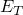；剪切模量 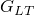 和 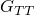；泊松比 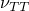 和 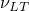——如表 [Table 1.4.6--2](ch01s04aex56.md#table-dmgfml-matepoxye) 所示。下标 "L" 指纵向（纤维方向），下标 "T" 指垂直于纤维方向的两个横向方向。损伤萌生和演化行为也假定为各向异性。[Table 1.4.6--3](ch01s04aex56.md#table-dmgfml-matepoxyd) 列出了纵向失效应力 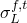 和 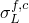；横向失效应力 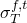 和 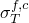；面内剪切失效应力 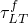 的极限值。上标 "t" 和 "c" 分别指张力和压缩。纤维和基体的断裂能假定为  = 12.5 N/mm 和 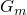 = 1.0 N/mm。

考虑使用上述参数的两个材料模型，如下：

1. 材料基于 Abaqus 中可用的纤维增强复合材料损伤内置模型建模（见 Abaqus Analysis User's Guide 的 "Damage and failure for fiber-reinforced composites: overview," Section 24.3.1）。
2. 材料使用基于 Linde 等人 (2004) 提出的模型的替代损伤模型建模。替代损伤模型在用户子程序 [`UMAT`](../sub/sub-link.md#sub-xsl-umat) 中实现，在本讨论中称为 [`UMAT`](../sub/sub-link.md#sub-xsl-umat) 模型。下面提供了 [`UMAT`](../sub/sub-link.md#sub-xsl-umat) 模型的详细信息。

用于粘合相邻层的粘合剂使用厚度为 t = 0.001 mm 的界面层建模。为了模拟层间分层，这些界面层使用内聚力单元建模。每个界面的初始弹性性能假定为各向同性，弹性模量 E = 2000 MPa，泊松比  = 0.33。界面层的失效应力假定为 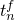 = 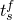 = 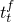 = 50 MPa；断裂能为  = 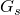 =  = 4.0 N/mm。下标 "n"、"s" 和 "t" 分别指法向和第一、第二剪切方向（关于粘合层使用的本构建模方法的进一步讨论，见 Abaqus Analysis User's Guide 的 "Defining the constitutive response of cohesive elements using a traction-separation description," Section 32.5.6）。

板以施加在右边缘的位移边界条件加载。为了简化后处理，位移载荷施加在参考点，并使用方程约束来约束右边缘和参考点之间沿加载方向的位移。除非那些专门设计用于研究加载方向对强度影响的文件，加载方向（沿全局 X 方向）与 0° 纤维增强环氧层的纤维方向一致。

### 纤维增强环氧层的 [`UMAT`](../sub/sub-link.md#sub-xsl-umat) 模型

对于纤维增强环氧层，考虑的主要模型基于 Abaqus/Standard 和 Abaqus/Explicit 中可用的纤维增强复合材料内置损伤模型。或者，在 Abaqus/Standard 中，纤维增强环氧中的损伤也使用 Linde 等人 (2004) 提出的模型模拟，该模型在用户子程序 [`UMAT`](../sub/sub-link.md#sub-xsl-umat) 中实现并在下面讨论。

在 [`UMAT`](../sub/sub-link.md#sub-xsl-umat) 模型中，损伤萌生准则用应变表示。与 Abaqus 中使用四个内部（损伤）变量的内置模型不同，[`UMAT`](../sub/sub-link.md#sub-xsl-umat) 模型使用两个损伤变量来描述纤维和基体中的损伤，不区分张力和压缩。虽然对于单调载荷（如本示例问题），两个模型的性能预期相似，但对于更复杂的载荷（例如先张力后压缩），获得的结果可能差异很大。对于 [`UMAT`](../sub/sub-link.md#sub-xsl-umat) 模型，如果材料承受足够大以导致部分或完全损伤的拉应力（对应于此损伤模式的损伤变量将大于零），材料的张力和压缩响应都将受到影响。然而，对于内置损伤模型，只有抗拉响应会降低，而材料的压缩响应不会受到影响。在许多情况下，后一种行为更适合模拟纤维增强复合材料。本节讨论 Linde 等人 (2004) 提出的损伤萌生和演化的控制方程，然后描述用户子程序 [`UMAT`](../sub/sub-link.md#sub-xsl-umat) 实现。

当满足以下准则时，纤维中的损伤开始：

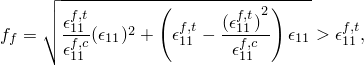

其中 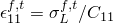、 和  是弹性矩阵在未损伤状态的组分。一旦满足上述准则，纤维损伤变量  根据以下方程演化：

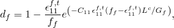

其中 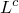 是与材料点相关的特征长度。类似地，基体中的损伤萌生由以下准则控制：

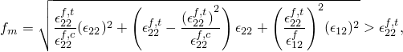

其中 、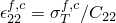 和 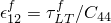。基体损伤变量 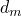 的演化定律为：

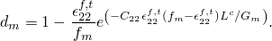

在渐进损伤期间，有效弹性矩阵由两个损伤变量  和  缩减，如下：

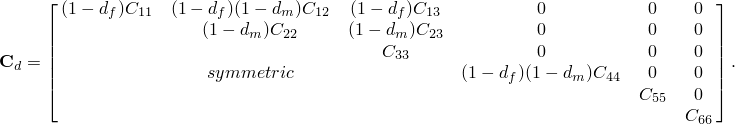

基于断裂能的损伤演化定律的使用以及在损伤演化定律中引入特征长度  有助于最小化数值结果的网格敏感性，这是具有应变软化响应的本构模型的常见问题。然而，由于特征长度计算仅基于单元几何，不考虑真实开裂方向，因此仍存在一定程度的网格敏感性。因此，建议使用纵横比接近一的单元（关于网格敏感性的讨论，见 Abaqus Analysis User's Guide 的 "Concrete damaged plasticity," Section 23.6.3）。

在用户子程序 [`UMAT`](../sub/sub-link.md#sub-xsl-umat) 中，应力根据以下方程更新：

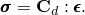

通过微分上述方程可以获得雅可比矩阵：

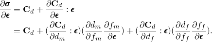

上述雅可比矩阵不是对称的；因此，当收敛速度慢时，建议使用非对称方程求解技术。

为了改善收敛，在用户子程序中实现了一种基于损伤变量粘性正则化（Duvaut-Lions 正则化的推广）的技术。在该技术中，我们不直接使用从上述损伤演化方程计算的损伤变量；而是通过以下方程对损伤变量进行 "正则化"：

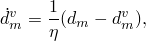

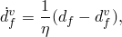

其中  和  是根据上述损伤演化定律计算的基体和纤维损伤变量，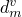 和 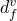 是在受损弹性矩阵和雅可比矩阵的真实计算中使用的 "正则化" 损伤变量， 是粘性参数，控制正则化损伤变量  和  接近真实损伤变量  和  的速率。

为了在时间 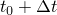 更新 "正则化" 损伤变量，上述方程在时间上离散如下：

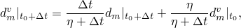

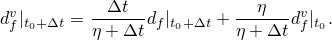

从上述表达式可以看出：

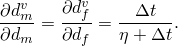

因此，雅可比矩阵可以进一步表述为：

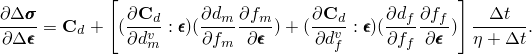

必须注意为  选择适当的值，因为大的粘性值可能导致刚度降低的明显延迟。为了估计粘性正则化的效果，通过在用户子程序 [`UMAT`](../sub/sub-link.md#sub-xsl-umat) 中更新变量 SCD 来增量积分与粘性正则化相关的近似能量：

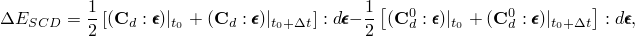

其中 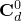 是使用损伤变量  和  计算的受损弹性矩阵；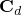 是使用正则化损伤变量  和  计算的受损弹性矩阵。为了避免粘性正则化导致不现实的结果，上述计算的能量（作为输出变量 ALLCD 可用）应该与系统中其他真实能量（如应变能 ALLSE）相比较小。

此用户子程序可与三维实体单元或具有平面应力公式的单元一起使用。在用户子程序中，纤维方向假定沿局部 1 材料方向。因此，当使用实体单元或使用壳单元且纤维方向不与全局 X 方向对齐时，应指定局部材料方向。损伤变量——、、 和 ——存储为解决方案依赖变量，可以在 Abaqus/CAE 的可视化模块中查看。

### 有限元模型

有限元模型对 [Figure 1.4.6--2](ch01s04aex56.md#sxmdmgfml-model) 所示的各层使用单独的网格：两层铝、两层纤维增强环氧和三层粘合剂层。虽然不是必需的，但可以使用类似的层合板平面有限元离散化（如图 [Figure 1.4.6--3](ch01s04aex56.md#sxmdmgfml-mesh) 所示）用于所有层。

#### 铝层建模考虑

由于与纤维增强环氧层的相互作用，铝层内（特别是缺口尖端周围）的应力状态不能使用平面应力假设近似。为了准确模拟这种三维塑性应力状态，必须对铝层使用实体单元。在 Abaqus/Standard 中使用不兼容模式单元（C3D8I），因为在缺口周围的后失效区域可能存在局部弯曲。对于 Abaqus/Explicit 分析，使用减缩积分单元（C3D8R）对铝层进行建模。

#### 玻璃纤维增强环氧层建模考虑

平面应力假设可以在纤维增强环氧层内安全使用；因此，这些层可以采用实体单元或壳单元。然而，必须准确表示层厚几何以真实地模拟粘合剂和纤维增强环氧之间的界面。这最方便地通过使用实体单元或连续壳单元而不是传统壳单元来实现。纤维增强材料的损伤模型仅适用于具有平面应力公式的单元。因此，连续壳单元与此模型一起使用。还提供了其中使用连续单元（C3D8R 或 C3D8）以及用户子程序 [`UMAT`](../sub/sub-link.md#sub-xsl-umat) 对纤维增强环氧层进行建模的模型。

#### 粘合剂层建模考虑

界面层使用内聚力单元（COH3D8）。弹性响应用法向和剪切组分之间未耦合的牵引-分离定律定义。为方便起见，使用 1.0 mm 的构造厚度，这样我们不需要区分分离位移和名义应变（NE）。然而，由于实际厚度为 0.001 mm，弹性矩阵中的对角项需要按实际厚度的倒数缩放，如下：

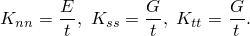

二次名义应变准则用于损伤萌生：

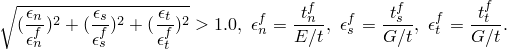

损伤演化基于混合模式行为的二次幂定律和指数软化行为（见 Abaqus Analysis User's Guide 的 "Defining the constitutive response of cohesive elements using a traction-separation description," Section 32.5.6）。

### 结果与讨论

以下各节讨论每个分析的结果。

#### Abaqus/Standard 结果

纤维增强环氧损伤在所考虑载荷的响应中起关键作用。[Figure 1.4.6--4](ch01s04aex56.md#sxmdmgfml-materialdisp) 显示了对于纤维增强环氧考虑的两个损伤模型，在 0° 加载方向下的载荷-位移曲线。响应在载荷能力突然丧失之前显示 "双线性" 形状；即，表示初始弹性区的初始线性曲线，表示局部塑性的光滑偏转非线性曲线，以及表示净截面屈服的第二线性曲线。使用 [`UMAT`](../sub/sub-link.md#sub-xsl-umat) 模型和 C3D8R、C3D8 和 SC8R 单元研究了单元类型的影响；结果总结在 [Figure 1.4.6--5](ch01s04aex56.md#sxmdmgfml-meshtypedisp) 和 [Table 1.4.6--5](ch01s04aex56.md#table-sxmdmgfml-notchstrength1) 中。使用不同单元类型和不同损伤模型获得的数值结果相似，与 De Vries (2001) 的实验结果表现出良好的一致性。

在失效载荷下 0° 纤维增强环氧层中的纤维和基体损伤模式分别如图 [Figure 1.4.6--6](ch01s04aex56.md#sxmdmgfmlfrm-zerodegdft) 和 [Figure 1.4.6--7](ch01s04aex56.md#sxmdmgfmlfrm-zerodegdmt) 所示，用于纤维增强材料内置损伤模型，以及如图 [Figure 1.4.6--8](ch01s04aex56.md#sxmdmgfml-zerodegdf) 和 [Figure 1.4.6--9](ch01s04aex56.md#sxmdmgfml-zerodegdm) 所示用于 [`UMAT`](../sub/sub-link.md#sub-xsl-umat) 模型。可以看出，0° 纤维增强环氧层中的纤维损伤沿钝缺口尖端上方的连接区域扩展（即垂直于加载方向）。[Figure 1.4.6--10](ch01s04aex56.md#sxmdmgfml-ninetydegdm) 显示了对于 Linde 等人 (2004) 的损伤模型，90° 层的基体损伤。在突然断裂之前，90° 纤维增强环氧层中没有纤维损伤。层间损伤在 0° 纤维增强环氧层和铝层之间最为严重。这些观察结果与 De Vries (2001) 的实验结果一致。

[Figure 1.4.6--11](ch01s04aex56.md#sxmdmgfmlfrm-viscositydisp) 和 [Table 1.4.6--4](ch01s04aex56.md#table-sxmdmgfmlfrm-notchstrength2) 给出了使用纤维增强材料内置损伤模型获得的不同粘性参数值  的载荷-位移结果。[`UMAT`](../sub/sub-link.md#sub-xsl-umat) 模型相同的结果给在 [Figure 1.4.6--12](ch01s04aex56.md#sxmdmgfml-viscositydisp) 和 [Table 1.4.6--6](ch01s04aex56.md#table-sxmdmgfml-notchstrength2)。粘性越小，失效越突然，失效强度越小。虽然 0.001 的粘性似乎高估了失效强度几个百分点（[Table 1.4.6--4](ch01s04aex56.md#table-sxmdmgfmlfrm-notchstrength2) 和 [Table 1.4.6--6](ch01s04aex56.md#table-sxmdmgfml-notchstrength2)），但收敛性明显改善；因此，在本示例的所有其他研究中使用的粘性为 0.001。对于纤维增强材料内置损伤模型，仅变化纤维方向的粘性，而基体方向的粘性保持在 0.005。这改善了收敛性，对结果没有显著影响。

使用三维单元 C3D8R 和 [`UMAT`](../sub/sub-link.md#sub-xsl-umat) 模型研究了加载方向对钝缺口强度的影响。进行了三次试验，其中 0/90 纤维增强环氧中的局部材料方向分别旋转 15°、30° 和 45°。例如，对于 15° 的加载角度，0° 纤维增强环氧层中的纤维方向相对于 X 方向为 15°，而 90° 纤维增强环氧层中的纤维方向相对于 X 方向为 75°（[Figure 1.4.6--13](ch01s04aex56.md#sxmdmgfml-loadingangle)）。从 [Figure 1.4.6--14](ch01s04aex56.md#sxmdmgfml-directiondisp) 可以看出，对于较大的加载角度，应变硬化较小。从 [Figure 1.4.6--15](ch01s04aex56.md#sxmdmgfml-strength) 可以看出，失效强度随加载角度的增加而降低，在 45° 加载角度达到最小值（对于更大的加载角度，响应预期相对于 45° 角大致对称，这是由于 0/90 纤维增强环氧层的对称性质）。如 De Vries (2001) 所述，这是预期的，反映了纤维增强环氧层较差的剪切性能。

在上述讨论中，净钝缺口强度定义为 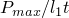，其中 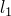 是缺口上方连接的长度，t 是层合板的总厚度。本示例表明，本研究中采用的方法可用于预测纤维金属层合板的钝缺口强度。

#### Abaqus/Explicit 结果

在 Abaqus/Explicit 模拟中，我们仅考虑沿 0° 铺层的载荷。模拟在不使用损伤稳定的情况下进行，也没有使用质量缩放。然而，为了减少计算时间，总载荷在短时间间隔（0.001 s）内施加。从显式动态模拟获得的总体载荷-位移曲线与 Abaqus/Standard 结果（粘性为 0.001）进行比较，如图 [Figure 1.4.6--16](ch01s04aex56.md#sxmdmgfml-loaddisp-stdvsxpl) 所示。显式动态模拟的结果使用抗混叠滤波器呈现以去除高频噪声（见 Abaqus Analysis User's Guide 的 "Output to the output database," Section 4.1.3 中的 "Filtering output and operating on output in Abaqus/Explicit"）。总体响应与 Abaqus/Standard 结果比较良好，载荷峰值和峰值后响应有一些差异。请注意，在 Abaqus/Standard 模拟中使用损伤稳定以实现收敛，这可能会改变总体响应（特别是在载荷-位移曲线峰值后部分）。另一方面，Abaus/Explicit 模拟不使用损伤稳定，更能够捕获损伤和失效过程中固有的动态行为。0° 和 90° 铺层中各种损伤变量的等值线图在定性与使用内置损伤模型的 Abaqus/Standard 模拟获得的相应图一致。

### Python 脚本

[fml_c3d8r_deg0_vis1_std.py](../eif/fml_c3d8r_deg0_vis1_std.py)

纤维增强环氧层使用 C3D8R，加载角度为 0°，粘性为 0.001。

[fml_c3d8r_deg0_vis2_std.py](../eif/fml_c3d8r_deg0_vis2_std.py)

纤维增强环氧层使用 C3D8R，加载角度为 0°，粘性为 0.0004。

[fml_c3d8r_deg0_vis3_std.py](../eif/fml_c3d8r_deg0_vis3_std.py)

纤维增强环氧层使用 C3D8R，加载角度为 0°，粘性为 0.00016。

[fml_c3d8r_deg0_vis4_std.py](../eif/fml_c3d8r_deg0_vis4_std.py)

纤维增强环氧层使用 C3D8R，加载角度为 0°，粘性为 0.000064。

[fml_c3d8_deg0_vis1_std.py](../eif/fml_c3d8_deg0_vis1_std.py)

纤维增强环氧层使用 C3D8，加载角度为 0°，粘性为 0.001。

[fml_sc8r_deg0_vis1_std.py](../eif/fml_sc8r_deg0_vis1_std.py)

纤维增强环氧层使用 SC8R，加载角度为 0°，粘性为 0.001。

[fml_c3d8r_deg15_vis1_std.py](../eif/fml_c3d8r_deg15_vis1_std.py)

纤维增强环氧层使用 C3D8R，加载角度为 15°，粘性为 0.001。

[fml_c3d8r_deg30_vis1_std.py](../eif/fml_c3d8r_deg30_vis1_std.py)

纤维增强环氧层使用 C3D8R，加载角度为 30°，粘性为 0.001。

[fml_c3d8r_deg45_vis1_std.py](../eif/fml_c3d8r_deg45_vis1_std.py)

纤维增强环氧层使用 C3D8R，加载角度为 45°，粘性为 0.001。

### 输入文件

##### **Abaqus/Standard 输入文件**

[fml_frm_sc8r_deg0_vis001_std.inp](../eif/fml_frm_sc8r_deg0_vis001_std.inp)

纤维增强环氧层使用 SC8R，加载角度为 0°，纤维方向粘性为 0.001（使用内置纤维增强材料损伤模型）。

[fml_frm_sc8r_deg0_vis0005_std.inp](../eif/fml_frm_sc8r_deg0_vis0005_std.inp)

纤维增强环氧层使用 SC8R，加载角度为 0°，纤维方向粘性为 0.0005（使用内置纤维增强材料损伤模型）。

[fml_frm_sc8r_deg0_vis00025_std.inp](../eif/fml_frm_sc8r_deg0_vis00025_std.inp)

纤维增强环氧层使用 SC8R，加载角度为 0°，纤维方向粘性为 0.00025（使用内置纤维增强材料损伤模型）。

[fml_c3d8r_deg0_vis1_std.inp](../eif/fml_c3d8r_deg0_vis1_std.inp)

纤维增强环氧层使用 C3D8R，加载角度为 0°，粘性为 0.001（使用 [`UMAT`](../sub/sub-link.md#sub-xsl-umat) 模型）。

[fml_c3d8r_deg0_vis2_std.inp](../eif/fml_c3d8r_deg0_vis2_std.inp)

纤维增强环氧层使用 C3D8R，加载角度为 0°，粘性为 0.0004（使用 [`UMAT`](../sub/sub-link.md#sub-xsl-umat) 模型）。

[fml_c3d8r_deg0_vis3_std.inp](../eif/fml_c3d8r_deg0_vis3_std.inp)

纤维增强环氧层使用 C3D8R，加载角度为 0°，粘性为 0.00016（使用 [`UMAT`](../sub/sub-link.md#sub-xsl-umat) 模型）。

[fml_c3d8r_deg0_vis4_std.inp](../eif/fml_c3d8r_deg0_vis4_std.inp)

纤维增强环氧层使用 C3D8R，加载角度为 0°，粘性为 0.000064（使用 [`UMAT`](../sub/sub-link.md#sub-xsl-umat) 模型）。

[fml_c3d8_deg0_vis1_std.inp](../eif/fml_c3d8_deg0_vis1_std.inp)

纤维增强环氧层使用 C3D8，加载角度为 0°，粘性为 0.001（使用 [`UMAT`](../sub/sub-link.md#sub-xsl-umat) 模型）。

[fml_sc8r_deg0_vis1_std.inp](../eif/fml_sc8r_deg0_vis1_std.inp)

纤维增强环氧层使用 SC8R，加载角度为 0°，粘性为 0.001（使用 [`UMAT`](../sub/sub-link.md#sub-xsl-umat) 模型）。

[fml_c3d8r_deg15_vis1_std.inp](../eif/fml_c3d8r_deg15_vis1_std.inp)

纤维增强环氧层使用 C3D8R，加载角度为 15°，粘性为 0.001（使用 [`UMAT`](../sub/sub-link.md#sub-xsl-umat) 模型）。

[fml_c3d8r_deg30_vis1_std.inp](../eif/fml_c3d8r_deg30_vis1_std.inp)

纤维增强环氧层使用 C3D8R，加载角度为 30°，粘性为 0.001（使用 [`UMAT`](../sub/sub-link.md#sub-xsl-umat) 模型）。

[fml_c3d8r_deg45_vis1_std.inp](../eif/fml_c3d8r_deg45_vis1_std.inp)

纤维增强环氧层使用 C3D8R，加载角度为 45°，粘性为 0.001（使用 [`UMAT`](../sub/sub-link.md#sub-xsl-umat) 模型）。

[exa_fml_ortho_damage_umat.f](../eif/exa_fml_ortho_damage_umat.f)

用于对纤维增强环氧层中损伤萌生和演化进行建模的用户子程序 [`UMAT`](../sub/sub-link.md#sub-xsl-umat)。

##### **Abaqus/Explicit 输入文件**

[fml_frm_sc8r_deg0_exp.inp](../eif/fml_frm_sc8r_deg0_exp.inp)

纤维增强环氧层使用 SC8R 单元，加载角度为 0°（使用内置纤维增强材料损伤模型）。

### 参考文献

De Vries, T. J., "Blunt and Sharp Notch Behavior of Glare Laminates," Ph.D dissertation, Delft University Press, 2001.

Hagenbeek, M., C. Van Hengel, O. J. Bosker, and C. A. J. R. Vermeeren, "Static Properties of Fibre Metal Laminates," Applied Composite Materials, vol. 10, pp. 207–222, 2003.

Linde, P., J. Pleitner, H. De Boer, and C. Carmone, "Modelling and Simulation of Fiber Metal Laminates," ABAQUS Users' Conference, 2004.

### 表格

**表 1.4.6–1** 铝的各向同性硬化数据。
| 屈服应力 (MPa) | 塑性应变 (%) |
| --- | --- |
| 300 | 0.000 |
| 320 | 0.016 |
| 340 | 0.047 |
| 355 | 0.119 |
| 375 | 0.449 |
| 390 | 1.036 |
| 410 | 2.130 |
| 430 | 3.439 |
| 450 | 5.133 |
| 470 | 8.000 |
| 484 | 14.710 |

**表 1.4.6–2** 纤维增强环氧的正交各向异性弹性性能。
|  (MPa) |  (MPa) |  (MPa) |  (MPa) |  |  |
| --- | --- | --- | --- | --- | --- |
| 55000 | 9500 | 5500 | 3000 | 0.45 | 0.33 |

**表 1.4.6–3** 纤维增强环氧的正交各向异性损伤萌生性能。
|  (MPa) |  (MPa) |  (MPa) |  (MPa) |  (MPa) |
| --- | --- | --- | --- | --- |
| 2500 | 2000 | 50 | 150 | 50 |

**表 1.4.6–4** 纤维方向不同粘性参数值的净钝缺口强度（MPa）（使用内置纤维增强材料损伤模型，基体方向粘性  = 0.005）。
| 数值结果（SC8R，0° 加载角度） | 实验结果（De Vries, 2001） |
| --- | --- |
| 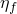 = 0.001 |  = 0.0005 |  = 0.00025 |
| 462.1 | 456.4 | 453.2 | 446 |

**表 1.4.6–5** 纤维增强环氧层使用不同单元类型的净钝缺口强度（MPa）（使用 [`UMAT`](../sub/sub-link.md#sub-xsl-umat) 模型）。
| 数值结果（ = 0.001，0° 加载角度） | 实验结果（De Vries, 2001） |
| --- | --- |
| C3D8R | C3D8 | SC8R |
| 463.7 | 467.1 | 458.7 | 446 |

**表 1.4.6–6** 不同粘性参数值的净钝缺口强度（MPa）（使用 [`UMAT`](../sub/sub-link.md#sub-xsl-umat) 模型）。
| 数值结果（C3D8R，0° 加载角度） | 实验结果（De Vries, 2001） |
| --- | --- |
|  = 0.001 |  = 0.0004 |  = 0.00016 |  = 0.000064 |
| 463.7 | 453.8 | 449.2 | 448.2 | 446 |

### 图表

**图 1.4.6–1** 板几何。

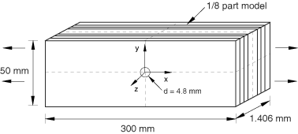

**图 1.4.6–2** (a) 1/8 板的平面内视图；(b) 1/8 板的层厚铺设。

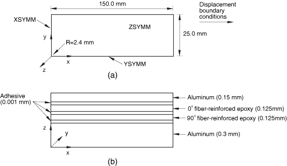

**图 1.4.6–3** 有限元网格。

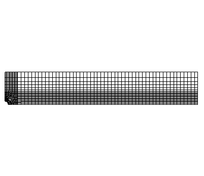

**图 1.4.6–4** 对于 0° 加载方向，不同损伤模型在纤维增强环氧层中的载荷-位移曲线， = 0.001。

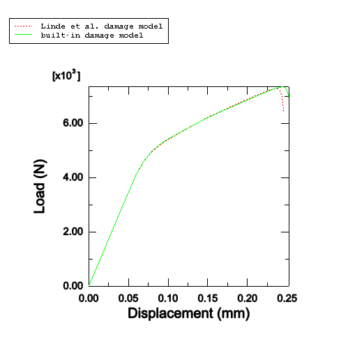

**图 1.4.6–5** 对于 0° 加载方向，纤维增强环氧层中使用不同单元类型的载荷-位移曲线（使用 [`UMAT`](../sub/sub-link.md#sub-xsl-umat) 模型）。

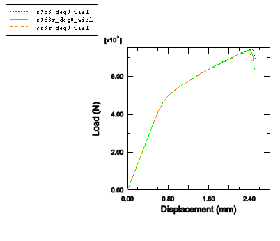

**图 1.4.6–6** 对于 0° 加载方向，0° 纤维增强环氧层中的纤维损伤模式（使用内置纤维增强材料模型，DAMAGEFT 等值线图）。

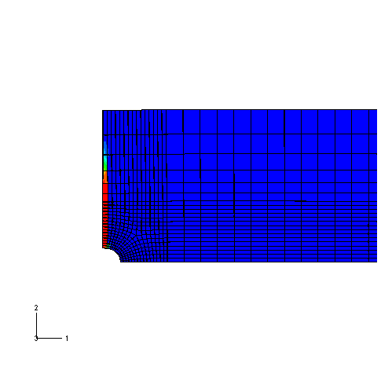

**图 1.4.6–7** 对于 0° 加载方向，0° 纤维增强环氧层中的基体损伤模式（使用内置纤维增强材料模型，DAMAGEMT 等值线图）。

**图 1.4.6–8** 对于 0° 加载方向，0° 纤维增强环氧层中的纤维损伤模式（使用 [`UMAT`](../sub/sub-link.md#sub-xsl-umat) 模型，SDV3 等值线图）。

**图 1.4.6–9** 对于 0° 加载方向，0° 纤维增强环氧层中的基体损伤模式（使用 [`UMAT`](../sub/sub-link.md#sub-xsl-umat) 模型，SDV4 等值线图）。

**图 1.4.6–10** 对于 0° 加载方向，90° 纤维增强环氧层中的基体损伤模式（使用 [`UMAT`](../sub/sub-link.md#sub-xsl-umat) 模型，SDV4 等值线图）。

**图 1.4.6–11** 对于 0° 加载方向，不同粘性参数值的载荷-位移曲线（使用内置纤维增强材料损伤模型）。

**图 1.4.6–12** 对于 0° 加载方向，不同粘性参数值的载荷-位移曲线（使用 [`UMAT`](../sub/sub-link.md#sub-xsl-umat)）。

**图 1.4.6–13** 15° 加载方向纤维增强环氧层中的局部材料方向。

**图 1.4.6–14** 对于不同加载方向，载荷-位移曲线（使用 [`UMAT`](../sub/sub-link.md#sub-xsl-umat) 模型）。

**图 1.4.6–15** 不同加载角度计算的钝缺口强度与实验结果的比较（使用 [`UMAT`](../sub/sub-link.md#sub-xsl-umat) 模型）。

**图 1.4.6–16** 对于 0° 加载方向：Abaqus/Explicit 与 Abaqus/Standard 的载荷-位移曲线比较。

