# 1.4.7 Debonding behavior of a double cantilever beam

**Products: **Abaqus/Standard  Abaqus/Explicit  

### Objectives

This example demonstrates the following Abaqus features and techniques:
- predicting debond growth in a double cantilever beam (DCB) using crack propagation analysis with the VCCT fracture criterion, cohesive elements, and surface-based cohesive behavior in Abaqus/Standard;
- demonstrating the use of contact clearance assignment between surfaces with the VCCT fracture criterion and surface-based cohesive behavior in Abaqus/Explicit to predict debond growth;
- restricting delamination growth and predicting the onset of debonding in models without a predefined crack tip using cohesive elements to supplement the VCCT fracture criterion for modeling the Z-pins and stitches that are commonly used in aerospace applications; and
- predicting progressive delamination growth at the interface in a double cantilever beam subjected to sub-critical cyclic loading using the low-cycle fatigue criterion based on the Paris law.

### Application description

This example examines the debonding behavior of a double cantilever beam. Debond onset and growth are predicted for matched meshes in both Abaqus/Standard and Abaqus/Explicit and mismatched meshes in Abaqus/Standard. Different mesh discretizations are also used to investigate their effects on the debonding behavior. The results from Abaqus/Standard are compared with the results obtained using the VCCT-based fracture interface elements in Mabson (2003), as well as the results predicted by theory. The results predicted using VCCT, cohesive elements, and surface-based cohesive behavior in Abaqus/Standard are also compared.

The debonding behavior can also be studied by using the VCCT capability in Abaqus/Explicit. The model used in Abaqus/Explicit is constructed to achieve quasi-static behavior that allows the results obtained to be comparable with those generated using VCCT in Abaqus/Standard.

The same model is analyzed in Abaqus/Standard using the low-cycle fatigue criterion to assess the fatigue life when the model is subjected to sub-critical cyclic loading. The onset and delamination growth are characterized using the Paris law, which relates the relative fracture energy release rate to the crack growth rate. The fracture energy release rate at the crack tip is calculated based on the VCCT technique. The results from Abaqus are compared with those predicted by the theory in Tada (1985). 

### Geometry

The double cantilever beam in this example has a span of 9.0 in (228.6 mm) with a rectangular cross-section of 1.0 in (25.4 mm) wide  0.4 in (10.2 mm) deep, as shown in [Figure 1.4.7--1](ch01s04aex57.md#vct-exa-dcb-dcb).

### Boundary conditions and loading

One end of the beam is fixed, and the displacements are applied at the other end, as shown in [Figure 1.4.7--1](ch01s04aex57.md#vct-exa-dcb-dcb). The maximum displacement is set equal to 0.16 in (4.1 mm) in the monotonic loading cases. In the low-cycle fatigue analysis a cyclic displacement loading with a peak value of 0.05 in (1.3 mm) is specified.

### Abaqus modeling approaches and simulation techniques

This example includes several two-dimensional models and one three-dimensional model.

### Summary of analysis cases

| Case 1 | Prediction using matched and mismatched meshes for the two-dimensional DCB model. |
| --- | --- |
| Case 2 | Comparison using different mesh discretizations for the two-dimensional DCB model. |
| Case 3 | Theoretical and VCCT response prediction for the three-dimensional DCB model. |
| Case 4 | Using cohesive elements with VCCT debond to model crack initiation. |
| Case 5 | Using cohesive elements with VCCT debond to model Z-pins and stitches. |
| Case 6 | Low-cycle fatigue prediction using the same model as in Case 1. |
| Case 7 | Low-cycle fatigue prediction using the same model as in Case 3. |
| Case 8 | Comparison of the results obtained using VCCT, cohesive elements, and cohesive behavior. |
| Case 9 | Using cohesive behavior with VCCT in Abaqus/Explicit to model crack initiation. The model is identical to the model in Case 3. |

### Analysis types

Static stress analyses are performed for Cases 1–8. Dynamic analysis is used for Case 9.

### Case 1 Prediction using matched and mismatched meshes for the two-dimensional DCB model

This case verifies that the simulation results agree with the experimental results and compares the accuracy of the results obtained using matched and mismatched meshes. 

### Mesh design

Four CPE4 elements are used to model the thickness of each half of the beam. The top and bottom figures in [Figure 1.4.7--2](ch01s04aex57.md#vct-exa-dcb-meshes2d) show the configurations of undeformed meshes used here with the initially bonded nodes. The model at the top has matched meshes with 90  4 meshes for each half of the DCB, while the model at the bottom has mismatched meshes with 90  4 meshes for the lower half and 85  4 meshes for the upper half of the DCB.

### Results and discussion

The VCCT debond approach in Abaqus predicts the onset of debonding for both the matched and mismatched meshes accurately within 3% of the prediction by the fracture interface elements, as shown in [Figure 1.4.7--3](ch01s04aex57.md#vct-exa-dcb-growth). [Figure 1.4.7--3](ch01s04aex57.md#vct-exa-dcb-growth) also shows the growth prediction calculated by the VCCT debond approach.

### Case 2 Comparison using different mesh discretizations for the two-dimensional DCB model

This case shows the effect of mesh refinement on the response. 

### Mesh design

Four CPE4 elements are used to model the thickness of each half of the beam, the same as in Case 1. The following mesh discretizations are used along the span of the beam: 

1. Matched mesh with 90 4 mesh for each half of the DCB.
2. Matched mesh with 180 4 mesh for each half of the DCB.
3. Matched mesh with 360 4 mesh for each half of the DCB.

The meshes are displayed in [Figure 1.4.7--2](ch01s04aex57.md#vct-exa-dcb-meshes2d) (first three models).

### Results and discussion

[Figure 1.4.7--4](ch01s04aex57.md#vct-exa-dcb-meshsize) shows the response for different mesh discretizations of the two-dimensional model of the double cantilever beam and clearly illustrates the convergence of the response to the same solution with mesh refinement. The maximum energy release rate cutback tolerance is set to the default value of 0.2 in the input file provided for the two-dimensional model (`dcb_vcct_2d_1.inp`). However, to eliminate factors other than mesh size from the results shown in [Figure 1.4.7--4](ch01s04aex57.md#vct-exa-dcb-meshsize), the comparisons were run with the cutback tolerance reduced to 0.1.

### Case 3 Theoretical and VCCT response prediction for the three-dimensional DCB model

This case compares the three-dimensional results of Abaqus with the theoretical prediction.

### Mesh design

The three-dimensional undeformed mesh and the initially bonded nodes are shown in [Figure 1.4.7--5](ch01s04aex57.md#vct-exa-dcb-mesh3d).

### Results and discussion

[Figure 1.4.7--6](ch01s04aex57.md#vct-exa-dcb-debond) shows a contour plot of the solution-dependent state variable BDSTAT for the three-dimensional model of the double cantilever beam. The debond growth is shown on the right side of the model.

The response predicted by the VCCT debond approach in Abaqus after the onset of debonding closely matches the theoretical results for the three-dimensional model of the double cantilever beam, as shown in [Figure 1.4.7--7](ch01s04aex57.md#vct-exa-dcb-response3d). 

### Case 4 Using cohesive elements with VCCT debond to model crack initiation

This case demonstrates how cohesive elements are used to initiate debond growth in a two-dimensional VCCT model. 

### Mesh design

A zero-thickness cohesive element (shown in [Figure 1.4.7--8](ch01s04aex57.md#vct-exa-dcb-cohesive)) is added at *x* = 0 at the interface between the two halves of the DCB. The cohesive element bonds the nodes at *x* = 0 at the contact interface. All the remaining nodes along the contact interface are initially bonded (see ["Defining initially bonded crack surfaces in Abaqus/Standard" in "Crack propagation analysis," Section 11.4.3 of the Abaqus Analysis User's Guide](../usb/usb-link.md#usb-anl-acrackpropagation-initcond)).

### Material model

The cohesive element properties are chosen such that the energy required for its complete failure equals the fracture toughness of the interface. A damage initiation criterion is specified for the cohesive element.

### Case 5 Using cohesive elements with VCCT debond to model Z-pins and stitches

Z-pins and stitches are additional reinforcements used at the bonded interface to retard the delamination growth. These can be modeled using zero-thickness cohesive elements at the debond interface with the appropriate material and damage initiation and damage evolution characteristics of the reinforcement. In the DCB model the nodes at the interface (shown in [Figure 1.4.7--9](ch01s04aex57.md#vct-exa-dcb-zpins)) are initially bonded (see ["Defining initially bonded crack surfaces in Abaqus/Standard" in "Crack propagation analysis," Section 11.4.3 of the Abaqus Analysis User's Guide](../usb/usb-link.md#usb-anl-acrackpropagation-initcond)). In addition, a layer of cohesive elements is defined at the interface using the initially bonded nodes to represent the Z-pins and stitches. 

### Case 6 Low-cycle fatigue prediction using the same model as in Case 1

This case verifies that delamination growth in a two-dimensional DCB model subjected to sub-critical cyclic loading can be predicted using the low-cycle fatigue criterion. The simulation results are compared with the theoretical results.

### Mesh design

The model has matched meshes the same as in Case 1 (model at the top of [Figure 1.4.7--2](ch01s04aex57.md#vct-exa-dcb-meshes2d)).

### Results and discussion

The results in terms of crack length versus the cycle number obtained using the low-cycle fatigue criterion in Abaqus are compared with the theoretical results in [Figure 1.4.7--10](ch01s04aex57.md#vct-exa-dcb2d-fatigue). Reasonably good agreement is obtained.

### Case 7 Low-cycle fatigue prediction using the same model as in Case 3

This case verifies that delamination growth in a three-dimensional DCB model subjected to sub-critical cyclic loading can be predicted using the low-cycle fatigue criterion. The simulation results are compared with the theoretical results.

### Mesh design

The mesh design is the same as in Case 3 ([Figure 1.4.7--5](ch01s04aex57.md#vct-exa-dcb-mesh3d)).

### Results and discussion

The results in terms of crack length versus the cycle number obtained using the low-cycle fatigue criterion in Abaqus are compared with the theoretical results in [Figure 1.4.7--11](ch01s04aex57.md#vct-exa-dcb3d-fatigue). Reasonably good agreement is obtained.

### Case 8 Comparison of the results obtained using VCCT, cohesive elements, and cohesive behavior

This case compares the results obtained using VCCT, cohesive elements, and surface-based cohesive behavior for both the two- and three-dimensional DCB models.

### Mesh design

For the two-dimensional model, four CPE4 elements are used to model the thickness of each half of the beam. The model at the top of [Figure 1.4.7--2](ch01s04aex57.md#vct-exa-dcb-meshes2d) shows the configurations of undeformed meshes used here with the initially bonded nodes. The model has matched meshes with 90  4 meshes for each half of the DCB.

The three-dimensional undeformed mesh and the initially bonded nodes are shown in [Figure 1.4.7--5](ch01s04aex57.md#vct-exa-dcb-mesh3d).

### Results and discussion

[Figure 1.4.7--12](ch01s04aex57.md#exa-dcb-comparison) compares the results obtained using VCCT, cohesive elements, and surface-based cohesive behavior for the two-dimensional DCB model. [Figure 1.4.7--13](ch01s04aex57.md#exa-dcb-comparison-3d) shows a similar comparison for the three-dimensional DCB model. All of the methods predicted nearly the same debond growth after debond onset. But the responses predicted using cohesive elements or surface-based cohesive behavior are not strictly linear before debond onset, as compared with the linear behavior predicted by the VCCT debond approach. This is not surprising since the slave nodes for the model using the VCCT debond approach are released one after another, while all the slave nodes for the models using cohesive elements or surface-based cohesive behavior debond simultaneously.

### Case 9 Using VCCT in Abaqus/Explicit to model crack initiation

This case verifies that delamination growth in a three-dimensional DCB model can be predicted using the VCCT capability in Abaqus/Explicit. The simulation results are compared with Abaqus/Standard VCCT results.

### Mesh design

The mesh design is the same as in Case 3 ([Figure 1.4.7--5](ch01s04aex57.md#vct-exa-dcb-mesh3d)).

### Results and discussion

The debond states obtained from the Abaqus/Explicit and Abaqus/Standard analyses match very well, as depicted in [Figure 1.4.7--14](ch01s04aex57.md#vcct-exa-xpl-dcbdebond). The measured reaction forces from the Abaqus/Explicit analysis compare extremely well with those from Abaqus/Standard, as shown in [Figure 1.4.7--15](ch01s04aex57.md#vct-exa-xpl-dcb3d). The debonding time, displacement, and energy release rate are highly consistent between both analyses.

### Input files

[dcb_vcct_2d_1.inp](../eif/dcb_vcct_2d_1.inp)

Two-dimensional model with matched mesh; 90  4 mesh for each half of the DCB.

[dcb_mismatch_vcct_2d_1.inp](../eif/dcb_mismatch_vcct_2d_1.inp)

Two-dimensional model with mismatched meshes.

[dcb_coh_init_vcct_2d_1.inp](../eif/dcb_coh_init_vcct_2d_1.inp)

Two-dimensional model with 4-node two-dimensional cohesive elements (COH2D4) to predict the onset of debonding.

[dcb_coh_stitch_vcct_2d_1.inp](../eif/dcb_coh_stitch_vcct_2d_1.inp)

Two-dimensional model with 4-node two-dimensional cohesive elements (COH2D4) representing Z-pins and stitches.

[dcb_vcct_3d_1.inp](../eif/dcb_vcct_3d_1.inp)

Three-dimensional model with matched meshes.

[dcb_vcct_fatigue_2d.inp](../eif/dcb_vcct_fatigue_2d.inp)

Same as dcb_vcct_2d_1.inp but subjected to cyclic displacement loading.

[dcb_vcct_fatigue_3d.inp](../eif/dcb_vcct_fatigue_3d.inp)

Same as dcb_vcct_3d_1.inp but subjected to cyclic displacement loading.

[dcb_cohelm_2d.inp](../eif/dcb_cohelm_2d.inp)

Two-dimensional model using cohesive elements with matched mesh; 90  4 mesh for each half of the DCB.

[dcb_surcoh_2d.inp](../eif/dcb_surcoh_2d.inp)

Two-dimensional model using surface-based cohesive behavior with matched mesh; 90  4 mesh for each half of the DCB.

[dcb_cohelm_3d.inp](../eif/dcb_cohelm_3d.inp)

Three-dimensional model using cohesive elements with matched meshes.

[dcb_surcoh_3d.inp](../eif/dcb_surcoh_3d.inp)

Three-dimensional model using surface-based cohesive behavior with matched meshes.

[dcb_vcct_xpl_3d.inp](../eif/dcb_vcct_xpl_3d.inp)

Abaqus/Explicit three-dimensional model with matched meshes.

### References

**Abaqus Analysis User's Guide**
- ["Low-cycle fatigue analysis using the direct cyclic approach," Section 6.2.7 of the Abaqus Analysis User's Guide](../usb/usb-link.md#usb-anl-adirectcyclicfatigue)
- ["Crack propagation analysis," Section 11.4.3 of the Abaqus Analysis User's Guide](../usb/usb-link.md#usb-anl-acrackpropagation)

**Abaqus Keywords Reference Guide**
- [*COHESIVE BEHAVIOR](../key/key-link.md#usb-kws-mcohesivebehavior)
- [*CONTACT CLEARANCE ASSIGNMENT](../key/key-link.md#usb-kws-hcontclearassign)
- [*DEBOND](../key/key-link.md#usb-kws-hdebond)
- [*DIRECT CYCLIC](../key/key-link.md#usb-kws-hdirectcyclic)
- [*FRACTURE CRITERION](../key/key-link.md#usb-kws-hfracturecriterion)

**Other**

- Mabson, G, "Fracture Interface Elements," 46th PMC General Session of Mil-17 (Composites Materials Handbook) Organization, Charleston, SC, 2003.

- Tada, H, "The Stress Analysis of Cracks Handbook," Paris Productions Incorporated, 1985.

### Figures

**Figure 1.4.7–1** The double cantilever beam (DCB) model.

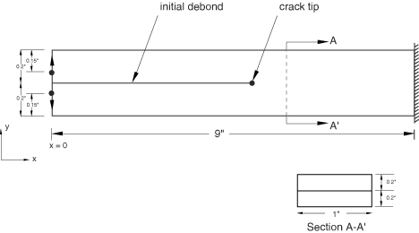

**Figure 1.4.7–2** Mesh configurations for the two-dimensional DCB model.

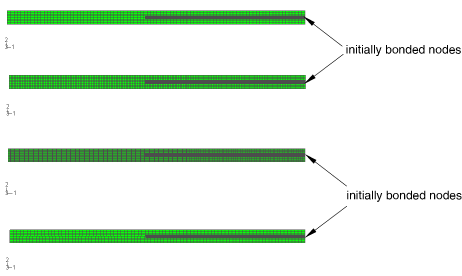

**Figure 1.4.7–3** Debond onset and growth prediction for matched and mismatched meshes for the two-dimensional DCB model.

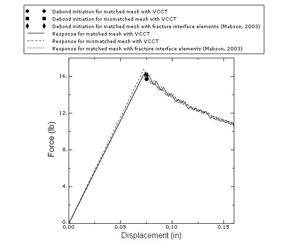

**Figure 1.4.7–4** Response for different mesh discretizations of the two-dimensional DCB model.

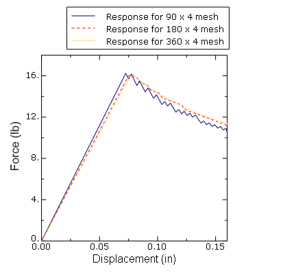

**Figure 1.4.7–5** Mesh configuration for the three-dimensional DCB model.

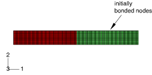

**Figure 1.4.7–6** Debond growth for the three-dimensional DCB model.

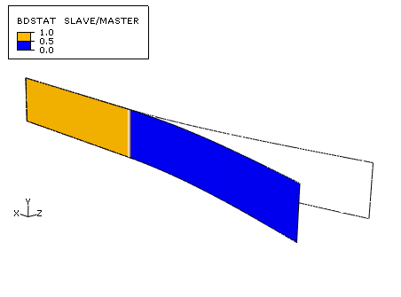

**Figure 1.4.7–7** Theoretical and VCCT in Abaqus response prediction for the three-dimensional DCB model.

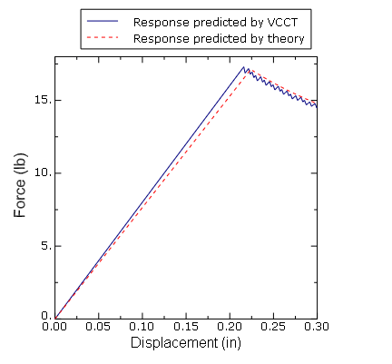

**Figure 1.4.7–8** Using zero-thickness cohesive elements to model crack initiation.

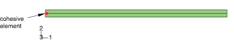

**Figure 1.4.7–9** Modeling Z-pins and stitches using cohesive elements.

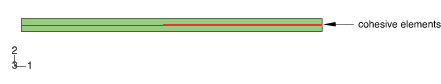

**Figure 1.4.7–10** Crack length versus cycle number for the two-dimensional DCB model.

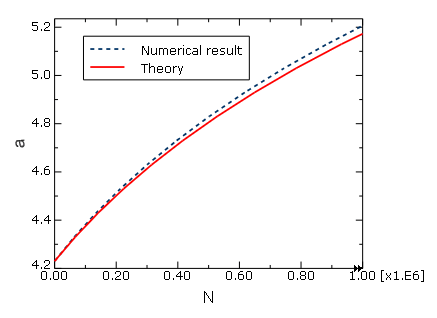

**Figure 1.4.7–11** Crack length versus cycle number for the three-dimensional DCB model.

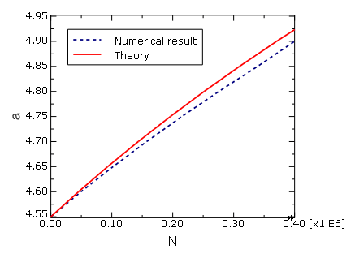

**Figure 1.4.7–12** Comparison of the results using VCCT, cohesive elements, and surface-based cohesive behavior for the two-dimensional DCB model.

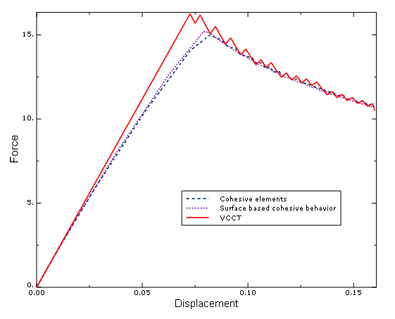

**Figure 1.4.7–13** Comparison of the results using VCCT, cohesive elements, and surface-based cohesive behavior for the three-dimensional DCB model.

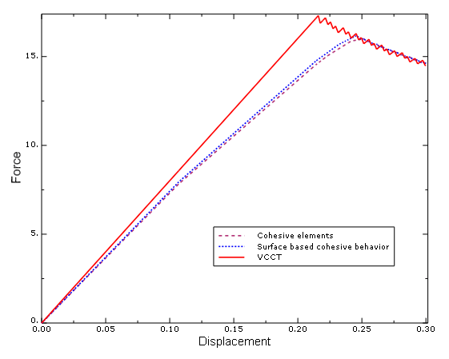

**Figure 1.4.7–14** Debond state comparison between Abaqus/Explicit (top) and Abaqus/Standard (bottom).

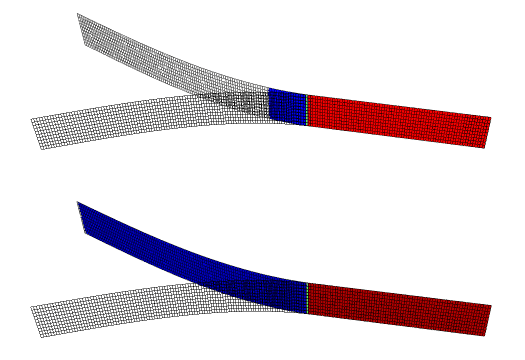

**Figure 1.4.7–15** Comparison of the results between Abaqus/Explicit and Abaqus/Standard.

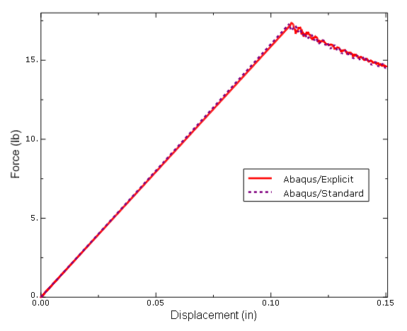

