# 1.4.8 单腿弯曲试件的脱粘行为

**产品：** Abaqus/Standard  Abaqus/Explicit  

### 目标

本示例演示了以下 Abaqus 功能和技巧：
- 在 Abaqus/Standard 中使用带 VCCT 断裂准则的裂纹扩展分析预测单腿弯曲（SLB）试件中的脱粘扩展；
- 在 Abaqus/Explicit 中使用 VCCT 断裂准则和基于表面的内聚力行为预测脱粘扩展；
- 使用基于 Paris 定律的低周疲劳准则预测该试件在亚临界循环载荷下的界面渐进分层扩展。

### 应用描述

本示例研究了单腿弯曲试件的脱粘行为，并将模拟结果与使用 Mabson (2003) 中讨论的基于 VCCT 的断裂界面元进行分析的结果进行了比较。二维模型中还使用了阻尼来演示如何稳定裂纹扩展。

使用低周疲劳准则分析了相同模型，以评估模型在亚临界循环载荷下的疲劳寿命。使用 Paris 定律表征分层萌生和扩展，该定律将相对断裂能量释放率与裂纹扩展速率联系起来。裂纹尖端的断裂能量释放率基于 VCCT 技术计算。将 Abaqus 的结果与 Davidson (1995) 中的理论预测进行了比较。

### 几何

[Figure 1.4.8--1](ch01s04aex58.md#vct-exa-slb-model) 和 [Figure 1.4.8--2](ch01s04aex58.md#vct-exa-slb-model-3d) 分别显示了两个维单腿弯曲试件及其相应初始裂纹位置的几何形状。

### 边界条件和载荷

在 [Figure 1.4.8--1](ch01s04aex58.md#vct-exa-slb-model)（二维模型）和 [Figure 1.4.8--2](ch01s04aex58.md#vct-exa-slb-model-3d)（三维模型）中显示的位置处，在顶部梁上施加位移。位移导致开口模式（I 型）和剪切模式（II 型）的混合。在单调加载情况下，二维模型中的最大位移设置为 0.32 in (8.13 mm)，三维模型中设置为 0.15 in (3.81 mm)。在低周疲劳分析中，二维模型中峰值为 0.12 in (3.05 mm)、三维模型中峰值为 0.035 in (0.89 mm) 的循环位移载荷被指定。

### Abaqus 建模方法和模拟技术

本示例包括一个二维模型和一个三维模型。

### 分析案例汇总

| 案例 1 | 二维单腿弯曲模型。 |
| --- | --- |
| 案例 2 | 三维单腿弯曲模型。 |
| 案例 3 | 使用与案例 1 相同模型的低周疲劳预测。 |
| 案例 4 | 使用与案例 2 相同模型的低周疲劳预测。 |
| 案例 5 | 在 Abaqus/Explicit 中使用 VCCT，使用与案例 2 相同的模型。 |

### 分析类型

案例 1-4 进行静态分析。案例 5 使用动态分析。

### 案例 1 二维单腿弯曲模型

本案例将 Abaqus VCCT 结果与 Mabson (2003) 的结果进行比较。还研究了阻尼效应。

### 网格设计

模型使用 4 节点双线性平面应变不兼容模式单元（CPE4I）的有限元网格来模拟长梁和短梁。

### 结果与讨论

[Figure 1.4.8--3](ch01s04aex58.md#vct-exa-slb-deformed) 显示了二维模型的变形配置。[Figure 1.4.8--4](ch01s04aex58.md#vct-exa-slb-bdstat2d) 显示了粘结状态变量 BDSTAT 的等值线图，说明了二维模型中的脱粘扩展。脱粘区域显示在模型的右侧。[Figure 1.4.8--5](ch01s04aex58.md#vct-exa-slb-response2d-1) 比较了二维分析与 Mabson (2003) 中讨论的基于 VCCT 的断裂界面元分析的结果。

本案例还通过在脱粘界面添加阻尼来研究阻尼对二维模拟的影响（见《Abaqus Analysis User's Guide》第 36.3.6 节 "Adjusting contact controls in Abaqus/Standard" 中的 "Automatic stabilization of rigid body motions in contact problems"）。阻尼稳定了裂纹扩展并使解收敛。通过将稳定能量与模型应变能进行比较来评估用于数值阻尼的能量是很重要的。[Figure 1.4.8--6](ch01s04aex58.md#vct-exa-slb-energy2d) 显示了静态稳定能量（ALLSD）与模型应变能（ALLSE）的比较。比较表明，在分析过程中最大静态稳定能量小于模型最大应变能的 3%。该值是合理的，表明解未受到附加人工数值阻尼的影响。

### 案例 2 三维单腿弯曲模型

本案例将 Abaqus VCCT 三维模型结果与理论预测进行比较。

### 网格设计

模型对长梁和短梁都使用完全积分的一阶壳单元（S4）。

### 结果与讨论

[Figure 1.4.8--7](ch01s04aex58.md#vct-exa-slb-bdstat3d) 显示了三维模型粘结状态变量 BDSTAT 的等值线图。[Figure 1.4.8--8](ch01s04aex58.md#vct-exa-slb-response3d-1) 显示了三维分析与 Mabson (2003) 中给出结果的比较。

### 案例 3 使用与案例 1 相同模型的低周疲劳预测

本案例验证了可以预测承受亚临界循环载荷的二维单腿弯曲模型中的分层扩展，使用低周疲劳准则。将模拟结果与理论结果进行比较。

### 网格设计

网格设计与案例 1 相同。

### 结果与讨论

使用 Abaqus 中低周疲劳准则获得的裂纹长度与循环次数的关系结果与 [Figure 1.4.8--9](ch01s04aex58.md#vct-exa-slb2d-fatigue) 中的理论结果进行了比较。获得了相当好的一致性。

### 案例 4 使用与案例 2 相同模型的低周疲劳预测

本案例验证了可以预测承受亚临界循环载荷的三维单腿弯曲模型中的分层扩展，使用低周疲劳准则。将模拟结果与理论结果进行比较。

### 网格设计

网格设计与案例 2 相同。

### 结果与讨论

使用 Abaqus 中低周疲劳准则获得的裂纹长度与循环次数的关系结果与 [Figure 1.4.8--10](ch01s04aex58.md#vct-exa-slb3d-fatigue) 中的理论结果进行了比较。获得了相当好的一致性。

### 案例 5 在 Abaqus/Explicit 中使用 VCCT 模拟裂纹萌生

本案例验证了可以使用 Abaqus/Explicit 预测分层扩展。将模拟结果与从 Abaqus/Standard 获得的结果进行比较。为了减少惯性效应并更好地比较 Abaqus/Standard 和 Abaqus/Explicit 结果，材料密度被降低，载荷以平滑步幅定义斜坡施加。

### 网格设计

网格设计与案例 2 相同。

### 结果与讨论

使用 Abaqus/Explicit 与 VCCT 获得的结果与从 Abaqus/Standard 获得的结果显示出相当好的一致性，如图 [Figure 1.4.8--11](ch01s04aex58.md#vcct-exa-xpl-slbdebond) 和 [Figure 1.4.8--12](ch01s04aex58.md#vct-exa-xpl-slb3d) 所示。由于模型中薄单元层和指定的边界条件，惯性效应在测量的反作用力中明显可见。然而，两种分析在脱粘萌生时的峰值力、脱粘时间和其他 VCCT 输出量是一致的。Abaqus/Explicit 中获得的反作用力使用截止频率为 500 Hz 的 Butterworth 滤波器进行了滤波，以减少响应曲线中的高频振荡。

### 输入文件

[slb_vcct_2d_1.inp](../eif/slb_vcct_2d_1.inp)

SLB 试件的二维模型。

[slb_vcct_3d_1.inp](../eif/slb_vcct_3d_1.inp)

SLB 试件的三维模型。

[slb_vcct_fatigue_2d.inp](../eif/slb_vcct_fatigue_2d.inp)

与 slb_vcct_2d_1.inp 相同，但承受循环位移载荷。

[slb_vcct_fatigue_3d.inp](../eif/slb_vcct_fatigue_3d.inp)

与 slb_vcct_3d_1.inp 相同，但承受循环位移载荷。

[slb_vcct_xpl_3d.inp](../eif/slb_vcct_xpl_3d.inp)

使用 Abaqus/Explicit 与 VCCT 的 SLB 试件三维模型。

### 参考文献

**Abaqus Analysis User's Guide**
- ["Low-cycle fatigue analysis using the direct cyclic approach," Section 6.2.7 of the Abaqus Analysis User's Guide](../usb/usb-link.md#usb-anl-adirectcyclicfatigue)
- ["Crack propagation analysis," Section 11.4.3 of the Abaqus Analysis User's Guide](../usb/usb-link.md#usb-anl-acrackpropagation)

**Abaqus Keywords Reference Guide**
- [*COHESIVE BEHAVIOR](../key/key-link.md#usb-kws-mcohesivebehavior)
- [*CONTACT CLEARANCE ASSIGNMENT](../key/key-link.md#usb-kws-hcontclearassign)
- [*DEBOND](../key/key-link.md#usb-kws-hdebond)
- [*DIRECT CYCLIC](../key/key-link.md#usb-kws-hdirectcyclic)
- [*FRACTURE CRITERION](../key/key-link.md#usb-kws-hfracturecriterion)
- [*NODAL ENERGY RATE](../key/key-link.md#usb-kws-mnodalenergyrate)

**其他**

- Mabson, G, "Fracture Interface Elements," 46th PMC General Session of Mil-17 (Composites Materials Handbook) Organization, Charleston, SC, 2003.

- Davidson, B. D., R. Kruger, and M. Konig, "Three-Dimensional Analysis of Center-Delaminated Unidirectional and Multidirectional Single-Leg Bending Specimens," Composites Science and Technology, vol. 54, pp. 385--394, 1995.

### 图表

**图 1.4.8–1** 二维单腿弯曲（SLB）试件。

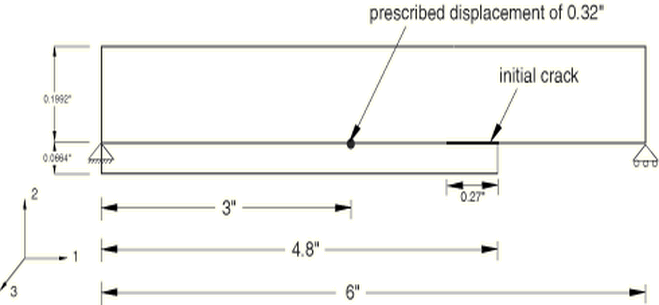

**图 1.4.8–2** 三维单腿弯曲（SLB）试件。

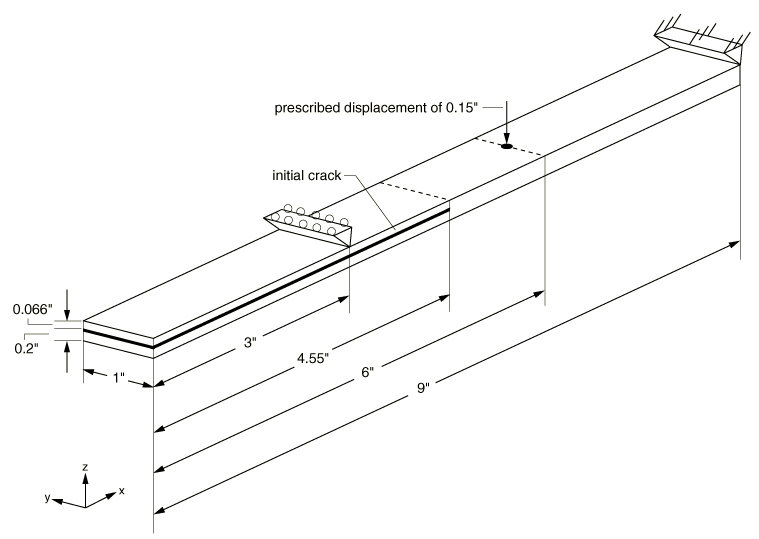

**图 1.4.8–3** 显示边界条件和规定位移的二维模型变形形状。

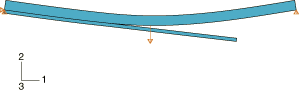

**图 1.4.8–4** 二维 SLB 模型脱粘扩展的预测。

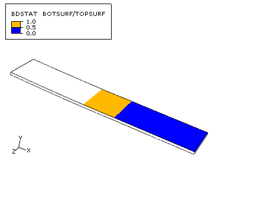

**图 1.4.8–5** 二维 SLB 模型的响应预测。

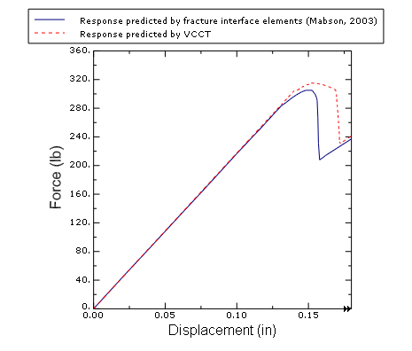

**图 1.4.8–6** 二维模型 ALLSD 和 ALLSE 的比较。

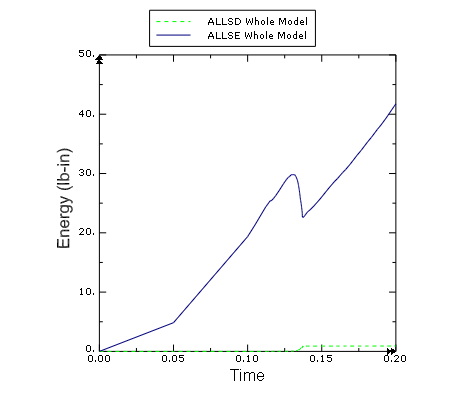

**图 1.4.8–7** 三维 SLB 模型脱粘扩展的预测。

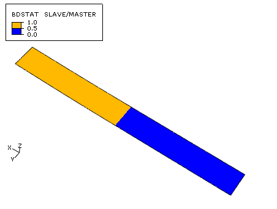

**图 1.4.8–8** 三维 SLB 模型的响应预测。

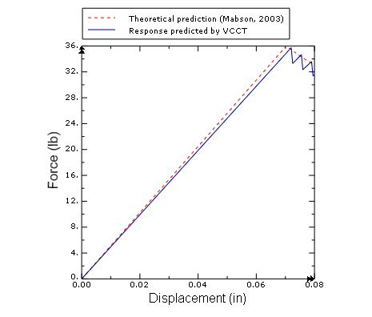

**图 1.4.8–9** 二维 SLB 模型裂纹长度与循环次数的关系。

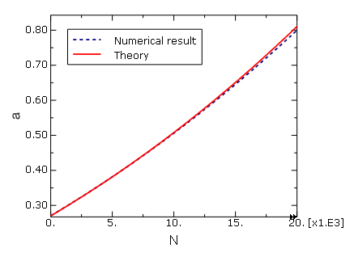

**图 1.4.8–10** 三维 SLB 模型裂纹长度与循环次数的关系。

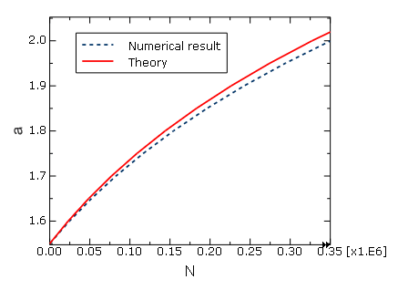

**图 1.4.8–11** Abaqus/Explicit（顶部）和 Abaqus/Standard（底部）之间脱粘状态比较。

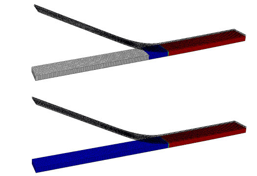

**图 1.4.8–12** Abaqus/Explicit 和 Abaqus/Standard 之间结果的比较。

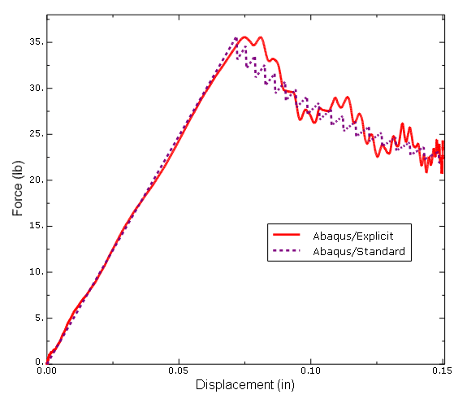

