# 1.4.9 复合材料板的分层后屈曲和扩展

**产品：** Abaqus/Standard  Abaqus/Explicit  

### 目标

本示例说明了在 Abaqus/Standard 和 Abaqus/Explicit 中应用 VCCT 断裂准则来预测层合复合材料板的后屈曲响应、分层萌生和扩展。

### 应用描述

分层是层合复合材料的主要失效模式。分层扩展在压缩载荷下更为显著，因为它导致子层合板的屈曲，从而导致分层扩展。本示例考虑的具体问题在 Reeder (2002) 中描述。将 Abaqus 中 VCCT 脱粘方法的结果与实验结果进行了比较。

### 几何

本示例研究了一个扁平的 9.0 in (228.6 mm) × 4.5 in (114.3 mm) 复合板，中心有一个 2.5 in (63.5 mm) 直径的分层，如图 [Figure 1.4.9--1](ch01s04aex59.md#vct-exa-nasa) 所示。

### 材料

面板由 AS4/3501-6 石墨/环氧树脂复合材料体系制成，其典型层压板属性在 [Table 1.4.9--1](ch01s04aex59.md#vct-exa-nasa-epoxy) 中给出。面板的铺层顺序为 [(45/90/0)2/60/15]S。分层界面的 I 型、II 型和 III 型临界断裂韧性也在 [Table 1.4.9--1](ch01s04aex59.md#vct-exa-nasa-epoxy) 中给出。

### 边界条件和载荷

面板沿其长轴承受压缩载荷。模型的总体尺寸、边界条件和载荷可以在 [Figure 1.4.9--1](ch01s04aex59.md#vct-exa-nasa) 中看到。

### Abaqus 建模方法和模拟技术

分层位于第 5 层和第 6 层之间（45° 层和 45° 层之间）的界面处。分层区域使用两个叠加的壳单元建模，定义接触约束以防止单元穿透。使用 Benzeggagh-Kenane 混合模式失效准则（Benzeggagh and Kenane, 1996）基于使用 VCCT 计算的应变能量释放率来确定分层的扩展。

### 分析类型

进行了静态和动态分析。

### 网格设计

有限元模型使用完全积分的一阶壳单元（S4）创建。模型的有限元网格如图 [Figure 1.4.9--2](ch01s04aex59.md#vct-exa-nasa-mesh) 所示，分层位于中心。

### 载荷

载荷由面板顶部边缘 0.03 in (0.76 mm) 的规定位移组成。

### 求解控制

为了在 Abaqus/Standard 中实现稳定的分层扩展，为发生分层扩展的界面指定了少量阻尼（见《Abaqus Analysis User's Guide》第 36.3.6 节 "Adjusting contact controls in Abaqus/Standard" 中的 "Automatic stabilization of rigid body motions in contact problems"）。Abaqus/Explicit 分析中没有指定求解控制。

### 结果与讨论

Abaqus/Standard 获得的复合面板最终变形配置如图 [Figure 1.4.9--3](ch01s04aex59.md#vct-exa-nasa-deformed) 所示。沿长轴切割的面板截面中的后屈曲如图 [Figure 1.4.9--4](ch01s04aex59.md#vct-exa-nasa-buckling) 所示。Abaqus/Standard 获得的表示分层扩展的粘结状态变量 BDSTAT 等值线如图 [Figure 1.4.9--5](ch01s04aex59.md#vct-exa-nasa-growth) 所示。载荷-应变预测与 Reeder (2002) 给出的实验数据在 [Figure 1.4.9--6](ch01s04aex59.md#vct-exa-nasa-expvsvcct) 中进行了比较。VCCT 的预测与实验结果一致。Abaqus 中 VCCT 脱粘方法预测的分层萌生与实验数据的差异在 10% 以内。稳定分层扩展所消耗的能量小于总应变能的 4%，如图 [Figure 1.4.9--7](ch01s04aex59.md#vct-exa-nasa-strainenergy) 所示。

Abaqus/Explicit 获得的变形配置如图 [Figure 1.4.9--8](ch01s04aex59.md#vct-exa-nasa-xpl-deformed) 和 [Figure 1.4.9--9](ch01s04aex59.md#vct-exa-nasa-xpl-buckling) 所示。Abaqus/Explicit 分析获得的分层扩展如图 [Figure 1.4.9--10](ch01s04aex59.md#vct-exa-nasa-xpl-growth) 所示。力-位移响应与 Abaqus/Standard 结果略有不同，如图 [Figure 1.4.9--11](ch01s04aex59.md#vct-exa-nasa-xpl-forcevsd) 所示，但显示出合理的一致性。

### 输入文件

[nasa_postbuckle_vcct_1.inp](../eif/nasa_postbuckle_vcct_1.inp)

使用 Abaqus/Standard 进行复合板的后屈曲分析。

[nasa_postbuckle_xpl_vcct.inp](../eif/nasa_postbuckle_xpl_vcct.inp)

使用 Abaqus/Explicit 进行复合板的后屈曲分析。

### 参考文献

**Abaqus Analysis User's Guide**
- ["Crack propagation analysis," Section 11.4.3 of the Abaqus Analysis User's Guide](../usb/usb-link.md#usb-anl-acrackpropagation)

**Abaqus Keywords Reference Guide**
- [*COHESIVE BEHAVIOR](../key/key-link.md#usb-kws-mcohesivebehavior)
- [*CONTACT CLEARANCE ASSIGNMENT](../key/key-link.md#usb-kws-hcontclearassign)
- [*DEBOND](../key/key-link.md#usb-kws-hdebond)
- [*FRACTURE CRITERION](../key/key-link.md#usb-kws-hfracturecriterion)

**其他**

- Benzeggagh, M., and M. Kenane, "Measurement of Mixed-Mode Delamination Fracture Toughness of Unidirectional Glass/Epoxy Composites with Mixed-Mode Bending Apparatus," Composite Science and Technology, vol. 56, p. 439, 1996.
- Reeder, J., S. Kyongchan, P. B. Chunchu, and D. R. Ambur, "Postbuckling and Growth of Delaminations in Composite Plates Subjected to Axial Compression," 43rd AIAA/ASME/ASCE/AHS/ASC Structures, Structural Dynamics, and Materials Conference, Denver, Colorado, vol. 1746, p. 10, 2002.

### 表格

**表 1.4.9–1** AS4/3501-6 石墨/环氧树脂材料的属性。
| 属性 | 值 |
| --- | --- |
|  | 18.500 × 10^6 lb/in² (127.554 kN/mm²) |
|  | 1.640 × 10^6 lb/in² (11.307 kN/mm²) |
| 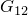 | 0.871 × 10^6 lb/in² (6.005 kN/mm²) |
|  | 0.871 × 10^6 lb/in² (6.005 kN/mm²) |
|  | 0.522 × 10^6 lb/in² (3.599 kN/mm²) |
|  | 0.30 |
|  | 0.46863 lb/in (0.08207 N/mm) |
|  | 3.171825 lb/in (0.55546 N/mm) |
|  | 3.171825 lb/in (0.55546 N/mm) |

### 图表

**图 1.4.9–1** 平板复合面板。

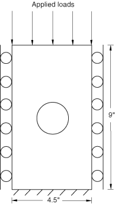

**图 1.4.9–2** NASA 面板模型的网格。

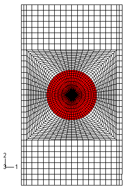

**图 1.4.9–3** 最终变形配置（Abaqus/Standard）。

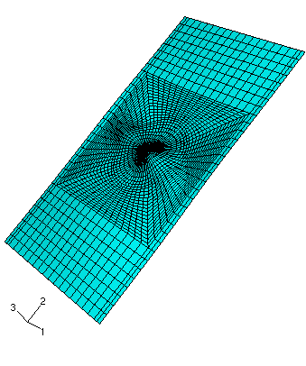

**图 1.4.9–4** 面板截面中的后屈曲（Abaqus/Standard）。

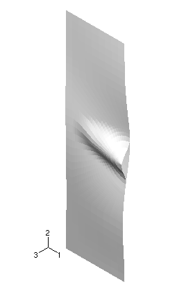

**图 1.4.9–5** 分层的扩展（Abaqus/Standard）。

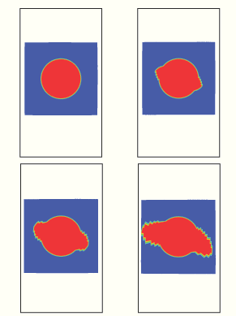

**图 1.4.9–6** 载荷-应变预测与实验数据的比较。

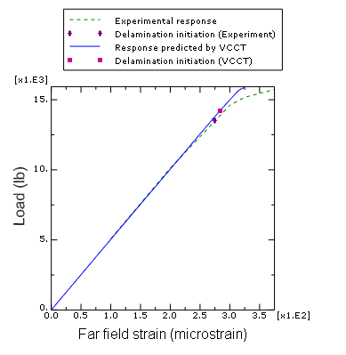

**图 1.4.9–7** 稳定分层扩展所消耗的能量。

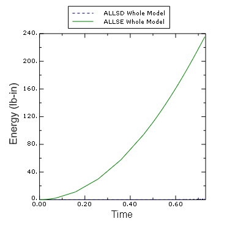

**图 1.4.9–8** 最终变形配置（Abaqus/Explicit）。

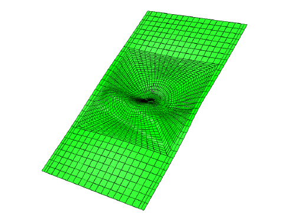

**图 1.4.9–9** 面板截面中的后屈曲（Abaqus/Explicit）。

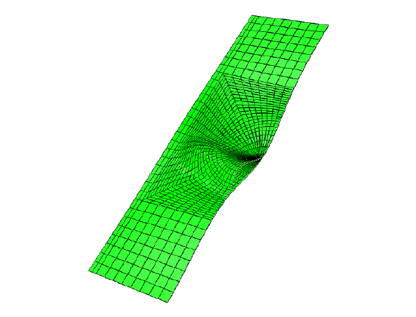

**图 1.4.9–10** 分层的扩展（Abaqus/Explicit）。

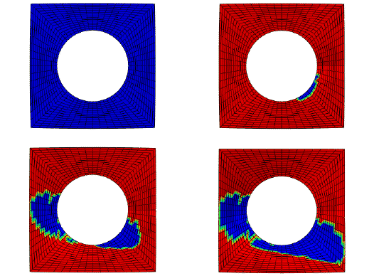

**图 1.4.9–11** Abaqus/Explicit 和 Abaqus/Standard 之间力-位移响应的比较。

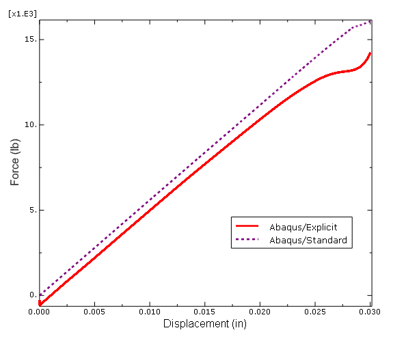

