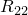
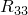
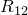
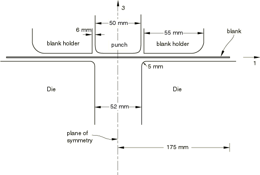
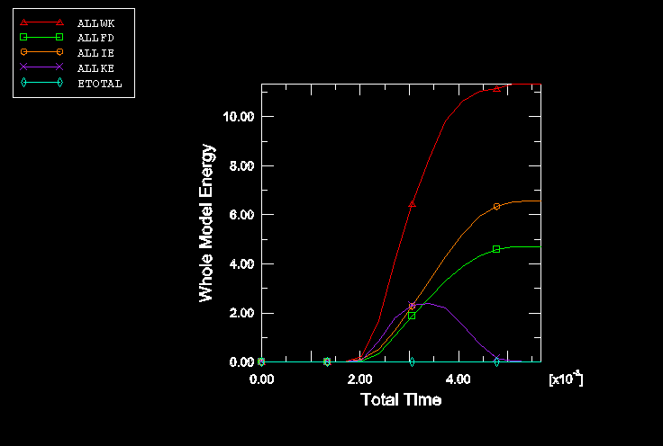
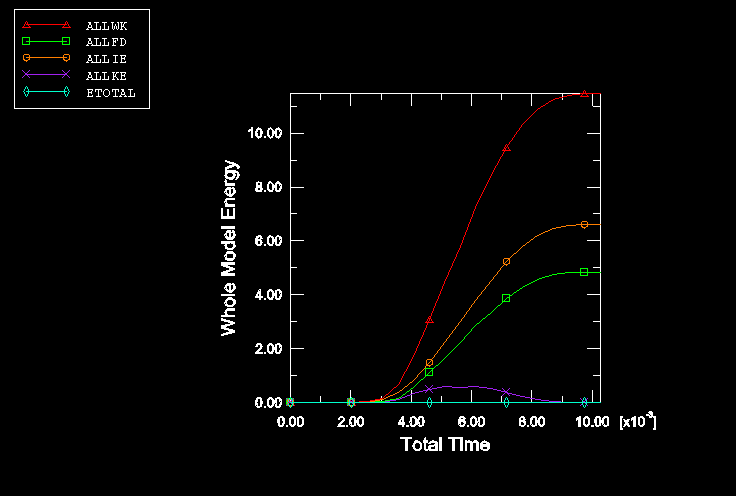
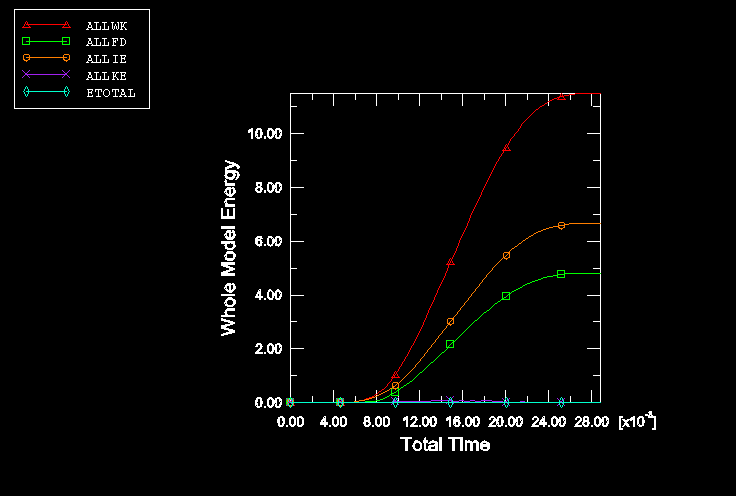
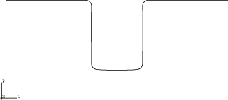
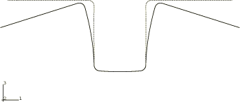

# 1.5.1 二维拉弯回弹

**产品：** Abaqus/Standard  Abaqus/Explicit  

本示例说明了二维拉弯工艺的成形和回弹分析。成形分析使用 Abaqus/Explicit 进行，回弹分析使用 Abaqus/Standard 通过导入分析运行。

### 问题描述

此处描述的示例是 Numisheet '93 会议上报告的基准测试之一。该基准包含六个问题的系列，使用三种不同材料和两种不同的压边力进行。其中一个问题的模拟在 Taylor 等人 (1993) 的论文中描述。

坯料初始尺寸为 350 mm × 35 mm，厚度为 0.78 mm。该问题本质上是平面应变问题（坯料的垂直方向尺寸为 35 mm）。模具、冲头、压边圈和坯料的横截面几何形状如图 [Figure 1.5.1--1](ch01s05aex60.md#exxdrawbend-xsect) 所示。总压边力为 2.45 kN，压边圈上附有 5 kg 的质量。所有相互作用表面使用的摩擦系数为 0.144。

坯料由软钢制成。材料被建模为具有各向同性弹性的弹塑性材料，使用 Hill 各向异性屈服准则进行塑性分析。使用以下材料属性：

| 弹性模量 = 206.0 GPa |
| --- |
| 泊松比 = 0.3 |
| 密度 = 7800 |
| 屈服应力  = 167.0 MPa |
| 各向异性屈服准则： = 1.0， = 1.0402， = 1.24897， = 1.07895，|
|  = 1.0， = 1.0 |

问题关于通过冲头中心的平面对称，仅对问题的一半进行建模。坯料用单排 175 个一阶壳单元建模。在对称平面上施加对称边界条件，并在坯料的所有节点上施加边界条件以模拟平面应变条件。模型中坯料的垂直方向尺寸为 5 mm；因此，压边力被适当缩放。

成形过程使用 Abaqus/Explicit 分两个步骤进行模拟。在分析的第一步中施加压边力。使用平滑步幅定义使力斜坡上升，以最小化惯性效应。在分析的第二步中，通过规定冲头刚体参考节点的速度，将冲头向下移动 70 mm。速度使用三角平滑步幅振幅函数施加，在时间周期的开始和结束时速度为零，峰值速度发生在时间段中间。

在这种情况下会发生大量的回弹。因为坯料非常灵活且基频振动模态较低，在 Abaqus/Explicit 中获得回弹分析的准静态解需要很长的模拟时间。

使用 Abaqus/Standard 通过导入分析进行回弹分析。将 Abaqus/Explicit 中成形模拟的结果导入 Abaqus/Standard，静态分析计算回弹。在此步骤中，Abaqus/Standard 自动施加一个平衡导入应力状态的人工应力状态，并在步骤期间逐渐移除。在步骤结束时获得的位移即为回弹量，应力给出残余应力状态。

导入分析中的设置决定了参考配置。当您选择在导入分析中更新参考配置时，将把变形后的板材及其在 Abaqus/Explicit 分析结束时的材料状态导入 Abaqus/Standard，变形配置成为参考配置。如果在后处理过程中需要显示由回弹引起的位移，此过程最为方便。当您不更新参考配置时，变形板材在 Abaqus/Explicit 分析结束时的材料状态、位移和应变被导入 Abaqus/Standard，原始配置保持为参考配置。如果需要获得连续的位移解，应使用此过程。

在这个二维拉弯问题中会发生明显的回弹，并且通过在步骤定义中考虑几何非线性来在计算中包括大位移效应。

有关导入功能的更多详细信息，请参阅《Abaqus Analysis User's Guide》第 9.2.2 节 "Transferring results between Abaqus/Explicit and Abaqus/Standard"。

### 结果与讨论

通过使用峰值速度为 30 m/s、15 m/s 和 5 m/s 运行显式分析来确定冲头的最佳峰值速度（以最低成本获得准静态结果的值）。能量历史分别如图 [Figure 1.5.1--2](ch01s05aex60.md#exxdrawbend-energy-30)、[Figure 1.5.1--3](ch01s05aex60.md#exxdrawbend-energy-15) 和 [Figure 1.5.1--4](ch01s05aex60.md#exxdrawbend-energy-5) 所示。从这些结果可以明显看出，在峰值速度为 30 m/s 时，模型中的动能太大，无法模拟准静态成形过程，而在峰值速度为 5 m/s 时，动能几乎为零。选择 15 m/s 的冲头峰值速度进行成形分析，因为这种情况下动能足够低，不会显著影响结果。对于准确的回弹分析，重要的是应力不受惯性效应的影响。

Abaqus/Explicit 成形分析结束时的坯料如图 [Figure 1.5.1--5](ch01s05aex60.md#exxdrawbend-blank-exp) 所示。回弹后的形状如图 [Figure 1.5.1--6](ch01s05aex60.md#exxdrawbend-blank-std) 所示。结果与报告的实验数据很好地吻合。在数值结果中，外法兰和水平轴之间的角度在 Abaqus/Explicit 分析中为 22°，在 Abaqus/Standard 分析中为 17.1°。结果的差异是由于接触计算中的差异。在 Abaqus/Explicit 中，接触计算期间考虑了壳厚度的变化，Abaqus/Standard 中的表面到表面接触公式同样这样做。然而，对于 Abaqus/Standard 中的节点到表面接触公式，当壳夹在两个表面之间时，有必要使用 "软化" 接触来考虑壳厚度，因此进行了近似。设置了一个修改后的 Abaqus/Explicit 分析，使用软化接触和零壳厚度（带有零厚度表面）来直接比较 Abaqus/Explicit 和 Abaqus/Standard 的结果。预测结果非常接近。实验中测量的平均角度为 17.1°，实验结果范围为 9° 到 23°。更新参考配置时的回弹分析结果与不更新参考配置时的结果几乎相同。

### 输入文件

[springback_exp_form.inp](../eif/springback_exp_form.inp)

使用接触对以 15 m/s 冲头速度进行 Abaqus/Explicit 成形分析。

[springback_exp_form_gcont.inp](../eif/springback_exp_form_gcont.inp)

使用通用接触以 15 m/s 冲头速度进行 Abaqus/Explicit 成形分析。

[springback_std_importyes.inp](../eif/springback_std_importyes.inp)

使用 [*IMPORT](../key/key-link.md#usb-kws-mimport)，UPDATE=YES 选项进行 Abaqus/Standard 回弹分析。

[springback_std_importno.inp](../eif/springback_std_importno.inp)

使用 [*IMPORT](../key/key-link.md#usb-kws-mimport)，UPDATE=NO 选项进行 Abaqus/Standard 回弹分析。

[springback_std_both.inp](../eif/springback_std_both.inp)

用于 Abaqus/Standard 成形和回弹分析的输入数据。

[springback_std_both_surf.inp](../eif/springback_std_both_surf.inp)

使用表面到表面接触公式进行 Abaqus/Standard 成形和回弹分析的输入数据。

[springback_exp_form_soft.inp](../eif/springback_exp_form_soft.inp)

使用软化接触和接触对（如同 springback_std_both.inp 中）以 15 m/s 冲头速度进行修改后的 Abaqus/Explicit 成形分析。

[springback_exp_punchv30.inp](../eif/springback_exp_punchv30.inp)

使用接触对以 30 m/s 冲头速度进行 Abaqus/Explicit 成形分析。

[springback_exp_punchv5.inp](../eif/springback_exp_punchv5.inp)

使用接触对以 5 m/s 冲头速度进行 Abaqus/Explicit 成形分析。

[springback_exp_punchv30_gcont.inp](../eif/springback_exp_punchv30_gcont.inp)

使用通用接触以 30 m/s 冲头速度进行 Abaqus/Explicit 成形分析。

[springback_exp_punchv5_gcont.inp](../eif/springback_exp_punchv5_gcont.inp)

使用通用接触以 5 m/s 冲头速度进行 Abaqus/Explicit 成形分析。

### 参考文献

Taylor,  L. M.,  J. Cao,  A. P. Karafillis,  and  M. C. Boyce, "Numerical Simulations of Sheet Metal Forming," Proceedings of 2nd International Conference, NUMISHEET 93, Isehara, Japan, Ed. A. Makinovchi, et al.

### 图表

**图 1.5.1–1** 显示模具、冲头、压边圈和坯料几何形状的横截面。

**图 1.5.1–2** 成形分析的能量历史：冲头峰值速度 30 m/s。

**图 1.5.1–3** 成形分析的能量历史：冲头峰值速度 15 m/s。

**图 1.5.1–4** 成形分析的能量历史：冲头峰值速度 5 m/s。

**图 1.5.1–5** Abaqus/Explicit 成形分析结束时的坯料。

**图 1.5.1–6** Abaqus/Standard 回弹后的坯料。

