# 1.5.2 方形盒子的深冲

**产品：** Abaqus/Standard  Abaqus/Explicit  

### 目标

本示例问题演示了以下 Abaqus 功能和技巧：
- 使用导入分析技术将结果从 Abaqus/Explicit 传输到 Abaqus/Standard；
- 将使用 Abaqus/Explicit 进行成形步骤和 Abaqus/Standard 进行回弹分析的分析序列与使用 Abaqus/Standard 进行成形和回弹步骤的结果进行比较；
- 比较不同接触公式在有限滑动下的特性，特别是在表面厚度处理方面。

### 应用描述

本示例通过深冲工艺说明了三维形状的成形。通常，成形过程包括成形步骤和坯料从工具上移除后发生的回弹。分析成形过程的目的是确定回弹后的最终变形形状。

### 几何

坯料最初为方形，200 mm × 200 mm，厚度为 0.82 mm。刚性模具是一个带有 102.5 mm × 102.5 mm 方形孔的平面，边缘半径为 10 mm。刚性方形冲头尺寸为 100 mm × 100 mm，边缘具有相同的 10 mm 半径。刚性压边圈可视为平板，因为坯料永远不会接近其边缘。这些刚性部件的几何形状如图 [Figure 1.5.2--1](ch01s05aex61.md#exxsqbox-meshes) 所示。

### 材料

坯料由铝镇静钢制成，假定满足真应力和对数应变之间的 Ramberg-Osgood 关系，

参考应力值（K）为 513 MPa，加工硬化指数（n）为 0.223。假定各向同性弹性，弹性模量为 211 GPa，泊松比为 0.3。从这些数据获得的初始屈服应力为 91.3 MPa。应力-应变行为由与 Ramberg-Osgood 曲线匹配的分段线性段定义，直至总（对数）应变水平为 107%，使用 Mises 屈服、各向同性硬化，无率率相关性。

### 边界条件和载荷

考虑到问题的对称性，仅对盒子的八分之一扇区进行建模就足够了。然而，为便于可视化，我们采用了四分之一模型。在坯料的四分之一边缘施加对称边界条件。冲头和压边圈仅允许在垂直方向移动。允许压边圈的垂直移动可以适应成形过程中坯料厚度的变化。

### 相互作用

考虑坯料与冲头之间的接触相互作用，摩擦系数为 0.25；坯料与模具之间的摩擦系数为 0.125。假定坯料与压边圈之间的接触相互作用是无摩擦的。

### Abaqus 建模方法和模拟技术

分析此类问题最有效的方法是使用 Abaqus/Explicit 分析成形步骤，然后将结果导入 Abaqus/Standard 分析回弹。为进行验证，还使用 Abaqus/Standard 进行了完整分析。然而，这在计算上更昂贵，对于模拟真实复杂零件的成形将非常昂贵。

这个问题在 Nagtegaal 和 Taylor (1991) 中使用，其中比较了用于成形问题的隐式和显式有限元技术。使用显式时间积分运行模拟所需的计算机时间与事件时间段成正比，因为稳定时间增量大小是网格尺寸（长度）和材料刚度的函数。因此，通常希望以比物理过程高得多的速度运行模拟。如果模拟中的速度增加太多，解就不对应于低速物理问题；即惯性效应开始占主导地位。在典型的成形过程中，冲头可能以约 1 m/sec 的速度移动，这比要成形材料中的典型波速（钢中的波速约为 5000 m/sec）慢得多。一般来说，对于远高于物理问题中标称 1 m/sec 速率的成形速率，惯性力不会占主导地位。因此，以 10、30 和 100 m/sec 的冲头速度获得显式解，以与使用 Abaqus/Standard 获得的静态解进行比较。在此处给出的结果中，通过在 0.0036 秒内将冲头参考节点向下移动总共 36 mm 来模拟拉深过程。使用显式动态和静态程序分析各种金属成形问题的详细比较在 Nagtegaal 和 Taylor (1991) 的论文中讨论。

尽管此示例不包含率相关材料属性，但在板材金属成形应用中这通常是需要考虑的因素。如果材料是率相关的，则不能在不影响材料响应的情况下人为地增加速度。相反，分析师可以使用质量缩放技术来调整有效的冲头速度而不改变材料属性。["厚板的轧制," 第 1.3.6 节](ch01s03aex37.md) 包含质量缩放技术的解释和示例。

### 分析案例汇总

| 使用通用接触功能的成形分析。 | 案例 1a | |
| --- | --- | --- |
|  | 案例 1b | 使用运动学接触对。 |
|  | 案例 1c | 使用罚函数接触对。 |
|  | 案例 1d | 使用通用接触功能的细网格情况成形分析（仅用于测试 Abaqus/Explicit 代码性能）。 |
|  | 案例 1e | 使用运动学接触对的细网格情况成形分析（仅用于测试 Abaqus/Explicit 代码性能）。 |
| 使用 Abaqus/Standard 进行回弹分析。 | 案例 2a | 使用不更新参考配置的导入分析进行 Abaqus/Standard 回弹分析。 |
|  | 案例 2b | 使用更新参考配置的导入分析进行 Abaqus/Standard 回弹分析。 |
|  | 案例 2c | 使用更新参考配置的细网格情况导入分析进行回弹分析（仅用于测试 Abaqus/Standard 代码性能）。 |
| 使用 Abaqus/Standard 进行成形和回弹分析。 | 案例 3a | 使用表面到表面接触公式。 |
|  | 案例 3b | 使用节点到表面接触公式。 |

### 分析类型

如前所述，Abaqus 中的导入功能用于将成形步骤作为显式动态分析运行，然后使用 Abaqus/Standard 进行静态应力分析来计算回弹。为了进行比较，给出了使用 Abaqus/Standard 进行成形和回弹步骤的完整静态应力分析的结果。

### 分析技术

Abaqus 中的导入功能用于将结果从 Abaqus/Explicit 传输到 Abaqus/Standard。

### 网格设计

坯料使用 4 节点双线性有限应变单元（类型 S4R）建模；而冲头、模具和压边圈使用 4 节点三维刚性表面单元（类型 R3D4）进行网格划分。各个部件的网格设计如图 [Figure 1.5.2--1](ch01s05aex61.md#exxsqbox-meshes) 和 [Figure 1.5.2--2](ch01s05aex61.md#exxsqbox-blankmesh) 所示。

### 载荷

通过施加 22.87 kN 的集中载荷将坯料压在压边圈之间。在成形步骤中，坯料的进一步载荷通过与冲头的接触力施加。

### 分析步骤

使用 Abaqus/Explicit 进行成形过程包括单个成形步骤，其中刚性冲头压向坯料，而压边圈通过施加集中载荷将坯料保持在适当位置。此描述适用于案例 1a-1e。对于 Abaqus/Standard 中的导入分析，使用单个步骤来计算回弹，如案例 2a-2c。对于案例 3a 和 3b 中 Abaqus/Standard 中的完整分析，采用以下步骤：
- 第一步：通过向其中一个刚性压边圈的参考点施加小位移，使压边圈与坯料接触。
- 第二步：向压边圈参考点施加集中载荷，以在保持接触的同时将坯料保持在适当位置。
- 后续步骤：通过将刚性冲头压向坯料来实现成形。
- 最后两个步骤：通过停用接触对来分析回弹。

### 输出请求

壳厚度 STH 和等效塑性应变 PEEQ 的输出变量与预选变量一起被特别请求。此外，还请求了冲头的反作用力和位移历史。

### 案例 1a：使用通用接触的显式成形分析

此分析仅涉及成形步骤。对于完整分析，此案例中的成形步骤需要继之以回弹分析（案例 2a 或 2b）。

### 相互作用

使用通用接触（见通用接触规范）来定义此案例中的接触相互作用。这允许非常简单的接触定义，对所涉及表面类型几乎没有限制（见《Abaqus Analysis User's Guide》第 36.4.1 节 "Defining general contact interactions in Abaqus/Explicit"）。但是，通用接触默认不考虑壳厚度的变化。因此，通用接触表面属性分配必须考虑坯料的变薄。

### 案例 1b：使用运动学接触对的显式成形分析

此分析再次仅涉及成形步骤。对于完整分析，成形步骤需要继之以回弹分析（案例 2a 或 2b）。

### 相互作用

定义接触对以包括坯料与冲头、模具和压边圈分别的相互作用，并具有先前指定的适当摩擦行为。接触对算法（在接触对定义中指定）对所涉及的表面类型有更多限制，通常需要更仔细的接触定义（见《Abaqus Analysis User's Guide》第 36.5.1 节 "Defining contact pairs in Abaqus/Explicit"）。接触相互作用在模型中所有基于元素的表面上定义。

### 案例 1c：使用罚函数接触对的显式成形分析

此分析仅涉及成形步骤。回弹计算必须单独进行（案例 2a 或 2b）。

### 相互作用

为接触对指定罚函数，以包括坯料与冲头、模具和压边圈分别的相互作用，并具有先前指定的适当摩擦行为。

### 案例 1d：使用细化网格的通用接触显式成形分析

在此案例中，坯料的网格被均匀细化，使得每个方向上的单元数量是之前案例的两倍。运行此案例纯粹是为了对执行显式分析的性能进行基准测试。

### 相互作用

接触相互作用与案例 1a 中完全相同。

### 案例 1e：使用细化网格的运动学接触对显式成形分析

在此案例中，使用案例 1d 中定义的细化网格执行显式成形分析。

### 相互作用

接触相互作用与案例 1b 中完全相同。

### 案例 2a：在导入期间不更新参考配置的静态回弹分析

运行此案例之前，应已完成先前的显式成形分析（案例 1a、案例 1b 或案例 1c）以将结果导入 Abaqus/Standard。通过指定不更新参考配置的导入分析，位移是相对于成形分析之前的原始参考配置的总值。这使得结果易于与成形和回弹都在 Abaqus/Standard 中分析的情况进行比较。

### 边界条件

在 Abaqus/Standard 分析中施加边界条件以防止刚体运动和对称。盒子中心的节点在 z 方向上被固定。

### 相互作用

一旦在 Abaqus/Explicit 结束时将变形板材及其材料状态导入，此分析中不使用接触相互作用。

### 案例 2b：在导入期间更新参考配置的静态回弹分析

与案例 2a 类似，应已完成先前的显式成形分析（案例 1a、案例 1b 或案例 1c）以将结果导入 Abaqus/Standard。但是，指定更新参考配置的导入分析意味着位移是相对于成形分析结束时的变形配置的。边界条件和相互作用与案例 2a 完全相同。

### 案例 2c：使用细化网格在导入期间更新参考配置的静态回弹分析

运行此案例之前，应已完成案例 1d 或案例 1e 的显式成形分析以将结果导入 Abaqus/Standard。同样，指定更新参考配置的导入分析意味着位移是相对于成形分析结束时的变形配置的。边界条件和相互作用与案例 2a 完全相同。

### 案例 3a：使用表面到表面接触的成形和回弹静态分析

在此分析中，成形和回弹步骤都在 Abaqus/Standard 中分析。

### 相互作用

在此案例中调用表面到表面接触公式。由于 Abaqus/Standard 中没有双面表面，因此在 Abaqus/Standard 中建模成形步骤时，使用两个单面表面来模拟坯料：一个表面模拟坯料的顶部，一个模拟坯料的底部。表面到表面接触公式默认在整个分析过程中考虑原始壳厚度。没有选项可以代替原始壳厚度考虑当前壳厚度。

### 求解控制

使用接触稳定来避免坯料与其接触的刚性表面之间的跳动。此外，应用自适应自动稳定方案以提高静态分析的稳健性。

### 案例 3b：使用节点到表面接触的成形和回弹静态分析

与案例 3a 一样，成形和回弹步骤都在 Abaqus/Standard 中分析。

### 相互作用

在此案例中使用节点到表面接触公式。由于节点到表面有限滑动接触不能考虑壳厚度，使用 "软化" 接触来近似厚度（见修正的接触压力-闭合关系）。

### 结果讨论和案例比较

[Figure 1.5.2--3](ch01s05aex61.md#exxsqbox-thick)、[Figure 1.5.2--5](ch01s05aex61.md#exxsqbox-std-thick) 和 [Figure 1.5.2--4](ch01s05aex61.md#exxsqbox-std-thick-surf) 分别显示了 Abaqus/Explicit（案例 1a）和 Abaqus/Standard 分析（案例 3a 和案例 3b）成形步骤结束、回弹前的坯料壳厚度等值线。[Figure 1.5.2--6](ch01s05aex61.md#exxsqbox-plstrain)、[Figure 1.5.2--7](ch01s05aex61.md#exxsqbox-std-plstrain-surf) 和 [Figure 1.5.2--8](ch01s05aex61.md#exxsqbox-std-plstrain) 分别显示了 Abaqus/Explicit 和两个 Abaqus/Standard 分析最终变形形状中坯料等效塑性应变的等值线。预测结果非常相似。Abaqus/Explicit 结果与 Abaqus/Standard 中表面到表面接触公式的匹配比与 Abaqus/Standard 中节点到表面结果的匹配更接近。这一观察结果对等效塑性应变等值线和壳厚度等值线都适用，这是各种接触公式固有差异的结果。Abaqus/Standard 中的节点到表面公式通过仔细指定的压力-闭合关系（软接触）间接考虑壳厚度。其他分析使用直接考虑壳厚度的接触公式。尽管 Abaqus/Standard 中的表面到表面公式在整个分析过程中使用原始壳厚度，但结果吻合良好。

仔细检查结果后发现，盒子的角落是通过拉伸成形的，而侧面是通过拉延作用成形的。这种效应导致剪切带的形成，这些剪切带沿对角线穿过盒子的侧面，导致壁厚不均匀。材料从坯料原本笔直的侧面不均匀地被拉入。在盒子侧面中部附近施加更局部的约束（例如，通过施加拉延筋）并在盒子角落附近放松约束，可能会提高成形产品的质量。

[Figure 1.5.2--9](ch01s05aex61.md#exxsqbox-rxn-disp) 显示了冲头上的反作用力，[Figure 1.5.2--10](ch01s05aex61.md#exxsqbox-thick-time) 显示了盒子角落处单元的变薄。这里同样，Abaqus/Standard 中表面到表面公式的结果比 Abaqus/Standard 中节点到表面接触公式的结果更接近 Abaqus/Explicit 的结果。尽管节点到表面公式通过压力-闭合关系对表面厚度进行了近似处理，Abaqus/Explicit 和 Abaqus/Standard 中节点到表面公式预测的壳厚度仅相差约 4%，反映了结果的总体质量。

回弹分析在 Abaqus/Standard 中两种接触公式都运行了 6 个增量。大多数回弹发生在 z 方向，回弹不明显。成形盒子外边缘的角落下降约 0.35 mm，而盒子的垂直侧上升约 0.26 mm。[Figure 1.5.2--11](ch01s05aex61.md#exxsqbox-contour) 显示了使用节点到表面公式从回弹分析获得的 z 方向位移等值线图。

不更新参考配置的分析产生相似的结果。然而，在这种情况下，位移被解释为相对于原始配置的总值。

### 文件

##### **案例 1a：使用通用接触的显式成形分析**

[deepdrawbox_exp_form.inp](../eif/deepdrawbox_exp_form.inp)

显式成形步骤的输入文件。

##### **案例 1b：使用运动学接触对的显式成形分析**

[deepdrawbox_exp_form_cpair.inp](../eif/deepdrawbox_exp_form_cpair.inp)

显式成形步骤的输入文件。

##### **案例 1c：使用罚函数接触对的显式成形分析**

[deepdrawbox_exp_form_plty_cpair.inp](../eif/deepdrawbox_exp_form_plty_cpair.inp)

显式成形步骤的输入文件。

##### **案例 1d：使用细化网格的通用接触显式成形分析**

[deepdrawbox_exp_finemesh.inp](../eif/deepdrawbox_exp_finemesh.inp)

显式成形步骤的输入文件。

##### **案例 1e：使用细化网格的运动学接触对显式成形分析**

[deepdrawbox_exp_finemesh_cpair.inp](../eif/deepdrawbox_exp_finemesh_cpair.inp)

显式成形步骤的输入文件。

##### **案例 2a：导入期间 UPDATE=NO 的静态回弹分析**

[deepdrawbox_std_importno.inp](../eif/deepdrawbox_std_importno.inp)

静态回弹步骤的输入文件。

##### **案例 2b：导入期间 UPDATE=YES 的静态回弹分析**

[deepdrawbox_std_importyes.inp](../eif/deepdrawbox_std_importyes.inp)

静态回弹步骤的输入文件。

##### **案例 2c：使用细化网格在导入期间 UPDATE=YES 的静态回弹分析**

[deepdrawbox_std_finesprngback.inp](../eif/deepdrawbox_std_finesprngback.inp)

坯料细化网格的静态回弹步骤的输入文件。

##### **案例 3a：使用表面到表面接触的成形和回弹静态分析**

[deepdrawbox_std_both_surf.inp](../eif/deepdrawbox_std_both_surf.inp)

完整静态分析的输入文件。

[deepdrawbox_std_both_surf_stabil_adap.inp](../eif/deepdrawbox_std_both_surf_stabil_adap.inp)

具有自适应稳定的完整静态分析的输入文件。

##### **案例 3b：使用节点到表面接触的成形和回弹静态分析**

[deepdrawbox_std_both.inp](../eif/deepdrawbox_std_both.inp)

完整静态分析的输入文件。

### 参考文献

**Abaqus Analysis User's Guide**
- ["Defining general contact interactions in Abaqus/Explicit," Section 36.4.1 of the Abaqus Analysis User's Guide](../usb/usb-link.md#usb-cni-acontactgeneral)
- ["Defining contact pairs in Abaqus/Standard," Section 36.3.1 of the Abaqus Analysis User's Guide](../usb/usb-link.md#usb-cni-acontactpair)

**Abaqus Keywords Reference Guide**
- [*CONTACT](../key/key-link.md#usb-kws-hcontact)
- [*CONTACT PAIR](../key/key-link.md#usb-kws-hcontactpair)

**其他**

- Nagtegaal J. C. and L. M. Taylor, "Comparison of Implicit and Explicit Finite Element Methods for Analysis of Sheet Forming Problems," VDI Berichte No. 894, 1991.

### 图表

**图 1.5.2–1** 模具、冲头和压边圈的网格。

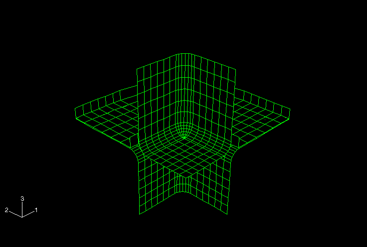

**图 1.5.2–2** 坯料的未变形网格。

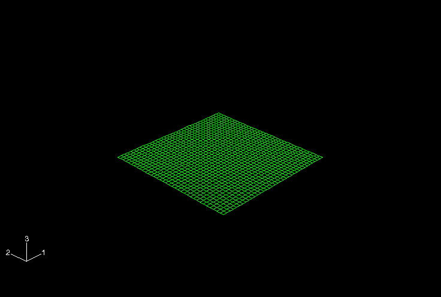

**图 1.5.2–3** Abaqus/Explicit 的壳厚度等值线。

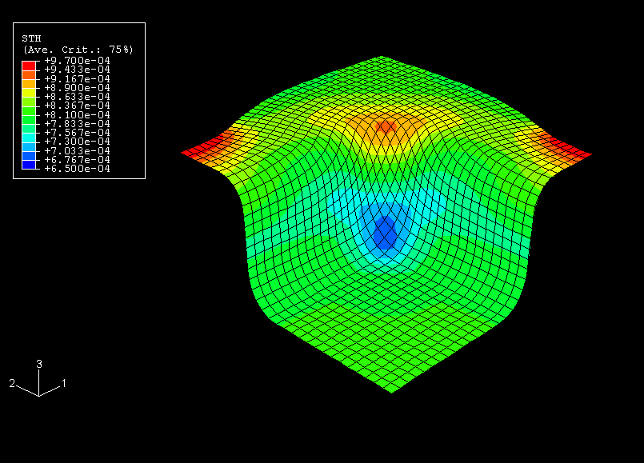

**图 1.5.2–4** 使用表面到表面接触公式的 Abaqus/Standard 壳厚度等值线。

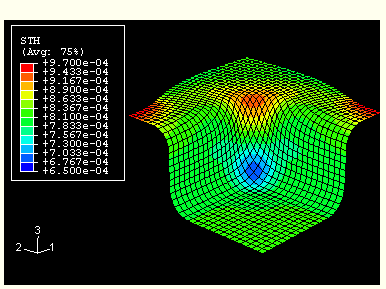

**图 1.5.2–5** 使用节点到表面接触公式的 Abaqus/Standard 壳厚度等值线。

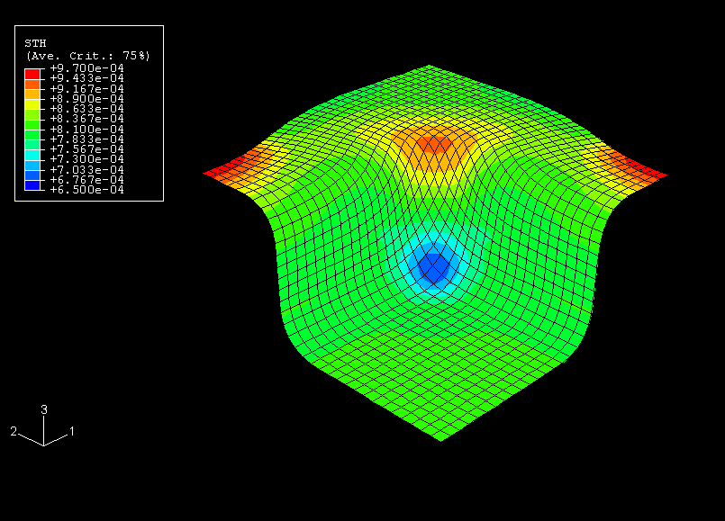

**图 1.5.2–6** Abaqus/Explicit 的等效塑性应变等值线。

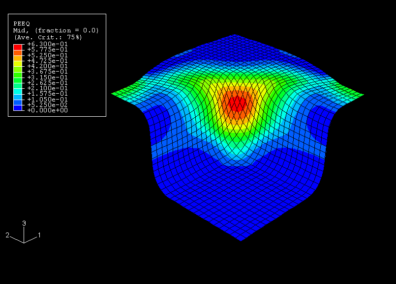

**图 1.5.2–7** 使用表面到表面接触公式的 Abaqus/Standard 等效塑性应变等值线。

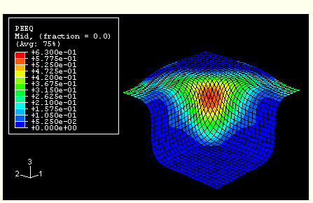

**图 1.5.2–8** 使用节点到表面接触公式的 Abaqus/Standard 等效塑性应变等值线。

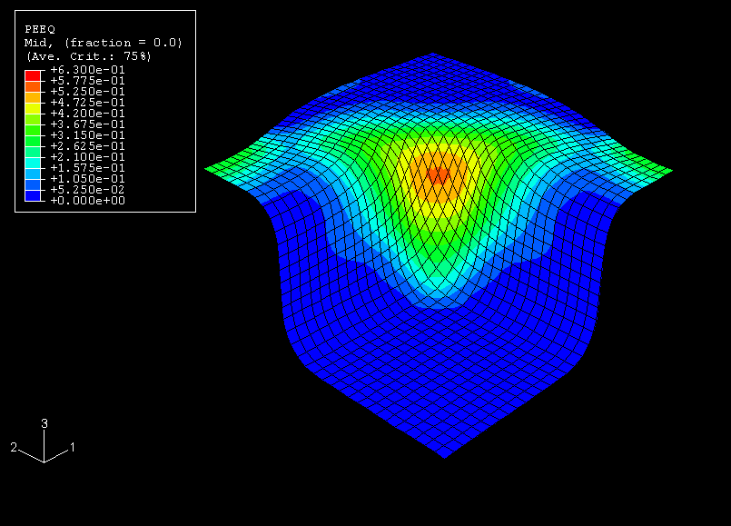

**图 1.5.2–9** 冲头反作用力与冲头位移的关系。

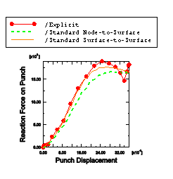

**图 1.5.2–10** 坯料最薄部分的壳厚度与时间的关系。

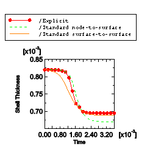

**图 1.5.2–11** 显示 z 方向回弹的等值线图。

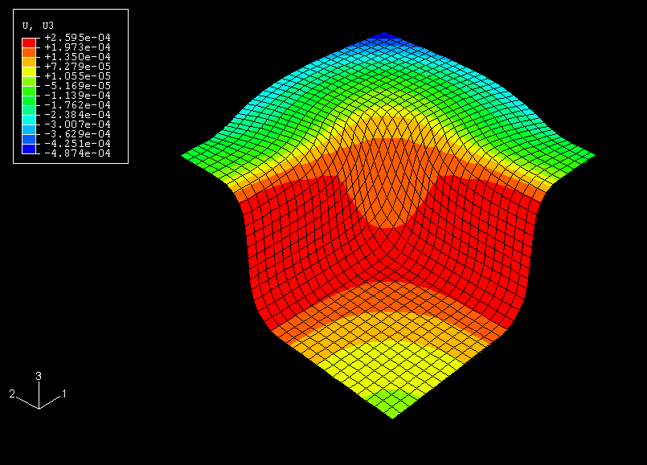

