# 2.1.1 Nonlinear dynamic analysis of a structure with local inelastic collapse

**Product: **Abaqus/Standard  

This example illustrates an inexpensive approach to the prediction of the overall response of a structure that exhibits complex local behavior. The case studied is an unrestrained pipe whip example, where an initially straight pipe undergoes so much motion that the pipe section collapses. A two-stage technique is used to predict the response. First, the collapse of the section is studied under static conditions using a generalized plane strain model. This analysis defines the moment-curvature relationship for the section under conditions of pure bending. It also shows how the section deforms as it collapses. This information can be used to judge whether the deformation is reasonable with respect to possible failure (fracture) of the section. In addition, this first stage analysis can be used to calculate the change in the cross-sectional area enclosed by the pipe as a function of the curvature of the pipe. In a pipe whip case the driving force is caused by fluid jetting from a break in the pipe; and, if the pipe does undergo such large motion, a section may be deformed sufficiently to choke the flow. The second stage of the analysis is to predict the overall dynamic response of the pipe, using the moment-curvature response of the section that has been obtained in the first analysis to define the inelastic bending behavior of the beam. This two-stage approach provides a straightforward, inexpensive method of evaluating the event. The method is approximate and may give rise to significant errors. That aspect of the approach is discussed in the last section below.

### Modeling

The problem is shown in [Figure 2.1.1--1](ch02s01aex62.md#sxmnldynanal-geom). To investigate the static collapse of the section, we consider a unit length of an initially straight pipe subjected to a pure bending moment and assume that plane sections remain plane. We can think of this unit length of pipe as being bounded at its ends by rigid walls and imagine the bending to be achieved by rotation of the walls relative to each other, the end sections being allowed to distort only in the plane of the walls (see [Figure 2.1.1--2](ch02s01aex62.md#sxmnldynanal-model)). With this idealization the pipe section can be modeled and discretized using generalized plane strain elements, as shown in [Figure 2.1.1--2](ch02s01aex62.md#sxmnldynanal-model). Bending occurs about the *x*-axis, and symmetry conditions are prescribed along the *y*-axis. There will not be symmetry about the *x*-axis because of the Poisson's effect. To remove rigid body motion in the *y*-direction, point *A* is fixed in that direction. Symmetry implies no *x*-displacement at  0 and no rotation of the section about the *y*-axis. 4-node and 8-node generalized plane strain elements are used. In addition to the four or eight regular nodes used for interpolation, these elements require one extra reference node that is common to all elements in the model. Degree of freedom 3 at the reference node is the relative displacement between the boundary planes, while degrees of freedom 4 and 5 are the relative rotations of these planes.

Since the problem involves bending the pipe cross-section, regular fully integrated 4-node elements will not provide accurate results, especially when the pipe is fairly thin, because they will suffer from “shear locking”—they will not provide the bending deformation because to do so requires that they shear at their integration points and this shearing requires an unrealistically large amount of strain energy. This problem is avoided by integrating the elements only at their centroids but the elements then exhibit singular modes—modes of deformation that do not cause strain. Abaqus uses orthogonal hourglass generalized strains and associated stiffness to avoid such spurious singular mode behavior. Although these techniques are not always reliable, they can work well and do so in this example. The problem is also modeled with the fully integrated incompatible mode element CPEG4I and the modified triangular element CPEG6M. CPEG4I elements do not have any hourglass modes and perform well in bending. For additional discussion of these points see ["Performance of continuum and shell elements for linear analysis of bending problems," Section 2.3.5 of the Abaqus Benchmarks Guide](../bmk/bmk-link.md#bmk-elm-linbending).

For the dynamic analysis of the pipe whip event the pipeline is modeled with 10 beam elements of type B21. These are planar beam elements that use linear interpolation of displacement and rotation. The moment-curvature relation obtained from the static analysis (shown in [Figure 2.1.1--5](ch02s01aex62.md#sxmnldynanal-mom-curv)) is used in the nonlinear general cross-section to define the bending behavior of the beams. A definition for the axial force versus strain behavior of the beams is also required and is provided by conversion of the uniaxial stress-strain relation given in [Figure 2.1.1--1](ch02s01aex62.md#sxmnldynanal-geom) into force versus strain by multiplying the stress by the current area, *A*, of the cross-section. This current area is computed from the original cross-sectional area  by assuming that the material is incompressible, so 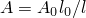, where *l* is the current length and  is the original length.

This definition of the beam section behavior provides for no interaction between the bending and axial stretching, although in most real cases there will actually be some interaction. However, this approximation is probably reasonable in this particular problem since the response is predominantly bending and no appreciable error is introduced by the little stretching that does occur.

### Loading and solution control

In the large-displacement static analysis of the inelastic collapse of the section, rotation of the boundary planes about the *x*-axis is prescribed at degree of freedom 4 of the generalized plane strain reference node. The Riks procedure is used: this method usually provides rapid convergence in such cases, especially when unstable response occurs.

In the large-displacement dynamic analysis the blowdown force is treated as a follower force. During the first 0.06 seconds of the event it has a constant magnitude of 30 kN (this is about three times the load required to produce maximum moment in the static response of the section). After that time the load is zero. The response is computed for a time period of 0.4 seconds, using automatic time incrementation. A half-increment residual tolerance (HAFTOL) of 30 kN (which is the magnitude of the applied load) is used. Since we expect considerable plastic deformation, high frequency response should be damped quickly in the actual event, so that this value of HAFTOL should be adequate to give reasonably accurate results.

### Results and discussion

[Figure 2.1.1--3](ch02s01aex62.md#sxmnldynanal-strains-8r) shows a series of contour plots of equivalent plastic strain (plotted on the deformed configuration) from the static analysis using element type CPEG8R, and [Figure 2.1.1--4](ch02s01aex62.md#sxmnldynanal-strains-4r) shows the same plots for the analysis using element type CPEG4R. [Figure 2.1.1--3](ch02s01aex62.md#sxmnldynanal-strains-8r) clearly shows that the discretization is too coarse or should be rezoned later in the deformation, but it is judged that this is not critical to the overall moment-rotation response prediction. [Figure 2.1.1--5](ch02s01aex62.md#sxmnldynanal-mom-curv) shows the moment-curvature responses predicted by the analyses. The unstable nature of the response is clearly illustrated.

[Figure 2.1.1--6](ch02s01aex62.md#sxmnldynanal-disppos) shows a series of deformed configuration plots from the dynamic analysis. After the shutdown of the force at 0.06 seconds, the momentum of the pipe is enough to cause localization of the deformation at the root of the cantilever as the section collapses there: the pipe whips around this hinge in a full circle and beyond its initial configuration. As well as this major hinge at the root, permanent plastic deformation develops throughout most of the pipe, leaving it bent into an arc. Time history plots of the tip displacement are shown in [Figure 2.1.1--7](ch02s01aex62.md#sxmnldynanal-tipdisp) and of the curvature strain at the localized hinge in [Figure 2.1.1--8](ch02s01aex62.md#sxmnldynanal-curv-time). [Figure 2.1.1--9](ch02s01aex62.md#sxmnldynanal-mom-curvsupp) shows the moment-curvature response for the element at the support and shows the elastic unloading and reloading that takes place during and at the end of the event. [Figure 2.1.1--10](ch02s01aex62.md#sxmnldynanal-energyhist) shows the history of the energy content during the dynamic analysis and clearly shows the initial build-up of kinetic energy, which is then converted almost entirely to plastic dissipation.

This two-stage approach to the problem has the advantages of being simple and computationally inexpensive. It contains some obvious approximations. One is that interaction effects between bending, axial, and torsional behavior are neglected. This lack of interaction between the various modes of cross-sectional response is a basic approximation of the nonlinear beam general section option. In reality, axial or torsional strain will have the effect of reducing the strength of the section in bending. This effect is unlikely to be significant in a case that is dominated by bending, but it can be important if large axial or torsional loadings occur. The approach also neglects the effect of the axial gradient of the cross-sectional behavior on the response. This may be a significant error, but its evaluation would require a detailed, three-dimensional analysis for comparison; and that exercise is beyond the scope of this example. Another possibly significant error is the neglect of rate effects on the response. The cross-sectional collapse involves large strains, which occur in a very short time in the dynamic loadings, so high strain rates arise. It is likely that the material will exhibit strain rate dependence in its yield behavior and will, therefore, be rather stiffer than the static analysis predicts it to be. This should have the effect of spreading the hinge along the pipe and reducing the localization (because the strain rates increase at the section where most deformation is occurring, and that increased strain rate increases the resistance of the section). The magnitude of this effect can be estimated from the solution we have obtained. From [Figure 2.1.1--3](ch02s01aex62.md#sxmnldynanal-strains-8r) we see that typical strains in the section are about 10–20% when the section is far into collapse; and [Figure 2.1.1--8](ch02s01aex62.md#sxmnldynanal-curv-time) shows that, in the dynamic event, it takes about 0.2 seconds for this to occur. This implies average gross strain rates of about 1.0 per second in that period of the response. In typical piping steels such a strain rate might raise the yield stress 5–10% above its static value. This is not a large effect, so the mitigation of localization by rate effects is probably not a major aspect of this event. Again, a more precise assessment of this error would require a fully three-dimensional analysis. Overall it seems likely that this simple and computationally inexpensive two-stage approach to the problem is providing results that are sufficiently realistic to be used in design, although it would be most desirable to compare these results with physical experimental data or data from a full, detailed, three-dimensional analysis to support that statement. Finally, it should be noted that the section considered here is relatively thick (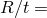3.5). In pipes with thin walls (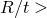20) it is to be expected that the behavior will be affected strongly by internal fluid pressure in the pipe and by the interaction between axial and bending forces. Such thin-walled pipes could be modeled at relatively low cost by using ELBOW elements directly in the dynamic analysis instead of this two-stage approach. An additional concern with very thin pipes is that they are more likely to tear and leak, rather than choke the flow.

### Input files

[nonlindyncollapse_cpeg8r.inp](../eif/nonlindyncollapse_cpeg8r.inp)

Static analysis of the elastic-plastic collapse of the pipe section using CPEG8R elements.

[nonlindyncollapse_nonlingsect.inp](../eif/nonlindyncollapse_nonlingsect.inp)

Dynamic analysis of the inelastic pipe whip response using nonlinear beam general section definitions for the axial and bending behaviors of the pipe.

[nonlindyncollapse_cpeg4i.inp](../eif/nonlindyncollapse_cpeg4i.inp)

Static analysis using element type CPEG4I.

[nonlindyncollapse_cpeg4r.inp](../eif/nonlindyncollapse_cpeg4r.inp)

Static analysis using element type CPEG4R.

[nonlindyncollapse_cpeg4r_eh.inp](../eif/nonlindyncollapse_cpeg4r_eh.inp)

Static analysis using element type CPEG4R with enhanced hourglass control.

[nonlindyncollapse_cpeg6m.inp](../eif/nonlindyncollapse_cpeg6m.inp)

Static analysis using element type CPEG6M.

[nonlindyncollapse_postoutput1.inp](../eif/nonlindyncollapse_postoutput1.inp)

[*POST OUTPUT](../key/key-link.md#usb-kws-hpostoutput) analysis.

[nonlindyncollapse_postoutput2.inp](../eif/nonlindyncollapse_postoutput2.inp)

[*POST OUTPUT](../key/key-link.md#usb-kws-hpostoutput) analysis.

### Figures

**Figure 2.1.1–1** Elastic-plastic pipe subjected to rupture force.

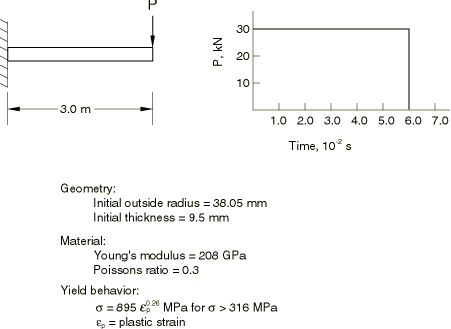

**Figure 2.1.1–2** Initially straight pipe collapsing under pure bending; generalized plane strain model.

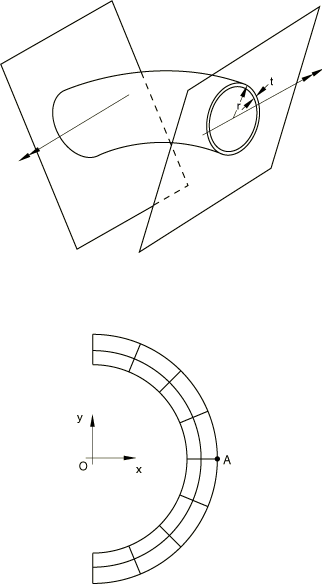

**Figure 2.1.1–3** Equivalent plastic strain contours in collapsing pipe section, element type CPEG8R.

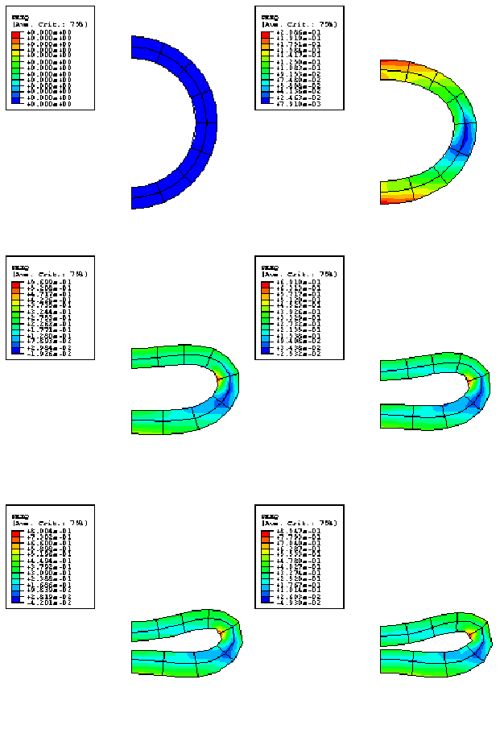

**Figure 2.1.1–4** Equivalent plastic strain contours in collapsing pipe section, element type CPEG4R.

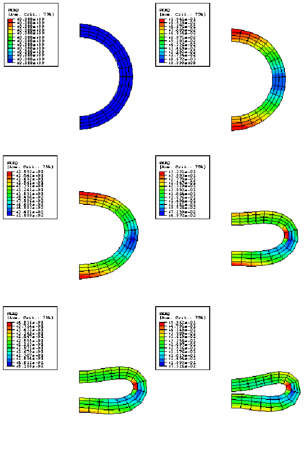

**Figure 2.1.1–5** Moment-curvature response predicted for collapsing section under pure bending.

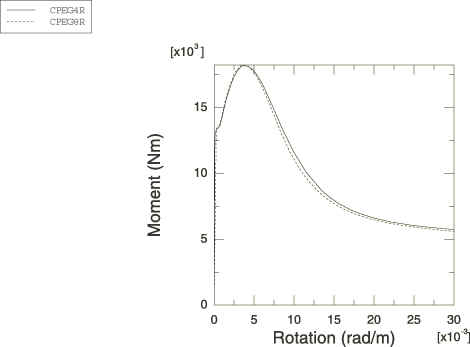

**Figure 2.1.1–6** Displaced positions of pipe, every 20 increments. Initial increments in top figure, final increments in bottom figure.

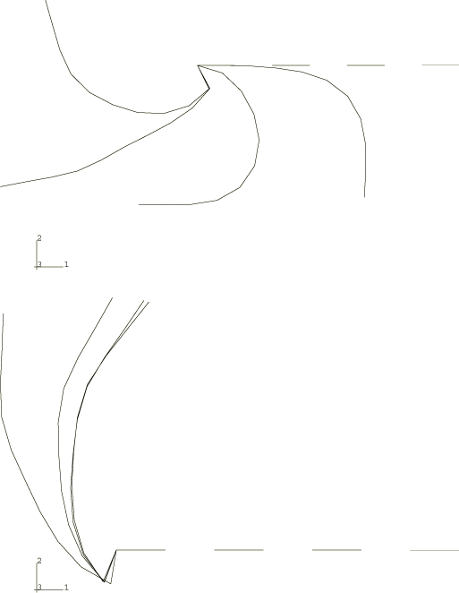

**Figure 2.1.1–7** Tip displacement history.

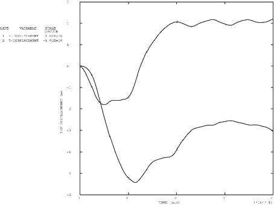

**Figure 2.1.1–8** Curvature-time history for the element at the support.

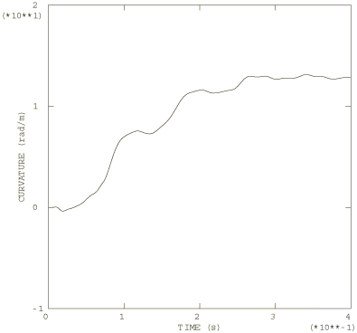

**Figure 2.1.1–9** Moment versus curvature in the element at the support.

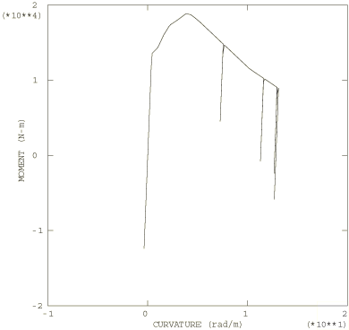

**Figure 2.1.1–10** Energy history for the beam.

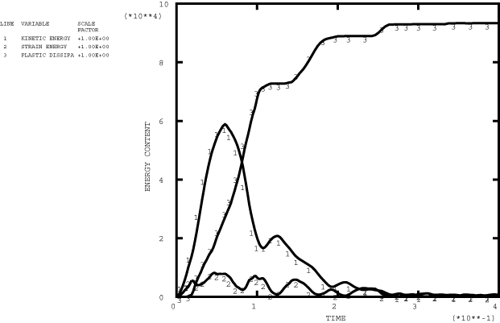

