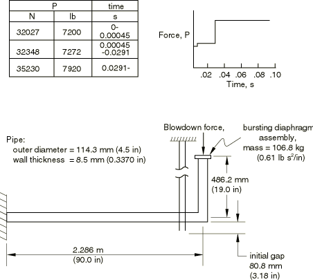
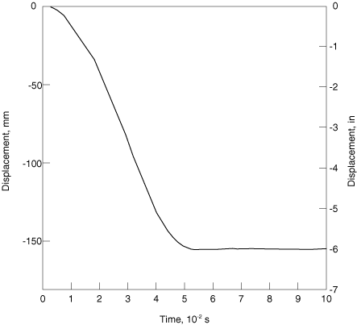
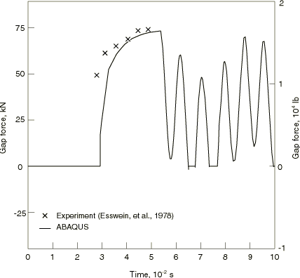

# 2.1.2 Detroit Edison管道甩动实验

**产品：** Abaqus/Standard  

本示例是Detroit Edison公司进行的简单、小位移管道甩动实验的模型，由Esswein等人（1978）报道。问题涉及相当小的位移，但提供了一个有趣的情况，因为有一些（有限的）实验结果可用。这是一个典型的管道甩动约束设计案例。这是一个相当直接的分析，因为约束限制了运动且几何形状非常简单。

### 几何和模型

几何和加载如图2.1.2-1所示。管道有一段2.286 m（90 in）的直管段、一个非常硬的弯头和一根482.6 mm（19 in）长的悬臂"棒"。在"棒"的末端安装了一个破裂膜片以启动泄放。实验中测得的泄放力历史也在图2.1.2-1中显示。所有尺寸、材料属性和此力历史均取自Esswein等人（1978）。

水平管道段用八个B23型单元（平面运动的三次插值梁）建模，棒用两个相同类型的单元建模。弯头被视为完全刚性连接，因此弯头处的节点被两个分支共享。破裂膜片结构建模为106.8 kg（0.61 lb·s²/in）的集中质量。约束建模为单个桁架单元。对于管道，杨氏模量为207 GPa（30×10⁶ lb/in²），初始屈服应力为214 MPa（31020 lb/in²），屈服后加工硬化模量为846*e*⁰·² MPa（122700*e*⁰·² lb/in²）。约束具有131.35 MN/m（750000 lb/in）的弹性刚度、16681 N（3750 lb）的屈服力，以及——屈服时——2.2716*d*⁰·²³⁵ MN/m（12971*d*⁰·²³⁵ lb/in）的力-位移响应。这些值取自Esswein等人（1978），其中指出它们基于静态测量值，应力和力在塑性范围内增加50%以考虑应变率效应。当已知应变率效应对响应重要时，最好使用率相关粘塑性模型直接建模它们。在本例中没有这样做，因为实际材料未指定。

对管道和约束都假设各向同性硬化，因为假定塑性流动处于大流动状态，而不仅仅是初始塑性（其中Bauschinger效应可能很重要）。管道横截面用七点Simpson规则积分：这对这个问题应该有足够的精度。通常，在没有重复大幅度激励的梁类问题中，更高阶的积分方案只在响应的后期显示显著不同的结果，而且差异在这种相当粗糙的模型级别中不太重要。

Esswein等人（1978）提供了图2.1.2-1中所示的泄放力-时间历史。这作为点载荷施加在棒的末端。实际上，泄放期间的流体 力发生在管道弯头处；但由于位移保持很小，这个细节不重要。

### 求解控制

使用自动时间步长，初始时间增量为100 μsec，半增量残差容差设置为4448 N（1000 lb）。此值基于预期的实际力值（本例中为泄放力）：HAFTOL选择为峰值实际力的约10%。这应该在动态积分中提供良好的精度。

### 结果和讨论

撞击约束的节点的位移如图2.1.2-2所示，管道和约束之间的力如图2.1.2-3所示。Esswein等人（1978）的一些实验结果也在图2.1.2-3中显示。

分析似乎很好地预测了管道和约束之间的闭合时间和峰值力。然而，数值解（就像Esswein等人1978年给出的数值解一样）显示力上升时间比实验慢。可能的解释可能是材料模型，其中粘塑性（率相关屈服）效应已被建模为增强的屈服值，如上所述：这意味着，在冲击后立即发生的高应变率下，实际材料可以承受比模型更高的应力，因此响应更 stiff。图2.1.2-3中约束初始加载后间隙力的振荡可能是由约束和管道的基本固有频率差异引起的：这种振荡足够严重，会导致两次轻微分离。

### 输入文件

[detroitedison.inp](../eif/detroitedison.inp)

此分析的输入数据。

[detroitedison_postoutput.inp](../eif/detroitedison_postoutput.inp)

[*POST OUTPUT*](../key/key-link.md#usb-kws-hpostoutput)分析。

### 参考文献

Esswein, G., S. Levy, M. Triplet, G. Chan, and N. Varadavajan, *Pipe Whip Dynamics*, ASME Special Publication, 1978.

### 图形

**图2.1.2-1** Detroit Edison实验。

**图2.1.2-2** 约束端的位移历史。

**图2.1.2-3** 间隙力历史。

