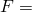

# 2.1.2 Detroit Edison pipe whip experiment

**Product: **Abaqus/Standard  

This example is a model of a simple, small-displacement pipe whip experiment conducted by the Detroit Edison Company and reported by Esswein et al. (1978). The problem involves rather small displacements but provides an interesting case because some (limited) experimental results are available. It is a typical pipe whip restraint design case. It is a rather straightforward analysis because the restraint limits the motion and the geometry is so simple.

### Geometry and model

The geometry and loading are shown in [Figure 2.1.2--1](ch02s01aex63.md#sxmdetroit-experiment). The pipe has a straight run of length 2.286 m (90 in), a very stiff elbow, and a cantilever “stick” 482.6 mm (19 in) long. A bursting diaphragm is installed at the end of the “stick” to initiate the blowdown. The restraint is a set of three U-bolts coupled together. The blowdown force history measured in the experiment is also shown in [Figure 2.1.2--1](ch02s01aex63.md#sxmdetroit-experiment). All dimensions, material properties, and this force history are taken from Esswein et al. (1978).

The horizontal pipe run is modeled with eight elements of type B23 (cubic interpolation beam with planar motion), and the stick is modeled with two elements of the same type. The elbow is treated as a fully rigid junction, so the node at the elbow is shared between the two branches. The bursting diaphragm structure is modeled as a lumped mass of 106.8 kg (0.61 lb s2/in). The restraint is modeled as a single truss element. For the pipe the Young's modulus is 207 GPa (30  106 lb/in2), the initial yield stress is 214 MPa (31020 lb/in2), and the work hardening modulus is 8460.2 MPa (1227000.2 lb/in2) after yield. The restraint has an elastic stiffness of 131.35 MN/m (750000 lb/in), a yield force of 16681 N (3750 lb), and—when yielding—a force-displacement response  2.2716 0.235 MN/m (129710.235 lb/in). These values are taken from Esswein et al. (1978), where it is stated that they are based on measurements of static values with the stresses and forces increased by 50% in the plastic range to account for strain-rate effects. When it is known that strain-rate effects are important to the response it is preferable to model them directly, using a rate-dependent viscoplastic model. This has not been done in this case because the actual material is not specified.

Isotropic hardening is assumed for both the pipe and the restraint since the plastic flows are presumed to be in the large flow regime and not just incipient plasticity (where the Bauschinger effect can be important). The cross-section of the pipe is integrated with a seven-point Simpson rule: this should be of sufficient accuracy for this problem. Generally, in beam-like problems without repeated large magnitude excitation, a higher-order integration scheme would show only significantly different results at late times in the response, and then the differences are not too important in models of this rather unrefined level.

Esswein et al. (1978) provide the blowdown force-time history shown in [Figure 2.1.2--1](ch02s01aex63.md#sxmdetroit-experiment). This is applied as a point load at the end of the stick. In reality the fluid force during blowdown occurs at the piping elbows; but, since the displacements remain small, this detail is not important.

### Solution control

Automatic time stepping is used, with an initial time increment of 100 sec and the value of the half-increment residual tolerance, set to 4448 N (1000 lb). This value is based on actual force values expected (in this case, the blowdown force): HAFTOL is chosen to be about 10% of peak real forces. This should give good accuracy in the dynamic integration.

### Results and discussion

The displacement of the node that hits the restraint is shown in [Figure 2.1.2--2](ch02s01aex63.md#sxmdetroit-disphist), and the force between the pipe and restraint is shown in [Figure 2.1.2--3](ch02s01aex63.md#sxmdetroit-gapforcehist). Some experimental results from Esswein et al. (1978) are shown in [Figure 2.1.2--3](ch02s01aex63.md#sxmdetroit-gapforcehist).

The analysis appears to predict the closure time and the peak force between the pipe and restraint quite well. However, the numerical solution (like the numerical solution given by Esswein et al., 1978) shows a slower force rise time than the experiment. A possible explanation may be the material model, where viscoplastic (strain-rate-dependent yield) effects have been modeled as enhanced yield values, as discussed above: this means that, at the high strain rate that occurs just after impact, the actual material can carry higher stresses than the model, and so will respond more stiffly. The oscillation in the gap force in [Figure 2.1.2--3](ch02s01aex63.md#sxmdetroit-gapforcehist) after the initial loading of the restraint is presumably caused by the difference in the basic natural frequencies of the restraint and the pipe: this oscillation is sufficiently severe to cause two slight separations.

### Input files

[detroitedison.inp](../eif/detroitedison.inp)

Input data for this analysis. 

[detroitedison_postoutput.inp](../eif/detroitedison_postoutput.inp)

[*POST OUTPUT](../key/key-link.md#usb-kws-hpostoutput) analysis.

### Reference

Esswein,  G., S. Levy, M. Triplet, G. Chan, and N. Varadavajan, *Pipe Whip Dynamics, *ASME Special Publication, 1978.

### Figures

**Figure 2.1.2–1** Detroit Edison experiment.

**Figure 2.1.2–2** Displacement history at constrained end.

**Figure 2.1.2–3** Gap force history.

