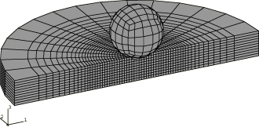
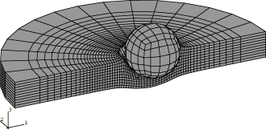
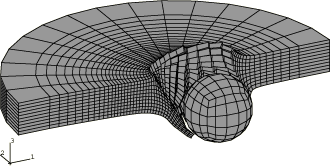
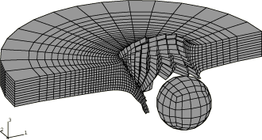
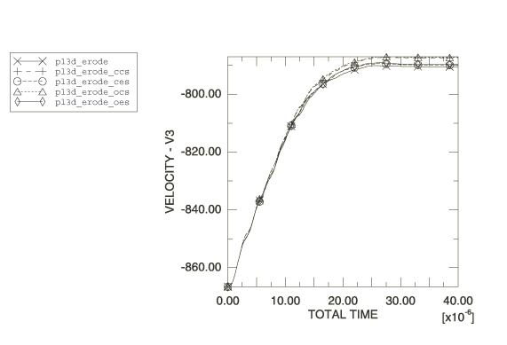
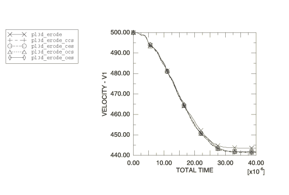

# 2.1.3 Rigid projectile impacting eroding plate

**Product: **Abaqus/Explicit  

This example simulates the oblique impact of a rigid spherical projectile onto a flat armor plate at a velocity of 1000 m/sec. A failure model is used for the plate, thus allowing the projectile to perforate the plate. The example illustrates impact, progressive failure, and the use of infinite elements.

### Problem description

The armor plate has a thickness of 10 mm and is assumed to be semi-infinite in size compared to the projectile. This is accomplished by using CIN3D8 infinite elements around the perimeter of the plate. The plate is modeled using 4480 C3D8R elements. The armor plate material has Young's modulus of 206.8 GPa, Poisson's ratio of 0.3, density of 7800 kg/m3, yield stress of 1220 MPa, and a constant hardening slope of 1220 MPa. The material definition also includes a progressive failure model, which causes Abaqus/Explicit to remove elements from the mesh as they fail. Failure is assumed to occur at an equivalent plastic strain of 100%, at which point the element is removed from the model instantaneously. (The value of the failure strain is chosen somewhat arbitrarily; it is not intended to model any particular material.)

The sphere has a diameter of 20 mm and is assumed to be rigid, with a mass corresponding to a uniform material with a density of 37240 kg/m3. The rotary inertia of the sphere is not needed in the model because we assume there is no friction between the sphere and the plate. Boundary conditions are applied to constrain the motion of the sphere in the *y*-direction. Two approaches for modeling the surface of the sphere are tested: using an analytical rigid surface and using R3D4 rigid elements. Analytical rigid surfaces are the preferred means for representing simple rigid geometries such as this in terms of both accuracy and computational performance. However, more complex three-dimensional surface geometries that occur in practice must be modeled with surfaces formed by element faces. Results for the faceted representations are presented here. The element formulation for the C3D8R elements is modified with the section controls. The advocated formulation for this problem uses the centroid kinematic formulation and a linear combination of stiffness and viscous hourglass control. Additional combinations of kinematic formulation and hourglass control are included for comparison.

Only half of the plate is modeled, using appropriate symmetry boundary conditions in the *x*–*z* plane. The model is shown in [Figure 2.1.3--1](ch02s01aex64.md#exxplateimpact-undefmesh). The complete sphere is modeled for visualization purposes. There are 17094 degrees of freedom in the model.

Since elements in the plate will fail and be removed from the model, nodes in the interior of the plate will be exposed to contact with the surface of the rigid sphere. Thus, contact must be modeled between the surface of the sphere, defined as an element-based surface, and a node-based surface that contains all of the nodes in the plate within a radius of 20 mm of the point of impact. (See ["Eroding projectile impacting eroding plate," Section 2.1.4](ch02s01aex65.md), for an example in which element-based surfaces are used to model erosion.) In the primary input files contact pairs are used to define contact between the surface of the sphere and any of the nodes contained in the node set. Input files that use the general contact algorithm are also provided.

### Results and discussion

The spherical projectile impacts the plate at 1000 m/sec at an angle of 30 to the normal to the plate. Deformed shapes at different stages of the analysis are shown in [Figure 2.1.3--2](ch02s01aex64.md#exxplateimpact-ccsdef-10) through [Figure 2.1.3--4](ch02s01aex64.md#exxplateimpact-ccsdef-40) for the centroid kinematic and the combined (viscous-stiffness form) hourglass section controls (analysis case pl3d_erode_ccs). Early in the analysis, shown in [Figure 2.1.3--2](ch02s01aex64.md#exxplateimpact-ccsdef-10), a relatively small amount of material has been eroded from the surface of the plate and the plate is still deforming under the sphere. In [Figure 2.1.3--3](ch02s01aex64.md#exxplateimpact-ccsdef-30) the plate has been perforated and the projectile is still in contact with the edge of the hole. In [Figure 2.1.3--4](ch02s01aex64.md#exxplateimpact-ccsdef-40) the projectile has exited the plate and is moving away with a constant velocity. [Figure 2.1.3--5](ch02s01aex64.md#exxplateimpact-vertvel) and [Figure 2.1.3--6](ch02s01aex64.md#exxplateimpact-horizvel) show the history of the projectile's velocity ([Table 2.1.3--1](ch02s01aex64.md#table-plate-analopts) shows the analysis options used to obtain these results). The results show close agreement.

In [Figure 2.1.3--2](ch02s01aex64.md#exxplateimpact-ccsdef-10) through [Figure 2.1.3--4](ch02s01aex64.md#exxplateimpact-ccsdef-40) the failed elements have been eliminated by creating a display group in Abaqus/CAE that contains only the active elements.

### Input files

[pl3d_erode_ccs.inp](../eif/pl3d_erode_ccs.inp)

Model using the CENTROID kinematic and COMBINED hourglass section control options.

[pl3d_erode_ccs_gcont.inp](../eif/pl3d_erode_ccs_gcont.inp)

Model using the CENTROID kinematic and COMBINED hourglass section control options and the general contact capability.

[pl3d_erode_ces.inp](../eif/pl3d_erode_ces.inp)

Model using the CENTROID kinematic and ENHANCED hourglass section control options.

[pl3d_erode_ces_gcont.inp](../eif/pl3d_erode_ces_gcont.inp)

Model using the CENTROID kinematic and ENHANCED hourglass section control options and the general contact capability.

[sphere_n.inp](../eif/sphere_n.inp)

External file referenced in this input.

[sphere_e.inp](../eif/sphere_e.inp)

External file referenced in this input.

[pl3d_erode.inp](../eif/pl3d_erode.inp)

Model using the default section controls.

[pl3d_erode_gcont.inp](../eif/pl3d_erode_gcont.inp)

Model using the default section controls and the general contact capability.

[pl3d_erode_ale.inp](../eif/pl3d_erode_ale.inp)

Model using the default section controls and the [*ADAPTIVE MESH](../key/key-link.md#usb-kws-hadaptivemesh) option.

[pl3d_erode_ocs.inp](../eif/pl3d_erode_ocs.inp)

Model using the ORTHOGONAL kinematic and COMBINED hourglass section control options.

[pl3d_erode_ocs_gcont.inp](../eif/pl3d_erode_ocs_gcont.inp)

Model using the ORTHOGONAL kinematic and COMBINED hourglass section control options and the general contact capability.

[pl3d_erode_oes.inp](../eif/pl3d_erode_oes.inp)

Model using the ORTHOGONAL kinematic and ENHANCED hourglass section control options.

[pl3d_erode_oes_gcont.inp](../eif/pl3d_erode_oes_gcont.inp)

Model using the ORTHOGONAL kinematic and ENHANCED hourglass section control options and the general contact capability.

[pl3d_erode_anl.inp](../eif/pl3d_erode_anl.inp)

Model using an analytical rigid surface and the default section controls.

### Table

**Table 2.1.3–1** Analysis section controls tested.
| Analysis File | Relative CPU Time | Section Controls |
| --- | --- | --- |
| Kinematic Formulation | Hourglass Control |
| pl3d_erode | 1.0 | average strain | integral viscoelastic |
| pl3d_erode_ocs | 0.86 | orthogonal | combined |
| pl3d_erode_oes | 0.88 | orthogonal | enhanced |
| pl3d_erode_ccs | 0.73 | centroid | combined |
| pl3d_erode_ces | 0.75 | centroid | enhanced |

### Figures

**Figure 2.1.3–1** Undeformed mesh.

**Figure 2.1.3–2** Deformed shape at 10 microseconds (analysis using the centroid kinematic and combined hourglass section controls).

**Figure 2.1.3–3** Deformed shape at 30 microseconds (analysis using the centroid kinematic and combined hourglass section controls).

**Figure 2.1.3–4** Deformed shape at 40 microseconds (analysis using the centroid kinematic and combined hourglass section controls).

**Figure 2.1.3–5** Vertical component of the projectile velocity.

**Figure 2.1.3–6** Horizontal component of the projectile velocity.

