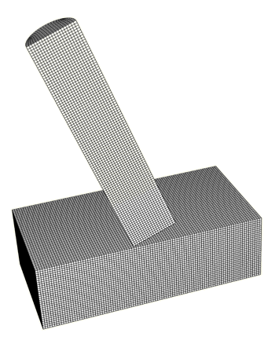
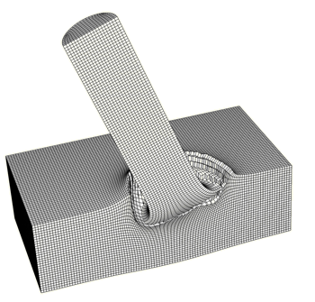
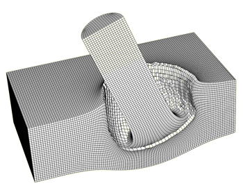
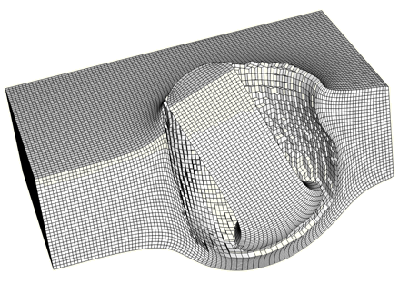
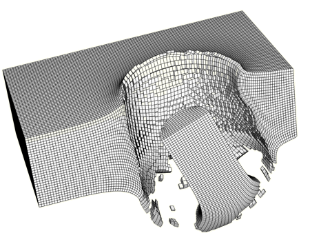
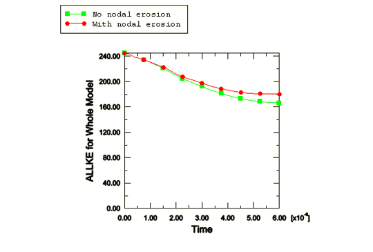

# 2.1.4 Eroding projectile impacting eroding plate

**Product: **Abaqus/Explicit  

This example simulates the oblique impact of a cylindrical projectile onto a flat armor plate at a velocity of 2000 m/sec. The same material model, which includes a failure model with progressive damage, is used for both the projectile and plate. This example demonstrates the ability of the general contact algorithm to model surface erosion on multiple contacting bodies during high-speed impact.

### Problem description

The undeformed mesh is shown in [Figure 2.1.4--1](ch02s01aex65.md#exa-erodecylplate-0). The armor plate has a thickness of 3 mm. A relatively small rectangular region of the plate is modeled for simplicity, with fully fixed boundary conditions specified on three cutting planes and *y*-axis symmetry specified on one cutting plane. The projectile, which is 10 mm in length and has a radius of 1 mm, has an initial speed of 2000 m/sec. The cylindrical axis of the projectile is 20 from perpendicular to the plate, and the initial velocity of the projectile is aligned with its cylindrical axis. Half of the projectile is modeled, with *y*-axis symmetry specified on the cutting plane. The plate and projectile material properties are identical, with Young's modulus of 210 GPa, Poisson's ratio of 0.3, and density of 7800 kg/m3. The yield stress of the material is specified as a function of the equivalent plastic strain at different equivalent plastic strain rates. The material definition also includes failure models with progressive damage, which causes Abaqus/Explicit to remove elements from the mesh as they fail. Both the ductile and shear initiation criteria are used: the ductile criterion is specified in terms of the plastic strain at the onset of damage as a tabular function of the stress triaxiality; the shear criterion is specified in terms of the plastic strain at the onset of damage as a tabular function of the shear stress ratio. The damage evolution energy is assumed to be 500 N/m.

During the analysis elements from both bodies fail, which calls for the use of element-based surfaces that can adapt to the exposed surfaces of the current non-failed elements. The general contact algorithm supports element-based surfaces that evolve in this manner (whereas the contact pair algorithm does not). To model eroding contact, the user must include in the contact domain all surface faces that may become exposed during the analysis, including faces that are originally in the interior of bodies. Only the interior faces that are expected to participate in contact are included in the contact domain in this analysis to minimize the memory use (including interior faces for all elements in the model would more than double the memory use). 

 By default, the general contact algorithm does not include nodal erosion, so contact nodes will still take part in the contact calculations even after all of the surrounding elements have failed. These nodes act as free-floating point masses that can experience contact with the active contact faces. For comparison purposes, the analysis is also conducted including nodal erosion, which causes the nodes to be removed from the contact calculations once all surrounding elements have failed (and can result in computational savings). The momentum transfer associated with free-flying nodes is expected to be significant in this example, so nodal erosion is not recommended.

### Results and discussion

Deformed shapes at different stages of the analysis are shown in [Figure 2.1.4--2](ch02s01aex65.md#exa-erodecylplate-1pt5) through [Figure 2.1.4--5](ch02s01aex65.md#exa-erodecylplate-6) (only active elements are shown in these figures). As shown in [Figure 2.1.4--5](ch02s01aex65.md#exa-erodecylplate-6), the projectile eventually perforates the plate, with approximately the leading half of the projectile elements failing during the analysis. Some broken-off fragments with active elements can be observed in [Figure 2.1.4--5](ch02s01aex65.md#exa-erodecylplate-6). The nodes and exposed faces of such fragments can take part in contact. Nodes no longer attached to any active elements can take part in contact only in the analysis without nodal erosion (which corresponds to the primary input file). [Figure 2.1.4--6](ch02s01aex65.md#exa-erodecylplate-ke) compares total kinetic energy histories for the analyses conducted with and without nodal erosion, respectively. Approximately 32% of the initial kinetic energy is absorbed by the impact for the model without nodal erosion; whereas approximately 26% of the initial kinetic energy is absorbed for the model with nodal erosion.

### Input files

[erode_material.inp](../eif/erode_material.inp)

External file referenced in this input (material definition).

[erode_proj_and_plate.inp](../eif/erode_proj_and_plate.inp)

Model of impact of eroding projectile into eroding plate without nodal erosion.

[erode_proj_and_plate2.inp](../eif/erode_proj_and_plate2.inp)

Model of impact of eroding projectile into eroding plate with nodal erosion.

### Figures

**Figure 2.1.4–1** Undeformed mesh.

**Figure 2.1.4–2** Deformed shape at 1.5 microseconds.

**Figure 2.1.4–3** Deformed shape at 3 microseconds.

**Figure 2.1.4–4** Deformed shape at 4.5 microseconds.

**Figure 2.1.4–5** Deformed shape at 6 microseconds.

**Figure 2.1.4–6** Kinetic energy history.

