# 2.1.5 Tennis racket and ball

**Product: **Abaqus/Explicit  

This example simulates the oblique impact of a tennis ball onto a racket at 6.706 m/sec (264 in/sec). The example illustrates contact between a deforming surface and a node set, the definition of initial stresses, and modeling of a fluid cavity filled with a compressible gas using the surface-based fluid cavity capability.

### Problem description

The strings on the tennis racket are modeled using T3D2 truss elements. They are assumed to be linear elastic, with Young's modulus of 6.895 GPa (1.0  106 psi), Poisson's ratio of 0.3, and density of 1143 kg/m3 (1.07  104 lb sec2in4). The strings are under an initial tension of 44.48 N (10 lb), which is specified using initial stress conditions.

The frame is assumed to be rigid and is modeled using R3D4 elements. The nodes of the strings (truss elements) around the perimeter are the same nodes as those used for the R3D4 elements. The reference node for the rigid frame has boundary conditions applied to constrain all six degrees of freedom on the rigid body so that the frame does not move.

The tennis ball is modeled as a sphere, using 150 S4R shell elements. It is assumed to be made of rubber, modeled with general hyperelastic material properties as a Mooney-Rivlin material with the constants  0.690 MPa (100 lb/in2) and  0.173 MPa (25 lb/in2). Abaqus/Explicit requires some compressibility for hyperelastic materials. In the results shown here,  0.0145 MPa1 (104 psi1). This gives an initial bulk modulus (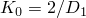) that is 80 times the initial shear modulus . This ratio is lower than the ratio for typical rubbers, but the results are not particularly sensitive to this value in this case because the rubber is unconfined. A more accurate representation of the material's compressibility would be needed if the rubber were confined by stiffer adjacent components or reinforcement. Decreasing  by an order of magnitude (thus increasing the initial bulk modulus by a factor of 10) has little effect on the overall results but causes a reduction in the stable time increment by a factor of  due to the increase in the bulk modulus. The density of the tennis ball is 1068 kg/m3 (1.07  104 lb sec2in4).

The tennis ball is under an initial internal pressure of 41 kPa (6 psi) in addition to the ambient atmospheric pressure of 100 kPa (14.7 psi). An element-based surface is defined on the inside of the tennis ball. This surface is used to define a fluid cavity filled with gas. The properties of the gas inside the tennis ball, molecular weight and molar heat capacity, are defined as part of the fluid behavior of a fluid cavity. The molecular weight and molar heat capacity of the gas are arbitrarily chosen as 0.062 kg (0.1367 lb) and 28.110 J/kg K (112.847 lb in/lbm K). Since the ball is impermeable to gas, the pressure of the gas will rise when the volume of the ball decreases, and vice versa. Static equilibrium gives the value of the initial biaxial membrane stresses in the shell elements of the sphere as 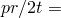 155 kPa (22.5 psi) to balance the internal pressure (here *p* is the internal gas pressure, *r* is the radius of the sphere, and *t* is the tennis ball thickness). This initial state of stress in the ball is defined using initial stress conditions.

A coefficient of friction of 0.1 is specified between the ball and the strings. The ball impacts on the strings at 6.706 m/sec (264 in/sec) at an angle of 15.

No attempt has been made to generate an accurate model of the ball and strings: the model parameters are chosen simply to provide a “soft” ball relative to the strings to illustrate contact effects.

The complete model is shown in [Figure 2.1.5--1](ch02s01aex66.md#exxtennis-undefmesh). There are 2241 degrees of freedom in the model.

An element-based surface is defined on the tennis ball. Since the truss elements are line elements, they do not form a planar surface. A node-based surface is defined that contains all the nodes of the strings. Contact pairs are then used to define contact between the element-based surface of the ball and any of the nodes defined in the node-based surface. An input file that uses the general contact algorithm is also provided.

### Results and discussion

[Figure 2.1.5--2](ch02s01aex66.md#exxtennis-origpos) shows the position of the ball with respect to the strings in the undeformed configuration. The deformed shapes at different stages of the analysis are shown in [Figure 2.1.5--3](ch02s01aex66.md#exxtennis-deform-2) through [Figure 2.1.5--7](ch02s01aex66.md#exxtennis-deform-15). [Figure 2.1.5--8](ch02s01aex66.md#exxtennis-energies) shows a time history of the energies for the model. These include the total internal energy (ALLIE), the kinetic energy (ALLKE), the viscous dissipation (ALLVD), the energy dissipated by friction (ALLFD), the external work (ALLWK), and the total energy balance for the model (ETOTAL). The total energy is seen to remain almost constant during the analysis, as it should. [Figure 2.1.5--9](ch02s01aex66.md#exxtennis-gaspress) and [Figure 2.1.5--10](ch02s01aex66.md#exxtennis-volume) give the history of pressure inside the ball and the history of the actual volume of the ball. It can be seen that both the gas pressure inside the ball and the ball volume stabilize after 10 msec.

### Input files

[tennis_surfcav.inp](../eif/tennis_surfcav.inp)

Analysis using the contact pair approach. 

[tennis_gcont_surfcav.inp](../eif/tennis_gcont_surfcav.inp)

Analysis using the general contact capability.

[tennis_ef1.inp](../eif/tennis_ef1.inp)

External file referenced in all analyses.

[tennis_ef2.inp](../eif/tennis_ef2.inp)

External file referenced in all analyses.

### Figures

**Figure 2.1.5–1** Undeformed mesh.

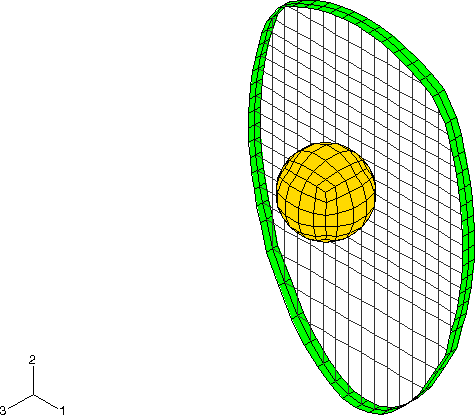

**Figure 2.1.5–2** Original position of ball and strings.

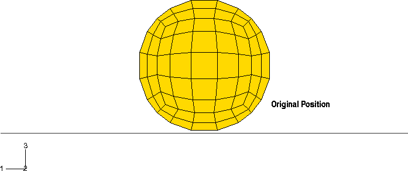

**Figure 2.1.5–3** Deformed shape at 2.5 milliseconds.

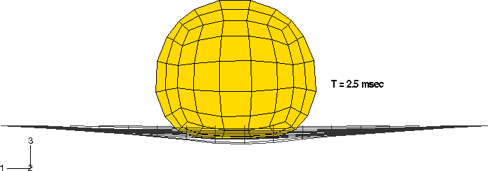

**Figure 2.1.5–4** Deformed shape at 5 milliseconds.

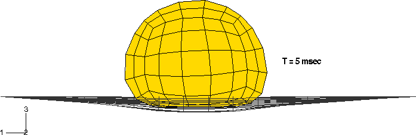

**Figure 2.1.5–5** Deformed shape at 7.5 milliseconds.

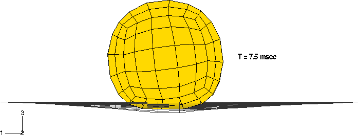

**Figure 2.1.5–6** Deformed shape at 10 milliseconds.

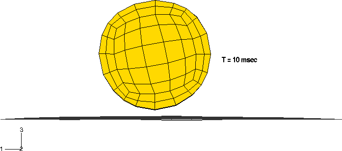

**Figure 2.1.5–7** Deformed shape at 15 milliseconds.

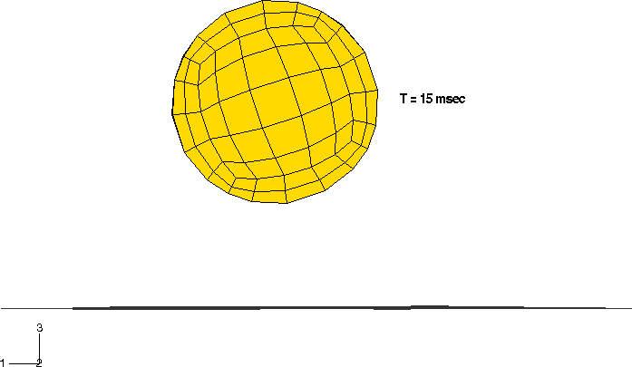

**Figure 2.1.5–8** Energy histories.

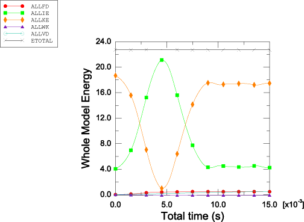

**Figure 2.1.5–9** History of the gas pressure inside the tennis ball.

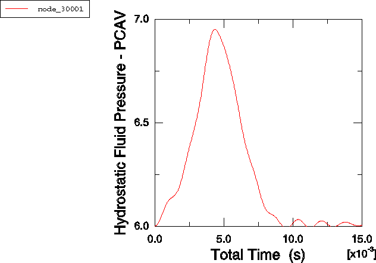

**Figure 2.1.5–10** History of the ball volume.

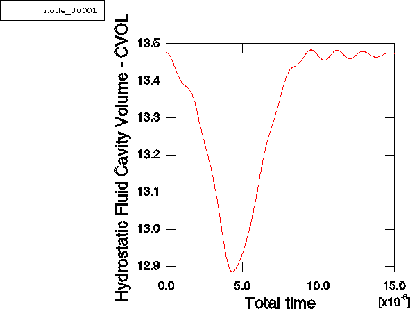

