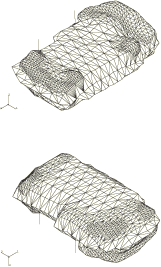
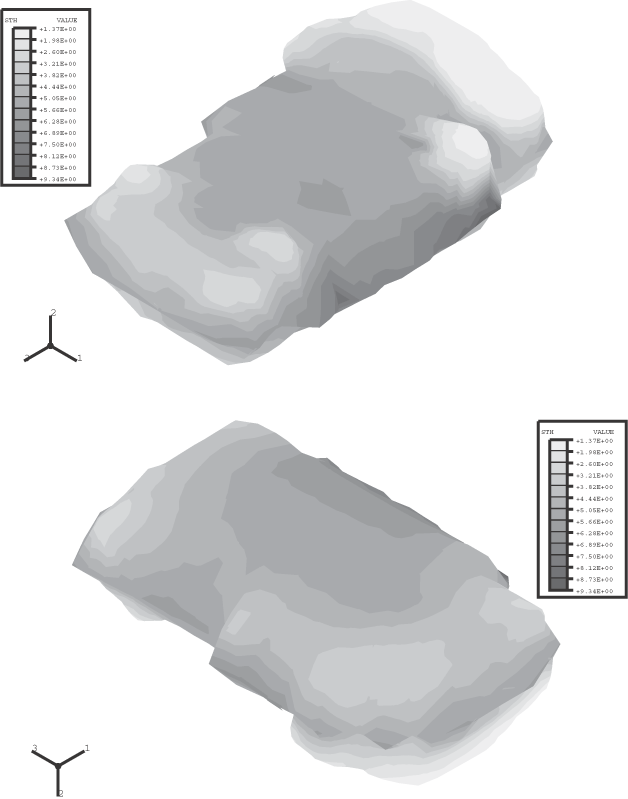
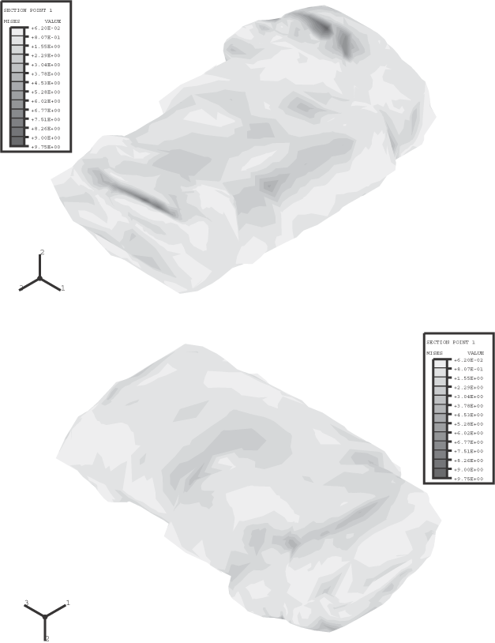
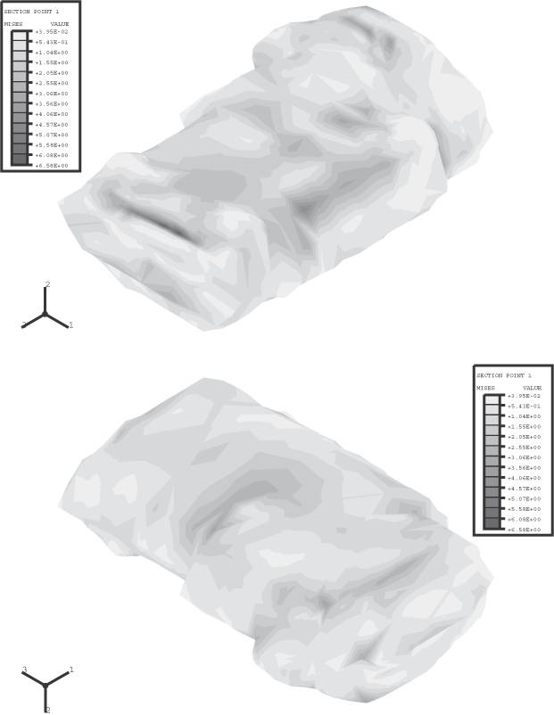

# 2.1.6 带可变壳厚度的加压燃料箱

**产品：** Abaqus/Standard   

此问题展示了Abaqus中的可变壳厚度能力。该示例基于SOLVAY RESEARCH & TECHNOLOGY（见参考文献）进行的分析，分析对象为吹塑塑料燃料箱，尺寸与此处考虑的相似。

### 几何与模型

本示例使用图2.1.6-1所示的网格来建模燃料箱及其支撑带。网格使用2812个3节点壳单元（S3R），支撑带用32个2节点梁单元（B31）建模。根据所需的精度和解决方案的细节，分析师可以识别网格中某些区域，在这些区域中额外的细化或二阶单元可能是合适的。燃料箱将容纳在尺寸为450 mm × 200 mm × 680 mm的箱体内。向油箱静态施加7×10³ MPa的内部压力。

对5 mm的均匀壳厚度和1.38 mm到9.35 mm范围的空间变化壳厚度（见图2.1.6-2）进行分析，这更准确地代表了油箱。均匀厚度分析提供了比较以判断可变厚度的影响。可变厚度分析中建模的塑料总体积约为均匀厚度分析中的93%。对于可变厚度分析，壳横截面表明壳厚度将从用节点厚度指定的节点值插值。对于具有多个积分点的单元，这种方法导致厚度可以在单元上变化。

材料建模为各向同性弹性。塑料燃料箱的杨氏模量为0.6 GPa，泊松比为0.3。钢支撑带的杨氏模量为206.8 GPa，泊松比为0.29。在此示例中几何非线性效应显著，因此在步骤中包含了几何非线性。

### 结果与讨论

可变壳厚度和均匀壳厚度分析的燃料箱内表面（壳单元中的截面点1）Mises应力等值线图分别如图2.1.6-3和图2.1.6-4所示。可变厚度分析中发现的最大Mises应力与均匀厚度分析中发现的最大Mises应力之比为1.5。对于可变厚度分析，最大Mises应力发生在燃料箱皮层相对较薄的位置（见图2.1.6-2和图2.1.6-3）。

检查*y*方向位移分量表明，在可变厚度分析中，油箱在*y*方向的总体膨胀大约大1.5%。

### 输入文件

[pressfueltank_variablethick.inp](../eif/pressfueltank_variablethick.inp)

使用可变壳厚度的示例。

[pressfueltank_uniformthick.inp](../eif/pressfueltank_uniformthick.inp)

使用均匀壳厚度的示例。

[pressfueltank_node.inp](../eif/pressfueltank_node.inp)

两种模型的节点坐标数据。

[pressfueltank_shellelement.inp](../eif/pressfueltank_shellelement.inp)

两种模型的壳单元连接数据。

[pressfueltank_beamelement.inp](../eif/pressfueltank_beamelement.inp)

两种模型的梁单元连接数据。

[pressfueltank_shellthickness.inp](../eif/pressfueltank_shellthickness.inp)

可变壳厚度模型的壳厚度数据。

### 参考文献

SOLVAY RESEARCH & TECHNOLOGY, Plastic Processing Department, Rue de Ransbeek, 310, B-1120 Brussels, Belgium.

### 图形

**图2.1.6-1** 带S3R和B31单元的燃料箱网格。

**图2.1.6-2** 可变厚度分析的壳厚度。

**图2.1.6-3** 可变壳厚度分析的Mises应力解。

**图2.1.6-4** 均匀壳厚度分析的Mises应力解。

