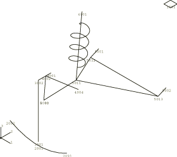
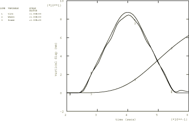
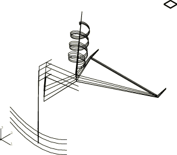
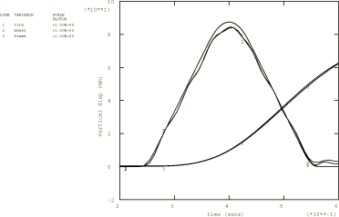
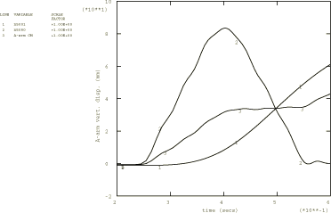
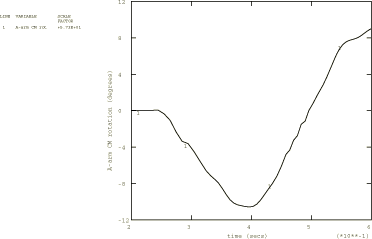

# 2.1.7 Modeling of an automobile suspension

**Product: **Abaqus/Standard  

This example illustrates the use of JOINTC elements. It is repeated to illustrate the use of connector elements. JOINTC elements (["Flexible joint element," Section 32.3.1 of the Abaqus Analysis User's Guide](../usb/usb-link.md#usb-elm-ejoint)) can be used to model the interaction between two nodes that are almost coincident geometrically and that represent a joint that has internal stiffness and/or damping. The behavior of the joint is defined in a local coordinate system (["Orientations," Section 2.2.5 of the Abaqus Analysis User's Guide](../usb/usb-link.md#usb-int-corientation)). This system rotates with the motion of the first node of the element and may consist of linear or nonlinear springs and dashpots arranged in parallel, coupling the corresponding components of relative displacement and of relative rotation in the joint. This feature can be used to model, for example, a rubber bearing in a car suspension.

In the connector element model the JOINTC elements are replaced by connector elements (see ["Connector elements," Section 31.1.2 of the Abaqus Analysis User's Guide](../usb/usb-link.md#usb-elm-econnectorelem)) with connection types CARTESIAN to define the translational behavior and ROTATION to define the rotational behavior. These connection types allow linear or nonlinear spring and dashpot behavior to be defined in a local coordinate system that rotates with the first node on the element. Several different connection types can be used to model the finite rotational response. See ["Connection-type library," Section 31.1.5 of the Abaqus Analysis User's Guide](../usb/usb-link.md#usb-elm-econnectortypelibrary), for connection types using different finite rotation parametrizations. In this model the rotation magnitudes are assumed small. Hence, a rotation vector parametrization of the joint using ROTATION is appropriate.

The primary objective of this example is to verify the accuracy of JOINTC and connector elements in a structure undergoing rigid rotation motions. A secondary objective of this example is to demonstrate the use of equivalent rigid body motion output variables in Abaqus/Standard.

### Geometry and model

The structure analyzed is an automobile's left front suspension subassembly (see [Figure 2.1.7--1](ch02s01aex68.md#sxmjointc-autosuspension)). The physical components included in the assemblage are the tire, the wheel, the axle (hub), the A-arm (wishbone), the coil spring, and the frame. The tire is modeled with a JOINTC or connector element; a curved bar element has been attached for visualization. (The JOINTC or connector element is used because it is a convenient way of defining the tire's nonlinear stiffness in a local coordinate system.) The vertical stiffness of the wheel is represented by a beam element. The axle and A-arm are both modeled with beam elements. The axle is connected to the A-arm by a pin-type MPC in the JOINTC model or with connection type JOIN in the connector model. The coil spring is modeled by a SPRINGA element in the JOINTC model or with connection type AXIAL in the connector model. The automobile frame is represented by a MASS element. The top of the coil spring is connected directly to the frame, while the A-arm is connected to the frame by two JOINTC elements or two connector elements with connection types CARTESIAN and ROTATION (representing the A-arm bushings). The initial position represents a fully weighted vehicle, and the tire and coil spring have a corresponding initial preload.

The first step in the analysis allows the suspension system to reach equilibrium. The second step models the tire moving over a bump in the road. The bump is idealized as a triangular shape 100 mm high by 400 mm long, and the vehicle is assumed to travel at 5 km/hr. A second input file is used to show the effects of large rotation on the suspension response. This file includes an initial rotation step, which rigidly rotates the model by 90 about the vertical axis but is otherwise identical to the first input file. We expect the response from the two analyses to be the same.

In this example we are primarily interested in the equivalent rigid body motion of the A-arm and, in particular, in the average displacement and rotation.

### Results and discussion

The results from the connector element models are qualitatively and quantitatively equivalent to the JOINTC models. Hence, only the JOINTC results are discussed further.

The vertical displacement histories in Step 2 are shown in [Figure 2.1.7--2](ch02s01aex68.md#sxmjointc-disphistories) for the contact point of the tire with the ground, the wheel center, and the frame. [Figure 2.1.7--3](ch02s01aex68.md#sxmjointc-dispshapes) shows a series of overlaid displaced plots as the tire rolls up the bump.

To verify the behavior of the JOINTC elements with large rotations, the second model rigidly rotates the entire structure by 90 before applying the bump excitation. [Figure 2.1.7--4](ch02s01aex68.md#sxmjointc-overlay) shows the displacement time histories from the two models overlaid on the same plot. They are nearly identical.

In the analysis of deformable bodies undergoing large motions it is convenient to obtain information about the equivalent rigid body motions: average displacement and rotation, as well as linear and angular momentum about the center of mass. For this purpose Abaqus provides a set of equivalent rigid body output variables. As indicated above, a secondary objective of this example is to demonstrate the use of these output variables, which represent the average motion of the specified element set. Element output requests to the results file and to the data file are included. If no element set is specified, the average motion of the entire model is given. This type of output can only be requested in a direct-integration implicit dynamic analysis, and only elements that have a mass will contribute to the equivalent rigid body motion. For a precise definition of the equivalent rigid body motion of a deformable body, see ["Equivalent rigid body dynamic motion," Section 2.4.4 of the Abaqus Theory Guide](../stm/stm-link.md#stm-anl-equivrbm).

[Figure 2.1.7--5](ch02s01aex68.md#sxmjointc-aarmvert) and [Figure 2.1.7--6](ch02s01aex68.md#sxmjointc-aarmrotate) have been generated using the equivalent rigid body output variables. [Figure 2.1.7--5](ch02s01aex68.md#sxmjointc-aarmvert) shows the vertical motion of node 5001 (bearing point “A” of the A-arm), node 5080 (point of A-arm nearest the tire), and the average vertical motion of the A-arm (output variable UC3). As expected, the displacement of the center of mass of the component lies between the displacements of its two ends. [Figure 2.1.7--6](ch02s01aex68.md#sxmjointc-aarmrotate) shows the average rigid body rotation of the A-arm component about its center of mass. Rigid body rotations are available about the three global axes. Here we are interested in the rotation about the global *X*-axis (output variable URC1). The standard output for rotations is radians, but the results have been scaled to plot the rotation in degrees.

### Input files

[jointcautosuspension.inp](../eif/jointcautosuspension.inp)

Suspension analysis with JOINTC elements.

[jointcautosuspension_rotated.inp](../eif/jointcautosuspension_rotated.inp)

Rotated suspension analysis with JOINTC elements. This input file includes one extra (rotation) step but is otherwise identical to jointcautosuspension.inp.

[jointcautosuspension_depend.inp](../eif/jointcautosuspension_depend.inp)

Identical to jointcautosuspension.inp, except that field-variable-dependent linear and nonlinear spring properties are used in the JOINTC elements.

[connautosuspension.inp](../eif/connautosuspension.inp)

Suspension analysis with connector elements.

[connautosuspension_rotated.inp](../eif/connautosuspension_rotated.inp)

Rotated suspension analysis with connector elements. This input file includes one extra (rotation) step but is otherwise identical to connautosuspension.inp.

[connautosuspension_depend.inp](../eif/connautosuspension_depend.inp)

Identical to connautosuspension.inp, except that field-variable-dependent linear and nonlinear spring properties are used in the connector elements with connection types CARTESIAN, ROTATION, and AXIAL.

### Figures

**Figure 2.1.7–1** Left front automobile suspension.

**Figure 2.1.7–2** Displacement histories of tire, wheel center, and frame.

**Figure 2.1.7–3** Displaced shapes during positive vertical tire motion.

**Figure 2.1.7–4** Overlay of unrotated and rotated suspension analyses.

**Figure 2.1.7–5** Vertical motion of the A-arm: average and nodal motions.

**Figure 2.1.7–6** Average rotation of the A-arm about its center of mass.

