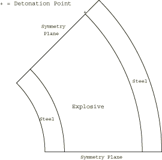
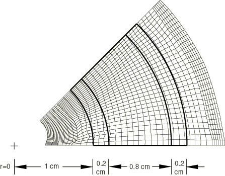
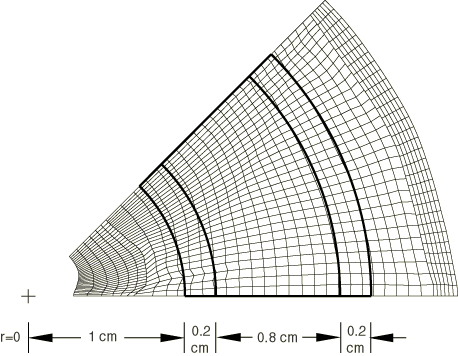
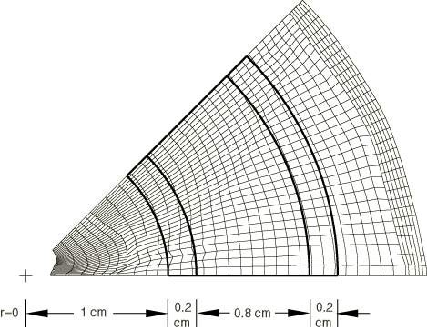
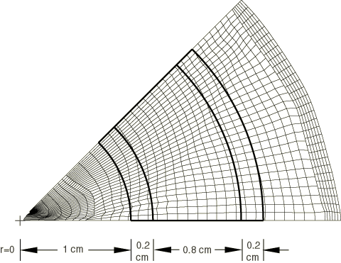

# 2.1.8 爆炸管道封闭

**产品：** Abaqus/Explicit   

此问题说明了以下概念：大变形运动学、状态方程、弹塑性材料、变换、起爆点。

### 问题描述

此分析使用的单位称为c.g.·sec。使用这些单位，长度以厘米（cm）给出，质量以克（gm）给出，时间以微秒（μsec）测量。应力单位为兆巴（M bar）。这些单位通常用于冲击波物理应用，因为压力往往具有约为1的值。

在此示例问题中，两根同心管道之间的环空充满了高能炸药（HE）。内管道内半径为10 mm。外管道内半径为20 mm。两根管道均为钢，壁厚为2 mm。每根管道在径向用6个单元建模，而HE在径向用24个单元建模。

钢管是弹性完全塑性材料，杨氏模量为221.1 GPa（2.211 M bar），泊松比为0.279，屈服强度为430 MPa（0.0043 M bar），密度为7846 kg/m³（7.846 gm/cm³）。

炸药材料使用JWL状态方程建模，爆震波速度=7596 m/sec（0.7596 cm/微秒），A=520.6 GPa（5.206 M bar），B=5.3 GPa（0.053 M bar），R1=4.1，R2=1.2，ω=0.35，密度=1900 kg/m³（1.9 gm/cm³），初始比内能=3.63 M joule/kg（0.0363 T erg/gm）。假设拉伸截止压力为零，并使用拉伸失效模型指定。有关此材料模型的描述，请参阅["状态方程，"Abaqus分析用户指南第25.2.1节](../usb/usb-link.md#usb-mat-ceos)。

炸药材料在圆筒周长的四个点起爆。由于此问题的对称性，只对管道的八分之一进行建模。图2.1.8-1显示了原始几何形状和模型的起爆点位置。使用变换坐标系来定义沿倾斜边界线的对称条件。炸药材料和钢之间的界面使用不允许两种材料之间分离但允许相对滑动的接触无分离关系进行建模。

此分析分两步运行，以减少写入输出数据库文件的输出量。在分析早期，变形不太重要。因此，第一步持续时间为6 μsec。6 μsec后变形变得显著。第二步持续时间为1.5 μsec。

此分析作为使用CPE4R单元的二维情况和使用C3D8R单元的三维情况运行。在三维情况下，位移被约束在面外方向为零。

### 结果与讨论

图2.1.8-2到图2.1.8-5显示了Abaqus/Explicit为二维情况计算的一系列变形形状。原始构型显示叠加在变形形状上。虽然此处未显示，但三维分析的结果与二维分析的结果无法区分。

此问题测试了列出的功能，但不提供它们的独立验证。

### 输入文件

[eoscyl2d.inp](../eif/eoscyl2d.inp)

二维情况。

[eoscyl3d.inp](../eif/eoscyl3d.inp)

三维情况。

### 图形

**图2.1.8-1** 原始几何形状。

**图2.1.8-2** 6.0 μsec后的变形构型，叠加显示原始构型。

**图2.1.8-3** 6.5 μsec后的变形构型，叠加显示原始构型。

**图2.1.8-4** 7.0 μsec后的变形构型，叠加显示原始构型。

**图2.1.8-5** 7.5 μsec后的变形构型，叠加显示原始构型。

