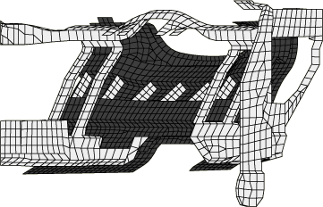
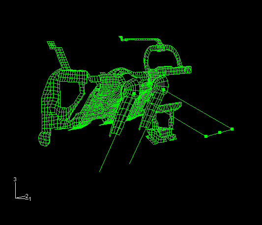
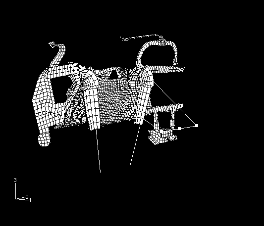
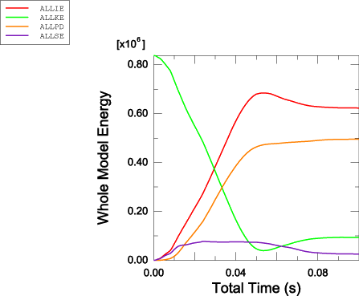
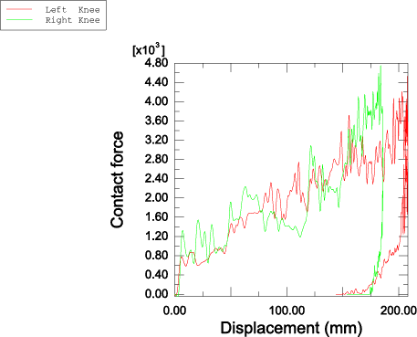

# 2.1.9 Knee bolster impact with general contact

**Product: **Abaqus/Explicit  

This example illustrates the use of the general contact capability in a simulation involving large relative motion between potentially contacting surfaces.

### Problem description

The model represents an automobile knee bolster assembly—the portion of the instrument panel that the occupant's legs impact in the event of a crash. The assembly consists of a hard plastic cover (the knee bolster) supported by a stiff steel substructure. Proper design of this assembly ensures that the occupant's energy is dissipated with a minimum of injury-causing forces. In this simulation the legs approach the knee bolster at 6 m/s, representing unrestrained motion following a 15 mph to dead stop crash event.

The components of the instrument panel are modeled using S3R and S4R shell elements. The bolster is made up of 2690 shell elements, with the material modeled as a von Mises, elastic strain hardening plastic material with a Young's modulus of 2.346 GPa, a Poisson's ratio of 0.4, a density of 1140 kg/m3, and a yield stress of 11.7 MPa. The steel substructure is made up of 1648 elements, with the material modeled as a strain hardening steel with a Young's modulus of 207 GPa, a Poisson's ratio of 0.3, a density of 7700 kg/m3, and a yield stress of 207 MPa. [Figure 2.1.9--1](ch02s01aex70.md#exxknee-initconfig-viw1) shows the model geometry from the rear of the knee bolster prior to impact, and [Figure 2.1.9--2](ch02s01aex70.md#exxknee-initconfig-viw2) shows the knee bolster and knee/leg assembly from a position outboard and behind the driver prior to impact.

The legs are represented as structural members with a surrounding rigid surface. The structural members, representing the bones, are modeled with B31 beam elements and T3D2 truss elements, with the material modeled as elastic with a Young's modulus of 207 GPa, a Poisson's ratio of 0.3, and a density of 7.7 kg/m3. The rigid surfaces, representing the knee and shin, are modeled with R3D4 rigid elements. The body mass is modeled by distributing mass elements at various locations among the nodes of the structural elements.

In the input file [knee_bolster_nsm.inp](../eif/knee_bolster_nsm.inp) the upper body mass is distributed over the hip bones (B31 beam elements) as a nonstructural mass instead of point masses. The nonstructural mass contribution to an element increases both the element mass and the element rotary inertia, thus resulting in an increased stable time increment. This analysis completes in about 40% fewer increments when the nonstructural mass feature is used since the time increment for the problem is controlled by the beam elements. In the input file [knee_bolster_massadjust.inp](../eif/knee_bolster_massadjust.inp), the upper body mass is distributed over the hip bones using mass adjustment instead of point masses. The mass distribution and analysis results are similar to those using nonstructural mass. Input files for similar analyses using pipe elements  (PIPE31) instead of beam elements are included. 

Potential contact among the instrument panel assembly components and between the instrument panel and the legs is modeled using the general contact capability. The general contact inclusions option to automatically define an all-inclusive surface is used and is the simplest way to define contact in the model. In addition, a model that uses the alternative contact pair algorithm is provided; the contact definition is more tedious with the contact pair algorithm.

Initial velocities are defined on the leg components to approximate a 15 mph (6 m/s) crash condition. The hips are constrained to translate in the plane of the seat. The ankles are constrained consistent with fixed planting of the feet on the floor of the car. The dashboard substructure is fixed at locations where it would be welded to the automobile frame; deformations due to this impact are assumed to be confined to the explicitly modeled structure.

### Results and discussion

[Figure 2.1.9--3](ch02s01aex70.md#exxknee-deform-100) shows the deformed shape of the bolster assembly after 100.0 ms.

[Figure 2.1.9--4](ch02s01aex70.md#exxknee-energyhist) shows the energy time history of the whole model: internal energy, kinetic energy, recoverable strain energy, and plastic dissipation. This figure shows that almost all of the body's initial kinetic energy has been transferred by the end of this simulation. Of this transferred amount a small amount has been transferred to elastic deformations in the instrument panel structure and bones, and the balance is lost to plastic dissipation.

[Figure 2.1.9--5](ch02s01aex70.md#exxknee-rxn-v-disp) shows the total knee and shin contact forces (filtered with the SAE 600 filter) measured against the displacement into the bolster. Consistent with the observations of the energy quantities, it is clear that the crash event is complete. The solution obtained using pipe elements is consistent with that using beam elements.

### Acknowledgment

Abaqus would like to thank GE Plastics for supplying the model used in this example.

### Input files

[knee_bolster.inp](../eif/knee_bolster.inp)

Input data for this analysis using the general contact capability.

[knee_bolster_pipe.inp](../eif/knee_bolster_pipe.inp)

Input file for similar analysis involving pipe elements and general contact.

[knee_bolster_cpair.inp](../eif/knee_bolster_cpair.inp)

Input data for this analysis using contact pairs.

[knee_bolster_cpair_pipe.inp](../eif/knee_bolster_cpair_pipe.inp)

Input file for similar analysis involving pipe elements and contact pairs.

[knee_bolster_nsm.inp](../eif/knee_bolster_nsm.inp)

Input data for this analysis using the general contact capability and the nonstructural mass capability to distribute the upper body mass over the hip bones.

[knee_bolster_nsm_pipe.inp](../eif/knee_bolster_nsm_pipe.inp)

Input file for similar analysis involving pipe elements, general contact, and nonstructural mass.

[knee_bolster_massadjust.inp](../eif/knee_bolster_massadjust.inp)

Input data for this analysis using the general contact capability and mass adjustment to distribute the upper body mass over the hip bones.

[knee_bolster_massadjust_pipe.inp](../eif/knee_bolster_massadjust_pipe.inp)

Input file for similar analysis involving pipe elements, general contact, and mass adjustment.

[knee_bolster_ef1.inp](../eif/knee_bolster_ef1.inp)

External file referenced by this analysis.

[knee_bolster_ef2.inp](../eif/knee_bolster_ef2.inp)

External file referenced by this analysis.

[knee_bolster_ef3.inp](../eif/knee_bolster_ef3.inp)

External file referenced by this analysis.

### Figures

**Figure 2.1.9–1** Initial configuration of the knee bolster model (view from behind the bolster).

**Figure 2.1.9–2** Initial configuration of the knee bolster model (view from outboard and behind the driver).

**Figure 2.1.9–3** Deformed shape after 100 ms.

**Figure 2.1.9–4** Time histories of the whole model: internal energy, kinetic energy, recoverable strain energy, and plastic dissipation.

**Figure 2.1.9–5** Front leg reaction forces measured against impact displacement.

