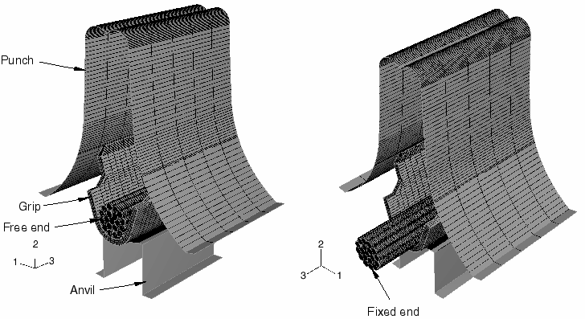
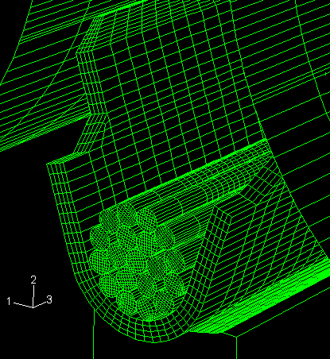
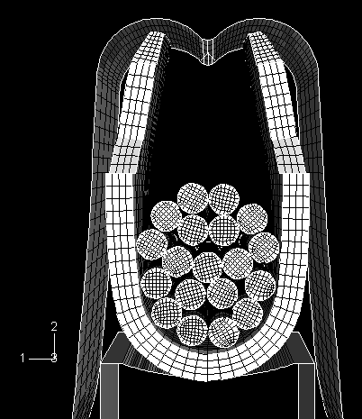
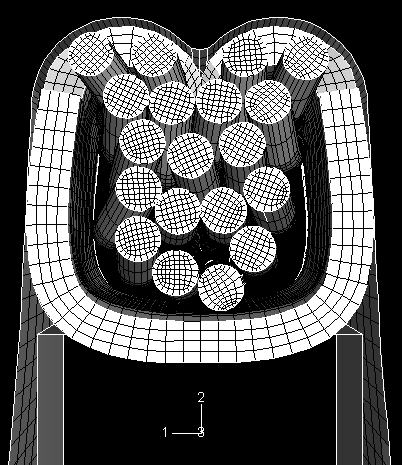
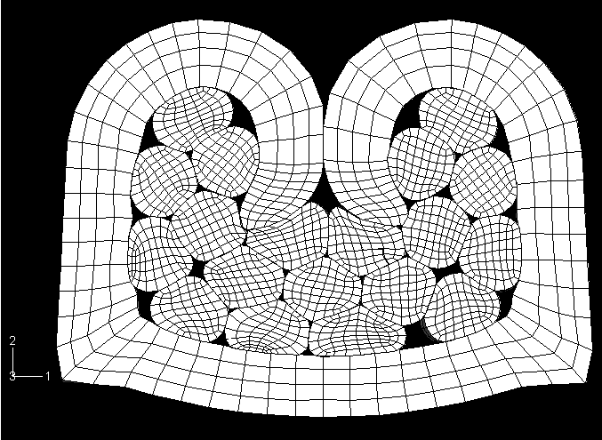
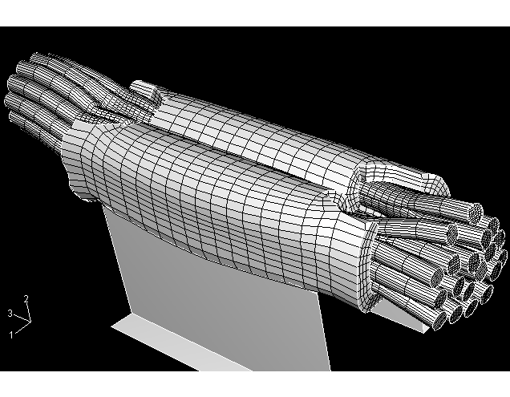
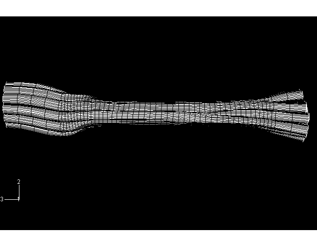

# 2.1.10 带通用接触的压接成形

**产品：** Abaqus/Explicit  

本示例说明了在涉及大量接触表面的模拟中使用通用接触能力。通用接触算法允许非常简单的接触定义，对所涉及表面类型的限制很少（见["在Abaqus/Explicit中定义通用接触相互作用，"Abaqus分析用户指南第36.4.1节](../usb/usb-link.md#usb-cni-acontactgeneral)）。

### 几何和模型

此模型模拟压接成形。现代汽车包含数千个压接接头。在压接接头中，多股线束被机械连接到端接端子，以在接头处提供电气连续性。在压接过程中折叠并压入线束的端子部分称为夹爪。压接接头的正确设计取决于多个竞争因素，包括线股的直径和数量；夹爪的厚度、长度和材料；以及压接工具的几何形状和表面光洁度。压接过程中线束和夹爪的面外挤出是压接形成的重要因素。

在此示例中，夹爪厚度为0.25 mm，尖端有50%的压印。压印是为了帮助夹爪臂在压接过程中被推向冲头顶部时卷曲绕过线束。夹爪臂尖端最初相距3.28 mm（翼尖宽度）。使用19股线束，每股直径为0.28 mm。图2.1.10-1显示了压接成形前的模型几何形状。图2.1.10-2显示了线-夹爪总成的特写视图。

可变形线和夹爪用C3D8R单元建模。冲头和砧建模为使用R3D4单元的刚性部件。夹爪由半硬铜合金制成，建模为von Mises弹塑性应变硬化塑料材料，杨氏模量为112 GPa，泊松比为0.34，屈服应力为391 MPa。线由铜制成，建模为应变硬化塑料材料，杨氏模量为117 GPa，泊松比为0.35，屈服应力为241.5 MPa。

### 分析定义

使用显式动态模拟，因为以下方面会给Abaqus/Standard的静态分析带来困难：
- 由于夹爪和线的自由刚体运动，模型没有静态稳定性。
- 在压接过程中，夹爪臂在被冲头向下推向线束时发生屈曲。
- 分析中存在复杂的多体接触：夹爪臂与19根线之间，每两根线的每种组合之间，以及两个夹爪臂之间。

刚性冲头需要向下行程6.88 mm才能完成压接成形。冲头以不同的速度向下移动，以有效进行分析，而不会使惯性效应显著影响解。最初冲头以50 mm/sec的平均速度移动，以建立夹爪臂和刚性冲头之间的接触。然后冲头以300 mm/sec的速度移动，直到夹爪臂尖端到达冲头顶部。在最后阶段，当夹爪臂屈曲并折叠到线束中时，冲头减速至约20 mm/sec。整个分析时间约为0.12秒。

Abaqus/Explicit中的通用接触算法用于此分析。通用接触包含选项用于自动定义全包容表面，是定义模型接触的最简单方式。由于此表面跨越模型中的所有物体，该表面的自接触包括所有物体之间的相互作用。接触对算法不能使用跨越多个物体的表面；因此，对此模型使用接触对方法将非常繁琐。由于模型中有22个接触部件，除了需要定义一个接触对来建模夹爪的自接触外，还需要定义231个接触对来考虑所有可能的两个表面的组合。

如果指定了截止特征角，模型的几何特征边缘也可以被通用接触算法考虑用于边缘到边缘接触。特征角是由连接到边缘的两个面的法线之间形成的角度。在此分析中大多数相互作用可以通过节点到面的接触被检测到，因此不依赖边缘到边缘接触；但是，当夹爪臂从冲头挤出并接触刚性冲头的边缘时，边缘到边缘接触对于准确强制接触是必要的。表面属性的特征角准则用于为此分析指定20°的截止特征角；因此，所有特征角大于20°的边缘都被包含在通用接触域中。

假设单个线之间、夹爪和砧之间、冲头和夹爪之间以及两个夹爪臂之间存在库仑摩擦。通用接触属性分配用于为各种类型的配对分配适当的摩擦系数。

砧在分析过程中保持静止。线束的一端完全约束，另一端没有边界条件。

### 结果和讨论

图2.1.10-3显示了夹爪臂到达冲头顶部后（39毫秒）压接总成的变形形状。图2.1.10-4显示了夹爪臂绕冲头顶部弯曲并部分折叠到线束中后（76毫秒）压接总成的变形形状。夹爪臂在图2.1.10-3和图2.1.10-4之间发生屈曲。图2.1.10-5显示了取自夹爪中点的夹爪和线束的横截面视图。此图显示了107毫秒后线的变形，当时冲头已向下行程6.605 mm。图2.1.10-6显示了模型的最终变形形状（为清晰起见已移除刚性冲头）。夹爪臂已完全折叠到线束中，冲头已完成其整个向下行程。此图还显示了变形后线束的面外挤出。

图2.1.10-7显示了去除周围夹爪后线束的最终形状。此图显示了原本圆形的线在压接成形过程中发生的变形。这种变形对于压接接头的正确形成至关重要裸铜线实际上覆盖着一层在铜暴露于空气时形成的脆性氧化铜层。压接成形的目标是通过在每根线中引起显著的表面应变来打破这个氧化铜层，并将铜暴露于夹爪表面。

### 输入文件

[crimp_gcont.inp](../eif/crimp_gcont.inp)

此分析的输入数据。

[crimp_assembly.inp](../eif/crimp_assembly.inp)

此分析引用的外部文件。

### 参考文献

Villeneuve, G., D. Kulkarni, P. Bastnagel, and D. Berry, "Dynamic Finite Element Analysis Simulation of the Terminal Crimping Process," 42nd IEEE Holm Conference, Chicago, IL, October 1996.

Villeneuve, G., P. Bastnagel, D. Berry, and C. S. Nagaraj, "Determining the Factors Affecting Crimp Formation Using Dynamic Finite Element Analysis," 30th IICIT Connector and Interconnection Symposium, Anaheim, CA, September 1997.

Berry, D. T., "Development of a Crimp Forming Simulator," ABAQUS User's Conference Proceedings, pp. 125–137, 1998.

### 图形

**图2.1.10-1** 压接成形模型的初始构型（相反的等轴测视图）。

**图2.1.10-2** 线-夹爪总成的特写视图。

**图2.1.10-3** 39毫秒后的变形形状（前视图）。

**图2.1.10-4** 76毫秒后的变形形状（前视图）。

**图2.1.10-5** 107毫秒后夹爪和线束的横截面视图（未显示冲头和砧）。

**图2.1.10-6** 线-夹爪总成最终变形构型的等轴测视图（未显示刚性冲头）。

**图2.1.10-7** 线束的最终变形形状（未显示夹爪）。

