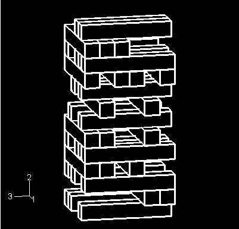
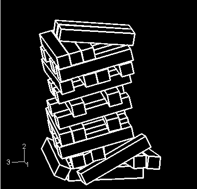
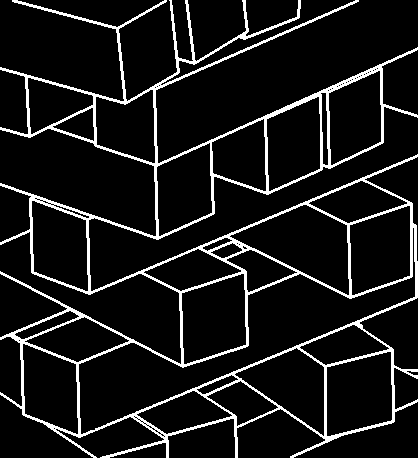
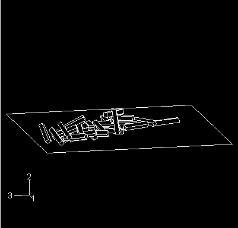

# 2.1.11 带通用接触的块体堆垛坍塌

**产品：** Abaqus/Explicit  

本示例说明了在涉及大量接触体的模拟中使用通用接触能力。通用接触算法允许非常简单的接触定义，对所涉及表面类型的限制很少（见["在Abaqus/Explicit中定义通用接触相互作用，"Abaqus分析用户指南第36.4.1节](../usb/usb-link.md#usb-cni-acontactgeneral)）。

### 问题描述

该模型模拟块体堆垛的坍塌。模型的未变形构型如图2.1.11-1所示。有35个块体，每个块体尺寸为12.7×12.7×76.2 mm（0.5×0.5×3英寸）。块体堆叠在刚性地板上。堆垛承受重力加载。假设在分析开始前不久，堆垛底部附近的一个关键块体已被移除，引发了坍塌。

每个块体用单个C3D8R单元建模。使用粗网格突出了通用接触算法的边缘到边缘接触能力，因为大多数块体间的相互作用不会导致节点穿透面。

分析了两种不同情况。在第一种分析中块体是刚性的。在第二种分析中块体是可变形的。在后一种情况下，块体材料假定为线弹性，杨氏模量为12.135 GPa（1.76×10⁶ psi），泊松比为0.3，密度为577.098 kg/m³（5.4×10⁻⁵ lb·s²/in⁴）。对于假设刚性块体的分析，只有密度是相关的。此外，可变形分析使用了ENHANCED沙漏控制。刚性地板使用单个R3D4单元建模为离散刚性表面。

此模型涉及大量接触体。通用接触能力大大简化了接触定义，因为595种可能的块体间配对不需要单独指定。通用接触包含选项用于自动定义全包容表面，是定义模型接触的最简单方式。假设单个块体之间以及块体和地板之间存在摩擦系数为0.15的库仑摩擦。通用接触属性分配用于分配此非默认接触属性。

默认情况下，Abaqus/Explicit中的通用接触算法考虑结构单元上周长边缘的边缘到边缘接触。模型的几何特征边缘也可以被通用接触算法考虑用于边缘到边缘接触；包括几何特征边缘在此分析中至关重要。为表面属性的特征角准则指定了20°的截止特征角，以指示所有特征角大于20°的边缘应被考虑用于边缘到边缘接触。特征角是由连接到边缘的两个面的法线之间形成的角度。

重力载荷的大小增加了10倍，以用较短的分析时间促进边缘到边缘接触能力的演示。分析执行时间为0.15秒。对于具有刚性块体的分析，模型中没有可变形单元来控制稳定时间增量。为此指定了1×10⁻⁶秒的固定时间增量，类似于可变形块体分析中使用的时间增量。为刚性块体分析选择的时间增量将影响接触算法使用的罚刚度，因为罚刚度与时间增量的平方成反比。

### 结果和讨论

显示了刚体情况的结果。可变形情况的结果与刚性模型结果非常相似。

图2.1.11-2显示了0.0375秒后块体总成的位移形状。块体堆垛已开始在外力作用下坍塌。图2.1.11-3显示了0.1125秒后坍塌块体的特写视图。此图清楚显示了单个块体的几何特征边缘在坍塌过程中相互接触。图2.1.11-4显示了块体的最终构型。堆垛已在刚性表面上完全坍塌。

### 输入文件

[blocks_rigid_gcont.inp](../eif/blocks_rigid_gcont.inp)

刚体分析的输入文件。

[blocks_rigid_assembly.inp](../eif/blocks_rigid_assembly.inp)

刚体分析引用的外部文件。

[blocks_deform_gcont.inp](../eif/blocks_deform_gcont.inp)

可变形分析的输入文件。

[blocks_deform_assembly.inp](../eif/blocks_deform_assembly.inp)

可变形分析引用的外部文件。

### 图形

**图2.1.11-1** 块体堆垛的初始构型。

**图2.1.11-2** 0.0375秒后的位移形状。

**图2.1.11-3** 0.1125秒后坍塌块体的特写视图。

**图2.1.11-4** 模型的最终构型。

