# 2.1.12 带泡沫冲击限制器的容器坠落

**产品：** Abaqus/Explicit

一个容纳容器部分填充有液体和泡沫冲击限制器。整个包装从9.09 m（30 ft）高度坠落到刚性表面，导致冲击速度为13.35 m/sec（525.3 in/sec）。此问题说明了初始速度条件的使用的分析，以及包含液体和结合可压碎泡沫以吸收冲击能量的结构分析。关于此问题的实验和数值结果已由Sauv等人（1993）报道。参考文献中给出的数值结果使用了相对粗的有限元网格。在此示例中给出了与参考文献中使用的相同粗网格以及更细化网格的结果。展示了连续体网格和粒子方法。

### 模型描述

如图2.1.12-2所示的容纳容器由两个隔室组成。上隔室围绕液体，由不锈钢（304L）制成。高度为580 mm（22.8 in），直径为300 mm（11.8 in），壁厚为4.76 mm（0.187 in）。顶部软钢盖厚度为9.52 mm（0.375 in）。水填充到522 mm（20.55 in）的深度，这是容器容量的90%。图2.1.12-3显示了用于建模液体的C3D8R单元的原始粗网格。在液体和上隔室内表面之间定义接触条件。

冲击限制器由聚氨酯泡沫组成，包含在容器底部的软钢隔室中。泡沫冲击限制器高度为127.3 mm（5.01 in）。图2.1.12-4显示了用于建模泡沫的粗网格。在泡沫和容器底部隔室内表面之间定义接触条件。泡沫冲击限制器和液体/不锈钢衬垫由厚度为12.7 mm（0.5 in）的软钢隔板隔开。泡沫表面顶部和此隔板之间存在12.7 mm（0.5 in）的空气间隙。

在实验中，压力传感器位于容器冲击限制器顶部中心线的聚氨酯泡沫中。此结果与从泡沫模型顶部中心线处单元获取的垂直应力-时间历史进行比较。

分析了轴对称和三维模型。图2.1.12-5显示了通过组装图2.1.12-2到图2.1.12-4所示部件形成的三维模型。等效轴对称模型如图2.1.12-6所示。相应的平滑粒子动力学模型对水的泡沫部件都使用了PC3D单元。

接触对定义在实体和壳之间。在壳上定义基于单元的表面，定义包含实体或粒子单元外表面上节点的基于节点的表面。还提供了使用替代通用接触算法的输入文件。在设计原始网格时未考虑壳厚度，实体的外表面通常与封闭壳的中面重合。这将导致初始过盈量为壳厚度的一半，但接触在壳的中面被强制执行，如同壳具有零厚度。基于节点表面的使用意味着接触对采用纯主-从关系。这在此问题中很重要，因为当在壳和实体之间定义接触时，Abaqus/Explicit中的默认设置是定义纯主-从关系，实体为主，壳为从。在这种情况下，壳结构比液体和泡沫结构要硬得多，因此必须反转主-从角色。

对于轴对称模型，分析了使用不同泡沫和流体单元截面控制的两种情况。第一种情况使用刚度和粘性沙漏控制的线性组合；第二种情况使用默认截面控制（沙漏控制的积分粘弹性形式）。三维模型也有两种情况，使用不同泡沫和流体单元的截面控制。第一种情况使用正交运动学公式和组合（粘性-刚度形式）沙漏控制；第二种三维情况使用默认截面控制（平均应变运动学公式和沙漏控制的积分粘弹性形式）。使用的截面控制总结在表2.1.12-1中。所有分析情况都使用了粗和细化网格。

### 材料描述

一般材料属性列于表2.1.12-2中。水和泡沫的材料模型在下面进一步描述。

**水：**

水被视为简单的流体动力学材料模型。这提供了零剪切强度和由以下给出的体积响应：

其中*K*是体积模量，值为2068 MPa（300000 psi）。此模型使用Abaqus/Explicit提供的线性*p*状态方程模型定义。线性*p*Hugoniot形式为：

其中*μ*与标称体积应变度量相同，*μ*=*ρ*/*ρ*₀-1。由于*K*=*ρ*₀*c*₀²，设定参数*A*=*B*=0给出了前面定义的简单静水体积响应。在此分析中*c*₀=1450.6 m/sec（57100 in/sec），*ρ*₀=983.2 kg/m³（0.92×10⁴ lb·s²/in⁴）。假设拉伸截止压力为零，并使用拉伸失效模型指定。有关此材料模型的描述，请参阅["状态方程，"Abaqus分析用户指南第25.2.1节](../usb/usb-link.md#usb-mat-ceos)。

**泡沫：**

聚氨酯泡沫使用了可压碎泡沫模型。在此模型中，流动势*h*选择为：

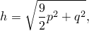

其中*q*是Mises等效应力，*p*是静水压力。屈服面定义为：

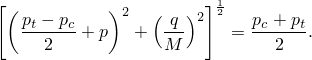

Sauv等人使用了"土和可压碎泡沫"模型，该模型最初在Krieg（1978）的一份未发表的报告中定义，基于屈服应力依赖于平均体积压力的Mises塑性模型。体积变形允许塑性行为，由定义压力与体积应变关系的表格数据定义。此模型在显式动力学算法中易于实现，并且是有用的，因为偏应变和体积项只是松散耦合的。然而，它需要经验丰富的分析师来确保获得有意义的结果，主要是因为该模型在偏应变下不能很好地匹配物理行为。

为了定义屈服面的初始形状，具有体积硬化的Abaqus/Explicit可压碎泡沫模型需要单轴压缩中的初始屈服应力σᵧ₀；静水拉伸中的强度大小σₘ；和静水压缩中的初始屈服应力σᶜ₀。Sauv等人将泡沫模型的依赖压力的屈服面定义为：

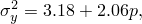

其中应力单位为MPa，压力在压缩中为正。为了将Abaqus/Explicit可压碎泡沫模型校准到此依赖压力的数据，我们观察到对于单轴压缩情况σᵧ₀=*p*/3。将此值代入上面的方程并求解σᵧ₀得到σᵧ₀=2.16 MPa（313.3 psi）。σₘ的值通过求解上面的方程得到σₘ=1.54 MPa（223.8 psi）。σᶜ₀的值在参考文献中给出为σᶜ₀=5.52 MPa（800.0 psi）。

参考文献中的压力-体积应变数据在表2.1.12-3中给出。表2.1.12-4显示了转换为Abaqus/Explicit体积硬化模型所需形式的单轴应力-塑性应变数据。每种形式的数据如图2.1.12-1所示。

### 结果和讨论

三维和轴对称模型在5毫秒时的变形几何形状如图2.1.12-7和图2.1.12-8所示。轴对称模型使用组合沙漏控制进行分析。三维模型使用正交运动学和组合沙漏控制。图2.1.12-9显示了位于泡沫中压力传感器处的单元的垂直应力与时间的关系图；报告了具有先前截面控制选项的模型结果以及使用默认截面控制选项的分析结果以供比较（见表2.1.12-1）。轴对称和三维结果与实验压力曲线进行了比较。实验曲线的时间原点未在参考文献中定义；因此，移动了实验曲线，使得传感器中压力变为正值的时被假定为冲击发生的时间。在响应的前2毫秒期间，数值压力结果显示了相对于实验结果的显著振荡。这部分是因为网格相当粗，部分是因为实验中的压力传感器在其响应中表现出惯性，不会报告时间上的尖锐梯度。在接下来的3毫秒期间，数值结果与实验结果更接近。使用不同截面控制选项进行的分析比较良好。

更细化的三维网格如图2.1.12-10所示。细化的轴对称模型是*r*–*z*平面中使用的相同模型。这些模型的变形几何形状如图2.1.12-11（使用正交运动学和组合沙漏控制）和图2.1.12-12（使用组合沙漏控制）所示。细化模型的垂直应力历史如图2.1.12-13所示，使用了与粗网格相同的截面控制（见表2.1.12-1）。数值结果显示了相对于实验结果的较少振荡，与粗网格获得的结果相比。它们在接下来的3毫秒响应期间与实验结果比较良好。此外，图2.1.12-11显示细化网格消除了由于其零剪切强度导致的大部分流体类沙漏响应。图2.1.12-14显示了三维权值细化模型和平滑粒子动力学模型的垂直应力结果比较。

### 输入文件

[cask_drop_axi_cs.inp](../eif/cask_drop_axi_cs.inp)

使用COMBINED沙漏控制的粗轴对称模型。

[cask_drop_3d_ocs.inp](../eif/cask_drop_3d_ocs.inp)

使用ORTHOGONAL运动学和COMBINED沙漏控制的粗三维模型。

[cask_drop_3d_ocs_gcont.inp](../eif/cask_drop_3d_ocs_gcont.inp)

使用ORTHOGONAL运动学和COMBINED沙漏控制以及通用接触能力的粗三维模型。

[cask_drop_axi.inp](../eif/cask_drop_axi.inp)

使用默认截面控制的粗轴对称网格。

[cask_drop_3d.inp](../eif/cask_drop_3d.inp)

使用默认截面控制的粗三维网格。

[cask_drop_3d_gcont.inp](../eif/cask_drop_3d_gcont.inp)

使用默认截面控制和通用接触能力的粗三维网格。

[cask_drop_axi_r_cs.inp](../eif/cask_drop_axi_r_cs.inp)

使用COMBINED沙漏控制的细化轴对称模型。

[cask_drop_3d_r_ocs.inp](../eif/cask_drop_3d_r_ocs.inp)

使用ORTHOGONAL运动学和COMBINED沙漏控制的细化三维模型。

[cask_drop_3d_r_ocs_gcont.inp](../eif/cask_drop_3d_r_ocs_gcont.inp)

使用ORTHOGONAL运动学和COMBINED沙漏控制以及通用接触能力的细化三维模型。

[cask_drop_axi_r.inp](../eif/cask_drop_axi_r.inp)

使用默认截面控制的细化轴对称网格。

[cask_drop_3d_r.inp](../eif/cask_drop_3d_r.inp)

使用默认截面控制的细化三维网格。

[cask_drop_3d_r_gcont.inp](../eif/cask_drop_3d_r_gcont.inp)

使用默认截面控制和通用接触能力的细化三维网格。

[cask_drop_3d_sph.inp](../eif/cask_drop_3d_sph.inp)

使用平滑粒子动力学方法的三维模型。

### 参考文献

Krieg, R. D., "A Simple Constitutive Description for Soils and Crushable Foams," SC-DR-72-0883, Sandia National Laboratories, Albuquerque, NM, 1978.

Sauv, R. G., G. D. Morandin, and E. Nadeau, "Impact Simulation of Liquid-Filled Containers Including Fluid-Structure Interaction," Journal of Pressure Vessel Technology, vol. 115, pp. 68–79, 1993.

### 表格

**表2.1.12-1** 测试的分析截面控制。

| 分析标签 | 截面控制 | | |
| --- | --- | --- | --- |
| 运动学公式 | 沙漏控制 | | |
| AXI | n/a | integral viscoelastic |
| AXI CS | n/a | combined |
| 3D | average strain | integral viscoelastic |
| 3D OCS | orthogonal | combined |

**表2.1.12-2** 材料属性。

| 属性 | A36 | 304L | 液体 | 泡沫 |
| --- | --- | --- | --- | --- |
| 密度，*ρ*（kg/m³） | 8032 | 8032 | 983 | 305 |
| 杨氏模量，*E*（GPa） | 193.1 | 193.1 | — | 0.129 |
| 泊松比，*ν* | 0.28 | 0.28 | — | 0 |
| 屈服应力，*σᵧ*（MPa） | 206.8 | 305.4 | — | — |
| 体积模量，*K*（GPa） | — | — | 2.07 | — |
| 硬化模量，*E*ₚ（GPa） | 0 | 1.52 | — | — |

**表2.1.12-3** 压力-体积应变数据。

| *μ* | 0 | 0.01 | 0.02 | 0.03 | 0.04 | 0.05 | 0.06 | 0.385 | 0.48 | 0.53 | 0.55 |
| --- | --- | --- | --- | --- | --- | --- | --- | --- | --- | --- | --- |
| *p*（MPa） | 0 | 2.76 | 4.14 | 5.17 | 5.52 | 5.86 | 6.21 | 10.34 | 19.31 | 39.30 | 82.74 |

**表2.1.12-4** 单轴应力-塑性应变数据。

| *εᵖ* | 0.00 | 0.01 | 0.02 | 0.345 | 0.44 | 0.49 | 0.51 | 2.00 |
| --- | --- | --- | --- | --- | --- | --- | --- | --- |
| *σ*（MPa） | 2.16 | 2.24 | 2.33 | 3.23 | 4.91 | 8.20 | 14.67 | 758.89 |

### 图形

**图2.1.12-1** 泡沫硬化曲线。

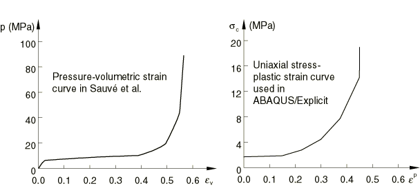

**图2.1.12-2** 三维模型中的容纳结构网格（粗网格）。

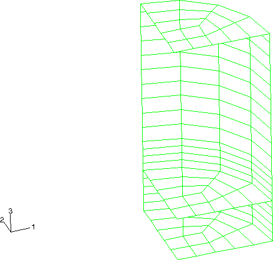

**图2.1.12-3** 三维模型中的流体网格（粗网格）。

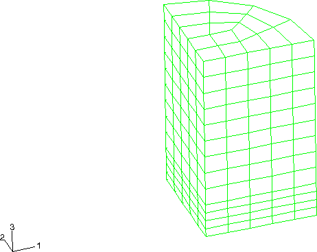

**图2.1.12-4** 三维模型中的泡沫网格（粗网格）。

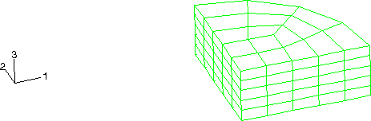

**图2.1.12-5** 完整的三维模型（粗网格）。

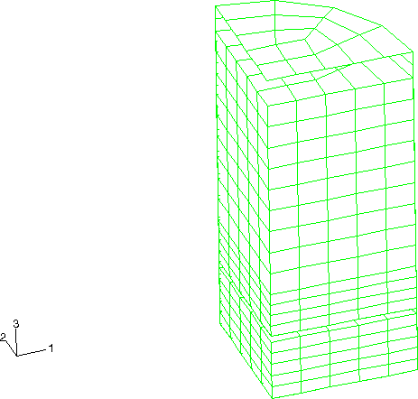

**图2.1.12-6** 轴对称模型（粗网格）。

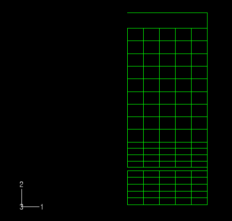

**图2.1.12-7** 使用正交单元运动学和组合沙漏控制的三维变形几何形状（粗网格）。

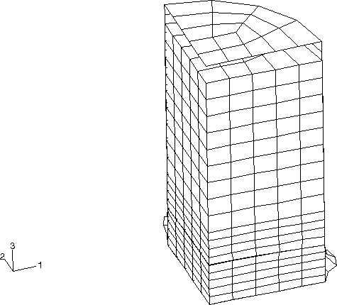

**图2.1.12-8** 使用组合沙漏控制的轴对称变形几何形状（粗网格）。

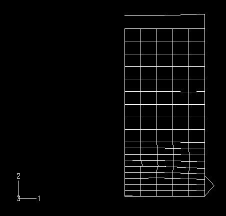

**图2.1.12-9** 泡沫中的垂直应力历史（粗网格）。

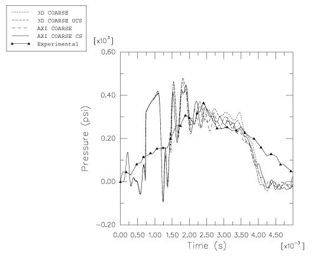

**图2.1.12-10** 三维模型的细化网格。

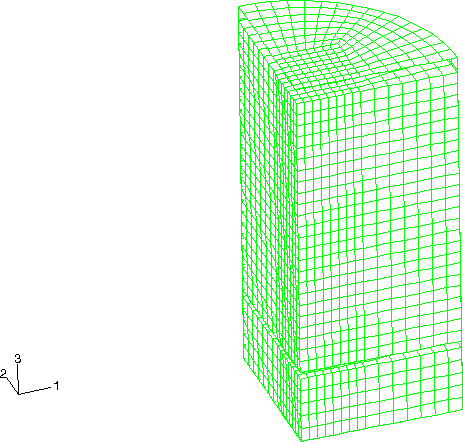

**图2.1.12-11** 使用正交单元运动学和组合沙漏控制的三维变形几何形状（细化网格）。

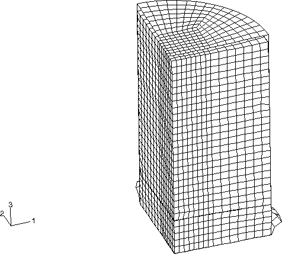

**图2.1.12-12** 使用组合沙漏控制的轴对称变形几何形状（细化网格）。

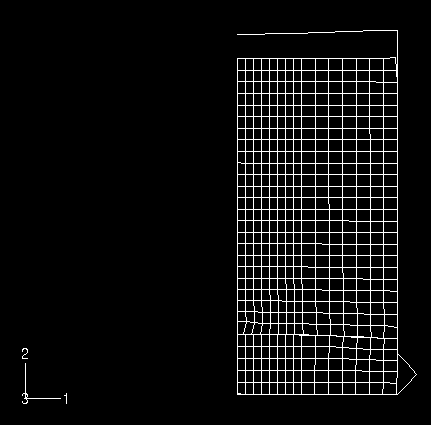

**图2.1.12-13** 泡沫中的垂直应力历史（细化网格）。

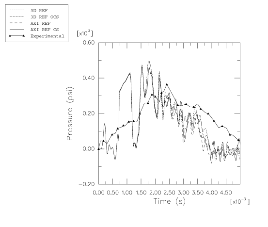

**图2.1.12-14** 三维权值细化模型和平滑粒子动力学模型的垂直应力历史比较。

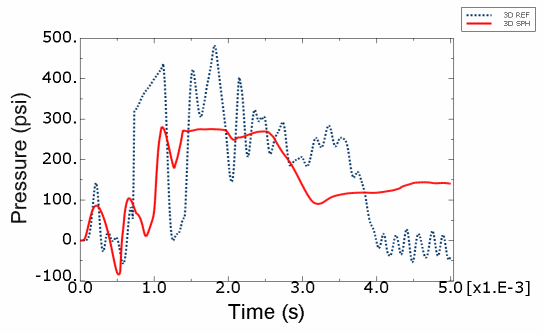

