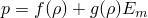
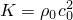
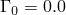
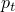
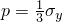
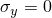
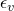
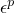

# 2.1.12 Cask drop with foam impact limiter

**Product: **Abaqus/Explicit  

A containment cask is partially filled with fluid and a foam impact limiter. The complete package is dropped a distance of 9.09 m (30 ft) onto a rigid surface, which results in an impact speed of 13.35 m/sec (525.3 in/sec). The problem illustrates the use of an initial velocity condition and the analysis of a structure containing liquid and incorporating crushable foam to absorb impact energy. Experimental and numerical results for this problem have been reported by Sauv et al. (1993). The numerical results given in the reference were obtained using a relatively coarse finite element mesh. In this example results are presented for the same coarse mesh as used in the reference and also for a more refined mesh. Both continuum meshes and particle methods are illustrated.

### Model description

The containment cask shown in [Figure 2.1.12--2](ch02s01aex73.md#exxcaskdrop-structmesh-3d) consists of two compartments. The upper compartment surrounds the fluid and is made of stainless steel (304L). It has a height of 580 mm (22.8 in), a diameter of 300 mm (11.8 in), and a wall thickness of 4.76 mm (0.187 in). The top mild steel cover has a thickness of 9.52 mm (0.375 in). The water is filled to a depth of 522 mm (20.55 in), which is 90% of the container's capacity. [Figure 2.1.12--3](ch02s01aex73.md#exxcaskdrop-fluidmesh-3d) shows the original, coarse mesh of C3D8R elements used to model the fluid. Contact conditions are defined between the fluid and the inside of the upper compartment.

An impact limiter made of polyurethane foam is contained within the bottom mild steel compartment of the cask. The height of the foam impact limiter is 127.3 mm (5.01 in). [Figure 2.1.12--4](ch02s01aex73.md#exxcaskdrop-foammesh-3d) shows the coarse mesh used to model the foam. Contact conditions are defined between the foam and the inside of the bottom compartment of the cask. The foam impact limiter and the fluid/stainless steel liner are separated by a mild steel bulkhead with a thickness of 12.7 mm (0.5 in). A 12.7 mm (0.5 in) air gap exists between the top of the foam surface and this bulkhead.

In the experiment a pressure transducer is located in the polyurethane foam on the centerline of the cask at the top of the impact limiter. This result is compared with vertical stress-time histories taken from the element at the top of the foam model on the centerline.

Both axisymmetric and three-dimensional models are analyzed. [Figure 2.1.12--5](ch02s01aex73.md#exxcaskdrop-3dmesh-coarse) shows the three-dimensional model formed by assembling the parts shown in [Figure 2.1.12--2](ch02s01aex73.md#exxcaskdrop-structmesh-3d) through [Figure 2.1.12--4](ch02s01aex73.md#exxcaskdrop-foammesh-3d). The equivalent axisymmetric model is shown in [Figure 2.1.12--6](ch02s01aex73.md#exxcaskdrop-axisym-mesh). The corresponding smoothed particle hydrodynamic model incorporates PC3D elements for both the water and the foam parts of the model.

Contact pairs are defined between the solids and the shells. Element-based surfaces are defined on the shells, and node-based surfaces are defined containing the nodes on the outer surfaces of the solid or particle elements. Input files that use the alternative general contact algorithm are also provided. The shell thickness was not taken into account when the original meshes were designed, and the outer surface of the solids usually coincides with the midsurface of the enclosing shell. This would lead to an initial overclosure of one-half the shell thickness, but contact at the midsurface of the shell is enforced, as if the shell had zero thickness. The use of a node-based surface implies a pure master-slave relationship for the contact pair. This is important in this problem because the default in Abaqus/Explicit when contact is defined between shells and solids is to define a pure master-slave relationship with the solids as the master and the shells as the slave. In this case the shell structures are much stiffer than the fluid and foam structures, so the master-slave roles must be reversed.

For the axisymmetric model two cases using different section controls for the foam and fluid elements are analyzed. The first case uses a linear combination of stiffness and viscous hourglass control; the second case uses the default section controls (the integral viscoelastic form for hourglass control). The three-dimensional model also has two cases with different section controls for the foam and fluid elements. The first case uses the orthogonal kinematic formulation and combined (viscous-stiffness form) hourglass control; the second three-dimensional case uses the default section controls (the average strain kinematic formulation and the integral viscoelastic form for hourglass control). The section controls used are summarized in [Table 2.1.12--1](ch02s01aex73.md#table-caskdrop-analopts). Coarse and refined meshes are used for all analysis cases.

### Material description

The general material properties are listed in [Table 2.1.12--2](ch02s01aex73.md#table-caskdrop-matprops). The material models for the water and foam are further described below.

**Water:**

The water is treated as a simple hydrodynamic material model. This provides zero shear strength and a bulk response given by 

where *K* is the bulk modulus with a value of 2068 MPa (300000 psi). This model is defined using the linear  equation of state model provided in Abaqus/Explicit. The linear  Hugoniot form, , is 

where  is the same as the nominal volumetric strain measure, . Since , setting the parameters  and  gives the simple hydrostatic bulk response defined earlier. In this analysis  1450.6 m/sec (57100 in/sec) and  983.2 kg/m3 (0.92  104 lb sec2in4). The tension cutoff pressure is assumed to be zero and is specified using a tensile failure model. Refer to ["Equation of state," Section 25.2.1 of the Abaqus Analysis User's Guide](../usb/usb-link.md#usb-mat-ceos), for a description of this material model.

**Foam:**

The crushable foam model is used for the polyurethane foam. In this model the flow potential, *h*, is chosen as 

where *q* is the Mises equivalent stress and *p* is the hydrostatic pressure. The yield surface is defined as 

Sauv et al. use the “soils and crushable foams” model, which was originally defined in an unpublished report by Krieg (1978) and is based upon a Mises plasticity model in which the yield stress depends upon the mean volumetric pressure. The volumetric deformation allows for plastic behavior, defined by tabular data defining pressure versus volume strain. This model is easy to implement in an explicit dynamics algorithm and useful because the deviatoric and volumetric terms are only loosely coupled. However, it requires an experienced analyst to ensure that meaningful results are obtained, mainly because the model does not match physical behavior well under deviatoric straining.

To define the initial shape of the yield surface, the Abaqus/Explicit crushable foam model with volumetric hardening requires the initial yield stress in uniaxial compression, ; the magnitude of the strength in hydrostatic tension, ; and the initial yield stress in hydrostatic compression, . Sauv et al. define the pressure-dependent yield surface for the foam model as 

where the units of stress are MPa and pressure is positive in compression. To calibrate the Abaqus/Explicit crushable foam model to this pressure-dependent data, we observe that  for the uniaxial compression case. Substituting this value for *p* in the above equation and solving for  gives  = 2.16 MPa (313.3 psi). The value of  is obtained by solving the above equation for , giving  = 1.54 MPa (223.8 psi). The value of  is given in the reference as  = 5.52 MPa (800.0 psi).

The pressure-volumetric strain data in the reference are given in [Table 2.1.12--3](ch02s01aex73.md#table-caskdrop-strain). [Table 2.1.12--4](ch02s01aex73.md#table-caskdrop-modstrain) shows the uniaxial stress-plastic strain data converted to the form required for the Abaqus/Explicit volumetric hardening model. Each form of the data is plotted in [Figure 2.1.12--1](ch02s01aex73.md#exxcaskdrop-foamharden).

### Results and discussion

The deformed geometries for the three-dimensional and the axisymmetric models at 5 msec are shown in [Figure 2.1.12--7](ch02s01aex73.md#exxcaskdrop-dfm-3d-ocs-crse) and [Figure 2.1.12--8](ch02s01aex73.md#exxcaskdrop-dfm-asym-cs-crse). The axisymmetric model is analyzed using combined hourglass control. The three-dimensional model uses orthogonal kinematic and combined hourglass control. [Figure 2.1.12--9](ch02s01aex73.md#exxcaskdrop-foamstress-crse) shows plots of the vertical stress versus time for the element located at the pressure transducer in the foam; results from the models with the previous section control options, as well as results from analyses using the default section control options, are reported for comparison (see [Table 2.1.12--1](ch02s01aex73.md#table-caskdrop-analopts)). Axisymmetric and three-dimensional results are compared to the experimental pressure trace. The time origin of the experimental curve is not defined in the reference; therefore, the experimental curve is shifted so that the time when pressure in the transducer changes to a positive value is assumed to be the time at which impact occurs. The numerical pressure results show significant oscillations about the experimental results during the first 2 msec of the response. This is partly because the meshes are quite coarse and partly because pressure transducers in experiments exhibit inertia in their response and will not report sharp gradients in time. During the next 3 msec the numerical results correspond more closely with the experimental results. The analyses run with different section control options compare very well.

A more refined three-dimensional mesh is shown in [Figure 2.1.12--10](ch02s01aex73.md#exxcaskdrop-3dmesh-ref). The refined axisymmetric model is the same model used in the *r*–*z* plane. The deformed geometries for these models are shown in [Figure 2.1.12--11](ch02s01aex73.md#exxcaskdrop-dfm-3d-ocs-ref) (using orthogonal kinematic and combined hourglass control) and [Figure 2.1.12--12](ch02s01aex73.md#exxcaskdrop-dfm-asym-cs-ref) (using combined hourglass control). The vertical stress histories for the refined models are shown in [Figure 2.1.12--13](ch02s01aex73.md#exxcaskdrop-foamstress-ref) for the same section controls used for the coarse meshes (see [Table 2.1.12--1](ch02s01aex73.md#table-caskdrop-analopts)). The numerical results show less oscillation about the experimental results than those obtained with the coarse mesh. They compare well with the experimental results during the following 3 msec of the response. In addition, [Figure 2.1.12--11](ch02s01aex73.md#exxcaskdrop-dfm-3d-ocs-ref) shows that the refined mesh eliminates much of the fluid's hourglass-like response due to its zero shear strength. [Figure 2.1.12--14](ch02s01aex73.md#exxcaskdrop-foamstress-sph) shows a comparison of the vertical stress results for the three-dimensional refined model and the smoothed particle hydrodynamic model.

### Input files

[cask_drop_axi_cs.inp](../eif/cask_drop_axi_cs.inp)

Coarse axisymmetric model using COMBINED hourglass control.

[cask_drop_3d_ocs.inp](../eif/cask_drop_3d_ocs.inp)

Coarse three-dimensional model using ORTHOGONAL kinematic and COMBINED hourglass control. 

[cask_drop_3d_ocs_gcont.inp](../eif/cask_drop_3d_ocs_gcont.inp)

Coarse three-dimensional model using ORTHOGONAL kinematic and COMBINED hourglass control and the general contact capability.

[cask_drop_axi.inp](../eif/cask_drop_axi.inp)

Coarse axisymmetric mesh using the default section controls.

[cask_drop_3d.inp](../eif/cask_drop_3d.inp)

Coarse three-dimensional mesh using the default section controls.

[cask_drop_3d_gcont.inp](../eif/cask_drop_3d_gcont.inp)

Coarse three-dimensional mesh using the default section controls and the general contact capability.

[cask_drop_axi_r_cs.inp](../eif/cask_drop_axi_r_cs.inp)

Refined axisymmetric model using COMBINED hourglass control.

[cask_drop_3d_r_ocs.inp](../eif/cask_drop_3d_r_ocs.inp)

Refined three-dimensional model using ORTHOGONAL kinematic and COMBINED hourglass control.

[cask_drop_3d_r_ocs_gcont.inp](../eif/cask_drop_3d_r_ocs_gcont.inp)

Refined three-dimensional model using ORTHOGONAL kinematic and COMBINED hourglass control and the general contact capability.

[cask_drop_axi_r.inp](../eif/cask_drop_axi_r.inp)

Refined axisymmetric mesh using the default section controls.

[cask_drop_3d_r.inp](../eif/cask_drop_3d_r.inp)

Refined three-dimensional mesh using the default section controls.

[cask_drop_3d_r_gcont.inp](../eif/cask_drop_3d_r_gcont.inp)

Refined three-dimensional mesh using the default section controls and the general contact capability.

[cask_drop_3d_sph.inp](../eif/cask_drop_3d_sph.inp)

Three-dimensional model using the smoothed particle hydrodynamic method.

### References

Krieg,  R. D., “A Simple Constitutive Description for Soils and Crushable Foams,” SC-DR-72-0883, Sandia National Laboratories, Albuquerque, NM, 1978.

Sauv,  R. G., G. D. Morandin, and E. Nadeau, “Impact Simulation of Liquid-Filled Containers Including Fluid-Structure Interaction,” Journal of Pressure Vessel Technology, vol. 115, pp. 68–79, 1993.

### Tables

**Table 2.1.12–1** Analysis section controls tested.
| Analysis Label | Section Controls |
| --- | --- |
| Kinematic Formulation | Hourglass Control |
| AXI | n/a | integral viscoelastic |
| AXI CS | n/a | combined |
| 3D | average strain | integral viscoelastic |
| 3D OCS | orthogonal | combined |

**Table 2.1.12–2** Material properties.
| Properties | A36 | 304L | Liquid | Foam |
| --- | --- | --- | --- | --- |
| Density,  (kg/m3) | 8032 | 8032 | 983 | 305 |
| Young's modulus, E (GPa) | 193.1 | 193.1 |  | .129 |
| Poisson's ratio,  | 0.28 | 0.28 |  | 0 |
| Yield stress,  (MPa) | 206.8 | 305.4 |  |  |
| Bulk modulus, K (GPa) |  |  | 2.07 |  |
| Hardening modulus, E (GPa) | 0 | 1.52 |  |  |

**Table 2.1.12–3** Pressure-volumetric strain data.
|  | 0 | 0.01 | 0.02 | 0.03 | 0.04 | 0.05 | 0.06 | 0.385 | 0.48 | 0.53 | 0.55 |
| --- | --- | --- | --- | --- | --- | --- | --- | --- | --- | --- | --- |
| p (MPa) | 0 | 2.76 | 4.14 | 5.17 | 5.52 | 5.86 | 6.21 | 10.34 | 19.31 | 39.30 | 82.74 |

**Table 2.1.12–4** Uniaxial stress-plastic strain data.
|  | 0.00 | 0.01 | 0.02 | 0.345 | 0.44 | 0.49 | 0.51 | 2.00 |
| --- | --- | --- | --- | --- | --- | --- | --- | --- |
|  (MPa) | 2.16 | 2.24 | 2.33 | 3.23 | 4.91 | 8.20 | 14.67 | 758.89 |

### Figures

**Figure 2.1.12–1** Foam hardening curves.

**Figure 2.1.12–2** Containment structure mesh in the three-dimensional model (coarse mesh).

**Figure 2.1.12–3** Fluid mesh in the three-dimensional model (coarse mesh).

**Figure 2.1.12–4** Foam mesh in the three-dimensional model (coarse mesh).

**Figure 2.1.12–5** The complete three-dimensional model (coarse mesh).

**Figure 2.1.12–6** Axisymmetric model (coarse mesh).

**Figure 2.1.12–7** Three-dimensional deformed geometry using orthogonal element kinematics and combined hourglass control (coarse mesh).

**Figure 2.1.12–8** Axisymmetric deformed geometry using combined hourglass control (coarse mesh).

**Figure 2.1.12–9** Vertical stress history in the foam (coarse mesh).

**Figure 2.1.12–10** Refined mesh for the three-dimensional model.

**Figure 2.1.12–11** Three-dimensional deformed geometry using orthogonal element kinematics and combined hourglass control (refined mesh).

**Figure 2.1.12–12** Axisymmetric deformed geometry using combined hourglass control (refined mesh).

**Figure 2.1.12–13** Vertical stress history in the foam (refined mesh).

**Figure 2.1.12–14** Vertical stress history comparison for the three-dimensional refined model and the smoothed particle hydrodynamic model.

