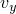
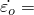
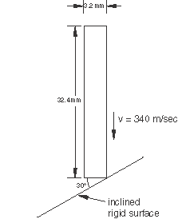
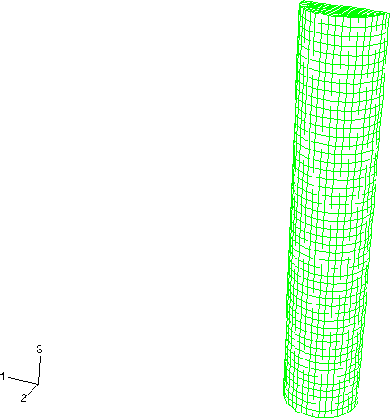
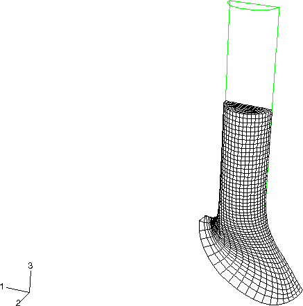
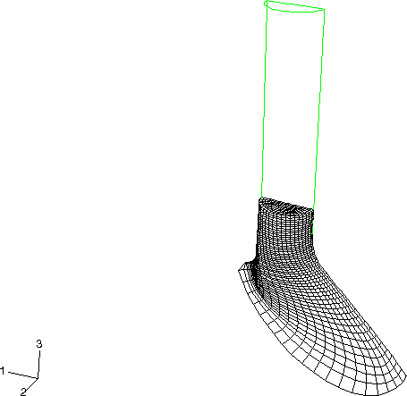
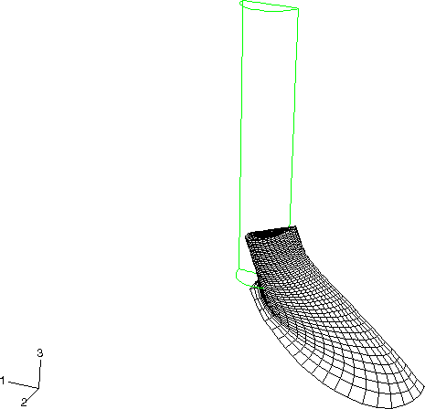
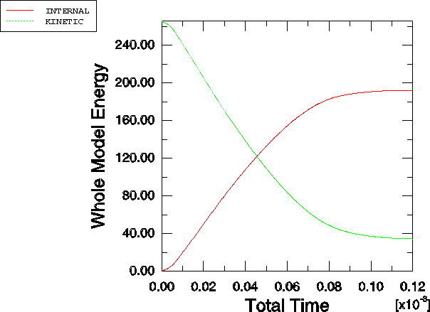

# 2.1.13 Oblique impact of a copper rod

**Product: **Abaqus/Explicit  

This example simulates a high velocity, oblique impact of a copper rod into a rigid wall. Extremely high plastic strains develop at the crushed end of the rod, resulting in severe local mesh distortion. Adaptive meshing is used to reduce element distortion and to obtain an accurate and economical solution to the problem.

### Problem description

The model geometry is depicted in [Figure 2.1.13--1](ch02s01aex74.md#exxalerod-geom). A cylindrical rod, measuring 32.4  3.2 mm, impacts a rigid wall with an initial velocity of =340 m/sec. The wall is perpendicular to the *x*–*z* plane and makes an angle of 30 with the *x*–*y* plane. The half-symmetric finite element model is shown in [Figure 2.1.13--2](ch02s01aex74.md#exxalerod-initconfig). Symmetry boundary conditions are applied at the *y*=0 plane. The rod is meshed with CAX4R elements, and the wall is modeled as an analytical rigid surface using a three-dimensional cylindrical surface in conjunction with a rigid body constraint. Coulomb friction is assumed between the rod and the wall, with a friction coefficient of 0.2. The analysis is performed for a period of 120 microseconds.

The rod is modeled as a Johnson-Cook, elastic-plastic material with a Young's modulus of 124 GPa, a Poisson's ratio of 0.34, and a density of 8960 kg/m3. The Johnson-Cook model is appropriate for modeling high-rate impacts involving metals. The Johnson-Cook material parameters are taken from Johnson and Cook (1985) in which the following constants are used:  90 MPa,  0.31,  1.09,  0.025, and  1 s1. Furthermore, the melting temperature is 1058C, and the transition temperature is 25C. Adiabatic conditions are assumed with a heat fraction of 50%. The specific heat of the material is 383 J/KgC, and the thermal expansion coefficient is 0.00005C1.

### Adaptive meshing

A single adaptive mesh domain that incorporates the entire rod is defined. Symmetry boundary conditions are defined as Lagrangian surfaces (the default), and contact surfaces are defined as sliding contact surfaces (the default). Because the impact phenomenon modeled in this example is an extremely dynamic event with large changes in geometry occurring over a relatively small number of increments, it is necessary to increase the frequency and intensity of adaptive meshing. The frequency value is reduced to 1 increment from a default value of 10, and the number of mesh sweeps used to smooth the mesh is increased to 3 from the default value of 1. The default values are used for all other adaptive mesh controls.

### Results and discussion

Deformed shape plots at 40, 80, and 120 microseconds are shown in [Figure 2.1.13--3](ch02s01aex74.md#exxalerod-deform-40), [Figure 2.1.13--4](ch02s01aex74.md#exxalerod-deform-80), and [Figure 2.1.13--5](ch02s01aex74.md#exxalerod-deform-120), respectively. The rod rebounds from the wall near the end of the analysis. High-speed collisions such as these result in significant amounts of material flow in the impact zone. A pure Lagrangian analysis of this finite element model fails as a result of excessive distortions. Continuous adaptive meshing allows the analysis to run to completion while retaining a high-quality mesh. The kinetic and internal energy histories are plotted in [Figure 2.1.13--6](ch02s01aex74.md#exxalerod-energy-hist). Most of the initial kinetic energy is converted to internal energy as the rod is plastically deformed. Both energy curves plateau as the rod rebounds from the wall.

### Input files

[ale_rodimpac_inclined.inp](../eif/ale_rodimpac_inclined.inp)

Analysis using adaptive meshing.

[ale_rodimpac_inclined_nodelem.inp](../eif/ale_rodimpac_inclined_nodelem.inp)

External file referenced by this analysis.

### Reference

Johnson, G. R., and W. H. Cook, “Fracture Characteristics of Three Metals Subjected to Various Strains, Strain Rates, Temperatures and Pressures,” Engineering Fracture Mechanics, 21, pp. 31–48, 1985.

### Figures

**Figure 2.1.13–1** Model geometry.

**Figure 2.1.13–2** Initial configuration.

**Figure 2.1.13–3** Deformed configuration at 40 microseconds.

**Figure 2.1.13–4** Deformed configuration at 80 microseconds.

**Figure 2.1.13–5** Deformed configuration at 120 microseconds.

**Figure 2.1.13–6** Time history of kinetic and internal energies of the rod.

