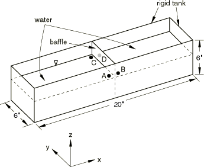
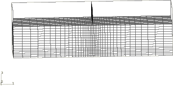
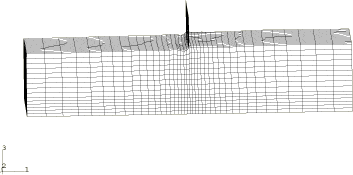
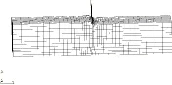
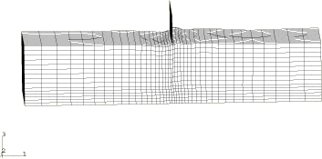
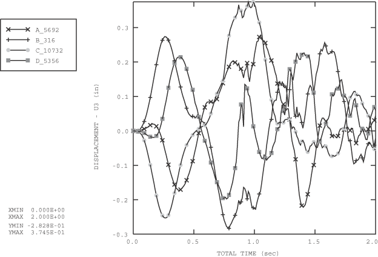

# 2.1.14 带挡板的槽中水的晃动

**产品：** Abaqus/Explicit

本示例说明了使用自适应网格划分来模拟无粘性流体在带挡板槽中的晃动。寻求的是水和槽之间耦合产生的整体结构响应，而不是流体中的详细解决方案。自适应网格划分允许在比纯拉格朗日方法更长的时间段内研究这种响应，因为后者发生的网格缠结被防止了。

### 问题描述

问题的几何形状如图2.1.14-1所示。该模型由一个充满水的带挡板槽组成。挡板连接在槽的侧面和顶部，但不穿透水的整个深度。槽的尺寸为508×152.4×152.4 mm（20×6×6英寸），挡板的尺寸为3.048×152.4×121.92 mm（0.12×6×4.8英寸）。槽中填充了101.6 mm（4英寸）深的水。

显示挡板和水的有限元模型剖面图如图2.1.14-2所示。槽的顶部未被建模，因为水预计不会与之接触。槽被建模为刚体，用R3D4单元网格划分。挡板被建模为可变形体，用S4R单元网格划分。水使用了C3D8R单元的渐变网格，在预期会有显著变形的挡板附近进行了更细的网格划分。

在晃动问题中，水可以被视为不可压缩和无粘性的材料。在Abaqus/Explicit中建模水的一种有效方法是使用简单的牛顿粘性剪切模型和线性状态方程的体积响应。体积模量作为不可压缩约束的惩罚参数。由于晃动问题是无约束的，所选的体积模量可以比实际体积模量小两到三个数量级，水仍然表现为不可压缩介质。剪切粘度也作为惩罚参数来抑制可能导致网格缠结的剪切模式。所选的剪切粘度应该很小，因为水是无粘性的；过高的剪切粘度会导致过于刚性的响应。可以根据体积模量计算适当的剪切粘度值。为了避免过于刚性的响应，由材料的偏响应引起的内力应保持在比由体积响应引起的力低几个数量级。这可以通过选择一个比体积模量低几个数量级的弹性剪切模量来实现。如果使用牛顿粘性偏响应模型，指定的剪切粘度应在等效剪切模量的数量级上，计算如前所述，并按稳定时间增量缩放。预期的稳定时间增量可以从模型的datacheck分析中获得。这种方法是近似剪切强度的方便方式，不会给材料引入过多的粘度。

此外，如果定义了剪切模型，沙漏控制力是根据材料的剪切刚度计算的。因此，在具有极低或零剪切强度（如无粘性流体）的材料中，根据默认参数计算的沙漏力不足以防止伪沙漏模式。因此，使用足够高的沙漏缩放因子来增加对这种模式的阻力。本分析 methodology 在["俯仰槽中的水的晃动，"Abaqus Benchmarks Guide第1.12.7节](../bmk/bmk-link.md#bmk-anl-alewateroscillation)中得到了验证。

对于此示例，线性状态方程与波速45.85 m/sec（1805 in/sec）和密度983.204 kg/m³（0.92×10⁴ lb sec²/in⁴）一起使用。波速对应于体积模量2.07 MPa（300 psi），比水的实际体积模量2.07 GPa（3.0×10⁵ psi）小三个数量级。剪切粘度选择为1.5×10⁸ psi sec。挡板被建模为Mooney-Rivlin超弹性材料，超弹性常数=689480 Pa（100 psi）和=172370 Pa（25 psi），密度为10900.74 kg/m³（1.02×10³ lb sec²/in⁴）。

在槽和水之间定义了纯主-从接触；在挡板和水之间定义了平衡主-从接触。挡板底边与底层水表面有公共节点。这防止了挡板底边与其正下方水的相对滑动。挡板其他边缘的运动与槽的运动一致。

水受到重力载荷。因此，定义了初始地应力场来平衡由水自重引起的应力。以幅度为63.5 mm（2.5英寸）、周期为2秒的正弦波形式的速度脉冲同时在*x*和*y*方向施加于槽。槽的所有剩余自由度被完全约束。晃动分析执行两秒。

### 自适应网格划分

定义了一个包含水的单一自适应网格域。滑动边界区域用于水的所有接触表面定义（默认设置）。由于本示例中建模的晃动现象导致大的网格运动，有必要增加自适应网格划分的频率和强度。频率值从默认值10减少到5个增量，用于平滑网格的网格扫描次数从默认值1增加到3。自适应网格划分算法在本示例中配置为在执行连续自适应网格划分时保留水的初始网格梯度。所有其他参数和控制使用默认值。

### 结果和讨论

图2.1.14-3、图2.1.14-4和图2.1.14-5分别显示了=1.2 s、=1.6 s和=2.0 s时的变形网格配置。图2.1.14-6显示了水位的垂直位移的四个时间历史；这些对应于左右隔间前后挡板处的水位。时间历史测量的位置在图2.1.14-1中用A、B、C和D表示。这样的分析可用于设计在某些频率下衰减晃动的挡板。在Abaqus/Explicit中使用自适应网格划分适用于结构响应是主要兴趣的晃动问题。通常不可能建模诸如飞溅或复杂自由表面相互作用之类的流动行为。此外，表面张力未被建模。

### 输入文件

[ale_water_sloshing.inp](../eif/ale_water_sloshing.inp)

此分析的输入数据。

[ale_water_sloshingel.inp](../eif/ale_water_sloshingel.inp)

单元数据。

### 图形

**图2.1.14-1** 模型几何形状。

**图2.1.14-2** 初始配置（未显示刚性槽的前部）。

**图2.1.14-3** 1.2秒时水和挡板的变形配置。

**图2.1.14-4** 1.6秒时水和挡板的变形配置。

**图2.1.14-5** 2.0秒时水和挡板的变形配置。

**图2.1.14-6** 左右隔间前后挡板处水位垂直位移的时间历史。

