# 2.1.15 混凝土重力坝的地震分析

**产品：** Abaqus/Standard  Abaqus/Explicit

在此示例中，我们考虑Koyna大坝的分析，该大坝于1967年12月11日遭受了里氏6.5级地震。本示例说明了混凝土损伤塑性材料模型在评估承受任意载荷的混凝土结构稳定性和损伤方面的典型应用。选择此问题是因为它已被众多研究者进行了广泛分析，包括Chopra和Chakrabarti（1973）、Bhattacharjee和Leger（1993）、Ghrib和Tinawi（1995）、Cervera等人（1996）以及Lee和Fenves（1998）。

### 问题描述

Koyna大坝典型非溢流墙体的几何形状如图2.1.15-1所示。墙体高度为103 m，底部宽度为71 m。上游墙体被假定为直线和垂直的，这与实际配置略有不同。地震时水库深度为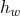=91.75 m。根据其他研究者的工作，我们考虑在平面应力条件下对非溢流墙体进行二维分析。用于分析的有限元网格如图2.1.15-2所示。它由760个一阶减积分平面应力单元（CPS4R）组成。节点定义参照全局矩形坐标系，原点位于大坝左下角，垂直*y*轴指向上游方向，水平*x*轴指向下游方向。Koyna地震期间记录的地面加速度的横向和垂直分量如图2.1.15-3所示（*g*=9.81 m sec⁻²的单位）。在地震激励之前，大坝受到自重和水库在上游墙体上的静水压力的重力载荷。

出于本示例的目的，我们通过假定基础为刚体来忽略坝-基础相互作用。由地面运动横向分量引起的大坝-水库动态相互作用可以使用Westergaard附加质量技术以简单形式建模。根据Westergaard（1933），水在地震期间对大坝施加的流体动力压力与某个水体的运动相同，该水体与大坝一起来回运动，而水库的其余部分保持不活动。单位面积上的附加质量以近似形式给出，表达式为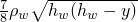，其中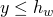，=1000 kg/m³是水的密度。在Abaqus/Standard分析中，附加质量方法使用在用户子程序[`UEL`](../sub/sub-link.md#sub-xsl-uel)中编码的简单2节点用户单元实现。在Abaqus/Explicit分析中，大坝和水库之间的动态相互作用被忽略。

地面运动垂直分量产生的流体动力压力假定为很小，在所有模拟中被忽略。

### 材料属性

混凝土材料的力学行为使用["混凝土损伤塑性，"Abaqus分析用户指南第23.6.3节](../usb/usb-link.md#usb-mat-cconcretedamaged)和["混凝土和其他准脆性材料的损伤塑性模型，"Abaqus理论指南第4.5.2节](../stm/stm-link.md#stm-mat-concretedamaged)中所述的混凝土损伤塑性本构模型建模。模拟使用的材料属性在表2.1.15-1和图2.1.15-4中给出。这些属性被认为是Koyna大坝混凝土材料的代表性属性，基于先前研究者使用的属性。在获得一些材料属性时，做出了若干假设。特别感兴趣的是混凝土拉伸行为的校准。拉伸强度估计为极限抗压强度的10%（=24.1 MPa），乘以1.2的动态放大因子以考虑率效应；因此，=2.9 MPa。为了避免因结构中缺乏钢筋而导致的网格敏感的 unreasonable 结果，拉伸后破坏行为以断裂能断裂准则的形式给出，通过指定应力/位移曲线而不是应力-应变曲线来定义，如图2.1.15-4所示。这通过后裂缝应力/位移曲线实现。类似地，拉伸损伤，，通过使用后裂缝损伤位移曲线作为裂纹位移的函数以表格形式指定。该曲线如图2.1.15-4所示。由混凝土压碎破坏引起的刚度退化损伤，，假定为零。

#### 阻尼

普遍认为大坝的阻尼比约为2-5%。在本示例中，我们调整材料阻尼属性以提供大坝第一振型约3%的临界阻尼。假设Rayleigh刚度比例阻尼，提供第一振型临界阻尼比例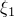所需的因子给定为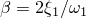。从大坝的固有频率提取分析中，发现第一固有频率为=18.61 rad sec⁻¹（见表2.1.15-2）。在此基础上，选择=3.23×10⁻³ sec。

### 载荷和求解控制

载荷条件和求解控制在每个分析中讨论。

#### Abaqus/Standard分析

在地震动态模拟之前，大坝受到重力和静水压力载荷。在Abaqus/Standard分析中，这些载荷在两个连续静态步骤中指定，在第一步中使用标签为GRAV的分布式载荷（用于重力载荷），在第二步中使用HP（用于静水压力）。在第三步的动态分析中，将图2.1.15-3所示的地面加速度的横向和垂直分量施加到大坝底部的所有节点。

由于预期响应中存在相当大的非线性，包括混凝土开裂时可能出现的不稳定状态，Abaqus/Standard分析中解的总体收敛预计是非单调的。在这种情况下，通常建议自动设置时间增量参数，以防止平衡迭代过程过早终止，因为解可能看起来正在发散。通过为步骤指定非对称方程求解器来激活非对称矩阵存储和求解方案。这对于使用混凝土损伤塑性模型获得可接受的收敛速率至关重要，因为塑性流动是非关联的。自动时间增量用于地震的动态分析，半增量残差容差设置为10⁻⁷，最大时间增量为0.02 sec。

#### Abaqus/Explicit分析

虽然可以在Abaqus/Explicit中执行震前状态的分析，但Abaqus/Standard在解决准静态分析方面效率更高。因此，我们在Abaqus/Standard分析中施加重力和静水载荷。然后将这些结果导入Abaqus/Explicit，以继续对承受地震加速度图的大坝进行地震分析。我们仍然需要在显式动态步骤中继续施加重力和静水压力载荷。在Abaqus/Explicit中，重力载荷的指定方式与Abaqus/Standard中完全相同。然而，静水压力的指定需要一些额外考虑，因为Abaqus/Explicit目前不支持这种载荷类型。这里我们使用用户子程序[`VDLOAD`](../sub/sub-link.md#sub-xsl-vdload)施加静水压力。

Abaqus/Explicit模拟需要非常大量的增量，因为稳定时间增量（6×10⁻⁶ sec）比地震总持续时间（10 sec）小得多。分析以双精度运行，以防止舍入误差的积累。可以通过使用质量缩放来增加稳定性限制；然而，这可能影响结构的动态响应。

对于这个特定问题，Abaqus/Standard比Abaqus/Explicit计算更有效，因为地震是一个相对较长的事件，在Abaqus/Explicit中需要非常大量的增量。此外，有限元模型的规模较小，Abaqus/Standard中每次全局平衡方程组求解的成本相当低廉。

### 结果和讨论

每个分析的结果在以下章节中讨论。

#### Abaqus/Standard结果

从没有水库的大坝频率提取分析中获得的结果总结在表2.1.15-2中。有限元模型的前四个固有频率与Chopra和Chakrabarti（1973）报告的值吻合良好。如上所述，频率提取分析有助于校准地震动态模拟中使用的材料阻尼。

图2.1.15-5显示了大坝顶部左角相对于地面运动的水平位移。在该图中，正值表示向下游方向的位移。在地震的前4秒期间，顶部位移保持小于30 mm。4秒后，顶部的振荡幅度显著增加。如下所述，在这些振荡过程中结构发生了严重损伤。

混凝土材料在第二步结束时保持弹性，没有损伤，此时大坝已承受重力和静水压力载荷。损伤在大坝顶部的地震分析第三步开始时发生。混凝土大坝损伤的演变如图2.1.15-6、图2.1.15-7和图2.1.15-8所示，展示了地震期间六个不同时间的损伤。=3.96 sec、=4.315 sec和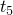=4.687 sec对应于图2.1.15-5所示的顶部向前三个大 excursion。=4.163 sec和=4.526 sec对应于顶部向后两个大的 excursion。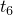=10 sec对应于地震结束。这些图显示了左侧的拉伸损伤变量DAMAGET（或）和右侧的刚度退化变量SDEG（或*d*）的等值线图。拉伸损伤变量是与材料拉伸破坏相关的非递减量。另一方面，刚度退化变量可以增加或减少，反映了与裂缝开闭相关的刚度恢复效应。因此，假设没有压缩损伤（），给定材料点处的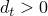和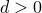组合表示一条开放裂缝，而和表示一条闭合裂缝。

在时间，损伤在两个位置开始：在上游面的大坝底部和下游面斜率变化的应力集中区域附近。

当大坝在时间向下游方向位移时，底部的损伤导致形成受损单元的局部裂缝状带。该裂缝沿大坝-基础边界向大坝内部扩展。这个裂缝的成核是由这个区域由于无限刚性基础而产生的应力集中引起的。此时，在上游面上沿着一些单元也观察到一些部分拉伸损伤。

在下一个向上游方向的大 excursion 期间，在时间，在下游斜率变化附近形成了受损单元的局部带。当这个下游裂缝向上游方向扩展时，由于大坝顶部块的摇摆运动，它向下弯曲。在时间，大坝底部的裂缝被这个区域的压应力关闭。通过查看时间时SDEG的等值线图可以很容易地验证这一点，它清楚地显示了这个区域的刚度已恢复，表明裂缝已闭合。

当载荷反向时，对应于在时间向下游方向的下一个 excursion，下游裂缝闭合，那个区域的刚度恢复。此时，拉伸损伤集中在上游面上的一些单元上，导致形成一条水平裂缝，该裂缝向下游裂缝扩展。

当大坝顶部块在地震的剩余时间内来回振荡时，上游和下游裂缝以交替方式闭合和打开。大坝保持了其整体结构稳定性，因为在这两个裂缝在地震期间从未处于拉伸应力状态。地震结束时拉伸损伤的分布如图2.1.15-8所示，在时间。刚度退化变量的等值线图表明，除裂缝尖端附近外，所有裂缝在压应力下都闭合，大部分刚度已恢复。在模拟过程中未观察到压缩破坏。abaqus预测的损伤模式与其他研究者报告的损伤模式一致。

#### Abaqus/Explicit结果

图2.1.15-9显示了Abaqus/Explicit模拟结束时拉伸损伤的分布。在地震期间形成了两个主要裂缝，一个在大坝底部，另一个在下游斜率变化处。如果我们将这些结果与Abaqus/Standard分析的结果进行比较（参见时间时的图2.1.15-8），我们发现Abaqus/Standard在上游面上预测了额外的损伤局部化区域。结果之间的差异是由于大坝-水库流体动力相互作用的影响，这在Abaqus/Standard模拟中通过附加质量用户单元包含，在Abaqus/Explicit中被忽略。这可以通过运行没有附加质量用户单元的Abaqus/Standard分析来轻松验证。该分析的结果如图2.1.15-10所示，与图2.1.15-9中的Abaqus/Explicit结果一致，并确认当考虑流体动力相互作用时，上游墙体会发生额外损伤。

### 输入文件

##### **Abaqus/Standard输入文件**

[koyna_freq.inp](../eif/koyna_freq.inp)

Koyna大坝的频率分析。

[koyna_std.inp](../eif/koyna_std.inp)

Koyna大坝的地震分析，包括流体动力相互作用。

[koyna2_std.inp](../eif/koyna2_std.inp)

Koyna大坝的地震分析，不包括流体动力相互作用。

[koyna_haccel.inp](../eif/koyna_haccel.inp)

横向地面加速度记录。

[koyna_vaccel.inp](../eif/koyna_vaccel.inp)

垂直地面加速度记录。

[addedmass_uel.f](../eif/addedmass_uel.f)

koyna_std.inp使用的用户子程序[`UEL`](../sub/sub-link.md#sub-xsl-uel)，用于通过附加质量技术建模流体动力相互作用。

[koyna_std_to_xpl.inp](../eif/koyna_std_to_xpl.inp)

Koyna大坝震前状态的分析。这些结果由koyna_xpl.inp导入。

##### **Abaqus/Explicit输入文件**

[koyna_xpl.inp](../eif/koyna_xpl.inp)

Koyna大坝的地震分析，不包括流体动力相互作用；需要从koyna_std_to_xpl.inp导入结果。

[koyna_hp_vdload.f](../eif/koyna_hp_vdload.f)

koyna_xpl.inp使用的用户子程序[`VDLOAD`](../sub/sub-link.md#sub-xsl-vdload)，用于指定静水压力。

[koyna2_xpl_std.inp](../eif/koyna2_xpl_std.inp)

Koyna大坝震后状态的分析；需要从koyna_xpl.inp导入结果。

### 参考文献

Bhattacharjee, S. S., and P. Leger, "Seismic Cracking and Energy Dissipation in Concrete Gravity Dams," Earthquake Engineering and Structural Dynamics, vol. 22, pp. 991-1007, 1993.

Cervera, M., J. Oliver, and O. Manzoli, "A Rate-Dependent Isotropic Damage Model for the Seismic Analysis of Concrete Dams," Earthquake Engineering and Structural Dynamics, vol. 25, pp. 987-1010, 1996.

Chopra, A. K., and P. Chakrabarti, "The Koyna Earthquake and the Damage to Koyna Dam," Bulletin of the Seismological Society of America, vol. 63, no.2, pp. 381-397, 1973.

Ghrib, F., and R. Tinawi, "An Application of Damage Mechanics for Seismic Analysis of Concrete Gravity Dams," Earthquake Engineering and Structural Dynamics, vol. 24, pp. 157-173, 1995.

Lee, J., and G. L. Fenves, "A Plastic-Damage Concrete Model for Earthquake Analysis of Dams," Earthquake Engineering and Structural Dynamics, vol. 27, pp. 937-956, 1998.

Westergaard, H. M., "Water Pressures on Dams during Earthquakes," Transactions of the American Society of Civil Engineers, vol. 98, pp. 418-433, 1933.

### 表格

**表2.1.15-1** Koyna大坝混凝土的材料属性。
| 杨氏模量： | *E*=31027 MPa |
| --- | --- |
| 泊松比： | =0.15 |
| 密度： | =2643 kg/m³ |
| 膨胀角： | =36.31° |
| 压缩初始屈服应力： | =13.0 MPa |
| 压缩极限应力： | =24.1 MPa |
| 拉伸破坏应力： | =2.9 MPa |

**表2.1.15-2** Koyna大坝的固有频率。
| 振型 | 固有频率（rad sec⁻¹） |
| --- | --- |
| Abaqus | Chopra和Chakrabarti（1973） |
| 1 | 18.86 | 19.27 |
| 2 | 49.97 | 51.50 |
| 3 | 68.16 | 67.56 |
| 4 | 98.27 | 99.73 |

### 图形

**图2.1.15-1** Koyna大坝的几何形状。

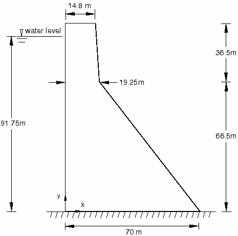

**图2.1.15-2** 有限元网格。

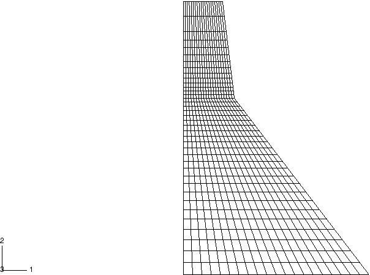

**图2.1.15-3** Koyna地震：（a）横向和（b）垂直地面加速度。

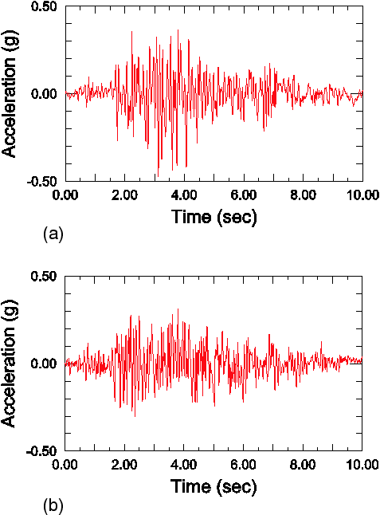

**图2.1.15-4** 混凝土拉伸属性：（a）拉伸强化和（b）拉伸损伤。

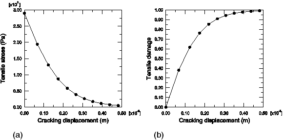

**图2.1.15-5** 顶部水平位移（相对于地面位移）。

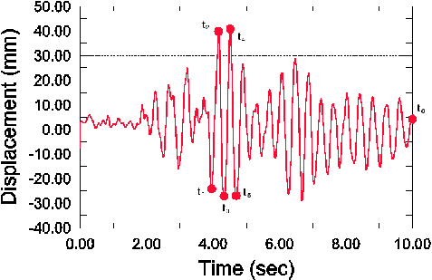

**图2.1.15-6** 拉伸损伤的演变（Abaqus/Standard）；变形缩放因子=100。

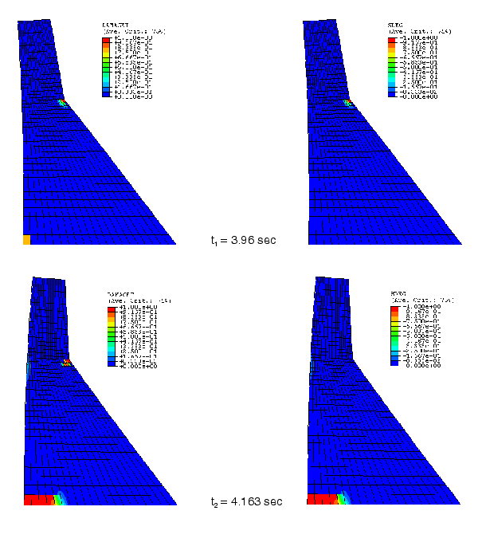

**图2.1.15-7** 拉伸损伤的演变（Abaqus/Standard）；变形缩放因子=100。

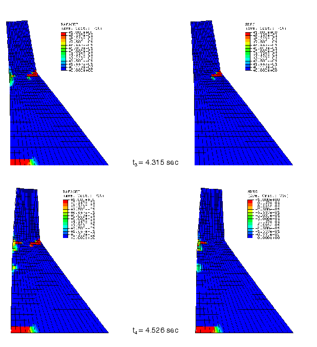

**图2.1.15-8** 拉伸损伤的演变（Abaqus/Standard）；变形缩放因子=100。

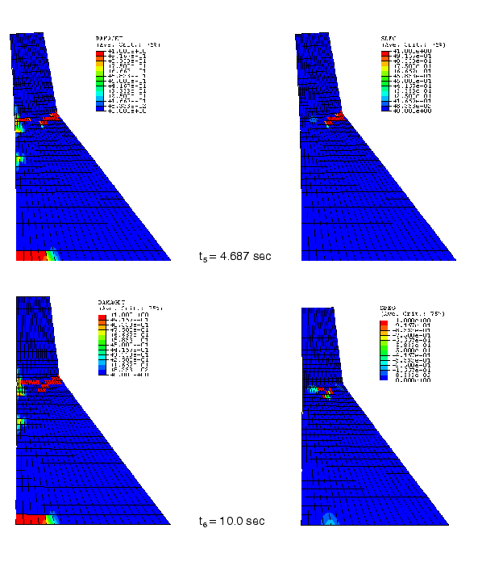

**图2.1.15-9** Abaqus/Explicit模拟结束时的拉伸损伤，不包括大坝-水库流体动力相互作用；变形缩放因子=100。

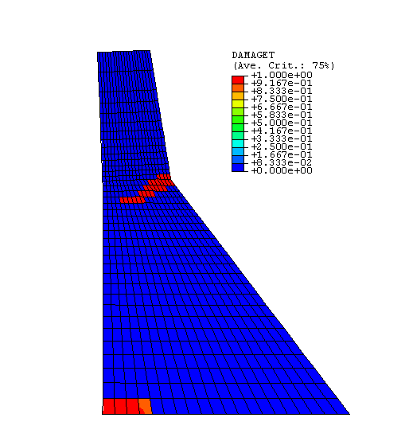

**图2.1.15-10** 不包括大坝-水库流体动力相互作用的Abaqus/Standard模拟结束时的拉伸损伤；变形缩放因子=100。

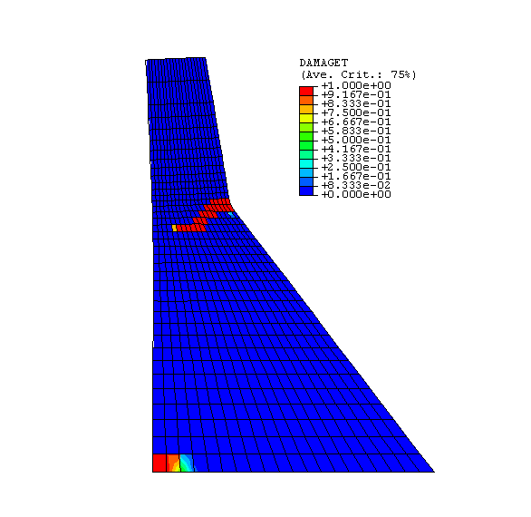

