# 2.1.16 薄壁铝型材在准静态和动态载荷下的渐进失效分析

**产品：** Abaqus/Explicit

### 目标

此示例问题演示了以下Abaqus特征和技术：
- 使用延性、剪切和Mschenborn-Sonne成形极限图（MSFLD）损伤起始准则来研究三种不同机制的失效起始：延性断裂、剪切带形成和颈缩失稳；和
- 使用损伤演化和单元移除对组件进行渐进失效建模。

### 应用描述

铝、镁合金和高强度钢等新材料正越来越多地用于汽车组件中以减轻重量，从而提高整体车辆性能。与传统钢相比，这些材料在断裂时延性通常较低，在碰撞载荷条件下可能发生损伤和失效。由板材制成的典型组件可能由于多种机制而发生损伤，包括孔洞形核和合并、剪切带形成和颈缩失稳。因此，为了从碰撞仿真中获得可靠的预测，模拟各种失效机制的损伤起始和渐进失效以及建模准确的塑性变形行为至关重要。在此示例问题中，我们考虑薄壁双腔铝型材在准静态三点弯曲和动态轴向载荷条件下的整体变形和失效行为。总体载荷-位移响应和断裂模式与Hooputra等人（2004）给出的实验结果进行比较。

### 几何形状

三点弯曲和轴向压碎配置分别如图2.1.16-1和图2.1.16-6所示。铝型材的整体尺寸为：L=500 mm，W=95 mm，H=68 mm（三点弯曲情况），L≈396.5 mm，W=95 mm，H=68 mm（轴向压碎情况）。两种情况的板厚均为2.5 mm。

### 材料

本研究中使用的材料是挤出铝合金EN AW-7108 T6。该材料表现为弹塑性行为，可能由于以下一种或多种损伤机制而发生损伤：孔洞的形核、生长和合并；剪切带形成；和颈缩失稳。

### 边界条件和载荷

三点弯曲配置由在两个刚性圆柱体上支撑并在另一个刚性圆柱体的横向方向上加载的铝型材组成（图2.1.16-1）。在轴向压碎模拟中，铝型材的一端由固定刚性基座支撑，另一端受到来自平面刚性冲击体的瞬时速度作用（图2.1.16-6）。

### Abaqus建模方法和仿真技术

考虑了两种载荷情况。第一种情况是准静态三点弯曲配置，其中零件沿垂直于挤压方向加载。第二种情况是零件承受沿轴向（挤压）方向的动态载荷。

### 分析情况汇总

| 情况1 | 准静态三点弯曲模拟。 |
| --- | --- |
| 情况2 | 动态轴向压碎模拟。 |

以下章节讨论适用于两种情况的分析考虑。

### 网格设计

两种情况的网格与Hooputra等人（2004）使用的网格相似。铝型材用均匀网格划分，主要由4节点壳单元（S4R）组成。在轴向压碎情况下也使用了一些3节点壳单元（S3R）。单元的平面尺寸比壳厚大约一个数量级。使用此网格的模拟产生了与实验观察一致的结果。未进行网格细化研究。

### 材料模型

下面讨论用于本构行为和渐进损伤分析的Abaqus模型的详细信息。还提供了从实验数据获取材料参数的指南。

##### 弹塑性

Hooputra等人（2004）表明，挤出铝合金EN AW-7108 T6由于挤压加工的性质而表现出塑性正交各向异性，并使用Barlat对称屈服轨迹（Barlat等人，1991）来拟合实验数据。在此示例中，我们忽略正交各向异性，假定弹性和塑性行为都是各向同性的，屈服面由Mises屈服函数描述（见["非弹性行为，"Abaqus分析用户指南第23.1.1节](../usb/usb-link.md#usb-mat-cplastic)）。各向同性塑性的假设对于准确预测挤压合金中的失效可能看起来过于严格。然而，在碰撞仿真中，各向同性假设通常与实验观察相比产生可接受的结果，如本示例中获得的结果所示。然而，您应该将模拟结果与实验数据进行比较，以检查各向同性塑性假设的有效性。

##### 损伤起始

由铝合金制成的金属板和薄壁型材可能由于一种或多种以下失效机制而失效（Hooputra等人，2004）：由孔洞形核、生长和合并引起的延性失效；由剪切带内断裂引起的剪切失效；和由颈缩失稳引起的失效。如果模型由壳单元组成，则需要最后一种失效机制的准则，因为局部颈缩的尺寸与板厚相当，因此无法用比厚度大约一个数量级的壳单元来解析。

Abaqus/Explicit提供了许多损伤起始准则来模拟金属板中颈缩失稳的开始。这些包括成形极限图（FLD）、成形极限应力图（FLSD）、Mschenborn-Sonne成形极限图（MSFLD）和Marciniak-Kuczynski（M-K）准则。前三个准则在相应的应变或应力空间中利用实验测量的成形极限曲线。最后一个准则在金属板中引入虚拟厚度缺陷，并分析缺陷区域的变形以确定失稳的开始（见["延性金属的损伤起始，"Abaqus分析用户指南第24.2.2节](../usb/usb-link.md#usb-mat-cdamageinitductile)）。

基于应变的FLD准则仅限于应变路径线性的应用。另一方面，基于应力的FLSD准则对应变路径的变化相对不敏感。然而，由于应变路径的变化，基于应力极限曲表的明显独立性可能只是反映屈服应力对塑性变形变化的敏感性较小。M-K准则可以准确地捕捉非线性应变路径的影响；然而，它在计算上很昂贵，特别是如果引入大量缺陷方向的话。已经验证，使用MSFLD准则获得的结果与使用M-K准则获得的结果相似，但计算费用大大降低（见["延性金属的渐进损伤和失效，"Abaqus验证指南第2.2.21节](../ver/ver-link.md#ver-mat-damage)）。因此，在此示例中，我们选择MSFLD损伤起始准则进行颈缩失稳。

对于指定MSFLD损伤起始准则，需要材料的成形极限曲线。在Abaqus中，可以通过将成形极限曲线从主应变与次应变空间转换为主等效塑性应变与主应变率比的空间来指定此准则。Abaqus还允许直接指定MSFLD准则的成形极限曲线（见["Mschenborn-Sonne成形极限图（MSFLD）准则"，"延性金属的损伤起始，"Abaqus分析用户指南第24.2.2节](../usb/usb-link.md#usb-mat-cdamageinitductile-msfld)）。我们使用基于Hooputra（2005）实验工作的成形极限曲线。该曲线假定在准静态和动态应变速率下都有效。与MSFLD准则结合使用的参数OMEGA用于在评估主应变率比时过滤数值噪声，在两种情况下都设置为0.001（见["延性金属的损伤起始，"Abaqus分析用户指南第24.2.2节](../usb/usb-link.md#usb-mat-cdamageinitductile)）；此值推荐用于碰撞仿真。

由孔洞形核、生长和合并引起的损伤导致金属的延性失效；剪切带内裂缝的形成导致剪切失效。Abaqus为这两种机制都提供了现象学损伤起始准则。延性准则通过提供延性损伤起始时的等效塑性应变作为应力三轴度和应变速率的函数来指定。类似地，剪切准则通过提供剪切损伤起始时的等效塑性应变作为剪切应力比和应变速率的函数来指定（见["延性金属的损伤起始，"Abaqus分析用户指南第24.2.2节](../usb/usb-link.md#usb-mat-cdamageinitductile)）。这两种准则所需的数据可能难以通过直接实验获得，因为它需要跨越难以实现的应力三轴度和剪切应力比范围的实验。Hooputra等人（2004）给出了延性和剪切失效准则的简化分析表达式，只需要有限的实验次数。在此示例中，我们采用这些表达式；但是，为了与前面所做的各向同性塑性假设保持一致，我们忽略延性断裂的正交各向异性。

对于延性损伤起始准则，等效塑性应变由应力三轴度函数给出（Hooputra等人，2004）：

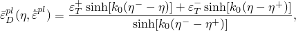

其中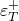和对应于等双轴拉伸和等双轴压缩变形时延性损伤起始的等效塑性应变。对于各向同性材料，等双轴拉伸变形状态中的应力三轴度，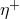，为，等双轴压缩变形状态中的应力三轴度，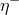，为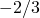。Abaqus中的定义（作为等效平均应力与Mises等效应力的比值）与Hooputra等人（2004）使用的定义相差一个因子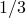。因此，上面表达式中使用的值是Hooputra等人（2004）使用值的3倍。上述表达式有三个必须通过实验获得的参数：、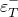和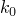。这些参数取决于材料、应变速率，可能还取决于温度。对于每个感兴趣的应变速率，需要三个不同应力三轴度值的实验来获得三个材料参数。可以直接从Erichsen测试中获得（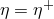）。三点弯曲（平面应变拉伸，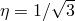，宽度/厚度>4）和腰形拉伸试样缺口根部的断裂（单轴拉伸，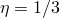）可以提供两个额外的实验来确定和。在Erichsen和三点弯曲实验中，局部断裂应变可以通过在试样表面放置网格来获得；在腰形拉伸实验中，断裂应变可以从断裂平面处的板厚获得（Hooputra等人，2004）。对于本示例中使用的铝合金，在准静态和动态应变速率（250 s⁻¹）下实验获得的延性失效参数列于表2.1.16-1中。

对于剪切损伤起始准则，损伤起始时的等效塑性应变由剪切应力比函数给出（Hooputra等人，2004）：

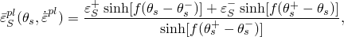

其中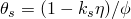，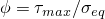，而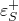和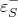分别对应于等双轴拉伸和等双轴压缩变形时剪切损伤起始的等效塑性应变。参数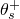和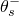对应于分别在和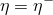时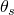的值。此表达式有四个必须通过实验确定的参数：、、和。这些参数取决于材料和应变速率。Hooputra等人（2004）使用了在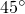（相对于加载方向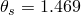）带有凹槽的拉伸试样（矩形截面和凹槽深度=板厚的一半）、专门设计的平行于加载方向的凹槽拉伸试样（纯剪切，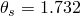）和Erichsen测试（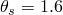），结合上述表达式来确定、和。材料参数的值取为0.3。对于本示例中使用的铝合金，在准静态和动态应变速率（250 s⁻¹）下实验获得的剪切失效参数列于表2.1.16-2中。

使用上述表达式和表2.1.16-1和表2.1.16-2中列出的材料参数，可以分别作为应力三轴度和剪切应力比的函数生成延性和剪切损伤起始准则的表格数据。此表格数据在Abaqus输入文件中提供。上述表达式可能在应力三轴度或剪切应力比非常小时给出非常高的损伤起始等效塑性应变值。在这种情况下，可以提供等效塑性应变的截止值。

##### 损伤演化和单元移除

一旦满足损伤起始准则，损伤演化就会发生。对于三个损伤起始准则中的每一个，都使用基于塑性位移的线性损伤演化定律。损伤变量达到1时的塑性位移值取为0.1。使用默认的最大退化规则，当最大退化发生时，单元从网格中移除（见["最大退化和单元移除选择"，"延性金属的损伤演化和单元移除"，Abaqus分析用户指南第24.2.3节](../usb/usb-link.md#usb-mat-cdamageevol-deletion)）。

### 初始条件

对于轴向压碎模拟，在平面刚性冲击体参考节点上沿全局1方向指定速度初始条件。

### 边界条件

对于三点弯曲模拟，所有与刚性支撑参考节点相关的自由度都被约束。在刚性冲头参考节点上沿全局2方向指定速度边界条件，其余所有自由度被约束。

对于轴向压碎模拟，与刚性支撑相关的参考节点的所有自由度都被约束。此外，在平面刚性冲击体参考节点上，除与全局1方向相关的自由度外，所有自由度都被约束。

### 载荷

刚性冲头上的速度边界条件在三点弯曲模拟中施加载荷。在轴向压碎模拟的情况下，平面刚性冲击体的初始速度对组件加载。

### 约束

在两种情况中都指定了刚性体约束以形成基于单元的刚体。这些刚体形成支撑并向铝型材施加载荷。

### 相互作用

对于三点弯曲模拟，在刚性冲头和铝型材组件的基于节点的表面之间定义了接触对相互作用。在形成支撑的刚性圆柱体和铝型材组件的基于单元的表面之间定义了通用接触相互作用。此外，在挤压组件的基于单元的表面之间定义了自接触。刚性圆柱体和挤压组件之间的接触摩擦系数为0.05，自接触的摩擦系数为0.15。

对于轴向压碎模拟，在挤压组件和刚性支撑之间以及组件和刚性冲击体之间定义了接触对相互作用。通用接触相互作用用于挤压组件表面之间的自接触。本例中所有接触相互作用的摩擦系数为0.15。

对于三点弯曲和轴向压碎两种情况，对所有接触对定义使用惩罚型机械约束。

### 分析步骤

三点弯曲和轴向压碎分析都由一个显式动态步骤组成。三点弯曲和轴向压碎情况的总模拟时间分别为0.0501 s和0.072 s。两种分析都考虑几何非线性，并使用基于单元-单元稳定时间估计的自动时间增量。

### 输出请求

对于两种情况，场输出请求包括以下量：位移、应力、应变、单元状态和损伤起始准则变量。历史输出请求包括顶部刚性圆柱体参考点（三点弯曲模拟）以及刚性冲击体和支撑基座参考点（轴向压碎模拟）的位移、速度、加速度和反力。整个模型请求能量输出变量。

### 结果讨论和情况比较

从三点弯曲模拟获得的铝型材的整体变形形状如图2.1.16-2所示，实验观察到的变形形状（Hooputra等人，2004）如图2.1.16-3所示。在模拟结束时已失效的单元如图2.1.16-4所示，映射到未变形配置中。模拟结果和实验观察之间可以看到良好的定性一致。从模拟获得的冲头载荷-位移历史与三个不同实验结果在图2.1.16-5中进行了比较。同样，观察到非常好的匹配，表明模拟结果的可靠性。在图2.1.16-5中，模拟结果在应用截止频率为1000的Butterworth滤波器后绘制（见["对X-Y数据对象应用Butterworth滤波"，Abaqus/CAE用户指南第47.4.26节](../usi/usi-link.md#usv-xyp-op-butterworthfilter)）。

从轴向压碎模拟获得的包括失效模式的整体变形形状如图2.1.16-7所示。变形形状和失效模式在性质上与实验观察到的相似（图2.1.16-8）。从模拟获得的总体力-位移响应（使用截止频率为1500的Butterworth滤波器过滤）与三个不同实验（Hooputra，2005）的结果在图2.1.16-9中进行了比较。同样，观察到良好的定性一致，数值结果在实验观察的离散范围内。

总之，准静态三点弯曲和动态轴向压碎模拟的结果与实验数据非常吻合。还得出结论，使用渐进损伤和失效对于捕获薄壁铝型材的整体变形和失效行为至关重要。

### 输入文件

##### **情况1：三点弯曲**

[threepointbending_alextrusion.inp](../eif/threepointbending_alextrusion.inp)

用于创建和分析模型的输入文件。

##### **情况2：轴向压碎**

[axialcrushing_alextrusion.inp](../eif/axialcrushing_alextrusion.inp)

用于创建和分析模型的输入文件。

### 参考文献

**Abaqus分析用户指南**
- ["渐进损伤和失效，"第24.1.1节](../usb/usb-link.md#usb-mat-cdamageoverview)

**Abaqus关键词参考指南**
- [*DAMAGE INITIATION](../key/key-link.md#usb-kws-mdamageinitiation)
- [*DAMAGE EVOLUTION](../key/key-link.md#usb-kws-mdamageevolution)

**Abaqus验证指南**
- ["延性金属的渐进损伤和失效，"第2.2.21节](../ver/ver-link.md#ver-mat-damage)

**其他**

- Barlat, F., D. J. Lege, and J. C. Brem, "A Six-Component Yield Function for Anisotropic Materials," International Journal of Plasticity, vol. 7, pp. 693-712, 1991.
- Hooputra, H., H. Gese, H. Dell, and H. Werner, "A Comprehensive Failure Model for Crashworthiness Simulation of Aluminium Extrusions," International Journal of Crashworthiness, vol. 9, pp. 449-463, 2004.
- Hooputra, H., Private Communication, 2005.

### 表格

**表2.1.16-1** 实验确定的延性失效参数（Hooputra等人，2004）。
| 参数 | 准静态 | 动态（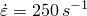） |
| --- | --- | --- |
|  | 0.26 | 0.44 |
|  | 193.0 | 1494.0 |
|  | 5.277 | 8.6304 |

**表2.1.16-2** 实验确定的剪切失效参数（Hooputra等人，2004）。
| 参数 | 准静态 | 动态（） |
| --- | --- | --- |
|  | 0.26 | 0.35 |
|  | 4.16 | 1.2 |
|  | 4.04 | 2.05 |
|  | 0.3 | 0.3 |

### 图形

**图2.1.16-1** 三点弯曲配置：几何形状和有限元网格。

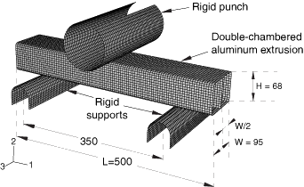

**图2.1.16-2** 准静态三点弯曲模拟结束时铝型材的最终变形形状。

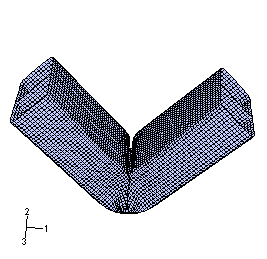

**图2.1.16-3** 准静态三点弯曲实验中铝型材的变形形状（Hooputra等人，2004）。

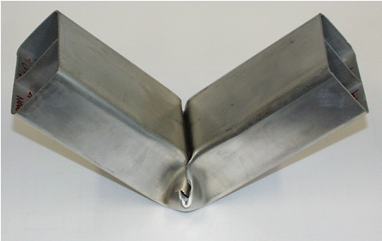

**图2.1.16-4** 三点弯曲模拟结束时完全失效的单元，映射到未变形配置中。

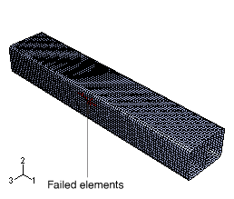

**图2.1.16-5** 三点弯曲模拟获得的力-位移响应与Hooputra等人（2004）实验结果的比较。

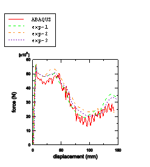

**图2.1.16-6** 轴向压碎配置：几何形状和有限元网格。

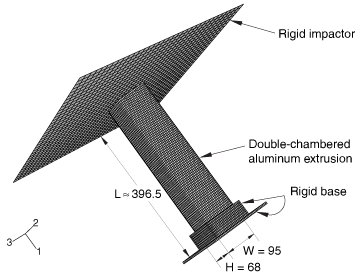

**图2.1.16-7** 动态轴向压碎模拟结束时铝型材的最终变形形状。

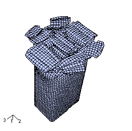

**图2.1.16-8** 动态轴向压碎实验中铝型材的变形形状（Hooputra等人，2004）。

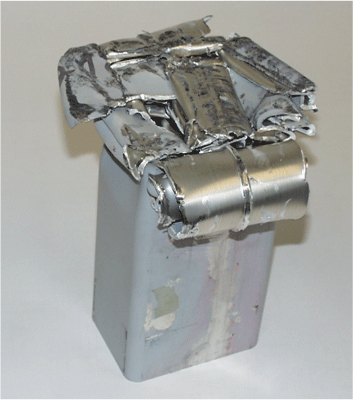

**图2.1.16-9** 轴向压碎模拟获得的力-位移响应与Hooputra等人（2004）实验结果的比较。

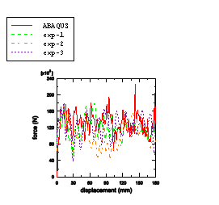

