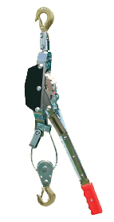
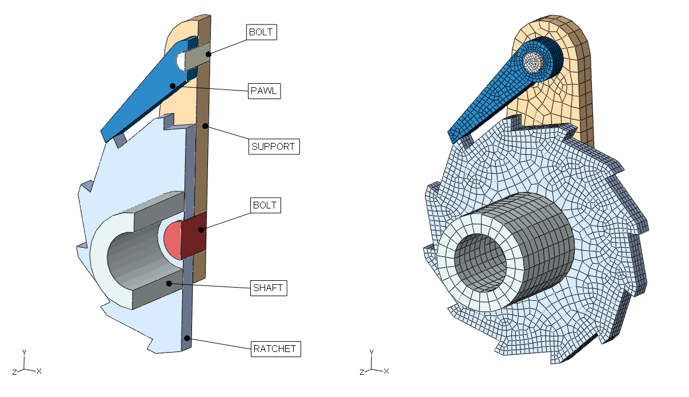
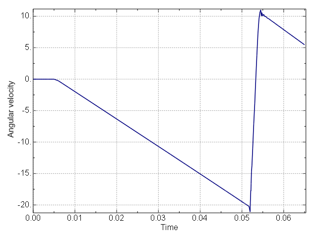
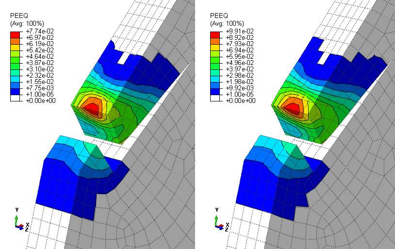
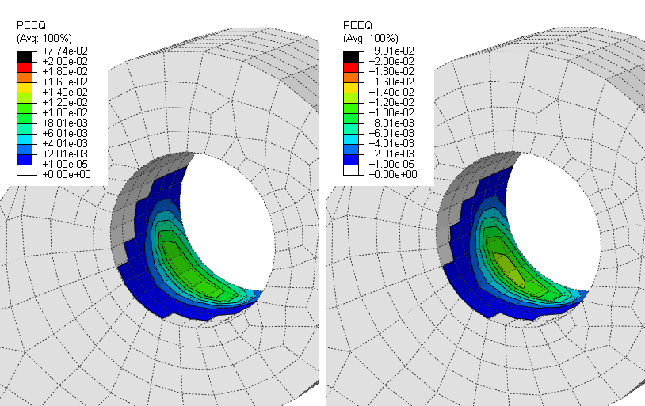
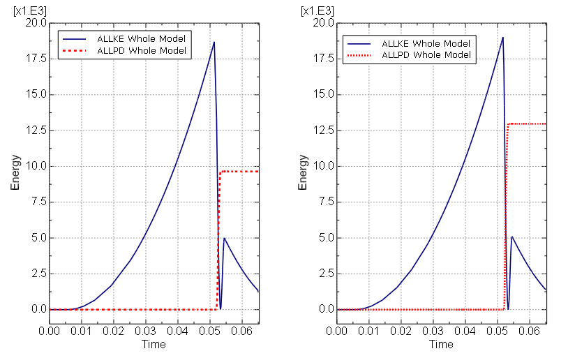

# 2.1.17 Impact analysis of a pawl-ratchet device

**Product: **Abaqus/Standard  

### Objectives

This example illustrates the use of the direct-integration implicit dynamic procedure with general contact for an example involving impact and significant sliding between contacting surfaces.

### Application description

Pawl-ratchet mechanisms exist in a variety of applications such as ratchet lever hoists (also known as come-along winches; see [Figure 2.1.17--1](ch02s01aex78.md#exxratchetpawl-comealongtool)) and parking brakes. Some care should be taken when using these devices to minimize dynamic impact between the pawl and ratchet teeth—for example, the lever of a ratchet lever hoist should be controlled such as to gradually engage the antireverse mechanism, and a car should be stopped before putting its transmission into “park.” This analysis provides a preliminary assessment of the integrity of a pawl-ratchet mechanism under misuse conditions in which dynamic effects are significant when the pawl engages a ratchet tooth.

### Geometry

The model is shown in [Figure 2.1.17--2](ch02s01aex78.md#exxratchetpawl-modelmesh), which somewhat resembles the ratchet mechanism within the tool shown in [Figure 2.1.17--1](ch02s01aex78.md#exxratchetpawl-comealongtool); however, this model is not representative of design details of any specific product. The ratchet mechanism is intended to restrict clockwise motion of the ratchet wheel. The pawl and ratchet wheel are each attached to a stiff support using cylindrical bolts. The ratchet-bolt and pawl-bolt interfaces do not restrict axial rotation of the ratchet and pawl. A torsional spring, which is not shown in the figure, tends to keep the pawl in contact with the ratchet wheel. The ratchet wheel is attached to a hollow shaft. A cable and a lever would also be attached to the shaft in a ratchet lever hoist; however, these aspects are not modeled explicitly.

The model uses a millimeter-tonne-second unit system. The hollow shaft has a length of 40 mm and a radius of 20 mm. The radius of the shaft hole is 12 mm. The width of both the pawl and the ratchet wheel is 8 mm. The radius of the wheel hole is 8 mm, and the radius of the pawl hole is 4 mm. The wheel outer diameter is 100 mm.

### Materials

The materials considered in this example are assumed to have linear elastic, perfectly plastic behavior except for the support, which is considered rigid with fixed position. The deformable bodies have an elastic modulus of 21  104 MPa, Poisson’s ratio of 0.3, and density of 7.9  109 tonne/mm3. The yield strength of the pawl is  600 MPa, and the yield strength of the other deformable bodies is 800 MPa.

### Interactions

The model employs the general contact capabilities available in Abaqus/Standard to simulate contact interactions between the various parts.

### Abaqus modeling approaches and simulation techniques

 The analysis is performed using implicit dynamic steps. The first step establishes contact between the pawl and the ratchet wheel, thereby establishing appropriate initial conditions for the second step. Inertia effects are considered during the first step only to avoid issues associated with initially unconstrained rigid body modes that could be troublesome for a purely static procedure; therefore, the quasi-static implicit dynamic application option is used in the first step.

The remainder of the analysis considers the effect of a suddenly applied, sustained net torque acting on the ratchet shaft that leads to impact between the pawl and a ratchet tooth. This applied net torque is meant to approximate the effect of suddenly removing an applied torque that had been counteracting a working load. In a ratchet lever hoist (see [Figure 2.1.17--1](ch02s01aex78.md#exxratchetpawl-comealongtool)) this applied net torque approximates the effect of suddenly removing the load on the lever before the pawl is properly engaged with the ratchet (while the hoist is carrying a load). The response due to the applied torque is modeled with a single (second) step in a preliminary analysis and alternatively with three separate steps for the pre-impact, impact, and post-impact phases to facilitate use of smaller time increments for a more accurate analysis of the highly nonlinear impact phase. The moderate dissipation implicit dynamic application option is used for steps modeling the response to the applied torque, which is appropriate for most dynamic contact simulations.

This analysis is meant to approximate a situation in which the cable loading is due to gravity acting on a mass attached to the cable. Since the cable and this mass are not modeled directly, the inertial effect of the mass is approximated with additional rotary inertia on the shaft. In general, if the cable were included in the model, one could expect that the solution may be affected by the cable dynamic response and the details of cable-shaft interactions and self-contact of the cable where it is wrapped onto the shaft. However, in this preliminary study, the model simplifications are assumed to provide reasonably representative results with respect to the severity of the impact loading.

### Mesh design

The shaft mesh uses fully integrated first-order continuum (C3D8) elements. All other parts are meshed with reduced integration first-order continuum (C3D8R) elements. 

### Material model

The deformable materials use the Mises plasticity model without hardening. The material parameters were discussed previously.

### Initial conditions

All of the bodies are initially at rest. The positioning of the pawl and ratchet wheel at the beginning of the analysis is shown in [Figure 2.1.17--2](ch02s01aex78.md#exxratchetpawl-modelmesh). A small initial gap exists between the pawl and the ratchet. Initially, the pawl is not in static equilibrium due to initial loading by a torsional spring, as discussed in ["Constraints](ch02s01aex78.md#exa-dyn-pawlratchet-constraints)” below.

### Boundary conditions

The reference node of the support (which is considered rigid) has all components of translation and rotation fixed. The annular face of the shaft away from the ratchet wheel is constrained to a reference node that is positioned on the shaft axis, at the center of the annular face. Zero displacement along the global *X*- and global *Y*-axes is prescribed for this reference node.

### Loads

After the initialization step, force and torque act on the ratchet shaft due to cable loading associated with a 0.2 tonne mass under gravitational loading (as discussed previously, this mass and the cable are not modeled explicitly). A force of 1960 N and torque of 42,140 Nmm act on the ratchet shaft via a distributing coupling reference node.  These concentrated loads are applied instantaneously at the beginning of the second step and remain constant in time.

The applied torque leads to impact loading (modeled with general contact), which is of primary interest in this analysis.

### Constraints

All translations and rotations for the rigid support are fixed. The circumferential surface of the bolts is partitioned in two halves (with respect to a plane perpendicular to their axis) with one half being tied to the corresponding hole in the support part, using a tie constraint. A distributing coupling is employed to apply concentrated force and torque to the outer cylindrical surface of the hollow shaft. One of the annular faces of the shaft is tied to the ratchet wheel. A kinematic coupling is employed to constrain the other annular face of the shaft (i.e., the face away from the ratchet wheel) to a reference node at the center of this face.

A torsional spring—modeled using a connector element—is used for maintaining contact between the pawl and the ratchet wheel. One end of the connector is coupled using a distributing coupling to the outer cylindrical surface of the pawl. 

### Interactions

Contact is defined using the default general contact inclusions option. This is the easiest way to ensure that Abaqus/Standard will enforce any mechanical interactions between various parts of the model. A friction coefficient of 0.15 is specified for all interactions. Circumferential smoothing is applied to all cylindrical surfaces (associated with bolts and bolt holes), which was facilitated by using Abaqus/CAE to create the model (Abaqus/CAE assigns circumferential smoothing by default to cylindrical surfaces).

A connector element (CONN3D2) using a revolute connection type with a prescribed reference angle is employed for representing the torsional spring, which maintains contact between the pawl and ratchet. The rotational stiffness of the connector element is 2000 Nmm/rad. A reference angle of 45 is defined for the connector behavior. When in static equilibrium, the pawl presses the ratchet with a contact force of about 31.5 N.

### Results and discussion

The evolution of the angular velocity of the ratchet wheel is shown in [Figure 2.1.17--3](ch02s01aex78.md#exxratchetpawl-vr3) for the preliminary analysis that uses two load steps. This angular velocity remains zero during the first step because no net torque acts on the ratchet wheel during that step. Once the torque loading is applied after the first step, an approximately linear increase in the absolute value of this angular velocity occurs while the pawl slides along the ratchet; during this time the net torque acting on the ratchet wheel (affected by the applied torque and frictional forces) is approximately constant, so the angular acceleration is also nearly constant. The sign of the angular acceleration changes upon impact. Large contact forces transmitted between the pawl and ratchet tooth eventually lead to a rebound. This simulation completes before any secondary rebounds occur (the analysis duration could be extended if secondary rebounds were of interest).

In a subsequent 4-step analysis, the initialization step remains the same but the response to torque loading is modeled with three steps instead of one step to facilitate specification of smaller time increments during impact. These three steps correspond to the pre-impact, impact, and post-impact phases that are apparent in [Figure 2.1.17--3](ch02s01aex78.md#exxratchetpawl-vr3). Usage of smaller time increments during impact enables more accurate modeling of the highly nonlinear response during this phase. [Figure 2.1.17--4](ch02s01aex78.md#exxratchetpawl-peeq) shows contour plots of equivalent plastic strain at the end of the 2-step and 4-step analyses in the vicinity of the pawl-to-ratchet impact for the imagined mechanism. The maximum equivalent plastic strain, which occurs at the tip of the pawl, is approximately 8% in the 2-step analysis and approximately 10% in the 4-step analysis. The 4-step analysis uses a time increment during impact about one-fifth of that in the 2-step analysis. The maximum equivalent plastic strain is quite insensitive to further reductions in the time increment during impact. The difference between the equivelent plastic strain plots shown in [Figure 2.1.17--4](ch02s01aex78.md#exxratchetpawl-peeq) demonstrates the importance of using an adequately small time increment to model portions of an analysis with sudden changes in acceleration. Less severe plastic deformation is predicted in the ratchet tooth and, as shown on the right side of [Figure 2.1.17--5](ch02s01aex78.md#exxratchetpawl-peeq-hole), in the vicinity of the pawl-bolt interface.

The evolution of kinetic energy (ALLKE) and energy dissipation due to yielding (ALLPD) is plotted for the 2-step and 4-step analyses in [Figure 2.1.17--6](ch02s01aex78.md#exxratchetpawl-allkeallpd). Plastic dissipation occurs while the ratchet wheel decelerates after impact; differences in plastic dissipation for the two analyses are again apparent in [Figure 2.1.17--6](ch02s01aex78.md#exxratchetpawl-allkeallpd). The various phases of the simulation can be identified in the kinetic energy plot, including the pre-impact, impact, rebound, and post-rebound phases.

### Input files

[pawlratchet_impact.inp](../eif/pawlratchet_impact.inp)

Implicit dynamic 2-step analysis.

[pawlratchet_impact_4step.inp](../eif/pawlratchet_impact_4step.inp)

Implicit dynamic 4-step analysis.

### References

**Abaqus Analysis User's Guide**
- ["Implicit dynamic analysis using direct integration," Section 6.3.2 of the Abaqus Analysis User's Guide](../usb/usb-link.md#usb-anl-adynamic)
- ["Defining general contact in Abaqus/Standard," Section 36.2 of the Abaqus Analysis User's Guide](../usb/usb-link.md#usbgencontactstd)

**Abaqus Keywords Reference Guide**
- [*CONTACT](../key/key-link.md#usb-kws-hcontact)
- [*DYNAMIC](../key/key-link.md#usb-kws-hdynamic)

### Figures

**Figure 2.1.17–1** Ratchet lever hoist (come-along winch).

**Figure 2.1.17–2** Geometry and mesh of the pawl-ratchet model.

**Figure 2.1.17–3** Evolution of angular velocity of the ratchet wheel.

**Figure 2.1.17–4** Distribution of equivalent plastic strain (PEEQ) near pawl tip for 2-step analysis (left) and 4-step analysis (right).

**Figure 2.1.17–5** Distribution of equivalent plastic strain (PEEQ) near pawl hole for 2-step analysis (left) and 4-step analysis (right).

**Figure 2.1.17–6** Evolution of the kinetic and plastically dissipated energy for 2-step analysis (left) and 4-step analysis (right).

