# 2.1.18 陶瓷靶的高速冲击

**产品：** Abaqus/Explicit

### 目标

此示例问题说明了以下Abaqus特征和技术：
- 使用Johnson-Holmquist-Beissel（JHB）和Johnson-Holmquist（JH-2）陶瓷材料模型来研究碳化硅靶的高速冲击。JHB和JH-2模型在Abaqus/Explicit中作为内置用户材料可用；
- 在Abaqus/Explicit中通过适当校准Drucker-Prager塑性和状态方程功能来实现陶瓷的类似材料响应；和
- 将数值结果与已发表的结果进行比较。

### 应用描述

陶瓷材料常用于装甲防护应用。近年来，Johnson、Holmquist及其合作者开发了一系列本构关系来模拟陶瓷材料在大应变、高应变速率和高压力冲击条件下的响应。在此示例中，探索了JHB和JH-2材料模型来研究撞击碳化硅靶的金质弹丸的穿透速度。计算结果与Holmquist和Johnson（2005）给出的已发表结果进行了比较。

### 几何形状

初始配置如图2.1.18-1所示。靶和弹丸都是圆柱形。碳化硅靶半径为7.5 mm，长度为40 mm。金质弹丸半径为0.375 mm，长度为30 mm。

### 材料

靶材料是碳化硅。这种材料非常硬，主要在压缩载荷条件下使用，只能承受非常小的拉力。典型应用包括防弹背心和高强度等方面，由于其高耐久性。强度具有对压力的依赖性。在高速冲击应用中，材料的损伤在强度演变中起重要作用。完全失效的碳化硅将不承受任何载荷。弹丸是金，与靶材料相比很软。

### 初始条件

为弹丸规定了4000 m/s的初始速度。

### 相互作用

由于高速冲击，弹丸将穿透靶。

### Abaqus建模方法和仿真技术

研究了三种情况，每种情况使用不同的方法来建模碳化硅材料：第一种情况使用JHB材料模型，第二种使用JH-2模型，第三种情况使用多个Abaqus选项的组合来在更通用的框架内获得类似的本构模型。弹丸和靶都使用拉格朗日描述。三种情况都使用具有表面侵蚀的通用接触。考虑单元删除和节点侵蚀。所有模拟选择吨-毫米-秒单位系统。

### 分析情况汇总

| 情况1 | JHB（内置用户材料） |
| --- | --- |
| 情况2 | JH-2（内置用户材料） |
| 情况3 | Drucker-Prager塑性、状态方程和Johnson-Cook率依赖的组合 |

以下章节讨论适用于所有情况的分析考虑。

### 分析类型

所有模拟都使用Abaqus/Explicit动态分析。穿透过程的总持续时间为7 μs。

### 网格设计

建模了圆筒的11.5°切片。弹丸径向有五个单元。靶径向的单元尺寸与弹丸几乎相同。由于弹丸和靶之间的半径比很大，靶有343,980个单元，弹丸有2000个单元。图2.1.18-2显示了用于分析的部分网格。

### 材料模型

以下章节详细讨论了用于每种情况的碳化硅靶的不同材料模型。JHB和JH-2模型作为Abaqus的内置用户材料可用（即通过作为内置的[`VUMAT`](../sub/sub-link.md#sub-xsl-vumat)子程序）。这些内置材料通过以`ABQ_JHB`和`ABQ_JH2`开头的材料名称来调用。关于陶瓷材料模型的描述，请参阅Dassault Systmes知识库中的"使用Johnson-Holmquist和Johnson-Holmquist-Beissel材料模型分析陶瓷"，网址为www.3ds.com/support/knowledge-base。

弹丸材料是金。密度为19,240 kg/m³。剪切模量为27.2 GPa。水动力行为由Mie-Grüneisen状态方程描述。使用线性 Hugoniot形式。参数为=2946.16 m/s，=3.08623，=2.8。强度描述为完美塑性，130 MPa。使用损伤起始准则，损伤起始时的等效塑性应变0.2。 fracture 能量选择为0用于损伤演化。

### 初始条件

为弹丸所有节点在朝向靶的轴向方向上指定4000 m/s的初始速度条件。

### 边界条件

对称轴上的所有节点（设置为全局*x*方向）只能沿此轴移动，因此在*y*和*z*方向都规定为零速度边界条件。为了满足轴对称边界条件，建立了一个圆柱坐标系。靶和弹丸的两个侧表面上除对称轴节点外的所有节点的周向自由度被规定为零速度边界条件。靶的非冲击端节点在轴向方向上被固定。

### 相互作用

通用接触用于建模弹丸和靶之间的相互作用。靶和弹丸的内表面都被包括以启用单元移除。

### 分析步骤

只有一个显式动态分析步骤，在此期间发生穿透。

### 输出请求

除了Abaqus中可用的标准输出标识符外，JHB和JH-2模型的输出还可使用表2.1.18-1和表2.1.18-2中描述的解决方案相关状态变量。

### 高速冲击下陶瓷材料的本构模型

本节详细描述了用于每种情况的碳化硅靶的不同本构模型。

#### 情况1：Johnson-Holmquist-Beissel模型

此情况对碳化硅靶使用JHB模型。本研究使用了Holmquist和Johnson（2005）给出的碳化硅JHB材料参数。它们列于表2.1.18-3中。

JHB模型由三个主要组成部分：以压力相关屈服面形式表示的完整和破碎材料的偏强度表示；将材料从完整状态过渡到破碎状态的损伤模型；以及用于压力-密度关系的状态方程（EOS），可以包括膨胀（或体积增大）效应以及相变（本研究未考虑）。

##### 强度

材料强度用Mises等效应力表示，是压力、无量纲等效应变速率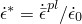（其中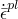是等效塑性应变速率，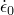是参考应变速率）和损伤变量）的函数。对于完整（未损伤）材料，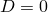，而对于完全损伤材料，。

对于无量纲应变速率为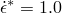的情况，完整材料（）的强度形式为

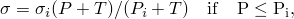

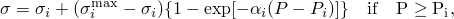

其中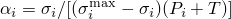和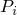、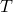、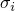和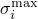是材料参数。破碎材料（）的强度给定为

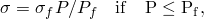

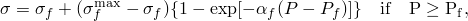

其中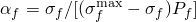和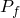、和是材料参数。

上述完整和破碎强度适用于无量纲应变速率为的情况。应变率的影响通过Johnson-Cook应变率依赖律纳入为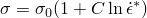，其中是对应于的强度。塑性流动是体积保持的，由Mises流动势控制。

##### 损伤

损伤起始参数根据塑性应变累积

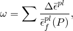

其中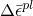是等效塑性应变增量，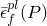是在恒定压力下断裂的等效塑性应变，定义为

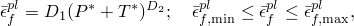

其中和是材料常数，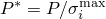和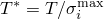。提供可选参数和以提供额外的灵活性来限制断裂应变的最小和最大值。

JHB模型假定当时材料立即失效，。对于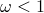的其他值，没有损伤（），材料保持其完整强度。

##### 压力

本研究使用的无相变的压力-密度关系方程列于此处。

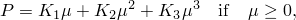

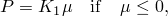

其中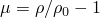。在以上式中，、和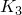是常数（是初始体积模量）；是当前密度；是参考密度。该模型包括脆性材料在失效时发生的膨胀或体积增大效应，方法是通过添加额外的压力增量，使得

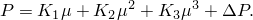

压力增量根据能量考虑确定

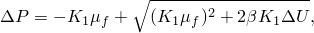

其中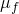是失效时的当前值，是转化为静水势能的弹性能量损失的比例（）。体积增大压力仅对压缩失效时计算（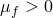）。

#### 情况2：Johnson-Holmquist模型

第二种情况使用JH-2模型。与JHB模型不同，JH-2模型假定损伤变量随塑性变形逐渐增加。JH-2模型使用的材料参数列于表2.1.18-4中。JH-2模型同样由三个组成部分组成。

##### 强度

材料强度用归一化Mises等效应力表示

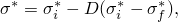

其中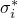是归一化完整等效应力，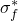是归一化破碎等效应力，是损伤变量。归一化等效应力（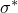、和）具有一般形式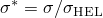，其中是实际Mises等效应力，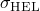是Hugoniot弹性极限（HEL）处的等效应力。该模型假定归一化完整和破碎应力可以表示为压力和应变速率的函数

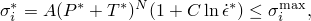

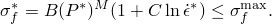

材料参数为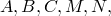和强度的可选限制和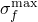。归一化压力定义为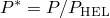，其中是实际压力，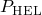是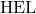处的压力。归一化最大拉伸静水压力为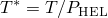，其中是材料可承受的最大拉伸压力。

##### 损伤

损伤起始参数根据塑性应变累积

其中是等效塑性应变增量，是在恒定压力下断裂的等效塑性应变，定义为

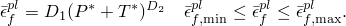

JH-2模型通过设置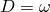假定损伤变量随塑性变形逐渐增加。

##### 压力

压力-密度关系方程与JHB模型类似。

其中。该模型包括脆性材料在失效时发生的膨胀或体积增大效应，方法是通过添加额外的压力增量，使得

压力增量根据能量考虑确定

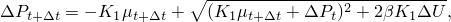

其中是转化为静水势能的弹性能量损失的比例（）。

#### 情况3：Drucker-Prager模型

我们使用校准的Drucker-Prager塑性模型和状态方程来获得与JH-2模型相似的材料行为。这样，我们不局限于遵循JH模型的具体表达式及其材料参数。Drucker-Prager塑性模型和状态方程的校准描述如下。

##### 强度

我们使用扩展Drucker-Prager模型的一般指数形式（["扩展Drucker-Prager模型，"Abaqus分析用户指南第23.3.1节](../usb/usb-link.md#usb-mat-cdruckerprager)），经过一些操作后，可以写成如下形式：

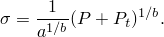

我们用替换了，用替换了，以与JH-2模型中使用的符号保持一致。这个表达式与JH-2模型的完整强度表达式非常相似

比较这两个表达式，可以获得校准Drucker-Prager模型中材料参数的方程

在代入表2.1.18-4中碳化硅的值后，我们发现*a*=3.920173×10³ MPa ，*b*=1.53846。在获得材料参数和后，通过求解以下方程可以校准单轴压缩屈服应力。

对于这种碳化硅，=6605.66 MPa。Johnson-Cook类型率依赖也可以与Drucker-Prager塑性模型结合使用。

##### 损伤

Abaqus中的延性损伤起始准则（["延性金属的损伤起始，"Abaqus分析用户指南第24.2.2节](../usb/usb-link.md#usb-mat-cdamageinitductile)）可以校准以重现JH-2损伤模型中使用的损伤准则。延性准则需要指定损伤起始时等效塑性应变作为应力三轴度的函数。在JH-2模型的完整强度曲线上，应力三轴度给定为

给定，JH-2模型的损伤演化关系给出以下压力表达式：

将此表达式代入应力三轴度表达式，我们最终得到延性损伤起始准则所需的和应力三轴度之间的函数关系。在为Drucker-Prager塑性模型指定损伤起始准则时，指定等效塑性应变的定义与JH-2模型中使用的定义不同。两者通过以下塑性功声明相关：

总之，我们为指定一些采样点，计算相应的压力，进而计算JH-2模型的完整强度。我们使用这些和值计算应力三轴度。我们通过上述塑性功声明将值转换为。这样，我们最终获得Drucker-Prager模型损伤起始时等效塑性应变和应力三轴度的数据对表。

##### 压力

Mie-Grüneisen状态方程（["Mie-Grüneisen状态方程"，"状态方程，"Abaqus分析用户指南第25.2.1节](../usb/usb-link.md#usb-mat-ceos-mg)）用于描述碳化硅材料的水动力行为。使用线性 Hugoniot形式。在没有能量贡献的情况下（=0.0），压力表示为

其中。使用关于的Taylor展开，多项式的线性和二次系数可以识别为JH-2模型压力-密度关系中的和，这给出

我们求解参数和。值为=8272.2 m/s，=1.32。

### 结果讨论和情况比较

表2.1.18-5列出了在3 μs、5 μs和7 μs时三种模型和Holmquist和Johnson（2005）参考文献中已发表结果的穿透深度。三种模型的所有结果与已发表结果吻合良好。特别是，使用Drucker-Prager模型获得的结果与使用JH模型的所有其他结果令人满意地一致。JHB、JH-2和Drucker-Prager模型的最终配置分别如图2.1.18-3、图2.1.18-4和图2.1.18-5所示。波传播结果可以通过增加楔形角度来改善。

### 输入文件

##### **情况1：JHB材料模型**

[exa_impactsiliconcarbide_jhb.inp](../eif/exa_impactsiliconcarbide_jhb.inp)

用于创建和分析模型的输入文件。

##### **情况2：JH-2材料模型**

[exa_impactsiliconcarbide_jh2.inp](../eif/exa_impactsiliconcarbide_jh2.inp)

用于创建和分析模型的输入文件。

##### **情况3：Drucker-Prager材料模型**

[exa_impactsiliconcarbide_dp.inp](../eif/exa_impactsiliconcarbide_dp.inp)

用于创建和分析模型的输入文件。

### 参考文献

**Abaqus分析用户指南**
- ["渐进损伤和失效，"第24.1.1节](../usb/usb-link.md#usb-mat-cdamageoverview)
- ["扩展Drucker-Prager模型，"第23.3.1节](../usb/usb-link.md#usb-mat-cdruckerprager)

**Abaqus关键词参考指南**
- [*DAMAGE INITIATION](../key/key-link.md#usb-kws-mdamageinitiation)
- [*DAMAGE EVOLUTION](../key/key-link.md#usb-kws-mdamageevolution)
- [*DRUCKER PRAGER](../key/key-link.md#usb-kws-mdruckerprager)

**其他**

- Holmquist, T. J., Johnson, G. R., "Characterization and Evaluation of Silicon Carbide for High-Velocity Impact," Journal of Applied Physics, vol. 97, 093502, 2005.
- Johnson, G. R., Holmquist, T. J., "An Improved Computational Constitutive Model for Brittle Materials," High Pressure Science and Technology--1993, New York, AIP Press, 1993.

### 表格

**表2.1.18-1** JHB模型定义解决方案相关状态变量。
| 输出变量 | 符号 | 描述 |
| --- | --- | --- |
| SDV1 |  | 等效塑性应变PEEQ |
| SDV2 |  | 等效塑性应变速率 |
| SDV3 |  | 损伤起始准则 |
| SDV4 |  | 损伤变量 |
| SDV5 |  | 由体积增大引起的压力增量 |
| SDV6 |  | 屈服强度 |
| SDV7 |  |体积应变  的最大值 |
| SDV8 |  | 体积应变  |
| SDV9 |  | 材料点状态：活动为1，失效为0 |

**表2.1.18-2** JH-2模型定义解决方案相关状态变量。
| 输出变量 | 符号 | 描述 |
| --- | --- | --- |
| SDV1 |  | 等效塑性应变PEEQ |
| SDV2 |  | 等效塑性应变速率 |
| SDV3 |  | 损伤起始准则 |
| SDV4 |  | 损伤变量 |
| SDV5 |  | 由体积增大引起的压力增量 |
| SDV6 |  | 屈服强度 |
| SDV7 |  | 体积应变  |
| SDV8 |  | 材料点状态：活动为1，失效为0 |

**表2.1.18-3** JHB模型的材料参数。
| 第1行 |  |  |  |  |  |  |  |  |
| --- | --- | --- | --- | --- | --- | --- | --- | --- |
|  | 3215 kg/m³ | 193 GPa | 4.92 GPa | 1.5 GPa | 0.1 GPa | 0.25 GPa | 0.009 | 1.0 |
| 第2行 |  |  |  |  |  |  |  |  |
|  | 0.75 GPa | 12.2 GPa | 0.2 GPa | 1.0 |  |  |  |  |
| 第3行 |  |  |  | FS |  |  |  |  |
|  | 0.16 | 1.0 | 999 | 0.2 |  |  |  |  |
| 第4行 |  |  |  |  |  |  |  |  |
|  | 220 GPa | 361 GPa | 0 GPa |  |  |  |  |  |
| 第5行 |  |  |  |  |  |  |  |  |
|  | 0 | 0 | 0 | 0 | 0 | 0 | 0 |  |

**表2.1.18-4** JH-2模型的材料参数。
| 第1行 |  |  |  |  |  |  |  |  |
| --- | --- | --- | --- | --- | --- | --- | --- | --- |
|  | 3215 kg/m³ | 193 GPa | 0.96 | 0.65 | 0.35 | 1.0 | 0.009 | 1.0 |
| 第2行 |  |  |  |  |  |  |  |  |
|  | 0.75 GPa | 1.24 | 0.132 | 11.7 GPa | 5.13 GPa | 1.0 |  |  |
| 第3行 |  |  |  |  | FS | lDamage |  |  |
|  | 0.48 | 0.48 | 1.2 | 0.0 | 0.2 | 0 |  |  |
| 第4行 |  |  |  |  |  |  |  |  |
|  | 220 GPa | 361 GPa | 0 GPa |  |  |  |  |  |

**表2.1.18-5** 与参考结果的结果比较。
| 结果 | 穿透深度 |
| --- | --- |
| 3 μs | 5 μs | 7 μs |
| 已发表结果 | 7.23 mm | 12.05 mm | 16.87 mm |
| JHB模型 | 7.19 mm | 12.10 mm | 16.88 mm |
| JH-2模型 | 7.18 mm | 12.03 mm | 16.89 mm |
| Drucker-Prager模型 | 7.18 mm | 11.80 mm | 16.52 mm |

### 图形

**图2.1.18-1** 碳化硅靶和金质弹丸：几何形状。

**图2.1.18-2** 碳化硅靶和金质弹丸：网格。

**图2.1.18-3** 使用JHB模型在7 μs时的最终配置。

**图2.1.18-4** 使用JH-2模型在7 μs时的最终配置。

**图2.1.18-5** 使用Drucker-Prager模型和Mie-Grüneisen状态方程在7 μs时的最终配置。

