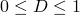

# 2.1.18 High-velocity impact of a ceramic target

**Product: **Abaqus/Explicit  

### Objectives

This example problem illustrates the following Abaqus features and techniques:
- using the Johnson-Holmquist-Beissel (JHB) and the Johnson-Holmquist (JH-2) ceramic material models to study the high-velocity impact of a silicon carbide target. The JHB and JH-2 models are available in Abaqus/Explicit as built-in user materials;
- achieving a similar material response for ceramics with proper calibration of the Drucker-Prager plasticity and the equation of state functionality in Abaqus/Explicit; and
- comparing numerical results with published results.

### Application description

Ceramic materials are commonly used in armor protection applications. In recent years Johnson, Holmquist, and their coworkers have developed a series of constitutive relations to simulate the response of ceramic materials under large strain, high-strain rate, and high-pressure impacting conditions. In this example  the JHB and JH-2 material models are explored to investigate the penetration velocity of a gold projectile impacting on a silicon carbide target. The computed results are compared with published results given by Holmquist and Johnson (2005). 

### Geometry

The initial configuration is shown in [Figure 2.1.18--1](ch02s01aex79.md#configure). Both target and projectile are of cylindrical shape. The silicon carbide target has a radius of 7.5 mm and a length of 40 mm. The gold projectile has a radius of 0.375 mm and a length of 30 mm.

### Materials

The target material is silicon carbide. This material is very hard and mainly used under compressive load conditions and can only sustain very little tension. Typical applications include bulletproof vests and car brakes due to its high endurance. The strength has a dependence on pressure. In high-speed impact applications, damage to the material plays an important role in the evolution of the strength. The totally failed silicon carbide will not sustain any load. The projectile is gold, which is soft compared to the target material.

### Initial conditions

An initial velocity of 4000 m/s is prescribed for the projectile.

### Interactions

The projectile will penetrate into the target due to the high-speed impact.

### Abaqus modeling approaches and simulation techniques

Three cases are investigated, each using a different approach to model the silicon carbide material: the first case uses the JHB material model, the second uses the JH-2 model, and the third case uses a combination of several Abaqus options to obtain a similar constitutive model within a more general framework. The Lagrangian description is used for both projectile and target. General contact with surface erosion is used for all three cases. Element deletion and node erosion are considered. A tonne-millimeter-second unit system was chosen for all simulations.

### Summary of analysis cases

| Case 1 | JHB (built-in user material) |
| --- | --- |
| Case 2 | JH-2 (built-in user material) |
| Case 3 | Combination of Drucker-Prager plasticity, equation of state, and Johnson-Cook rate dependence |

The sections that follow discuss the analysis considerations that are applicable to all cases.

### Analysis types

An Abaqus/Explicit dynamic analysis is used for all the simulations. The total duration for the penetration process is 7 μs.

### Mesh design

An 11.5 slice of the cylinders is modeled. There are five elements along the radial direction of the projectile. The element size along the radial direction for the target is nearly the same as for the projectile. Due to the large radius ratio between the projectile and the target, there are 343,980 elements for the target and 2000 elements for the projectile. [Figure 2.1.18--2](ch02s01aex79.md#mesh) shows part of the meshes used for the analysis.

### Material model

The different material models used for the silicon carbide target are discussed in detail in subsequent sections. The JHB and JH-2 models are available as built-in user materials for Abaqus (i.e., via [`VUMAT`](../sub/sub-link.md#sub-xsl-vumat) subroutines that are built-in). These built-in materials are invoked by using material names starting with `ABQ_JHB` and `ABQ_JH2`, respectively. For descriptions of the ceramic material models, see “Analyzing ceramics with the Johnson-Holmquist and Johnson-Holmquist-Beissel material models” in the Dassault Systmes Knowledge Base at [www.3ds.com/support/knowledge-base](http://www.3ds.com/support/knowledge-base).

The material for the projectile is gold. The density is 19,240 kg/m3. The shear modulus is 27.2 GPa. The hydrodynamic behavior is described by the Mie-Grneisen equation of state. The linear  Hugoniot form is used. The parameters are  = 2946.16 m/s,  = 3.08623, and  = 2.8. The strength is 130 MPa described as a perfect plasticity. A ductile damage initiation criterion with the equivalent plastic strain of 0.2 at the onset of damage is used. The fracture energy is chosen as 0 for the damage evolution. 

### Initial conditions

Initial velocity conditions of 4000 m/s are specified for all the nodes of the projectile in the axial direction toward the target.

### Boundary conditions

All the nodes on the symmetry axis, which is set up as the global *x*-direction, can move only along this axis, so zero velocity boundary conditions are prescribed for both the *y*- and *z*-directions. To satisfy the axial symmetry boundary conditions, a cylindrical coordinate system is established. The circumferential degrees of freedom for all the nodes on the two side surfaces except the nodes on the symmetry axis of both the target and the projectile are prescribed with zero velocity boundary conditions. The nodes on the non-impacting end of the target are fixed along the axial direction.

### Interactions

General contact is used to model the interactions between the projectile and the target. The interior surface of both the target and the projectile is included to enable element removal.

### Analysis steps

There is only one explicit dynamic analysis step, during which the penetration takes place.

### Output requests

In addition to the standard output identifiers available in Abaqus, the solution-dependent state variables described in [Table 2.1.18--1](ch02s01aex79.md#jhboutput) and [Table 2.1.18--2](ch02s01aex79.md#jh2output) are also available for output for the JHB and JH-2 models, respectively.

### Constitutive models for ceramic materials under high-velocity impact

This section provides a detailed description of the different constitutive models for ceramic materials that are used to model the silicon carbide target for each of the cases considered.

#### Case 1: Johnson-Holmquist-Beissel model

This case uses the JHB model for the silicon carbide target. The JHB material parameters for silicon carbide given in Holmquist and Johnson (2005) are used in this study. They are listed in [Table 2.1.18--3](ch02s01aex79.md#jhbpara).

The JHB model consists of three main components: a representation of the deviatoric strength of the intact and fractured material in the form of a pressure-dependent yield surface, a damage model that transitions the material from the intact state to a fractured state, and an equation of state (EOS) for the pressure-density relation that can include dilation (or bulking) effects as well as a phase change (not considered in this study).

##### Strength

The strength of the material is expressed in terms of the von Mises equivalent stress, , and is a function of the pressure, , the dimensionless equivalent strain rate,   (where  is the equivalent plastic strain rate and  is the reference strain rate), and the damage variable,  (). For the intact (undamaged) material, , whereas  for a fully damaged material.

For a dimensionless strain rate of   , the strength of the intact material () takes the form

where  and , , , and  are material parameters. The strength of the fractured material  () is given by 

where  and , , and  are material parameters.

The intact and fractured strengths above are for a dimensionless strain rate of  . The effect from strain rates is incorporated by the Johnson-Cook strain rate dependence law as , where  is the strength corresponding to . Plastic flow is volume preserving and is governed by a Mises flow potential.

##### Damage

The damage initiation parameter, , accumulates with plastic strain according to

where  is the increment in equivalent plastic strain and   is the equivalent plastic strain to fracture under constant pressure, defined as  

where  and  are material constants and  and . The optional parameters  and  are provided for additional flexibility to limit the minimum and maximum values of the fracture strain.

The JHB model assumes that the material fails immediately,  when . For other values of , there is no damage () and the material preserves its intact strength.

##### Pressure

The equations for the pressure-density relationship without phase change are used in this study and are listed here. 

where . In the above, , , and  are constants ( is the initial bulk modulus);  is the current density; and  is the reference density. The model includes the effects of dilation or bulking that occur when brittle materials fail by including an additional pressure increment, , such that

The pressure increment is determined from energy considerations as 

where  is the current value of   at the time of failure and  is the fraction of the elastic energy loss converted to potential hydrostatic energy ( ). The bulking pressure is computed only for failure under compression ().

#### Case 2: Johnson-Holmquist model

The second case uses the JH-2 model. Unlike the JHB model, the JH-2 model assumes that the damage variable increases progressively with plastic deformation.  The material parameters used for the JH-2 model are listed in [Table 2.1.18--4](ch02s01aex79.md#jh2para). The JH-2 model similarly consists of three components.

##### Strength

The strength of the material is expressed in terms of the normalized von Mises equivalent stress as

where   is the normalized intact equivalent stress,   is the normalized fractured equivalent stress, and   is the damage variable. The normalized equivalent stresses (,   and ) have the general form  , where  is the actual von Mises equivalent stress and  is the equivalent stress at the Hugoniot elastic limit (HEL). The model assumes that the normalized intact and fractured stresses can be expressed as functions of the pressure and strain rate as

 The material parameters are  and the optional limits for the strengths  and . The normalized pressure is defined as , where  is the actual pressure and  is the pressure at the . The normalized maximum tensile hydrostatic pressure is , where  is the maximum tensile pressure that the material can withstand.

##### Damage

The damage initiation parameter, , accumulates with plastic strain according to

where  is the increment in equivalent plastic strain and   is the equivalent plastic strain to fracture under constant pressure, defined as  

The JH-2 model assumes that the damage variable increases gradually with plastic deformation by setting . 

##### Pressure

The equations for the pressure-density relationship are similar to the JHB model. 

where . The model includes the effects of dilation or bulking that occur when brittle materials fail by including an additional pressure increment, , such that

The pressure increment is determined from energy considerations as 

where  is the fraction of the elastic energy loss converted to potential hydrostatic energy (). 

#### Case 3: Drucker-Prager model

 We use a calibrated Drucker-Prager plasticity model and an equation of state to obtain a material behavior that is similar to that of the JH-2 model. In this way we are not confined to follow the specific expressions and, subsequently, the material parameters of the JH models. The calibration of the Drucker-Prager plasticity model and the equation of state is described below.

##### Strength

We use the general exponent form of the extended Drucker-Prager model (["Extended Drucker-Prager models," Section 23.3.1 of the Abaqus Analysis User's Guide](../usb/usb-link.md#usb-mat-cdruckerprager)) which, after some manipulations, can be written as follows: 

We have replaced  with  and  with  to be consistent with the symbols used in the JH-2 models. This expression is very similar to that of the intact strength of the JH-2 model

Comparing these two expressions, the equations to calibrate the material parameters in the Drucker-Prager model can be obtained as 

After substituting the values for silicon carbide in [Table 2.1.18--4](ch02s01aex79.md#jh2para), we find *a* = 3.920173  103 MPa  and *b* = 1.53846. After obtaining the material parameters  and , the uniaxial compression yield stress, , can be calibrated by solving the following equation. 

For this silicon carbide,  = 6605.66 MPa. The Johnson-Cook type rate dependence can also be used together with the Drucker-Prager plasticity model. 

##### Damage

The ductile damage initiation criterion in Abaqus (["Damage initiation for ductile metals," Section 24.2.2 of the Abaqus Analysis User's Guide](../usb/usb-link.md#usb-mat-cdamageinitductile)) can be calibrated to reproduce the damage criterion used in the JH-2 damage model. The ductile criterion requires the specification of the equivalent plastic strain at the onset of damage as a function of the stress triaxiality. Along the intact strength curve of the  JH-2 model, the stress triaxiality is given as 

Given , the damage evolution relation for the JH-2 model gives the following expression for the pressure : 

Substituting this expression into the stress triaxiality expression, we finally obtain the functional relationship between  and the stress triaxiality needed for the ductile damage initiation criterion. An additional consideration when specifying the damage initiation criterion for the Drucker-Prager plasticity model is that the definition of the equivalent plastic strain is different from that used in the JH-2 model. The two are related by the following plastic work statement:

In summary, we specify some sampling points for  and calculate the corresponding pressure  and, in turn, the intact strength  for the JH-2 model. We calculate the stress triaxiality using these  and  values. We convert the  values into  through the above plastic work statement. In this manner, we finally obtain a table of data pairs for the equivalent plastic strain at damage initiation and the stress triaxiality for the Drucker-Prager model.

##### Pressure

The  Mie-Grneisen equation of state (["Mie-Grneisen equations of state" in "Equation of state," Section 25.2.1 of the Abaqus Analysis User's Guide](../usb/usb-link.md#usb-mat-ceos-mg)) is used to describe the hydrodynamic behavior of the silicon carbide material. The linear  Hugoniot form is used. Without the energy contribution ( = 0.0), the pressure is expressed as 

where . Using a Taylor expansion with respect to , the linear and quadratic coefficients of the polynomial can be identified as  and  in the pressure density relation for the JH-2 model, which gives

 We solve for the parameters  and . The values are  = 8272.2 m/s and  = 1.32. 

### Discussion of results and comparison of cases

The penetration depths from the three models and the published results in the reference by  Holmquist and Johnson  (2005) at 3 μs, 5 μs, and 7 μs are listed in [Table 2.1.18--5](ch02s01aex79.md#cmpresult). All results from the three models match the published results well. Especially, the results obtained with the Drucker-Prager model are in satisfactory agreement with all other results obtained with the JH models. The final configurations for the JHB, JH-2, and Drucker-Prager models are shown in [Figure 2.1.18--3](ch02s01aex79.md#jhbresult),  [Figure 2.1.18--4](ch02s01aex79.md#jh2result), and  [Figure 2.1.18--5](ch02s01aex79.md#dpresult), respectively. The wave propagation results can be improved by increasing the angle of the wedge.

### Input files

##### **Case 1: JHB material model**

[exa_impactsiliconcarbide_jhb.inp](../eif/exa_impactsiliconcarbide_jhb.inp)

Input file to create and analyze the model.

##### **Case 2: JH-2 material model**

[exa_impactsiliconcarbide_jh2.inp](../eif/exa_impactsiliconcarbide_jh2.inp)

Input file to create and analyze the model.

##### **Case 3: Drucker-Prager material model**

[exa_impactsiliconcarbide_dp.inp](../eif/exa_impactsiliconcarbide_dp.inp)

Input file to create and analyze the model.

### References

**Abaqus Analysis User's Guide**
- ["Progressive damage and failure," Section 24.1.1 of the Abaqus Analysis User's Guide](../usb/usb-link.md#usb-mat-cdamageoverview)
- ["Extended Drucker-Prager models," Section 23.3.1 of the Abaqus Analysis User's Guide](../usb/usb-link.md#usb-mat-cdruckerprager)

**Abaqus Keywords Reference Guide**
- [*DAMAGE INITIATION](../key/key-link.md#usb-kws-mdamageinitiation)
- [*DAMAGE EVOLUTION](../key/key-link.md#usb-kws-mdamageevolution)
- [*DRUCKER PRAGER](../key/key-link.md#usb-kws-mdruckerprager)

**Other**

- Holmquist, T. J., Johnson, G. R., "Characterization and Evaluation of Silicon Carbide for High-Velocity Impact," Journal of Applied Physics, vol. 97, 093502, 2005.
- Johnson, G. R., Holmquist, T. J., "An Improved Computational Constitutive Model for Brittle Materials," High Pressure Science and Technology--1993, New York, AIP Press, 1993.

### Tables

**Table 2.1.18–1** Solution-dependent state variables defined in JHB model.
| Output variables | Symbol | Description |
| --- | --- | --- |
| SDV1 |  | Equivalent plastic strain PEEQ |
| SDV2 |  | Equivalent plastic strain rate |
| SDV3 |  | Damage initiation criterion |
| SDV4 |  | Damage variable |
| SDV5 |  | Pressure increment due to bulking |
| SDV6 |  | Yield strength |
| SDV7 |  | Maximum value of volumetric strain  |
| SDV8 |  | Volumetric strain  |
| SDV9 |  | Material point status: 1 if active, 0 if failed |

**Table 2.1.18–2** Solution-dependent state variables defined in JH-2 model.
| Output variables | Symbol | Description |
| --- | --- | --- |
| SDV1 |  | Equivalent plastic strain PEEQ |
| SDV2 |  | Equivalent plastic strain rate |
| SDV3 |  | Damage initiation criterion |
| SDV4 |  | Damage variable |
| SDV5 |  | Pressure increment due to bulking |
| SDV6 |  | Yield strength |
| SDV7 |  | Volumetric strain  |
| SDV8 |  | Material point status: 1 if active, 0 if failed |

**Table 2.1.18–3** Material parameters for JHB model.
| Line 1 |  |  |  |  |  |  |  |  |
| --- | --- | --- | --- | --- | --- | --- | --- | --- |
|  | 3215 kg/m3 | 193 GPa | 4.92 GPa | 1.5 GPa | 0.1 GPa | 0.25 GPa | 0.009 | 1.0 |
| Line 2 |  |  |  |  |  |  |  |  |
|  | 0.75 GPa | 12.2 GPa | 0.2 GPa | 1.0 |  |  |  |  |
| Line 3 |  |  |  | FS |  |  |  |  |
|  | 0.16 | 1.0 | 999 | 0.2 |  |  |  |  |
| Line 4 |  |  |  |  |  |  |  |  |
|  | 220 GPa | 361 GPa | 0 GPa |  |  |  |  |  |
| Line 5 |  |  |  |  |  |  |  |  |
|  | 0 | 0 | 0 | 0 | 0 | 0 | 0 |  |

**Table 2.1.18–4** Material parameters for JH-2 model.
| Line 1 |  |  |  |  |  |  |  |  |
| --- | --- | --- | --- | --- | --- | --- | --- | --- |
|  | 3215 kg/m3 | 193 GPa | 0.96 | 0.65 | 0.35 | 1.0 | 0.009 | 1.0 |
| Line 2 |  |  |  |  |  |  |  |  |
|  | 0.75 GPa | 1.24 | 0.132 | 11.7 GPa | 5.13 GPa | 1.0 |  |  |
| Line 3 |  |  |  |  | FS | lDamage |  |  |
|  | 0.48 | 0.48 | 1.2 | 0.0 | 0.2 | 0 |  |  |
| Line 4 |  |  |  |  |  |  |  |  |
|  | 220 GPa | 361 GPa | 0 GPa |  |  |  |  |  |

**Table 2.1.18–5** Results comparison with the reference results.
| Results | Penetration depth |
| --- | --- |
| 3 μs | 5 μs | 7 μs |
| Published results | 7.23 mm | 12.05 mm | 16.87 mm |
| JHB model | 7.19 mm | 12.10 mm | 16.88 mm |
| JH-2 model | 7.18 mm | 12.03 mm | 16.89 mm |
| Drucker-Prager model | 7.18 mm | 11.80 mm | 16.52 mm |

### Figures

**Figure 2.1.18–1** Silicon carbide target and gold projectile: geometry.

**Figure 2.1.18–2** Silicon carbide target and gold projectile: mesh.

**Figure 2.1.18–3** Final configuration at 7 μs using the JHB model.

**Figure 2.1.18–4** Final configuration at 7 μs using the JH-2 model.

**Figure 2.1.18–5** Final configuration at 7 μs using the Drucker-Prager model and the Mie-Grneisen equation of state.

