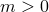
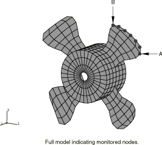
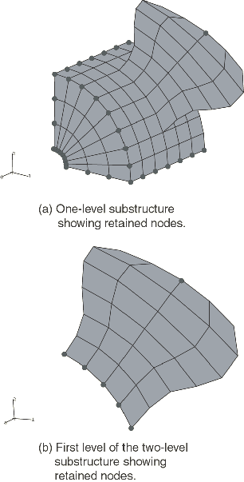
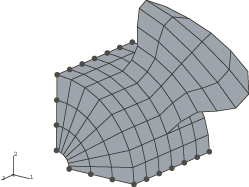
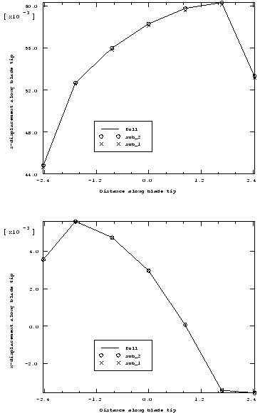

# 2.2.1 使用子结构和循环对称分析旋转风扇

**产品：** Abaqus/Standard  

本示例说明了Abaqus的单一和多级子结构功能在建模由重复结构组成的零件时的应用。它还演示了Abaqus使用循环对称分析技术分析循环对称模型的能力。还讨论了使用子结构或循环对称建模结构的一些局限性。

### 几何结构和材料

该结构是一个由中心轮毂和四个叶片组成的风扇，如图2.2.1-1所示（ch02s02aex80.md#sxmsuperfan-mesh）。叶片和轮毂由S4R壳单元组成。材料为弹性材料，弹性模量为200 GPa，泊松比为0.29。材料密度为7850 kg/m3。轮毂上安装孔的所有节点均被固定。

### 模型

考虑了四种不同的模型，如下所示：

1. 风扇建模为单一结构（无子结构）。
2. 风扇的一个象限，由四分之一的轮毂和单个叶片组成，被简化为子结构。然后使用四个子结构建模风扇（单级子结构）。在子结构生成期间，保留每个象限中轮毂边缘节点以及叶片尖端一个节点的所有自由度（参见图2.2.1-2）（ch02s02aex80.md#sxmsuperfan-superelms）。
3. 单个风扇叶片简化为子结构，然后与四分之一的轮毂结合形成更高级别的子结构。四个这样的子结构然后组合形成风扇（类似于单级子结构），从而形成多级子结构。在风扇叶片子结构生成期间，沿叶片底部的节点和叶片尖端的节点保留了所有自由度（如图2.2.1-2所示）（ch02s02aex80.md#sxmsuperfan-superelms）。在更高级别子结构生成阶段，每个象限中轮毂边缘上的节点以及叶片尖端节点保留了它们的自由度。
4. 风扇的一个象限，由四分之一的轮毂和单个叶片组成，带或不带子结构建模，作为循环对称分析技术的基准扇区。选择两个相互成90度的表面作为循环对称基于表面的tie约束的从属和主表面。有限元mesh在对称表面上包含匹配的节点；因此，两个表面都用节点列表或节点集标签定义。循环对称轴平行于全局z轴，并通过x-y平面上坐标为（3.0, 3.0）的点。循环对称模型如图2.2.1-3所示（ch02s02aex80.md#sxmsuperfan-cyclicsym）。整个模型由四个重复扇区组成。

对前三个模型同时进行频率分析和静态分析。对循环对称模型进行静态分析，然后进行频率提取和基于模态的稳态动力学分析。风扇上离心载荷引起的应力和载荷刚化效应在子结构生成期间使用大位移公式的预载步骤内置到子结构刚度中。为了在多级子结构的轮毂中获得适当的应力刚化，需要在最低级子结构（叶片）中定义的离心载荷用子结构载荷案例捕获，并必须作为子结构载荷施加到下一级子结构。

为了在全局分析中更好地表示子结构的动态行为，在子结构生成期间使用特征模式选择来包含使用特征频率提取步骤提取的m个动态模式。使用默认值获得的简化质量矩阵对应于Guyan简化技术，而对应于约束模式附加技术。在下面的"结果与讨论"部分中，使用无子结构模型（"完整模型"）获得的解作为参考解。

对于无子结构的循环对称模型，对预载结构执行特征值提取过程。非线性静态步骤有离心载荷施加到叶片上。使用Lanczos特征值求解器请求特征值，这是唯一可用于循环对称分析技术的特征频率分析的固有求解器。在特征值分析中指定循环对称模式的演示见一个问题。这使得可以仅提取具有所请求循环对称性的特征模式。当省略此选项时，会提取所有可能的（三）循环对称模式的特征值。在下面的讨论中，循环对称模型获得的解与整个360度模型（参考解）获得的解进行比较。对带子结构的循环对称模型进行无预载步骤的特征值分析。提取20个特征值并与整个360度带子结构模型获得的参考解进行比较。循环对称模型问题中的第三步是基于频率域的、基于模态的稳态过程。它计算投影到特定循环对称模式上的压力载荷的响应。

### 结果与讨论

频率分析和静态分析的结果如下所示。

#### 带子结构模型的频率分析

对应于最低15个特征值的频率被提取并列表在表2.2.1-1中（ch02s02aex80.md#table-superfan-compare-nosuper）。为了研究在子结构生成期间保留动态模式的效果，子结构模型在子结构生成期间提取0、5和20个动态模式后运行。

虽然Guyan简化技术（0）产生的频率与完整模型相比是合理的，但使用5个保留模式获得的值更接近完整模型预测，特别是对于更高的特征值。将保留模式数增加到20并不能显著改善结果，这与以下事实一致：在Guyan简化技术中，保留自由度的选择影响精度，而对于约束模式附加技术，最低频率对应的模式本质上是最佳的。

当子结构用于特征频率分析时，预期子结构模型中的最低特征频率高于无子结构对应模型中的最低特征频率。单级子结构分析确实如此，但对于多级子结构分析，最低特征频率低于完整模型。这是因为最低级子结构（叶片）的应力和载荷刚度是在叶片根部固定的情况下生成的，而在完整模型中，由于轮毂在施加离心载荷下的变形，叶片根部将径向移动。因此，子结构刚度有些不准确。由于叶片根部径向位移与模型整体尺寸相比很小（约为10^3量级），因此如从结果中观察到的，产生的误差应该很小。

表2.2.1-2（ch02s02aex80.md#table-superfan-compare-nonlgeom）显示了在预载步骤中省略NLGEOM参数时会发生什么。显然，结果与考虑预载对刚度影响的结果显著不同。在这种情况下，子结构模型中的最低特征频率确实高于无子结构模型中的最低特征频率。

#### 带子结构模型的静态分析

通过对叶片施加105 Pa的正常压力载荷，对风扇进行关于预载基态的静态分析。监测沿路径的叶片外缘轴向位移（如图2.2.1-1所示）（ch02s02aex80.md#sxmsuperfan-mesh）。结果如图2.2.1-4所示（ch02s02aex80.md#sxmsuperfan-disp）；子结构模型和完整模型的解之间具有良好的一致性。

虽然可以从表现出非线性响应的模型生成子结构，但必须注意，一旦创建，子结构在使用级别始终表现出线性响应。因此，预载子结构将产生与预载完整模型上线性扰动载荷响应等效的响应。因此，完整模型通过在一般步骤中施加离心预载，在线性扰动步骤中施加压力载荷进行分析。由于使用子结构的分析与扰动步骤等效，获得的结果不包含预载变形。因此，如果需要结构的总位移，需要将此扰动步骤的结果添加到结构的基态解中。

#### 循环对称模型的稳态分析（带预载）

对风扇进行关于预载基态的基于模态的稳态分析，如fan_cyclicsymmodel_ss.inp所示（../eif/fan_cyclicsymmodel_ss.inp）。在包含非线性几何的一般静态步骤中，离心力施加到基准扇区。使用循环对称分析技术时，只能在一般静态步骤中施加对称载荷。预载步骤之后是三个特征值提取和稳态动力学步骤的序列。每个特征值提取仅请求一个循环对称模式，用于后续稳态动力学分析中的载荷投影。分析指定应提取属于循环对称模式0、1和2的模式。计算的特征值与整个360度模型获得的特征值相同（如表2.2.1-1所示）（ch02s02aex80.md#table-superfan-compare-nosuper）。特征值提取期间获得的附加信息是与每个特征值关联的循环对称模式号。对于4个重复扇区的情况，所有对应于循环对称模式1的特征值成对出现；对应于模式0和2的特征值是单个的。最低的两个特征值对应于循环对称模式1，其次是循环对称模式2和0的单特征值。为了与循环对称模型选项进行比较，也使用多点约束类型CYCLSYM对特征值问题进行了建模（参见fansubstr_mpc.inp）（../eif/fansubstr_mpc.inp）。为了验证子结构与循环对称模型的使用，确定fansubstr_cyclic.inp（../eif/fansubstr_cyclic.inp）获得的特征值与fansubstr_1level_freq.inp（../eif/fansubstr_1level_freq.inp）获得的特征值相同。最后一步是基于模态的稳态动力学分析。压力载荷按投影到三个不同循环对称模式上的形式施加到整个结构。

### 输入文件

[fan_cyclicsymmodel_ss.inp](../eif/fan_cyclicsymmodel_ss.inp)

具有静态、特征值和稳态动力学步骤的循环对称模型，载荷分别投影到循环模式0、1和2上。

[fansubstr_1level_freq.inp](../eif/fansubstr_1level_freq.inp)

带有频率提取步骤的单级子结构使用分析。

[fansubstr_1level_static.inp](../eif/fansubstr_1level_static.inp)

带有静态步骤的单级子结构使用分析。

[fansubstr_multi_freq.inp](../eif/fansubstr_multi_freq.inp)

带有频率提取步骤的多级子结构使用分析。

[fansubstr_multi_static.inp](../eif/fansubstr_multi_static.inp)

带有静态步骤的多级子结构使用分析。

[fansubstr_freq.inp](../eif/fansubstr_freq.inp)

不带子结构的频率提取。

[fansubstr_static.inp](../eif/fansubstr_static.inp)

不带子结构的静态分析。

[fansubstr_mpc.inp](../eif/fansubstr_mpc.inp)

演示循环对称MPCs使用的单级使用分析。

[fansubstr_gen1.inp](../eif/fansubstr_gen1.inp)

用于多级子结构生成文件fansubstr_gen2.inp中使用的单个叶片子结构生成。

[fansubstr_gen2.inp](../eif/fansubstr_gen2.inp)

用于fansubstr_multi_freq.inp和fansubstr_multi_static.inp的多级子结构生成。

[fansubstr_gen3.inp](../eif/fansubstr_gen3.inp)

用于fansubstr_1level_freq.inp、fansubstr_1level_static.inp和fansubstr_mpc.inp的单级子结构生成。

[fansubstr_cyclic.inp](../eif/fansubstr_cyclic.inp)

用于频率分析的单级子结构与循环对称模型。

### 表格

**表2.2.1-1** 单级和多级子结构与无子结构模型的固有频率比较。
| 特征值编号 循环/秒 | 带子结构：1级 | 带子结构：2级 | 完整模型 |
| --- | --- | --- | --- |
| m=0 | m=5 | m=20 | m=0 | m=5 | m=20 |
| 1 | 6.9477 | 6.7901 | 6.7891 | 6.7655 | 6.6269 | 6.6258 | 6.7890 |
| 2 | 6.9477 | 6.7901 | 6.7891 | 6.7655 | 6.6269 | 6.6258 | 6.7890 |
| 3 | 8.0100 | 7.7207 | 7.7198 | 7.8162 | 7.5563 | 7.5552 | 7.7198 |
| 4 | 8.2009 | 7.8816 | 7.8810 | 8.1986 | 7.8813 | 7.8807 | 7.8810 |
| 5 | 11.341 | 11.020 | 11.010 | 11.123 | 10.802 | 10.792 | 11.009 |
| 6 | 11.341 | 11.020 | 11.010 | 11.123 | 10.802 | 10.792 | 11.009 |
| 7 | 12.529 | 11.930 | 11.912 | 11.539 | 11.142 | 11.124 | 11.910 |
| 8 | 14.751 | 14.397 | 14.346 | 13.450 | 13.256 | 13.211 | 14.348 |
| 9 | 17.787 | 14.432 | 14.432 | 17.208 | 14.455 | 14.455 | 14.431 |
| 10 | 18.922 | 14.779 | 14.775 | 18.797 | 14.751 | 14.747 | 14.774 |
| 11 | 21.250 | 14.779 | 14.775 | 19.860 | 14.751 | 14.747 | 14.774 |
| 12 | 21.250 | 16.034 | 15.995 | 19.860 | 15.645 | 15.623 | 15.991 |
| 13 | 28.250 | 17.699 | 17.624 | 28.066 | 17.129 | 17.057 | 17.624 |
| 14 | 28.691 | 19.034 | 19.019 | 28.628 | 18.914 | 18.901 | 19.008 |
| 15 | 28.691 | 21.333 | 21.178 | 28.628 | 20.014 | 19.885 | 21.176 |

**表2.2.1-2** 单级和两级子结构与完整模型值的固有频率比较，不使用NLGEOM参数。
| 特征值编号 循环/秒 | 带子结构 | 完整模型 |
| --- | --- | --- |
| 1级 | 2级 |
| 1 | 4.4795 | 4.4795 | 4.4795 |
| 2 | 4.4795 | 4.4795 | 4.4795 |
| 3 | 4.5511 | 4.5511 | 4.5511 |
| 4 | 4.8889 | 4.8889 | 4.8889 |
| 5 | 9.5431 | 9.5431 | 9.5426 |
| 6 | 9.5431 | 9.5431 | 9.5426 |
| 7 | 9.7921 | 9.7921 | 9.7918 |
| 8 | 12.632 | 12.633 | 12.632 |
| 9 | 14.005 | 14.005 | 14.005 |
| 10 | 14.336 | 14.336 | 14.336 |
| 11 | 14.336 | 14.336 | 14.336 |
| 12 | 15.489 | 15.489 | 15.489 |
| 13 | 16.861 | 16.861 | 16.860 |
| 14 | 18.241 | 18.241 | 18.232 |
| 15 | 19.036 | 19.036 | 19.034 |

### 图表

**图2.2.1-1** 完整风扇模型使用的mesh。

**图2.2.1-2** 生成的子结构。

**图2.2.1-3** 循环对称模型的基准扇区。

**图2.2.1-4** 沿路径的压力载荷引起的位移。

